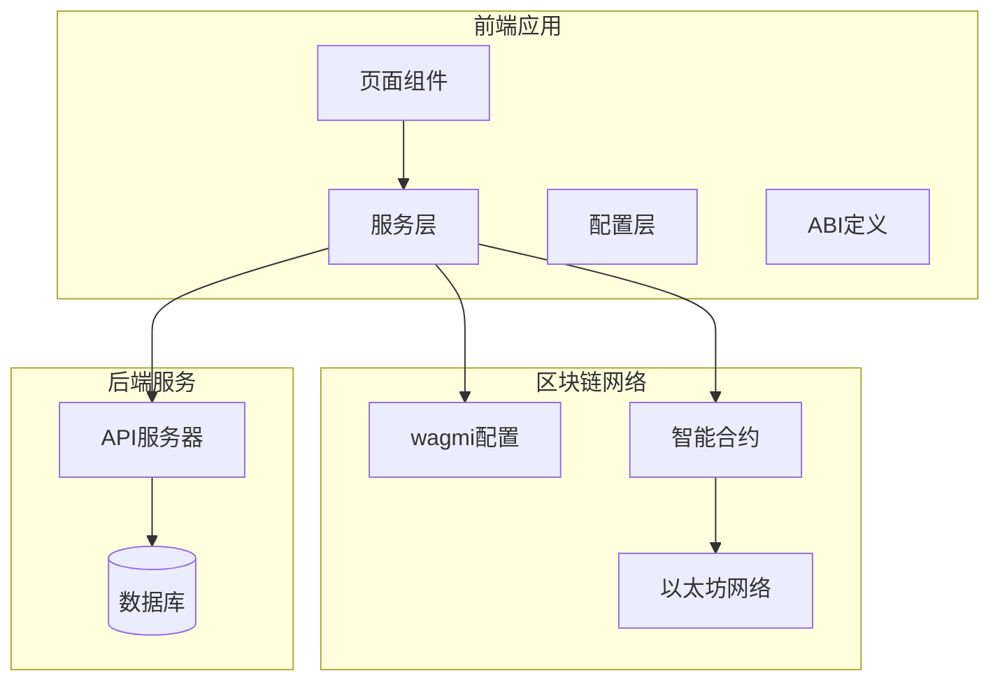
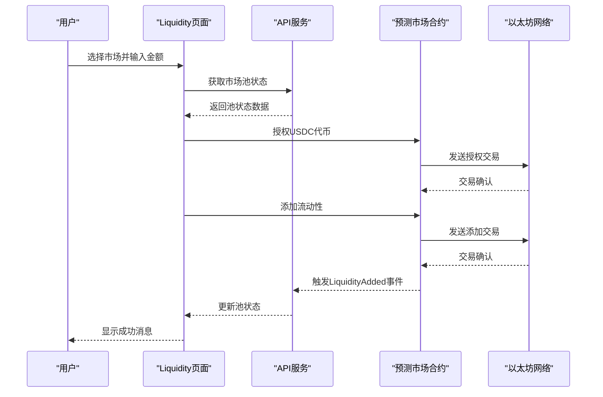
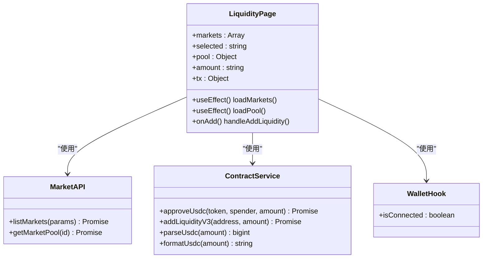
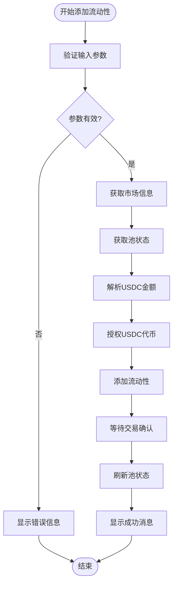
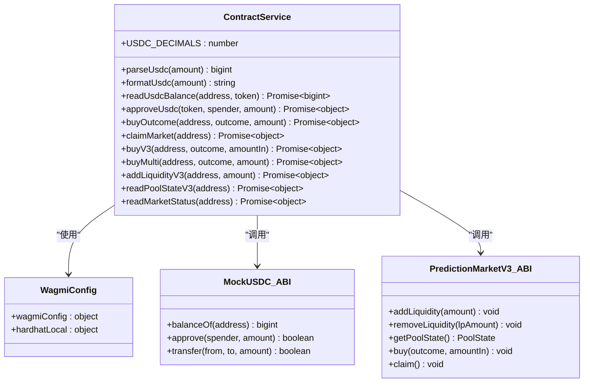
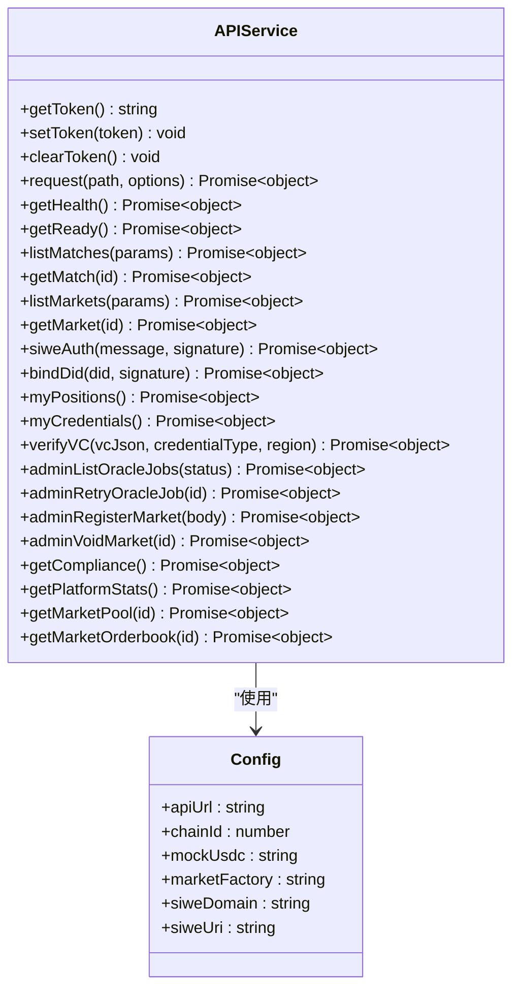
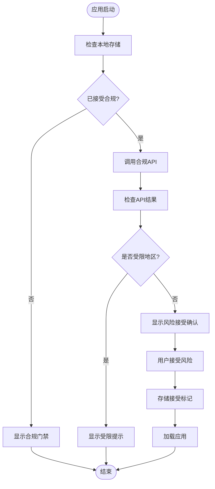
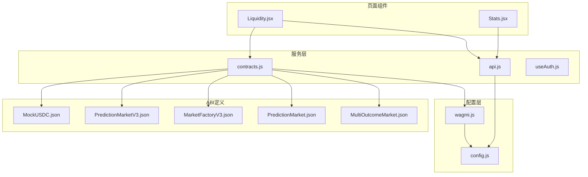

# 流动性池管理

<cite>
**本文档引用的文件**
- [Liquidity.jsx](file://src/pages/Liquidity.jsx)
- [contracts.js](file://src/services/contracts.js)
- [api.js](file://src/services/api.js)
- [config.js](file://src/config.js)
- [wagmi.js](file://src/wagmi.js)
- [Stats.jsx](file://src/pages/Stats.jsx)
- [ComplianceWrapper.jsx](file://src/components/ComplianceWrapper.jsx)
- [MockUSDC.json](file://src/abis/MockUSDC.json)
- [PredictionMarketV3.json](file://src/abis/PredictionMarketV3.json)
- [MarketFactoryV3.json](file://src/abis/MarketFactoryV3.json)
- [PredictionMarket.json](file://src/abis/PredictionMarket.json)
- [MultiOutcomeMarket.json](file://src/abis/MultiOutcomeMarket.json)
</cite>

## 目录
1. [简介](#简介)
2. [项目结构](#项目结构)
3. [核心组件](#核心组件)
4. [架构概览](#架构概览)
5. [详细组件分析](#详细组件分析)
6. [依赖关系分析](#依赖关系分析)
7. [性能考虑](#性能考虑)
8. [故障排除指南](#故障排除指南)
9. [结论](#结论)
10. [附录](#附录)

## 简介
本项目是一个基于区块链的预测市场流动性池管理系统，采用CPMM（常数乘法做市商）模型实现自动做市。系统支持二元市场和多结果市场，提供完整的流动性管理功能，包括流动性添加、移除、收益计算和分配机制。

## 项目结构
项目采用React + Vite构建，主要分为以下层次：
- 页面层：用户界面组件，包括流动性管理页面、市场页面、统计页面等
- 服务层：API服务和合约交互服务
- 配置层：应用配置和区块链网络配置
- ABI层：智能合约接口定义



**图表来源**
- [Liquidity.jsx](file://src/pages/Liquidity.jsx#L1-L117)
- [contracts.js](file://src/services/contracts.js#L1-L214)
- [config.js](file://src/config.js#L1-L23)

**章节来源**
- [Liquidity.jsx](file://src/pages/Liquidity.jsx#L1-L117)
- [config.js](file://src/config.js#L1-L23)

## 核心组件
系统的核心组件包括：

### 流动性管理页面
- 支持V3 CPMM二元市场流动性管理
- 实时池状态监控（储备量、价格）
- 用户友好的交互界面

### 合约交互服务
- USDC代币授权和余额查询
- 流动性添加和移除操作
- 市场状态读取和事件监听

### API服务
- 市场列表和池状态查询
- 平台统计数据获取
- 用户认证和合规检查

**章节来源**
- [Liquidity.jsx](file://src/pages/Liquidity.jsx#L15-L117)
- [contracts.js](file://src/services/contracts.js#L144-L176)
- [api.js](file://src/services/api.js#L178-L187)

## 架构概览
系统采用分层架构设计，确保模块间的清晰分离和高内聚低耦合。



**图表来源**
- [Liquidity.jsx](file://src/pages/Liquidity.jsx#L52-L77)
- [contracts.js](file://src/services/contracts.js#L59-L69)
- [contracts.js](file://src/services/contracts.js#L150-L160)

## 详细组件分析

### 流动性管理页面组件分析

#### 组件架构图


**图表来源**
- [Liquidity.jsx](file://src/pages/Liquidity.jsx#L19-L117)
- [api.js](file://src/services/api.js#L82-L91)
- [contracts.js](file://src/services/contracts.js#L59-L160)

#### 流动性添加流程


**图表来源**
- [Liquidity.jsx](file://src/pages/Liquidity.jsx#L52-L77)
- [contracts.js](file://src/services/contracts.js#L24-L26)
- [contracts.js](file://src/services/contracts.js#L59-L69)

**章节来源**
- [Liquidity.jsx](file://src/pages/Liquidity.jsx#L15-L117)

### 合约交互服务分析

#### 合约服务架构


**图表来源**
- [contracts.js](file://src/services/contracts.js#L1-L214)
- [wagmi.js](file://src/wagmi.js#L26-L37)
- [MockUSDC.json](file://src/abis/MockUSDC.json#L1-L336)
- [PredictionMarketV3.json](file://src/abis/PredictionMarketV3.json#L1-L581)

#### CPMM定价模型实现
系统采用常数乘法做市商模型，其数学原理如下：

**核心公式**：`x × y = k`（k为常数）

其中：
- x = Yes方向的储备量
- y = No方向的储备量  
- k = 市场常数

**价格计算**：
- Yes方向价格：`P_yes = y / (x + Δx)`
- No方向价格：`P_no = x / (y + Δy)`

**流动性添加**：
当LP添加流动性时，按当前储备比例同步增加两种资产，保持k值不变。

**章节来源**
- [contracts.js](file://src/services/contracts.js#L144-L176)
- [PredictionMarketV3.json](file://src/abis/PredictionMarketV3.json#L300-L322)

### API服务分析

#### API接口架构


**图表来源**
- [api.js](file://src/services/api.js#L1-L187)
- [config.js](file://src/config.js#L7-L23)

**章节来源**
- [api.js](file://src/services/api.js#L178-L187)
- [config.js](file://src/config.js#L1-L23)

### 风险控制和合规组件

#### 合规检查流程


**图表来源**
- [ComplianceWrapper.jsx](file://src/components/ComplianceWrapper.jsx#L16-L44)

**章节来源**
- [ComplianceWrapper.jsx](file://src/components/ComplianceWrapper.jsx#L1-L44)

## 依赖关系分析

### 组件依赖图


**图表来源**
- [Liquidity.jsx](file://src/pages/Liquidity.jsx#L1-L14)
- [contracts.js](file://src/services/contracts.js#L1-L15)
- [api.js](file://src/services/api.js#L1-L2)

### 外部依赖
- **wagmi**: EVM钱包连接和合约交互
- **viem**: 区块链工具库（金额解析、格式化）
- **react-router-dom**: 路由管理
- **@wagmi/core**: 合约读写和交易确认

**章节来源**
- [Liquidity.jsx](file://src/pages/Liquidity.jsx#L1-L14)
- [contracts.js](file://src/services/contracts.js#L1-L7)

## 性能考虑

### 优化策略
1. **批量读取优化**：使用Promise.all并行读取多个合约状态
2. **缓存机制**：合理使用React状态缓存避免重复渲染
3. **交易确认优化**：异步等待交易确认，避免阻塞UI
4. **金额处理优化**：使用BigInt避免精度丢失

### 性能监控指标
- 交易确认时间
- API响应延迟
- 合约调用Gas消耗
- UI渲染性能

## 故障排除指南

### 常见问题及解决方案

#### 钱包连接问题
**症状**：无法连接钱包或显示未连接状态
**解决方案**：
1. 检查MetaMask或其他钱包扩展是否安装
2. 确认钱包网络与应用配置一致
3. 重新连接钱包并授权权限

#### 交易失败问题
**症状**：流动性添加或移除交易失败
**解决方案**：
1. 检查USDC余额是否充足
2. 确认授权额度足够
3. 检查Gas费用设置
4. 查看交易日志获取具体错误信息

#### 合约交互问题
**症状**：合约调用超时或返回错误
**解决方案**：
1. 检查合约地址是否正确
2. 确认合约ABI版本匹配
3. 验证网络连接状态
4. 查看区块浏览器确认交易状态

**章节来源**
- [Liquidity.jsx](file://src/pages/Liquidity.jsx#L73-L77)
- [contracts.js](file://src/services/contracts.js#L59-L69)

## 结论
本流动性池管理系统实现了完整的CPMM做市功能，提供了用户友好的界面和可靠的技术架构。系统支持多种市场类型，具备完善的风控机制和合规检查功能。通过模块化的架构设计，系统具有良好的可维护性和扩展性。

## 附录

### API接口说明

#### 市场相关接口
- `GET /markets` - 获取市场列表
- `GET /markets/:id` - 获取市场详情  
- `GET /markets/:id/pool` - 获取市场池状态
- `GET /markets/:id/orderbook` - 获取市场订单簿

#### 平台统计接口
- `GET /stats/platform` - 获取平台统计数据

#### 用户相关接口
- `POST /auth/siwe` - SIWE认证
- `POST /users/bind-did` - 绑定DID
- `GET /users/me/credentials` - 获取用户VC列表
- `POST /auth/verify-vc` - 验证VC

### 前端组件集成示例

#### 流动性管理组件集成
```javascript
// 在页面中导入和使用
import Liquidity from './pages/Liquidity';

function App() {
  return (
    <div>
      <Liquidity />
    </div>
  );
}
```

#### 合约交互服务集成
```javascript
// 导入合约服务
import { 
  addLiquidityV3, 
  approveUsdc, 
  parseUsdc, 
  formatUsdc 
} from '../services/contracts';

// 使用示例
const amount = parseUsdc('100');
await approveUsdc(usdcAddress, marketAddress, amount);
await addLiquidityV3(marketAddress, amount);
```