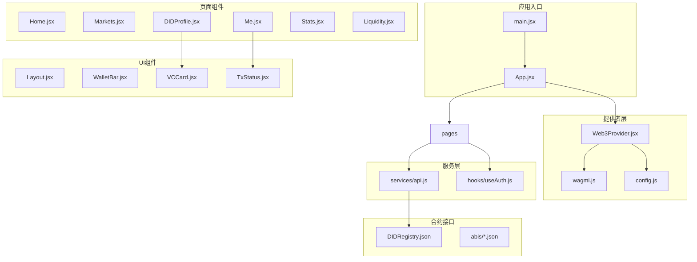
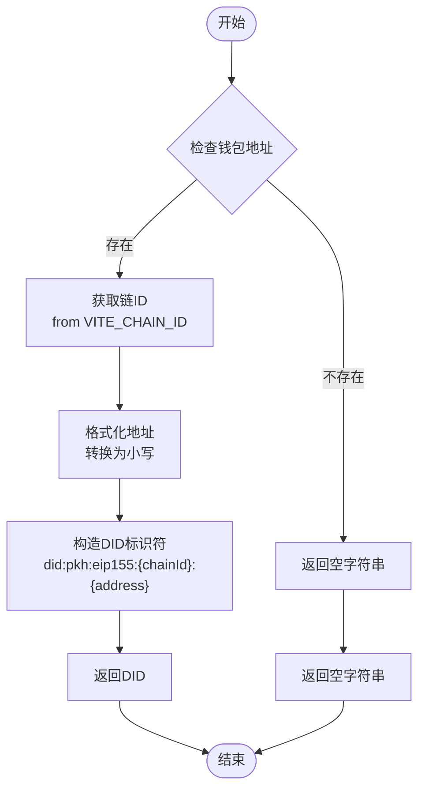
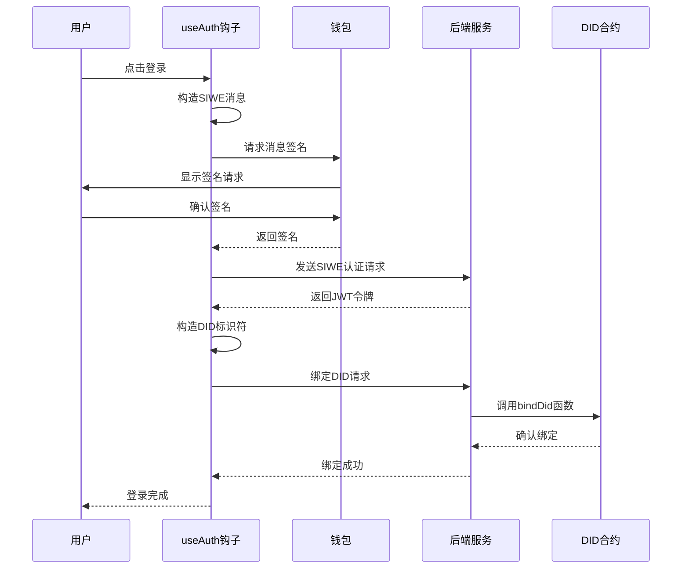
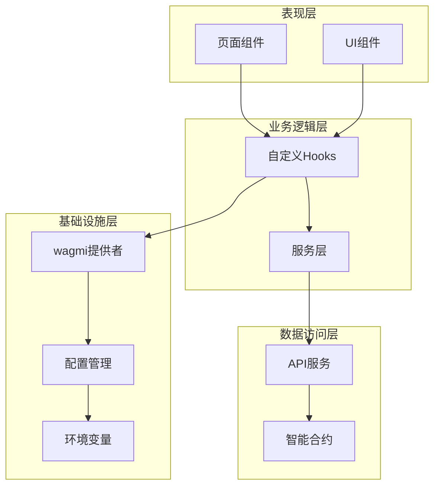
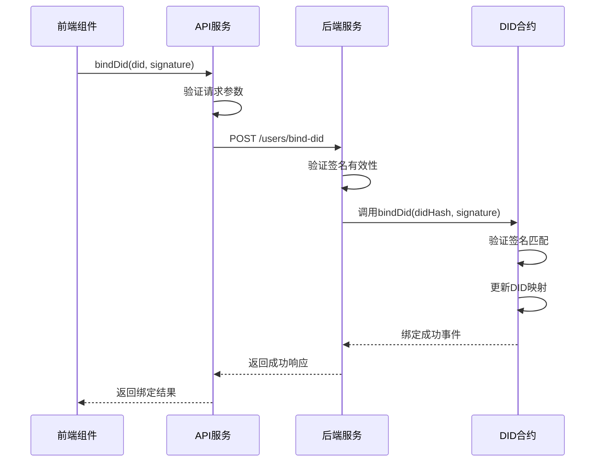
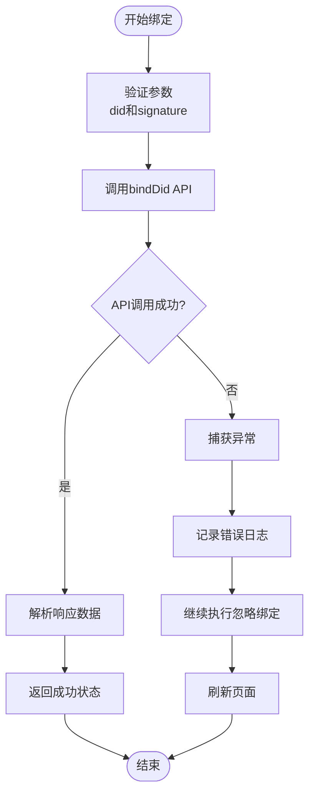
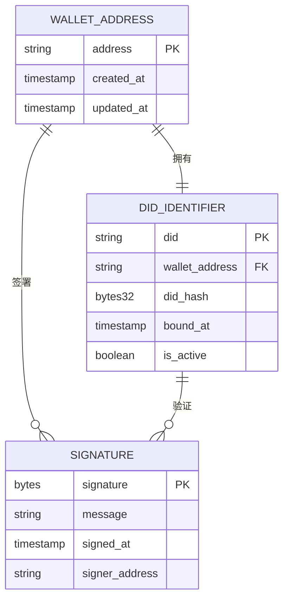
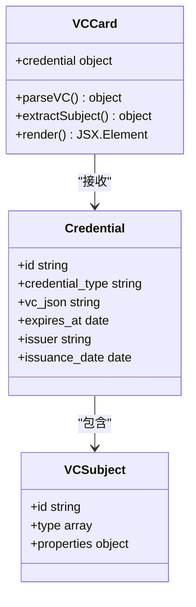

# DID身份管理

<cite>
**本文档引用的文件**
- [DIDProfile.jsx](file://src/pages/DIDProfile.jsx)
- [api.js](file://src/services/api.js)
- [useAuth.js](file://src/hooks/useAuth.js)
- [Web3Provider.jsx](file://src/providers/Web3Provider.jsx)
- [config.js](file://src/config.js)
- [App.jsx](file://src/App.jsx)
- [main.jsx](file://src/main.jsx)
- [DIDRegistry.json](file://src/abis/DIDRegistry.json)
- [VCCard.jsx](file://src/components/VCCard.jsx)
- [wagmi.js](file://src/wagmi.js)
- [.env.example](file://.env.example)
</cite>

## 目录
1. [简介](#简介)
2. [项目结构](#项目结构)
3. [核心组件](#核心组件)
4. [架构概览](#架构概览)
5. [详细组件分析](#详细组件分析)
6. [依赖分析](#依赖分析)
7. [性能考虑](#性能考虑)
8. [故障排除指南](#故障排除指南)
9. [结论](#结论)

## 简介

PredictionDID是一个基于去中心化身份（DID）的预测市场平台，允许用户使用基于以太坊钱包的身份进行身份验证和权限管理。该系统的核心是实现了did:pkh:eip155标准的DID标识符格式，为用户提供了一个无需第三方信任的数字身份解决方案。

DID（Decentralized Identifier，去中心化身份）是一种新型的标识符，它不依赖于传统的集中式身份管理系统。在PredictionDID中，DID标识符格式为`did:pkh:eip155:chainId:address`，其中：
- `did`：DID标识符的标准前缀
- `pkh`：基于公钥哈希的身份验证方法
- `eip155`：以太坊改进提案155的标识符
- `chainId`：区块链网络标识符
- `address`：用户的以太坊钱包地址

## 项目结构

PredictionDID前端采用现代化的React技术栈构建，主要包含以下模块：



**图表来源**
- [main.jsx](file://src/main.jsx#L17-L32)
- [App.jsx](file://src/App.jsx#L31-L66)
- [Web3Provider.jsx](file://src/providers/Web3Provider.jsx#L16-L24)

**章节来源**
- [main.jsx](file://src/main.jsx#L1-L33)
- [App.jsx](file://src/App.jsx#L1-L67)

## 核心组件

### DID身份标识符生成

系统中的DID标识符生成逻辑位于DIDProfile组件中，采用did:pkh:eip155标准格式：



**图表来源**
- [DIDProfile.jsx](file://src/pages/DIDProfile.jsx#L32-L35)

### SIWE认证流程

系统使用SIWE（Sign-In with Ethereum）协议实现基于以太坊的用户认证：



**图表来源**
- [useAuth.js](file://src/hooks/useAuth.js#L29-L80)
- [api.js](file://src/services/api.js#L94-L107)

**章节来源**
- [DIDProfile.jsx](file://src/pages/DIDProfile.jsx#L32-L35)
- [useAuth.js](file://src/hooks/useAuth.js#L29-L80)
- [api.js](file://src/services/api.js#L94-L107)

## 架构概览

PredictionDID采用分层架构设计，各层职责明确：



**图表来源**
- [Web3Provider.jsx](file://src/providers/Web3Provider.jsx#L16-L24)
- [useAuth.js](file://src/hooks/useAuth.js#L16-L109)
- [api.js](file://src/services/api.js#L29-L55)

## 详细组件分析

### DID绑定API实现

bindDid API是DID身份管理的核心功能，负责将用户的去中心化身份与账户进行绑定：

#### API调用流程



**图表来源**
- [api.js](file://src/services/api.js#L101-L107)
- [DIDRegistry.json](file://src/abis/DIDRegistry.json#L109-L112)

#### 错误处理机制

系统实现了多层次的错误处理策略：



**图表来源**
- [useAuth.js](file://src/hooks/useAuth.js#L64-L70)

**章节来源**
- [api.js](file://src/services/api.js#L101-L107)
- [DIDRegistry.json](file://src/abis/DIDRegistry.json#L109-L112)
- [useAuth.js](file://src/hooks/useAuth.js#L64-L70)

### DID与钱包地址映射关系

系统中的DID与钱包地址建立了强关联的映射关系：



**图表来源**
- [DIDProfile.jsx](file://src/pages/DIDProfile.jsx#L32-L35)
- [DIDRegistry.json](file://src/abis/DIDRegistry.json#L122-L131)

### 可验证凭证（VC）展示

系统提供了完整的可验证凭证展示功能：



**图表来源**
- [VCCard.jsx](file://src/components/VCCard.jsx#L6-L34)

**章节来源**
- [VCCard.jsx](file://src/components/VCCard.jsx#L1-L35)

## 依赖分析

### 技术栈依赖关系

```mermaid
graph TB
subgraph "核心框架"
react[React 18.3.1]
router[React Router DOM]
query[React Query]
end
subgraph "区块链集成"
wagmi[Wagmi 2.14.1]
viem[Viem 2.21.54]
siwe[SIWE 2.3.2]
end
subgraph "工具库"
tanstack[@tanstack/react-query]
eslint[ESLint]
end
subgraph "开发工具"
vite[Vite 5.4.11]
reactPlugin[@vitejs/plugin-react]
end
react --> router
react --> query
wagmi --> viem
wagmi --> siwe
query --> tanstack
```

**图表来源**
- [package.json](file://package.json#L12-L29)

### 外部依赖接口

系统对外部服务的依赖主要体现在以下几个方面：

| 依赖类型 | 服务名称 | 用途 | 配置项 |
|---------|----------|------|--------|
| 区块链网络 | Hardhat本地网络 | 开发环境 | VITE_CHAIN_ID=31337 |
| API服务 | 后端REST API | 用户认证和数据获取 | VITE_API_URL=http://localhost:8080 |
| 钱包服务 | MetaMask等 | 用户身份验证 | 自动检测 |
| 国际化服务 | i18n | 多语言支持 | 自动配置 |

**章节来源**
- [package.json](file://package.json#L1-L30)
- [.env.example](file://.env.example#L1-L7)

## 性能考虑

### 缓存策略

系统采用了多层缓存机制来优化性能：

1. **React Query缓存**：自动管理API响应缓存
2. **本地存储缓存**：JWT令牌持久化存储
3. **组件状态缓存**：避免不必要的重新渲染

### 网络优化

- 使用HTTP/2协议提升并发性能
- 实现请求去重机制
- 采用懒加载策略减少初始加载时间

## 故障排除指南

### 常见问题及解决方案

| 问题类型 | 症状 | 可能原因 | 解决方案 |
|---------|------|---------|---------|
| DID绑定失败 | 绑定API调用报错 | 签名验证失败 | 检查钱包签名和消息一致性 |
| 钱包连接问题 | 无法连接MetaMask | 网络ID不匹配 | 确认VITE_CHAIN_ID配置正确 |
| JWT令牌失效 | API请求401错误 | 令牌过期或损坏 | 清除localStorage中的令牌 |
| 页面加载缓慢 | 组件渲染延迟 | 缓存未命中 | 检查React Query缓存配置 |

### 调试工具

1. **浏览器开发者工具**：监控网络请求和JavaScript错误
2. **React DevTools**：分析组件渲染性能
3. **wagmi调试**：检查钱包连接状态
4. **控制台日志**：跟踪认证流程状态

**章节来源**
- [useAuth.js](file://src/hooks/useAuth.js#L73-L79)
- [api.js](file://src/services/api.js#L49-L54)

## 结论

PredictionDID身份管理系统通过实现did:pkh:eip155标准的DID标识符格式，为用户提供了去中心化的身份验证解决方案。系统采用现代React技术栈构建，具有良好的可扩展性和维护性。

### 主要优势

1. **去中心化身份**：用户拥有完全控制权的数字身份
2. **安全可靠**：基于以太坊区块链的不可篡改特性
3. **用户体验**：简洁直观的SIWE认证流程
4. **技术先进**：采用最新的web3技术和最佳实践

### 最佳实践建议

1. **重复绑定处理**：系统已内置重复绑定容错机制，无需额外处理
2. **DID查询方法**：通过`did:pkh:eip155:{chainId}:{address}`格式直接构造
3. **传统用户名对比**：DID提供更安全、去中心化的身份标识，无需传统用户名系统
4. **错误处理**：遵循系统内置的错误处理策略，确保用户体验一致性

该系统为预测市场平台提供了坚实的身份管理基础，为未来的功能扩展和技术升级奠定了良好基础。