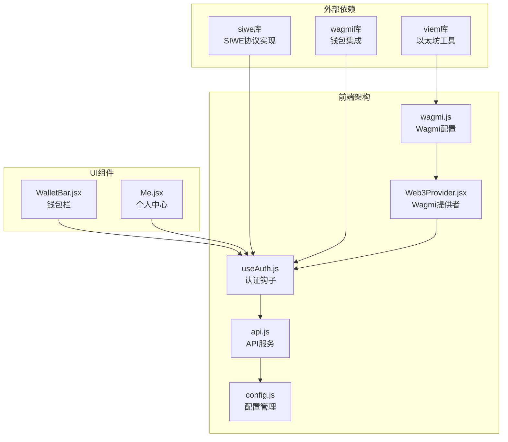
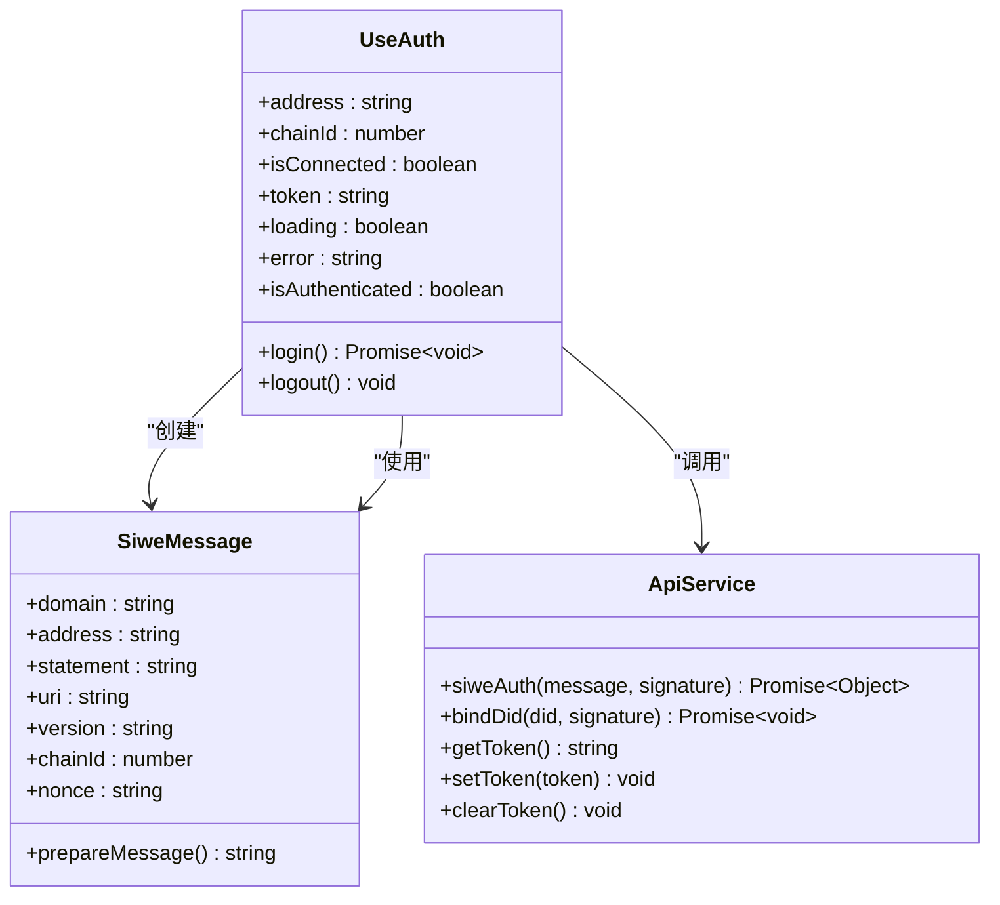
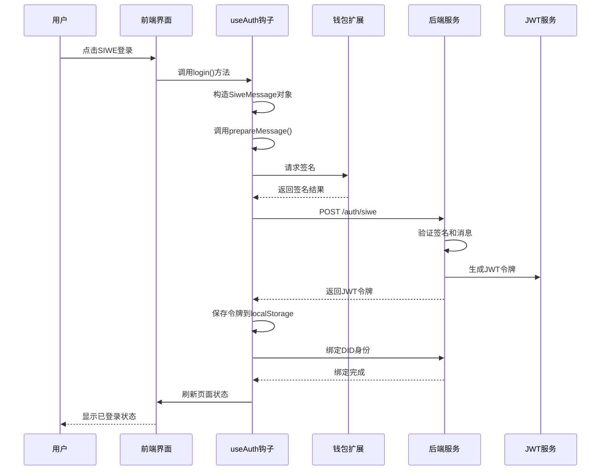
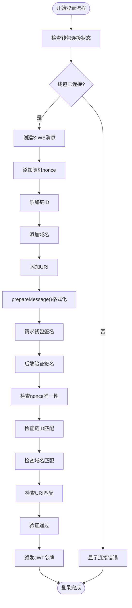
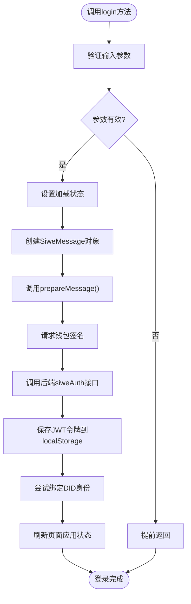
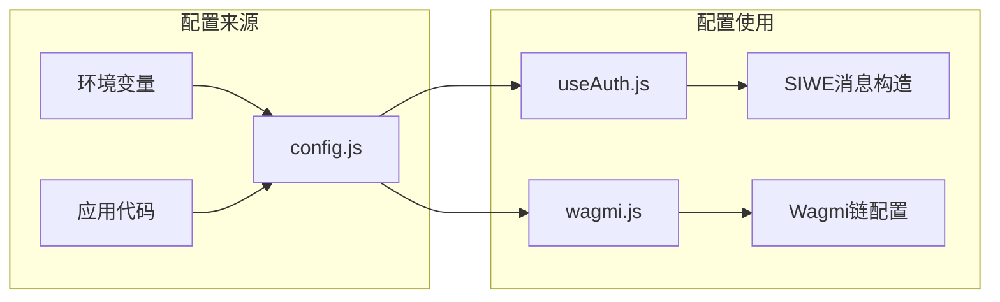
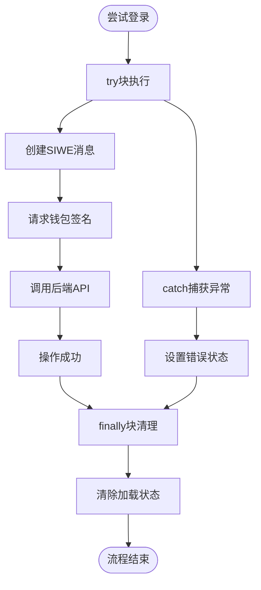
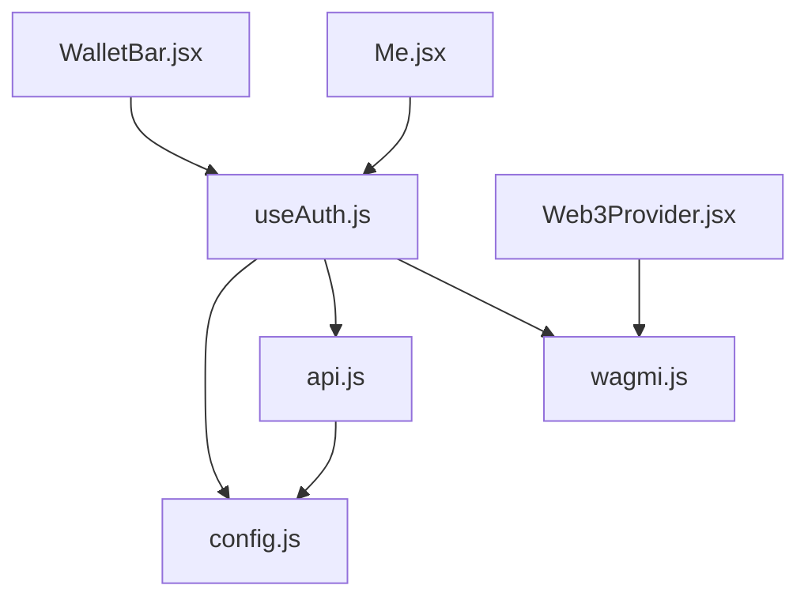

# SIWE集成实现

<cite>
**本文档引用的文件**
- [useAuth.js](file://src/hooks/useAuth.js)
- [api.js](file://src/services/api.js)
- [config.js](file://src/config.js)
- [wagmi.js](file://src/wagmi.js)
- [Web3Provider.jsx](file://src/providers/Web3Provider.jsx)
- [Me.jsx](file://src/pages/Me.jsx)
- [WalletBar.jsx](file://src/components/WalletBar.jsx)
- [package.json](file://package.json)
</cite>

## 目录
1. [简介](#简介)
2. [项目结构](#项目结构)
3. [核心组件](#核心组件)
4. [架构概览](#架构概览)
5. [详细组件分析](#详细组件分析)
6. [依赖关系分析](#依赖关系分析)
7. [性能考虑](#性能考虑)
8. [故障排除指南](#故障排除指南)
9. [结论](#结论)

## 简介

SIWE（Sign-In with Ethereum）是一种基于以太坊的去中心化身份认证协议，允许用户使用其加密钱包地址进行网站登录。本项目实现了完整的SIWE认证流程，包括消息构造、签名验证和防重放攻击机制。

SIWE协议的核心优势在于：
- **无需传统用户名密码**：使用钱包私钥进行数字签名
- **去中心化身份**：基于EIP-155标准的去中心化身份标识
- **防重放攻击**：通过随机nonce值确保每次登录的独特性
- **跨平台兼容**：支持所有以太坊生态的钱包

## 项目结构

该项目采用模块化的前端架构，SIWE认证功能主要集中在以下文件中：



**图表来源**
- [Web3Provider.jsx](file://src/providers/Web3Provider.jsx#L16-L24)
- [useAuth.js](file://src/hooks/useAuth.js#L16-L108)
- [api.js](file://src/services/api.js#L1-L187)

**章节来源**
- [Web3Provider.jsx](file://src/providers/Web3Provider.jsx#L1-L25)
- [wagmi.js](file://src/wagmi.js#L1-L37)
- [package.json](file://package.json#L12-L20)

## 核心组件

### useAuth认证钩子

`useAuth`是SIWE认证的核心实现，提供了完整的认证状态管理和登录流程：



**图表来源**
- [useAuth.js](file://src/hooks/useAuth.js#L16-L108)
- [api.js](file://src/services/api.js#L94-L107)

**章节来源**
- [useAuth.js](file://src/hooks/useAuth.js#L16-L108)

### API服务层

API服务层封装了所有与后端的通信逻辑，包括SIWE认证和DID绑定：

**章节来源**
- [api.js](file://src/services/api.js#L94-L107)

## 架构概览

SIWE认证流程采用前后端分离架构，前端负责用户界面和签名请求，后端负责验证和令牌发放：



**图表来源**
- [useAuth.js](file://src/hooks/useAuth.js#L29-L80)
- [api.js](file://src/services/api.js#L94-L99)

## 详细组件分析

### SIWE消息构造与验证

#### 消息字段详解

SIWE消息包含多个关键字段，每个字段都有特定的安全作用：

| 字段 | 类型 | 必需 | 描述 | 安全作用 |
|------|------|------|------|----------|
| domain | string | 是 | 服务器域名 | 防止跨域重放攻击 |
| address | string | 是 | 钱包地址 | 确认用户身份 |
| statement | string | 否 | 用户声明文本 | 增强用户理解 |
| uri | string | 是 | 应用URI | 防止跨站点重放 |
| version | string | 是 | SIWE版本 | 确保协议兼容性 |
| chainId | number | 是 | 区块链网络ID | 防止跨链重放 |
| nonce | string | 是 | 随机数 | 防止重放攻击 |
| expirationTime | string | 否 | 过期时间 | 限制登录有效期 |

#### 防重放攻击机制

系统通过以下多重机制防止重放攻击：



**图表来源**
- [useAuth.js](file://src/hooks/useAuth.js#L37-L57)

**章节来源**
- [useAuth.js](file://src/hooks/useAuth.js#L37-L57)
- [config.js](file://src/config.js#L18-L22)

### 登录方法实现详解

#### login方法执行流程

`login`方法实现了完整的SIWE认证流程：



**图表来源**
- [useAuth.js](file://src/hooks/useAuth.js#L29-L80)

**章节来源**
- [useAuth.js](file://src/hooks/useAuth.js#L29-L80)

### 配置参数详解

#### 环境变量配置

系统通过环境变量管理关键配置：

| 配置项 | 默认值 | 用途 | 安全考虑 |
|--------|--------|------|----------|
| VITE_API_URL | http://localhost:8080 | 后端API基础URL | 生产环境必须HTTPS |
| VITE_CHAIN_ID | 31337 | 区块链网络ID | 必须与钱包网络匹配 |
| VITE_SIWE_DOMAIN | localhost | SIWE域名 | 必须与实际域名一致 |
| VITE_SIWE_URI | http://localhost:5173 | 应用URI | 必须与实际URI一致 |

#### 配置使用场景



**图表来源**
- [config.js](file://src/config.js#L7-L22)
- [useAuth.js](file://src/hooks/useAuth.js#L38-L52)

**章节来源**
- [config.js](file://src/config.js#L1-L23)

### 错误处理策略

系统实现了多层次的错误处理机制：



**图表来源**
- [useAuth.js](file://src/hooks/useAuth.js#L73-L79)

**章节来源**
- [useAuth.js](file://src/hooks/useAuth.js#L73-L79)

## 依赖关系分析

### 外部依赖关系

项目依赖的关键库及其作用：

```mermaid
graph TB
subgraph "核心依赖"
A[siwe@2.3.2<br/>SIWE协议实现] --> B[useAuth.js]
C[wagmi@2.14.1<br/>钱包集成] --> B
D[viem@2.21.54<br/>以太坊工具] --> E[wagmi.js]
end
subgraph "UI框架"
F[react@18.3.1] --> G[WalletBar.jsx]
H[react-router-dom@6.28.0] --> G
end
subgraph "状态管理"
I[@tanstack/react-query@5.62.2] --> J[Web3Provider.jsx]
end
subgraph "构建工具"
K[@vitejs/plugin-react@4.3.4] --> L[package.json]
M[eslint@8.57.1] --> L
end
```

**图表来源**
- [package.json](file://package.json#L12-L28)
- [useAuth.js](file://src/hooks/useAuth.js#L4-L10)

**章节来源**
- [package.json](file://package.json#L12-L28)

### 内部模块依赖



**图表来源**
- [useAuth.js](file://src/hooks/useAuth.js#L1-L10)
- [WalletBar.jsx](file://src/components/WalletBar.jsx#L1-L4)
- [Me.jsx](file://src/pages/Me.jsx#L1-L12)

**章节来源**
- [useAuth.js](file://src/hooks/useAuth.js#L1-L10)

## 性能考虑

### 登录流程优化

1. **异步操作管理**：使用`useCallback`优化函数引用，避免不必要的重新渲染
2. **状态管理**：合理使用React状态钩子，避免过度的状态更新
3. **内存管理**：及时清理错误状态和加载状态
4. **缓存策略**：利用localStorage持久化JWT令牌

### 错误恢复机制

- **重试机制**：对于临时性错误提供自动重试
- **降级策略**：在网络不可用时提供友好的用户体验
- **超时处理**：为长时间操作设置合理的超时机制

## 故障排除指南

### 常见问题及解决方案

#### 钱包连接问题
- **症状**：无法连接MetaMask或其他钱包
- **原因**：钱包扩展未安装或网络不匹配
- **解决**：确认钱包扩展安装，检查网络设置

#### SIWE消息验证失败
- **症状**：后端返回签名验证错误
- **原因**：消息格式不正确或参数不匹配
- **解决**：检查配置参数，确认消息构造完整

#### JWT令牌获取失败
- **症状**：登录成功但无令牌
- **原因**：后端服务异常或网络问题
- **解决**：检查后端服务状态，确认网络连接

#### 防重放攻击失败
- **症状**：重复登录被拒绝
- **原因**：nonce值冲突或过期
- **解决**：刷新页面重新获取新的nonce

### 调试技巧

1. **浏览器控制台**：查看详细的错误信息
2. **网络面板**：监控API请求和响应
3. **存储检查**：验证localStorage中的令牌状态
4. **钱包日志**：查看钱包扩展的签名过程

**章节来源**
- [useAuth.js](file://src/hooks/useAuth.js#L73-L79)

## 结论

本项目的SIWE集成实现展现了现代去中心化身份认证的最佳实践。通过精心设计的消息构造、严格的验证机制和完善的错误处理，系统提供了安全可靠的用户认证体验。

关键优势包括：
- **安全性**：多重防重放攻击机制
- **易用性**：简洁的API接口和直观的用户界面
- **可维护性**：清晰的模块化架构和完整的错误处理
- **可扩展性**：灵活的配置系统和标准化的接口设计

未来可以考虑的改进方向：
- 添加更多钱包支持
- 实现更细粒度的权限控制
- 增强审计日志功能
- 优化移动端用户体验