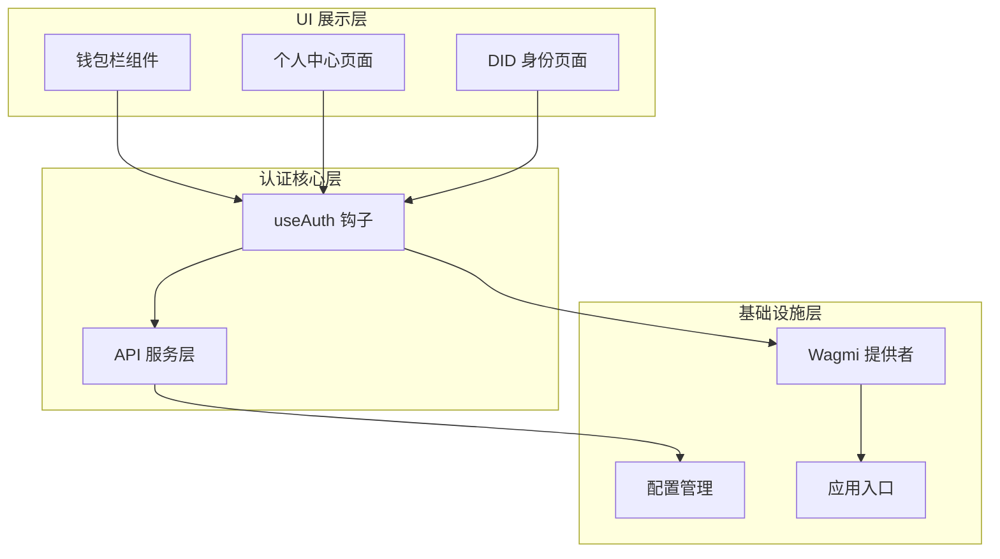
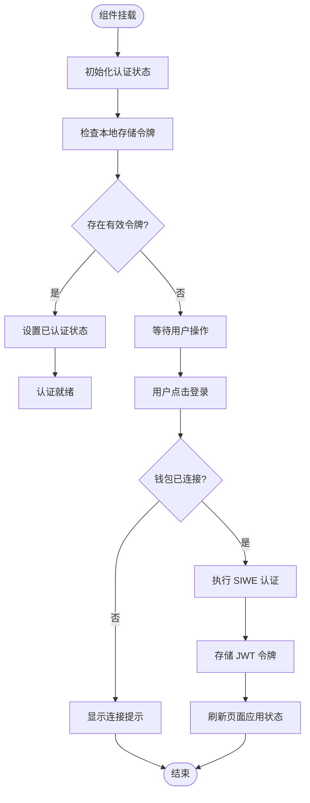
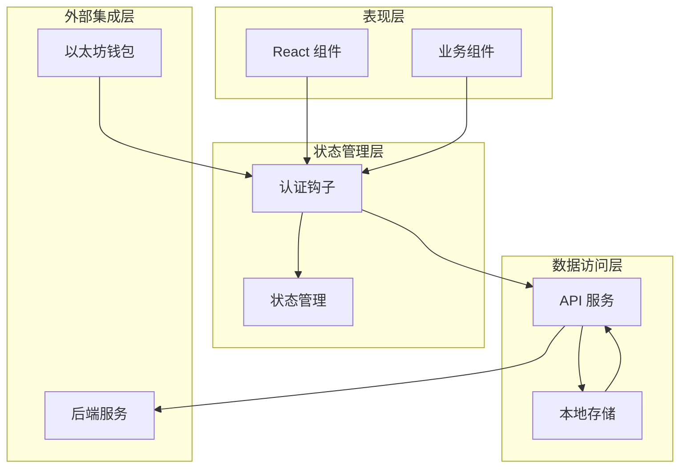
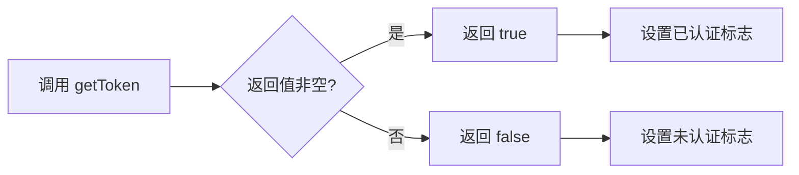
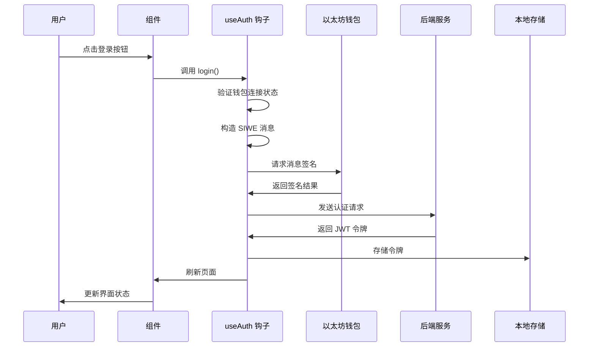
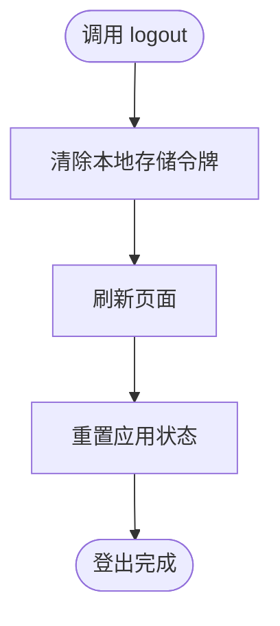
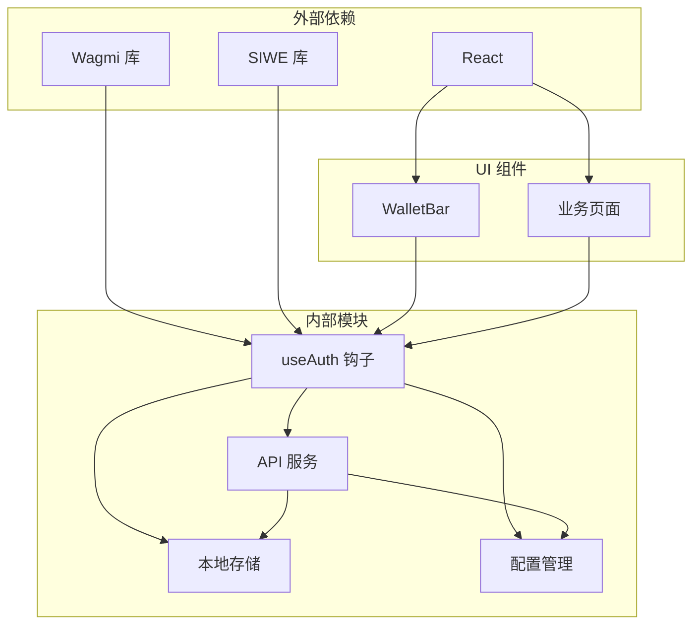

# 会话状态管理

<cite>
**本文档引用的文件**
- [useAuth.js](file://src/hooks/useAuth.js)
- [api.js](file://src/services/api.js)
- [WalletBar.jsx](file://src/components/WalletBar.jsx)
- [Me.jsx](file://src/pages/Me.jsx)
- [DIDProfile.jsx](file://src/pages/DIDProfile.jsx)
- [config.js](file://src/config.js)
- [Web3Provider.jsx](file://src/providers/Web3Provider.jsx)
- [main.jsx](file://src/main.jsx)
</cite>

## 目录
1. [简介](#简介)
2. [项目结构](#项目结构)
3. [核心组件](#核心组件)
4. [架构概览](#架构概览)
5. [详细组件分析](#详细组件分析)
6. [依赖关系分析](#依赖关系分析)
7. [性能考虑](#性能考虑)
8. [故障排除指南](#故障排除指南)
9. [结论](#结论)

## 简介

PredictionDIDSimple 是一个基于以太坊的预测市场应用，采用 SIWE（Sign-In with Ethereum）协议实现去中心化身份认证。本文档详细阐述了会话状态管理系统，包括 JWT 令牌的存储、读取、清除机制，认证状态判断逻辑，以及完整的会话生命周期管理。

该系统的核心特点：
- 基于 localStorage 的 JWT 令牌持久化存储
- SIWE 协议实现的去中心化身份认证
- 实时认证状态管理
- 完整的会话生命周期控制

## 项目结构

会话状态管理功能分布在以下关键模块中：

**图表来源**
- [useAuth.js](file://src/hooks/useAuth.js#L16-L108)
- [api.js](file://src/services/api.js#L1-L187)
- [WalletBar.jsx](file://src/components/WalletBar.jsx#L10-L53)

**章节来源**
- [useAuth.js](file://src/hooks/useAuth.js#L1-L110)
- [api.js](file://src/services/api.js#L1-L187)
- [WalletBar.jsx](file://src/components/WalletBar.jsx#L1-L54)

## 核心组件

### 令牌存储机制

系统采用 localStorage 作为 JWT 令牌的持久化存储方案，使用统一的存储键名管理令牌。

**令牌存储键名**: `prediction_jwt`

### 认证钩子 useAuth

useAuth 钩子是会话状态管理的核心，提供了完整的认证生命周期管理：

**图表来源**
- [useAuth.js](file://src/hooks/useAuth.js#L28-L80)

**章节来源**
- [useAuth.js](file://src/hooks/useAuth.js#L16-L108)

## 架构概览

会话状态管理采用分层架构设计，确保各层职责清晰分离：

**图表来源**
- [useAuth.js](file://src/hooks/useAuth.js#L1-L110)
- [api.js](file://src/services/api.js#L1-L187)

## 详细组件分析

### 令牌管理 API

#### getToken 方法

getToken 方法负责从 localStorage 中检索 JWT 令牌：

**实现要点**:
- 使用统一的存储键名 `prediction_jwt`
- 返回 null 或令牌字符串
- 不进行令牌有效性验证

**使用场景**:
- 组件初始化时检查认证状态
- 构建请求头时添加认证信息

#### setToken 方法

setToken 方法将 JWT 令牌保存到 localStorage：

**实现要点**:
- 使用原子性存储操作
- 支持令牌更新覆盖
- 异常情况下的错误处理

**使用场景**:
- SIWE 认证成功后存储新令牌
- 令牌刷新后的更新操作

#### clearToken 方法

clearToken 方法清除本地存储中的 JWT 令牌：

**实现要点**:
- 删除指定的存储键
- 确保令牌完全移除
- 防止令牌残留

**使用场景**:
- 用户主动登出
- 令牌失效后的清理

**章节来源**
- [api.js](file://src/services/api.js#L7-L20)

### 认证状态判断逻辑

#### isAuthenticated 属性

isAuthenticated 属性提供简洁的认证状态判断：

**图表来源**
- [useAuth.js](file://src/hooks/useAuth.js#L98-L99)

**实现逻辑**:
- 基于令牌的存在性判断
- Boolean(token) 简洁高效
- 不涉及令牌有效期检查

**章节来源**
- [useAuth.js](file://src/hooks/useAuth.js#L98-L99)

### SIWE 认证流程

#### 登录方法实现

登录方法实现了完整的 SIWE 认证流程：

**图表来源**
- [useAuth.js](file://src/hooks/useAuth.js#L29-L80)
- [api.js](file://src/services/api.js#L94-L99)

**关键实现细节**:
- 随机 nonce 防重放攻击
- 完整的 SIWE 消息构造
- 异步签名流程处理
- 自动 DID 绑定尝试

**章节来源**
- [useAuth.js](file://src/hooks/useAuth.js#L29-L80)

### 登出功能实现

#### logout 方法

登出方法提供完整的会话终止功能：

**图表来源**
- [useAuth.js](file://src/hooks/useAuth.js#L82-L88)

**实现特性**:
- 单一职责的令牌清除
- 页面刷新确保状态同步
- 简洁可靠的登出流程

**章节来源**
- [useAuth.js](file://src/hooks/useAuth.js#L82-L88)

### UI 集成组件

#### WalletBar 组件

WalletBar 组件展示了认证状态的实时反馈：

**功能特性**:
- 动态显示认证状态
- 条件渲染登录/登出按钮
- 错误状态的可视化展示

**章节来源**
- [WalletBar.jsx](file://src/components/WalletBar.jsx#L10-L53)

#### 业务页面集成

多个业务页面集成了认证状态检查：

**个人中心页面**: [Me.jsx](file://src/pages/Me.jsx#L25-L44)
**DID 身份页面**: [DIDProfile.jsx](file://src/pages/DIDProfile.jsx#L19-L30)

这些页面根据认证状态动态调整内容和交互行为。

**章节来源**
- [Me.jsx](file://src/pages/Me.jsx#L25-L44)
- [DIDProfile.jsx](file://src/pages/DIDProfile.jsx#L19-L30)

## 依赖关系分析

会话状态管理的依赖关系体现了清晰的分层设计：

**图表来源**
- [useAuth.js](file://src/hooks/useAuth.js#L1-L110)
- [api.js](file://src/services/api.js#L1-L187)
- [config.js](file://src/config.js#L1-L23)

**章节来源**
- [useAuth.js](file://src/hooks/useAuth.js#L1-L110)
- [api.js](file://src/services/api.js#L1-L187)
- [config.js](file://src/config.js#L1-L23)

## 性能考虑

### 存储性能优化

localStorage 作为存储介质具有以下特点：
- 同步操作，无网络延迟
- 有限的存储空间（通常 5-10MB）
- 全局共享，跨标签页可见

### 认证状态缓存

useAuth 钩子实现了智能的状态缓存：
- 避免重复的令牌读取操作
- 基于 React 状态管理的高效更新
- 减少不必要的重新渲染

### 网络请求优化

API 服务层的请求封装提供了：
- 自动化的认证头添加
- 统一的错误处理机制
- 可复用的请求配置

## 故障排除指南

### 常见问题诊断

#### 令牌无法读取

**可能原因**:
- 浏览器隐私模式限制
- localStorage 权限问题
- 存储键名不匹配

**解决方案**:
- 检查浏览器控制台错误
- 验证存储键名一致性
- 确认浏览器设置允许本地存储

#### 认证状态异常

**可能原因**:
- 钱包连接状态变化
- 令牌过期或无效
- 页面刷新导致状态丢失

**解决方案**:
- 检查钱包连接状态
- 验证令牌有效性
- 实现状态恢复机制

#### 登出功能失效

**可能原因**:
- 令牌清除失败
- 页面刷新未触发
- 状态更新延迟

**解决方案**:
- 确认 clearToken 调用
- 检查页面刷新逻辑
- 实现状态同步机制

**章节来源**
- [useAuth.js](file://src/hooks/useAuth.js#L73-L79)
- [api.js](file://src/services/api.js#L18-L20)

## 结论

PredictionDIDSimple 的会话状态管理系统展现了现代前端应用的最佳实践：

### 设计优势

1. **简洁高效的架构**: 分层设计确保了代码的可维护性和扩展性
2. **完整的生命周期管理**: 从认证到登出的全流程覆盖
3. **用户体验优化**: 实时状态反馈和流畅的交互体验
4. **安全性考虑**: 基于 SIWE 的去中心化认证方案

### 技术亮点

- **去中心化认证**: 基于以太坊钱包的可信身份验证
- **本地存储策略**: 合理利用 localStorage 实现状态持久化
- **状态管理集成**: 与 React 生态系统的深度集成
- **错误处理机制**: 完善的异常捕获和用户反馈

### 改进建议

1. **令牌有效期检查**: 可考虑实现令牌过期检测机制
2. **多标签页同步**: 实现跨标签页的状态同步
3. **安全增强**: 考虑使用更安全的存储方案（如 httpOnly cookies）
4. **性能监控**: 添加认证性能指标和监控

该系统为去中心化身份认证提供了一个稳健、可扩展的解决方案，为类似的应用开发提供了优秀的参考模板。