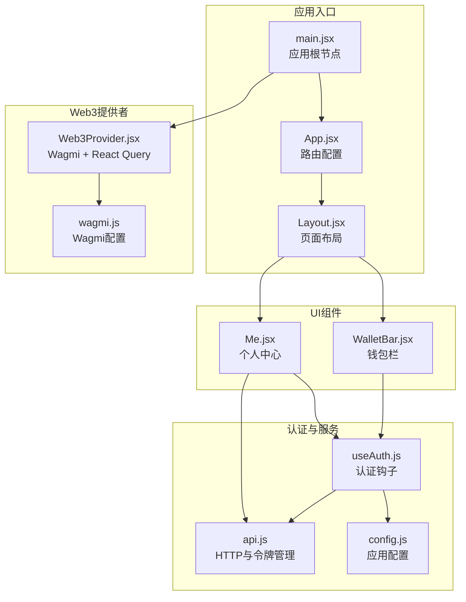
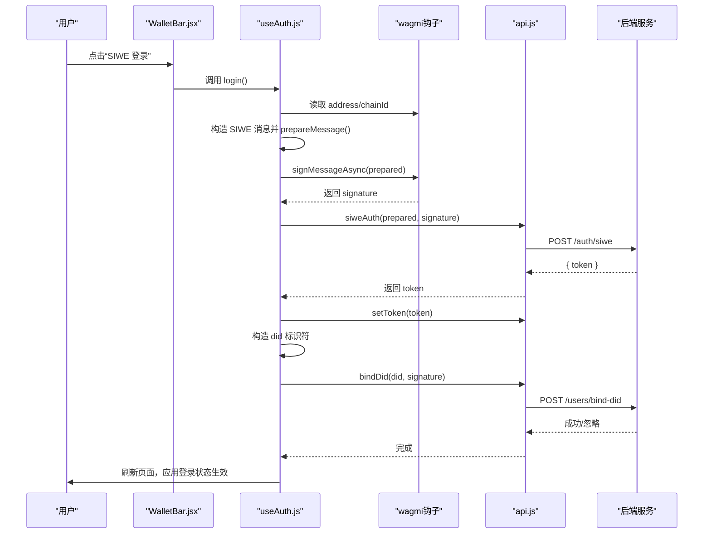
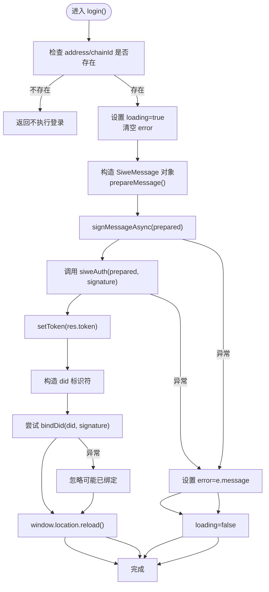
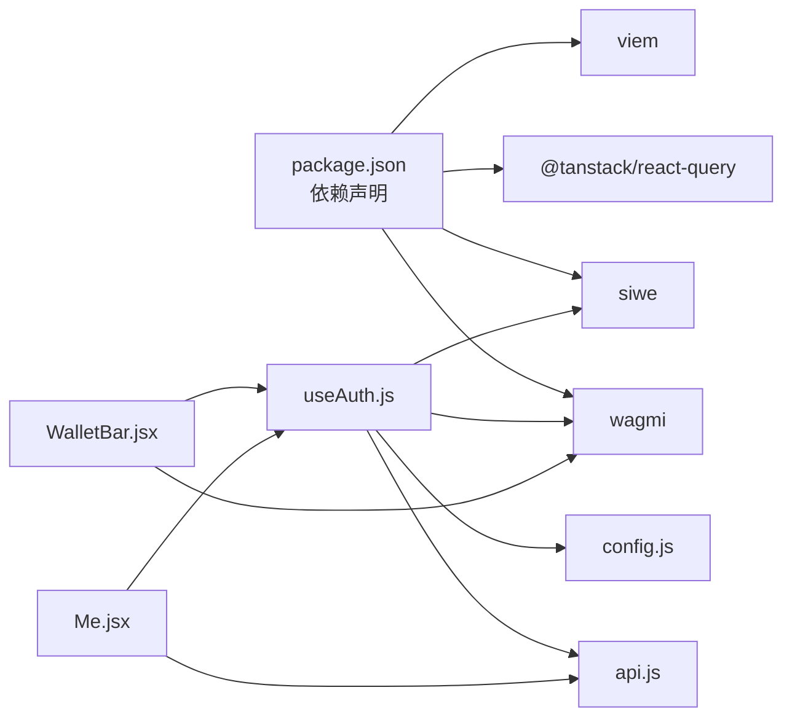

# 用户认证系统

<cite>
**本文档引用的文件**
- [useAuth.js](file://src/hooks/useAuth.js)
- [Web3Provider.jsx](file://src/providers/Web3Provider.jsx)
- [App.jsx](file://src/App.jsx)
- [main.jsx](file://src/main.jsx)
- [wagmi.js](file://src/wagmi.js)
- [api.js](file://src/services/api.js)
- [config.js](file://src/config.js)
- [WalletBar.jsx](file://src/components/WalletBar.jsx)
- [Me.jsx](file://src/pages/Me.jsx)
- [Layout.jsx](file://src/components/Layout.jsx)
- [package.json](file://package.json)
</cite>

## 目录
1. [简介](#简介)
2. [项目结构](#项目结构)
3. [核心组件](#核心组件)
4. [架构总览](#架构总览)
5. [详细组件分析](#详细组件分析)
6. [依赖关系分析](#依赖关系分析)
7. [性能考虑](#性能考虑)
8. [故障排除指南](#故障排除指南)
9. [结论](#结论)
10. [附录](#附录)

## 简介
本文件面向PredictionDID前端的用户认证系统，重点阐述SIWE（Sign-In with Ethereum）集成实现，涵盖钱包连接流程、签名验证机制、DID身份绑定过程、认证状态管理、会话持久化以及与Web3Provider/Wagmi的集成方式。文档提供完整的认证工作流程图、错误处理策略与安全注意事项，并给出在组件中使用认证功能的实际示例路径，包括登录、登出、状态检查等常见操作。

## 项目结构
前端采用React + Vite构建，认证系统围绕以下关键模块组织：
- 提供者层：Web3Provider负责注入Wagmi与React Query能力，贯穿整个应用。
- 钩子层：useAuth封装钱包账户、签名、SIWE登录、登出与状态管理。
- 服务层：api.js统一管理HTTP请求、令牌存储与后端接口调用。
- 配置层：config.js集中管理API地址、链ID、SIWE域名与URI等。
- UI层：WalletBar、Layout、Me等组件展示认证状态与触发认证动作。

图表来源
- [main.jsx](file://src/main.jsx#L17-L32)
- [App.jsx](file://src/App.jsx#L31-L66)
- [Layout.jsx](file://src/components/Layout.jsx#L14-L68)
- [Web3Provider.jsx](file://src/providers/Web3Provider.jsx#L16-L24)
- [wagmi.js](file://src/wagmi.js#L26-L36)
- [useAuth.js](file://src/hooks/useAuth.js#L16-L108)
- [api.js](file://src/services/api.js#L8-L55)
- [config.js](file://src/config.js#L7-L22)
- [WalletBar.jsx](file://src/components/WalletBar.jsx#L10-L53)
- [Me.jsx](file://src/pages/Me.jsx#L22-L104)

章节来源
- [main.jsx](file://src/main.jsx#L17-L32)
- [App.jsx](file://src/App.jsx#L31-L66)
- [Layout.jsx](file://src/components/Layout.jsx#L14-L68)
- [Web3Provider.jsx](file://src/providers/Web3Provider.jsx#L16-L24)
- [wagmi.js](file://src/wagmi.js#L26-L36)
- [useAuth.js](file://src/hooks/useAuth.js#L16-L108)
- [api.js](file://src/services/api.js#L8-L55)
- [config.js](file://src/config.js#L7-L22)
- [WalletBar.jsx](file://src/components/WalletBar.jsx#L10-L53)
- [Me.jsx](file://src/pages/Me.jsx#L22-L104)

## 核心组件
- useAuth钩子：封装钱包连接状态、SIWE登录、登出、认证状态判断与错误处理；负责生成SIWE消息、请求签名、调用后端认证接口、保存JWT令牌、构造并尝试绑定DID。
- Web3Provider：在应用顶层注入Wagmi与React Query，确保全应用具备钱包连接与数据缓存能力。
- wagmi配置：定义本地链（Hardhat）与连接器（injected），提供HTTP传输。
- API服务：统一封装fetch请求、令牌读写、错误处理；提供siweAuth与bindDid等认证相关接口。
- WalletBar组件：根据钱包连接与认证状态展示连接/断开、登录/登出、地址显示与错误提示。
- Me页面：在认证后拉取用户持仓，提供Claim操作入口。

章节来源
- [useAuth.js](file://src/hooks/useAuth.js#L16-L108)
- [Web3Provider.jsx](file://src/providers/Web3Provider.jsx#L16-L24)
- [wagmi.js](file://src/wagmi.js#L11-L36)
- [api.js](file://src/services/api.js#L8-L107)
- [WalletBar.jsx](file://src/components/WalletBar.jsx#L10-L53)
- [Me.jsx](file://src/pages/Me.jsx#L22-L104)

## 架构总览
认证系统采用“提供者注入 + 自定义钩子 + 服务封装”的分层设计：
- 提供者层：Web3Provider在根节点注入Wagmi与React Query，使任意组件可直接使用useAccount、useSignMessage等钩子。
- 钩子层：useAuth聚合钱包状态与签名逻辑，完成SIWE消息构造、签名请求与后端认证。
- 服务层：api.js统一处理请求头（含Authorization）、响应解析与错误抛出，封装令牌持久化。
- UI层：WalletBar与Me等组件基于useAuth暴露的状态与方法进行渲染与交互。

图表来源
- [WalletBar.jsx](file://src/components/WalletBar.jsx#L36-L40)
- [useAuth.js](file://src/hooks/useAuth.js#L29-L80)
- [api.js](file://src/services/api.js#L94-L99)
- [api.js](file://src/services/api.js#L102-L107)

## 详细组件分析

### useAuth钩子：SIWE登录与状态管理
- 功能要点
  - 读取钱包地址与链ID，结合useSignMessage请求用户签名。
  - 使用SiweMessage构造标准SIWE消息，包含domain、uri、statement、version、chainId、nonce等字段，防止重放攻击。
  - 调用后端siweAuth接口获取JWT令牌，保存至localStorage。
  - 构造did:pkh标识符并尝试绑定，若已绑定则忽略错误。
  - 提供isAuthenticated、loading、error等状态，便于UI层渲染。
- 关键流程
  - 登录：校验地址与链ID -> 构造SIWE消息 -> 请求签名 -> 调用siweAuth -> setToken -> 绑定DID -> 刷新页面。
  - 登出：clearToken -> 刷新页面。
- 错误处理
  - 捕获登录过程中的异常并设置error；登出不抛错，仅清理令牌。
- 安全考虑
  - nonce随机生成，降低重放风险。
  - 令牌通过Authorization头传递，避免明文泄露。
  - 绑定DID为可选步骤，失败不影响登录流程。

图表来源
- [useAuth.js](file://src/hooks/useAuth.js#L29-L80)
- [api.js](file://src/services/api.js#L94-L99)
- [api.js](file://src/services/api.js#L102-L107)

章节来源
- [useAuth.js](file://src/hooks/useAuth.js#L16-L108)

### Web3Provider与Wagmi集成
- Web3Provider在根节点注入WagmiProvider与QueryClientProvider，确保全应用具备：
  - useAccount：读取钱包连接状态、地址、链ID。
  - useSignMessage：异步请求用户签名。
  - React Query：缓存与管理异步数据请求。
- wagmi配置定义本地链（Hardhat）与injected连接器，提供HTTP传输。

章节来源
- [Web3Provider.jsx](file://src/providers/Web3Provider.jsx#L16-L24)
- [wagmi.js](file://src/wagmi.js#L11-L36)

### API服务与令牌持久化
- 令牌管理
  - getToken/setToken/clearToken分别读取、保存与移除localStorage中的JWT令牌。
  - request函数自动在headers中附加Authorization: Bearer token，若存在。
- 错误处理
  - 若响应非2xx，抛出错误（优先使用后端返回的error字段）。
- 认证相关接口
  - siweAuth：POST /auth/siwe，传入message与signature，返回{ token }。
  - bindDid：POST /users/bind-did，传入did与signature，用于绑定DID身份。

章节来源
- [api.js](file://src/services/api.js#L8-L55)
- [api.js](file://src/services/api.js#L94-L99)
- [api.js](file://src/services/api.js#L102-L107)

### WalletBar组件：认证状态展示与触发
- 行为逻辑
  - 未连接：显示“连接钱包”按钮。
  - 已连接：显示地址缩略、未登录时显示“SIWE 登录”，已认证显示“已登录”，并提供“断开”按钮（同时登出与断开钱包）。
  - 错误显示：当useAuth返回error时，统一展示错误信息。
- 与useAuth的协作
  - 通过useAuth获取token、login、logout、loading、error、isAuthenticated等状态与方法。

章节来源
- [WalletBar.jsx](file://src/components/WalletBar.jsx#L10-L53)
- [useAuth.js](file://src/hooks/useAuth.js#L91-L108)

### Me页面：认证后数据加载与Claim操作
- 行为逻辑
  - 认证成功后自动加载用户持仓列表。
  - 对于已结算或作废且未领取的市场，提供Claim按钮。
  - 交易状态通过TxStatus组件展示。
- 与useAuth的协作
  - 未连接钱包时提示连接；已连接未认证时提供登录按钮。

章节来源
- [Me.jsx](file://src/pages/Me.jsx#L22-L104)
- [useAuth.js](file://src/hooks/useAuth.js#L91-L108)

## 依赖关系分析
- 外部依赖
  - wagmi：提供钱包连接与签名能力。
  - siwe：构造与解析SIWE消息。
  - @tanstack/react-query：缓存与管理异步数据。
  - viem：链定义与传输。
- 内部依赖
  - useAuth依赖wagmi钩子、config与api服务。
  - WalletBar依赖useAuth与wagmi钩子。
  - Me依赖useAuth与api服务。

图表来源
- [package.json](file://package.json#L12-L28)
- [useAuth.js](file://src/hooks/useAuth.js#L4-L10)
- [api.js](file://src/services/api.js#L2-L2)
- [config.js](file://src/config.js#L8-L22)
- [WalletBar.jsx](file://src/components/WalletBar.jsx#L2-L4)
- [Me.jsx](file://src/pages/Me.jsx#L6-L12)

章节来源
- [package.json](file://package.json#L12-L28)
- [useAuth.js](file://src/hooks/useAuth.js#L4-L10)
- [api.js](file://src/services/api.js#L2-L2)
- [config.js](file://src/config.js#L8-L22)
- [WalletBar.jsx](file://src/components/WalletBar.jsx#L2-L4)
- [Me.jsx](file://src/pages/Me.jsx#L6-L12)

## 性能考虑
- 令牌缓存：使用localStorage存储JWT，避免每次请求重复登录。
- 请求复用：React Query提供缓存与去重，减少重复网络请求。
- 按需加载：认证状态变化时才触发数据加载，避免不必要的API调用。
- 优化建议
  - 在高并发场景下，为siweAuth与bindDid增加防抖与幂等处理。
  - 对API响应进行结构化缓存，区分不同资源类型。
  - 在移动端优化WalletBar的交互反馈，减少频繁重绘。

## 故障排除指南
- 常见问题与排查
  - 钱包未连接：检查WagmiProvider是否正确注入，确认浏览器钱包扩展已安装并启用。
  - 登录失败：确认config中的siweDomain与siweUri与后端一致；检查链ID是否匹配；查看useAuth返回的error信息。
  - 令牌无效：确认后端JWT签发与过期时间；检查api.js中Authorization头是否正确附加。
  - 绑定DID失败：bindDid为可选步骤，若已绑定会忽略错误；可在日志中确认是否重复绑定。
- 错误处理策略
  - 登录阶段：捕获异常并设置error，保持loading状态直至finally执行。
  - 登出阶段：clearToken后刷新页面，确保状态完全重置。
  - UI层：WalletBar统一展示error，便于用户感知与反馈。

章节来源
- [useAuth.js](file://src/hooks/useAuth.js#L73-L79)
- [api.js](file://src/services/api.js#L49-L54)
- [WalletBar.jsx](file://src/components/WalletBar.jsx#L50)

## 结论
该认证系统通过useAuth钩子整合Wagmi与SIWE，实现了从钱包连接到签名验证再到DID绑定的完整流程。配合Web3Provider与React Query，系统在用户体验与性能之间取得平衡。通过localStorage持久化JWT令牌，结合严格的错误处理与安全措施（nonce、Authorization头），为PredictionDID提供了稳定可靠的前端认证基础。

## 附录

### 实际使用示例（代码片段路径）
- 在组件中使用认证功能
  - 登录：参考 [WalletBar.jsx](file://src/components/WalletBar.jsx#L36-L40) 中的登录按钮点击事件。
  - 登出：参考 [WalletBar.jsx](file://src/components/WalletBar.jsx#L44-L46) 中的断开按钮点击事件。
  - 状态检查：参考 [Me.jsx](file://src/pages/Me.jsx#L69-L74) 中的认证状态判断与登录按钮显示。
  - 数据加载：参考 [Me.jsx](file://src/pages/Me.jsx#L42-L44) 中的useEffect与myPositions调用。
- 配置与环境变量
  - API地址与链ID：参考 [config.js](file://src/config.js#L9-L11)。
  - SIWE域名与URI：参考 [config.js](file://src/config.js#L18-L21)。
- 认证流程关键路径
  - SIWE登录流程：参考 [useAuth.js](file://src/hooks/useAuth.js#L29-L80)。
  - 令牌持久化：参考 [api.js](file://src/services/api.js#L8-L20)。
  - 绑定DID：参考 [api.js](file://src/services/api.js#L102-L107)。