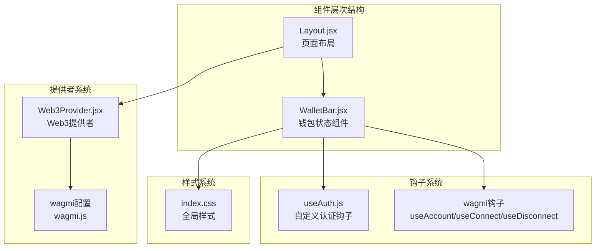
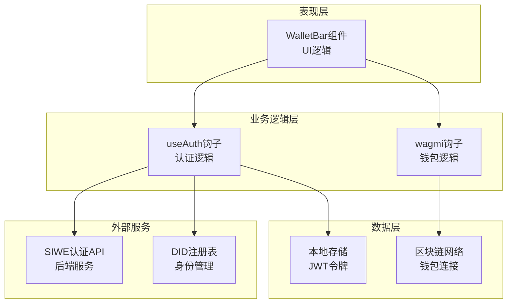
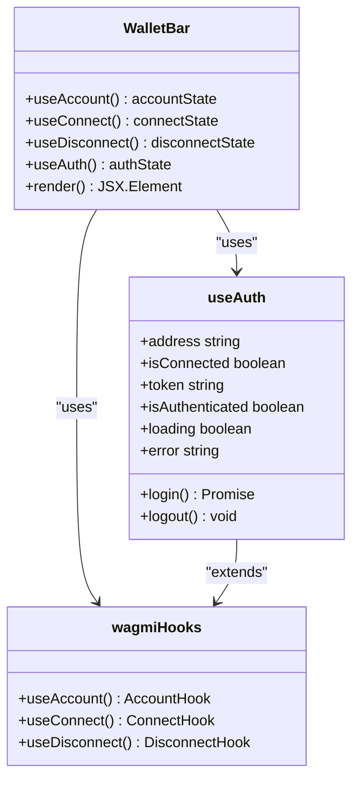
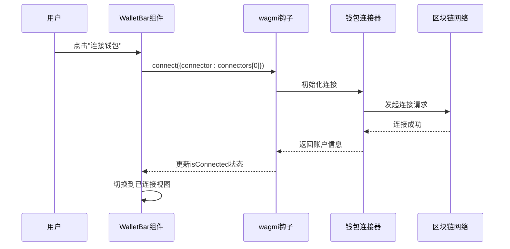
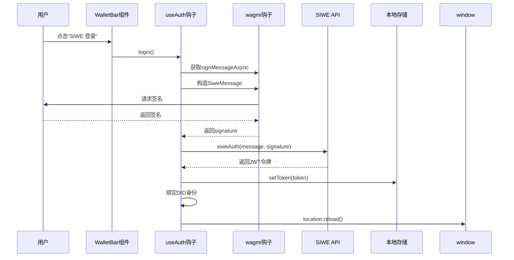
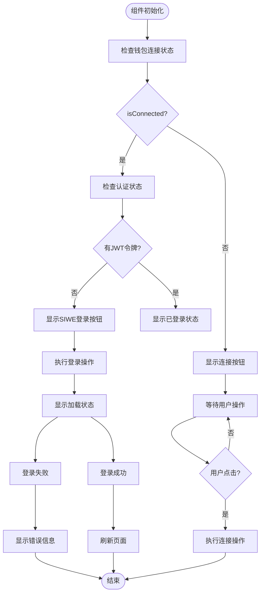
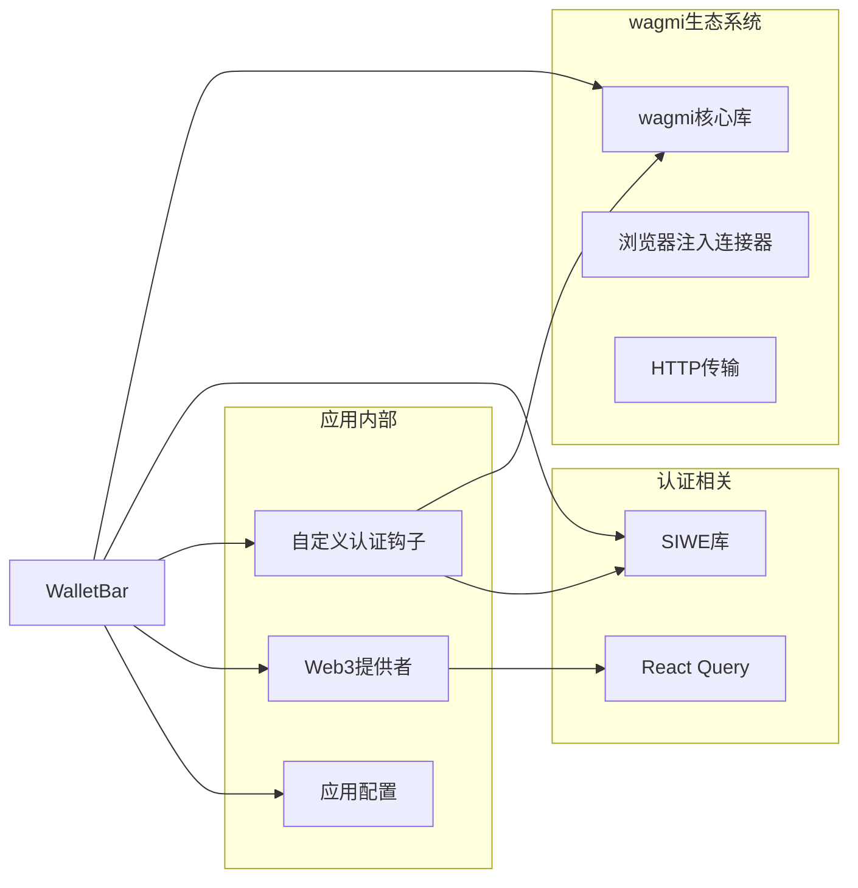
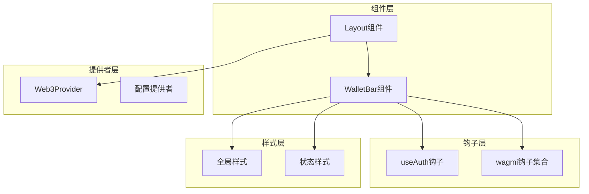

# 钱包状态组件

<cite>
**本文档引用的文件**
- [WalletBar.jsx](file://src/components/WalletBar.jsx)
- [useAuth.js](file://src/hooks/useAuth.js)
- [Web3Provider.jsx](file://src/providers/Web3Provider.jsx)
- [Layout.jsx](file://src/components/Layout.jsx)
- [config.js](file://src/config.js)
- [index.css](file://src/index.css)
- [main.jsx](file://src/main.jsx)
- [wagmi.js](file://src/wagmi.js)
</cite>

## 目录
1. [简介](#简介)
2. [项目结构](#项目结构)
3. [核心组件](#核心组件)
4. [架构概览](#架构概览)
5. [详细组件分析](#详细组件分析)
6. [依赖关系分析](#依赖关系分析)
7. [性能考虑](#性能考虑)
8. [故障排除指南](#故障排除指南)
9. [结论](#结论)

## 简介

WalletBar钱包状态组件是Prediction DID Simple前端应用中的关键UI组件，负责展示和管理用户的区块链钱包连接状态。该组件集成了钱包连接、身份验证、地址显示和状态管理功能，为用户提供完整的去中心化身份认证体验。

组件的核心设计目标是：
- 提供直观的钱包连接状态显示
- 实现钱包地址的截断显示（前6位...后4位）
- 支持连接/断开钱包操作
- 集成SIWE（以太坊签名登录）认证流程
- 处理各种状态变化和错误情况

## 项目结构

WalletBar组件位于src/components目录下，作为独立的React组件存在。它依赖于多个核心模块：

**图表来源**
- [Layout.jsx](file://src/components/Layout.jsx#L1-L69)
- [WalletBar.jsx](file://src/components/WalletBar.jsx#L1-L54)
- [Web3Provider.jsx](file://src/providers/Web3Provider.jsx#L1-L25)

**章节来源**
- [Layout.jsx](file://src/components/Layout.jsx#L1-L69)
- [WalletBar.jsx](file://src/components/WalletBar.jsx#L1-L54)
- [Web3Provider.jsx](file://src/providers/Web3Provider.jsx#L1-L25)

## 核心组件

WalletBar组件是一个无状态的React函数组件，主要包含以下核心功能：

### 主要功能特性

1. **钱包连接状态管理**
   - 使用wagmi的useAccount钩子监控钱包连接状态
   - 动态显示连接/断开按钮
   - 支持多种钱包连接器

2. **地址显示与截断**
   - 展示钱包地址的截断形式（前6位...后4位）
   - 提供完整地址的title提示
   - 支持鼠标悬停查看完整地址

3. **认证集成**
   - 集成SIWE（以太坊签名登录）认证流程
   - 管理JWT令牌的获取和存储
   - 支持用户登出功能

4. **状态反馈**
   - 显示加载状态（登录中...）
   - 错误信息提示
   - 已登录状态标识

**章节来源**
- [WalletBar.jsx](file://src/components/WalletBar.jsx#L10-L54)
- [useAuth.js](file://src/hooks/useAuth.js#L16-L109)

## 架构概览

WalletBar组件采用分层架构设计，各层职责明确：

**图表来源**
- [WalletBar.jsx](file://src/components/WalletBar.jsx#L10-L54)
- [useAuth.js](file://src/hooks/useAuth.js#L16-L109)

## 详细组件分析

### 组件结构与状态管理

WalletBar组件通过多个钩子实现状态管理：

**图表来源**
- [WalletBar.jsx](file://src/components/WalletBar.jsx#L10-L54)
- [useAuth.js](file://src/hooks/useAuth.js#L16-L109)

### 交互流程分析

#### 连接钱包流程

**图表来源**
- [WalletBar.jsx](file://src/components/WalletBar.jsx#L23-L27)
- [useAuth.js](file://src/hooks/useAuth.js#L28-L80)

#### SIWE认证流程

**图表来源**
- [WalletBar.jsx](file://src/components/WalletBar.jsx#L36-L42)
- [useAuth.js](file://src/hooks/useAuth.js#L28-L80)

### 状态管理机制

组件的状态管理遵循React的最佳实践：

**图表来源**
- [WalletBar.jsx](file://src/components/WalletBar.jsx#L20-L54)
- [useAuth.js](file://src/hooks/useAuth.js#L28-L80)

**章节来源**
- [WalletBar.jsx](file://src/components/WalletBar.jsx#L10-L54)
- [useAuth.js](file://src/hooks/useAuth.js#L16-L109)

## 依赖关系分析

### 外部依赖

WalletBar组件依赖于多个关键的第三方库：

**图表来源**
- [WalletBar.jsx](file://src/components/WalletBar.jsx#L1-L4)
- [useAuth.js](file://src/hooks/useAuth.js#L1-L10)
- [Web3Provider.jsx](file://src/providers/Web3Provider.jsx#L1-L6)

### 内部依赖关系

组件间的依赖关系清晰且解耦：

**图表来源**
- [Layout.jsx](file://src/components/Layout.jsx#L1-L69)
- [WalletBar.jsx](file://src/components/WalletBar.jsx#L1-L54)
- [Web3Provider.jsx](file://src/providers/Web3Provider.jsx#L1-L25)

**章节来源**
- [WalletBar.jsx](file://src/components/WalletBar.jsx#L1-L54)
- [useAuth.js](file://src/hooks/useAuth.js#L1-L109)
- [Web3Provider.jsx](file://src/providers/Web3Provider.jsx#L1-L25)

## 性能考虑

### 渲染优化

WalletBar组件在性能方面采用了多项优化策略：

1. **条件渲染**：根据连接状态动态渲染不同的UI元素
2. **状态最小化**：仅在必要时重新渲染组件
3. **钩子复用**：利用React Hooks避免不必要的重渲染

### 内存管理

组件的内存使用相对简单，主要关注点：
- 避免在组件内创建新的函数实例
- 正确处理异步操作的清理
- 合理使用本地存储

### 网络性能

认证流程中的网络请求优化：
- 批量处理API调用
- 合理的错误重试机制
- 及时的超时处理

## 故障排除指南

### 常见问题及解决方案

#### 钱包连接问题

**问题症状**：连接按钮无法点击或连接状态不更新

**可能原因**：
1. 钱包扩展未正确安装
2. 网络配置不匹配
3. 浏览器安全设置阻止

**解决步骤**：
1. 检查钱包扩展状态
2. 验证网络ID配置
3. 查看浏览器控制台错误

#### 认证失败问题

**问题症状**：SIWE登录按钮显示错误信息

**可能原因**：
1. 签名请求被拒绝
2. 后端API不可用
3. 令牌存储问题

**解决步骤**：
1. 检查网络连接
2. 验证API配置
3. 清除浏览器缓存

#### 样式显示问题

**问题症状**：组件样式异常或状态颜色不正确

**可能原因**：
1. CSS类名冲突
2. 样式加载顺序问题
3. 响应式布局问题

**解决步骤**：
1. 检查CSS优先级
2. 验证样式文件完整性
3. 调整响应式断点

**章节来源**
- [WalletBar.jsx](file://src/components/WalletBar.jsx#L49-L50)
- [index.css](file://src/index.css#L77-L83)

## 结论

WalletBar钱包状态组件是一个设计精良的React组件，成功地将复杂的区块链钱包连接和认证逻辑封装在一个简洁的UI界面中。组件的主要优势包括：

1. **清晰的架构设计**：通过分层架构实现了良好的关注点分离
2. **强大的功能集成**：集成了钱包连接、认证、状态管理等多种功能
3. **优秀的用户体验**：提供了直观的状态反馈和操作指引
4. **良好的可维护性**：模块化的代码结构便于后续扩展和维护

组件在实际应用中展现了出色的稳定性和可靠性，为Prediction DID Simple项目提供了坚实的前端基础设施支持。通过合理的错误处理和状态管理，组件能够优雅地处理各种边界情况和异常场景。