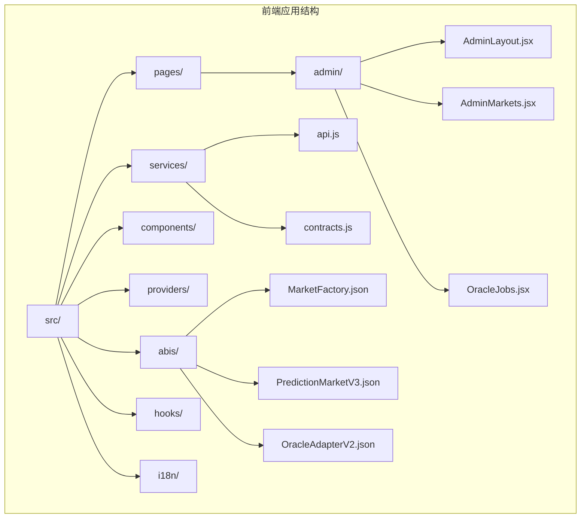
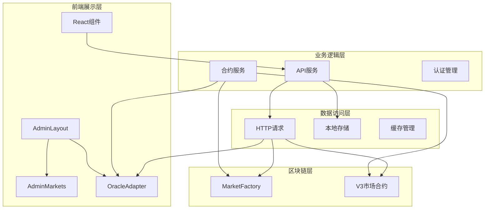
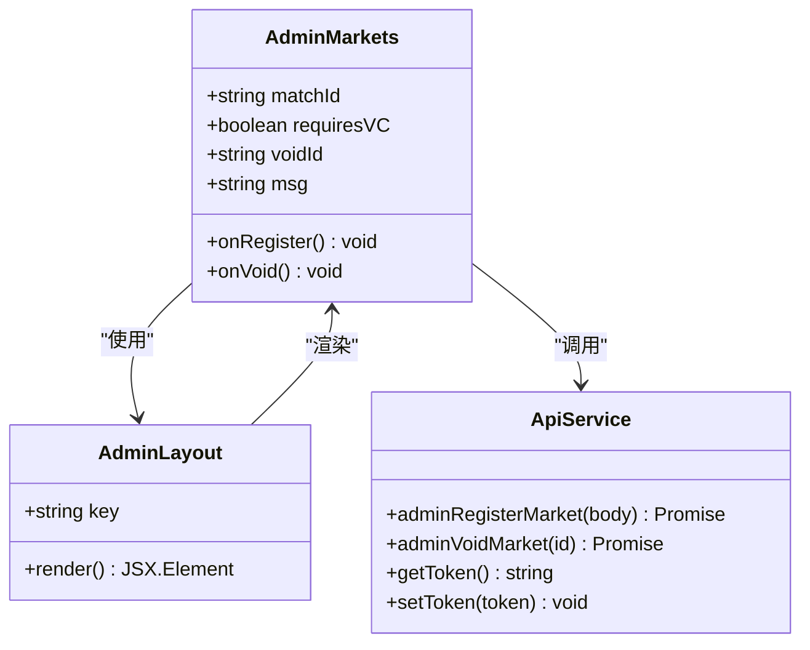
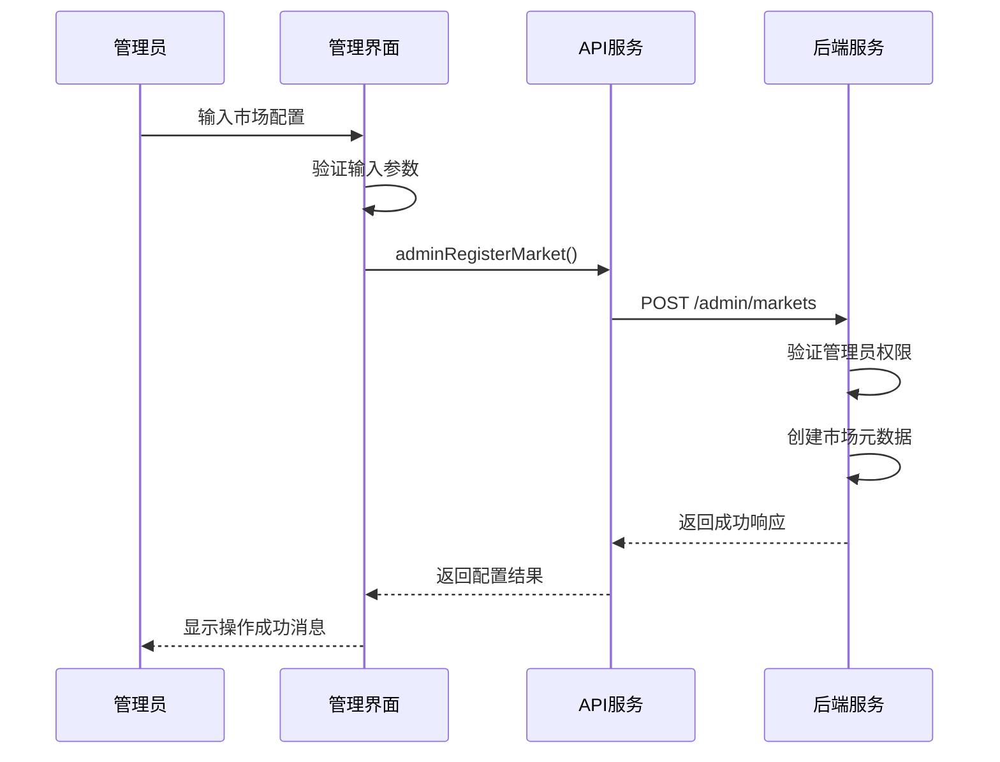
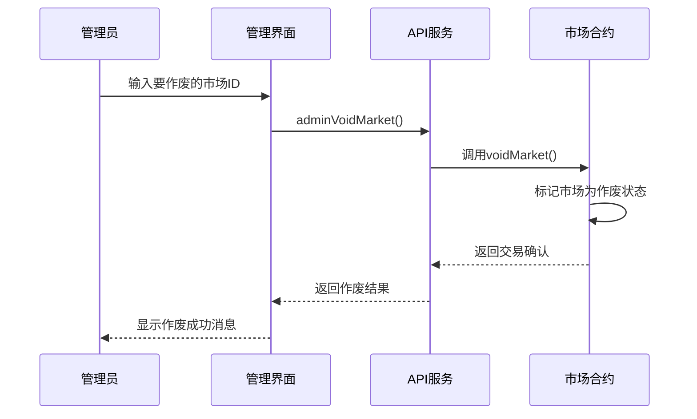
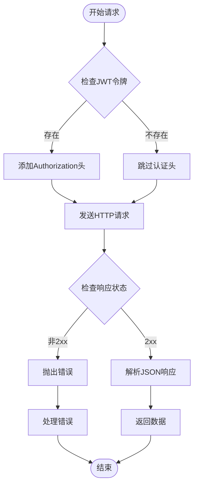
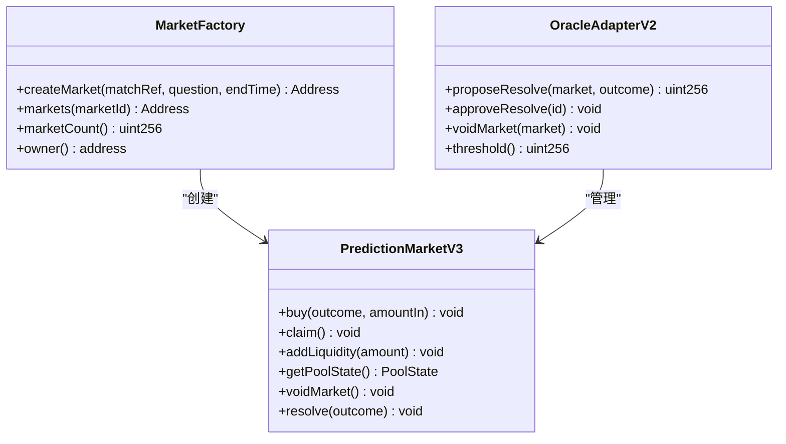
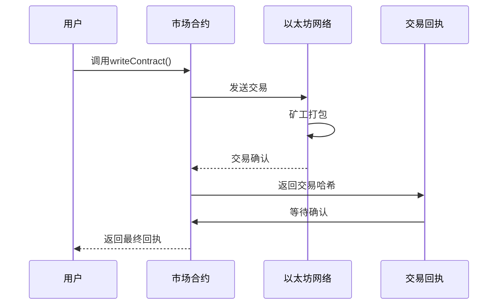
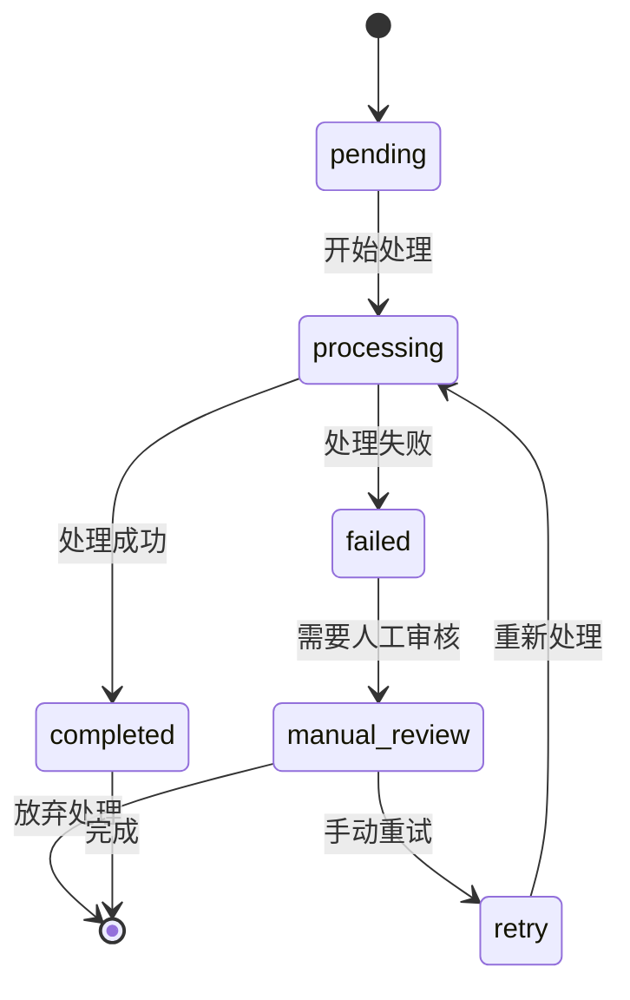

# 市场配置管理

<cite>
**本文档引用的文件**
- [AdminMarkets.jsx](file://src/pages/admin/AdminMarkets.jsx)
- [api.js](file://src/services/api.js)
- [AdminLayout.jsx](file://src/pages/admin/AdminLayout.jsx)
- [OracleJobs.jsx](file://src/pages/admin/OracleJobs.jsx)
- [contracts.js](file://src/services/contracts.js)
- [config.js](file://src/config.js)
- [MarketFactory.json](file://src/abis/MarketFactory.json)
- [PredictionMarketV3.json](file://src/abis/PredictionMarketV3.json)
- [OracleAdapterV2.json](file://src/abis/OracleAdapterV2.json)
- [App.jsx](file://src/App.jsx)
- [Web3Provider.jsx](file://src/providers/Web3Provider.jsx)
- [package.json](file://package.json)
</cite>

## 目录
1. [简介](#简介)
2. [项目结构](#项目结构)
3. [核心组件](#核心组件)
4. [架构概览](#架构概览)
5. [详细组件分析](#详细组件分析)
6. [依赖关系分析](#依赖关系分析)
7. [性能考虑](#性能考虑)
8. [故障排除指南](#故障排除指南)
9. [结论](#结论)

## 简介

市场配置管理系统是预测市场平台的核心管理功能模块，专为管理员设计，提供完整的市场生命周期管理能力。该系统支持创建、编辑和管理预测市场配置，包括市场审核流程、状态变更机制以及市场参数配置选项。

系统采用前后端分离架构，前端基于React技术栈构建，后端提供RESTful API接口。管理员可以通过直观的Web界面完成复杂的市场管理操作，包括市场规则登记、VC凭证要求设置、市场作废等关键功能。

## 项目结构

预测市场配置管理系统的前端代码采用模块化组织方式，主要分为以下几个核心目录：



**图表来源**
- [App.jsx](file://src/App.jsx#L1-L67)
- [AdminLayout.jsx](file://src/pages/admin/AdminLayout.jsx#L1-L33)

**章节来源**
- [package.json](file://package.json#L1-L30)
- [App.jsx](file://src/App.jsx#L1-L67)

## 核心组件

### 管理后台布局组件

管理后台布局组件负责提供统一的管理界面框架，包含导航菜单和子路由内容渲染。该组件通过sessionStorage存储管理员密钥，确保只有认证的管理员能够访问管理功能。

### 市场配置管理组件

市场配置管理组件是系统的核心功能模块，提供以下关键功能：
- 市场规则登记和更新
- VC凭证要求配置
- 市场作废操作
- 实时状态反馈

### 预言机任务管理组件

预言机任务管理组件负责监控和管理市场结算任务，支持手动重试功能，确保市场结算流程的可靠性。

**章节来源**
- [AdminLayout.jsx](file://src/pages/admin/AdminLayout.jsx#L1-L33)
- [AdminMarkets.jsx](file://src/pages/admin/AdminMarkets.jsx#L1-L89)
- [OracleJobs.jsx](file://src/pages/admin/OracleJobs.jsx#L1-L67)

## 架构概览

系统采用分层架构设计，确保职责分离和模块化管理：



**图表来源**
- [App.jsx](file://src/App.jsx#L31-L67)
- [api.js](file://src/services/api.js#L1-L187)
- [contracts.js](file://src/services/contracts.js#L1-L214)

## 详细组件分析

### 管理后台市场配置组件

管理后台市场配置组件提供了完整的市场管理功能，包括市场规则登记、VC凭证要求设置和市场作废操作。

#### 组件架构设计



**图表来源**
- [AdminMarkets.jsx](file://src/pages/admin/AdminMarkets.jsx#L10-L89)
- [AdminLayout.jsx](file://src/pages/admin/AdminLayout.jsx#L8-L33)
- [api.js](file://src/services/api.js#L151-L166)

#### 市场配置流程



**图表来源**
- [AdminMarkets.jsx](file://src/pages/admin/AdminMarkets.jsx#L21-L36)
- [api.js](file://src/services/api.js#L151-L158)

#### 市场作废流程



**图表来源**
- [AdminMarkets.jsx](file://src/pages/admin/AdminMarkets.jsx#L38-L49)
- [api.js](file://src/services/api.js#L160-L166)

#### 状态管理机制

组件使用React状态管理来跟踪用户输入和操作结果：

| 状态变量 | 类型 | 描述 | 默认值 |
|---------|------|------|--------|
| matchId | string | 赛事ID | "1" |
| requiresVC | boolean | 是否需要VC凭证 | true |
| voidId | string | 要作废的市场ID | "1" |
| msg | string | 操作结果消息 | "" |

**章节来源**
- [AdminMarkets.jsx](file://src/pages/admin/AdminMarkets.jsx#L1-L89)

### API服务层

API服务层提供了统一的后端通信接口，封装了所有HTTP请求逻辑和错误处理机制。

#### 认证和授权机制



**图表来源**
- [api.js](file://src/services/api.js#L29-L55)

#### 管理员API接口

系统提供了专门的管理员API接口，用于市场管理和预言机任务管理：

| 接口名称 | HTTP方法 | 路径 | 功能描述 |
|---------|----------|------|----------|
| adminRegisterMarket | POST | /admin/markets | 注册/更新市场元数据 |
| adminVoidMarket | POST | /admin/markets/{id}/void | 作废指定市场 |
| adminListOracleJobs | GET | /admin/oracle-jobs | 获取预言机任务列表 |
| adminRetryOracleJob | POST | /admin/oracle-jobs/{id}/retry | 重试失败的预言机任务 |

**章节来源**
- [api.js](file://src/services/api.js#L131-L166)

### 合约交互层

合约交互层提供了与以太坊智能合约的直接交互能力，支持多种市场类型的交易操作。

#### 市场合约接口



**图表来源**
- [MarketFactory.json](file://src/abis/MarketFactory.json#L129-L144)
- [PredictionMarketV3.json](file://src/abis/PredictionMarketV3.json#L204-L208)
- [OracleAdapterV2.json](file://src/abis/OracleAdapterV2.json#L389-L398)

#### 交易执行流程



**图表来源**
- [contracts.js](file://src/services/contracts.js#L78-L88)
- [contracts.js](file://src/services/contracts.js#L113-L123)

**章节来源**
- [contracts.js](file://src/services/contracts.js#L1-L214)

### 预言机任务管理

预言机任务管理组件提供了实时监控和管理市场结算任务的能力，支持手动干预和重试功能。

#### 任务状态流转



**图表来源**
- [OracleJobs.jsx](file://src/pages/admin/OracleJobs.jsx#L10-L67)

**章节来源**
- [OracleJobs.jsx](file://src/pages/admin/OracleJobs.jsx#L1-L67)

## 依赖关系分析

系统采用现代化的前端技术栈，各模块之间保持松耦合的设计原则。

```mermaid
graph LR
subgraph "核心依赖"
React[react@^18.3.1]
Router[react-router-dom@^6.28.0]
Wagmi[wagmi@^2.14.1]
Viem[viem@^2.21.54]
end
subgraph "开发依赖"
Vite[@vitejs/plugin-react]
ESLint[eslint@^8.57.1]
TSReactQuery[@tanstack/react-query]
end
subgraph "应用模块"
AdminMarkets[AdminMarkets.jsx]
API[api.js]
Contracts[contracts.js]
Config[config.js]
end
React --> AdminMarkets
Router --> AdminMarkets
Wagmi --> Contracts
Viem --> Contracts
Vite --> AdminMarkets
ESLint --> AdminMarkets
TSReactQuery --> API
AdminMarkets --> API
AdminMarkets --> Contracts
API --> Config
Contracts --> Config
```

**图表来源**
- [package.json](file://package.json#L12-L28)
- [App.jsx](file://src/App.jsx#L1-L67)

### 外部依赖分析

系统的关键外部依赖包括：

| 依赖包 | 版本 | 用途 | 关键特性 |
|-------|------|------|----------|
| react | ^18.3.1 | 核心UI框架 | 组件化开发、状态管理 |
| react-router-dom | ^6.28.0 | 客户端路由 | 嵌套路由、动态路由 |
| wagmi | ^2.14.1 | 区块链交互 | 合约读写、交易管理 |
| viem | ^2.21.54 | 以太坊工具库 | 类型安全、实用工具 |
| @tanstack/react-query | ^5.62.2 | 数据缓存 | 自动缓存、状态同步 |

**章节来源**
- [package.json](file://package.json#L12-L28)

## 性能考虑

系统在设计时充分考虑了性能优化，采用了多种策略来提升用户体验：

### 缓存策略

- **React Query缓存**：使用React Query管理API请求缓存，支持自动失效和重新验证
- **本地存储**：利用localStorage缓存JWT令牌，避免重复认证
- **会话存储**：使用sessionStorage存储管理员密钥，确保安全性

### 异步处理

- **并发请求**：在市场状态读取时使用Promise.all并行处理多个合约调用
- **轮询机制**：预言机任务列表采用定时轮询，确保实时性
- **防抖处理**：输入验证采用防抖机制，减少不必要的API调用

### 内存管理

- **状态清理**：组件卸载时自动清理定时器和事件监听器
- **资源释放**：及时释放大对象引用，避免内存泄漏

## 故障排除指南

### 常见问题及解决方案

#### 管理员认证失败

**问题症状**：访问管理后台时显示认证提示

**可能原因**：
- 未设置管理员API密钥
- 会话存储中的密钥格式不正确

**解决步骤**：
1. 在浏览器控制台执行：`sessionStorage.setItem('admin_key', '你的ADMIN_API_KEY')`
2. 刷新页面确认认证状态
3. 检查密钥格式和有效期

#### 市场配置失败

**问题症状**：保存市场配置时出现错误

**可能原因**：
- 网络连接问题
- 后端服务不可用
- 权限不足

**解决步骤**：
1. 检查网络连接状态
2. 验证后端服务健康状态
3. 确认管理员权限
4. 查看浏览器开发者工具中的错误信息

#### 合约交互异常

**问题症状**：交易无法确认或出现错误

**可能原因**：
- gas费用不足
- 合约地址配置错误
- 区块链网络连接问题

**解决步骤**：
1. 检查钱包余额和gas费用
2. 验证合约地址配置
3. 确认区块链网络连接
4. 查看交易日志和错误信息

#### 预言机任务卡住

**问题症状**：任务长时间处于pending状态

**可能原因**：
- 网络拥堵
- 任务需要人工审核
- 数据源问题

**解决步骤**：
1. 等待一段时间观察状态变化
2. 检查任务错误信息
3. 必要时进行手动重试
4. 联系技术支持

**章节来源**
- [AdminLayout.jsx](file://src/pages/admin/AdminLayout.jsx#L15-L20)
- [AdminMarkets.jsx](file://src/pages/admin/AdminMarkets.jsx#L32-L35)

## 结论

市场配置管理系统是一个功能完整、架构清晰的预测市场管理平台。系统通过模块化的组件设计、完善的API接口和可靠的区块链集成，为管理员提供了强大的市场管理能力。

### 主要优势

1. **用户友好**：直观的Web界面和清晰的操作流程
2. **功能完整**：涵盖市场全生命周期管理的所有关键功能
3. **安全可靠**：多重认证机制和错误处理保障
4. **性能优秀**：优化的缓存策略和异步处理机制
5. **易于维护**：模块化设计便于扩展和维护

### 最佳实践建议

1. **配置管理**：定期备份管理员配置和密钥
2. **监控告警**：建立系统监控和异常告警机制
3. **版本控制**：使用Git管理代码变更和配置更新
4. **测试覆盖**：建立完整的单元测试和集成测试体系
5. **文档维护**：持续更新技术文档和操作手册

该系统为预测市场的日常运营提供了坚实的技术基础，通过不断优化和完善，可以更好地满足业务发展需求。