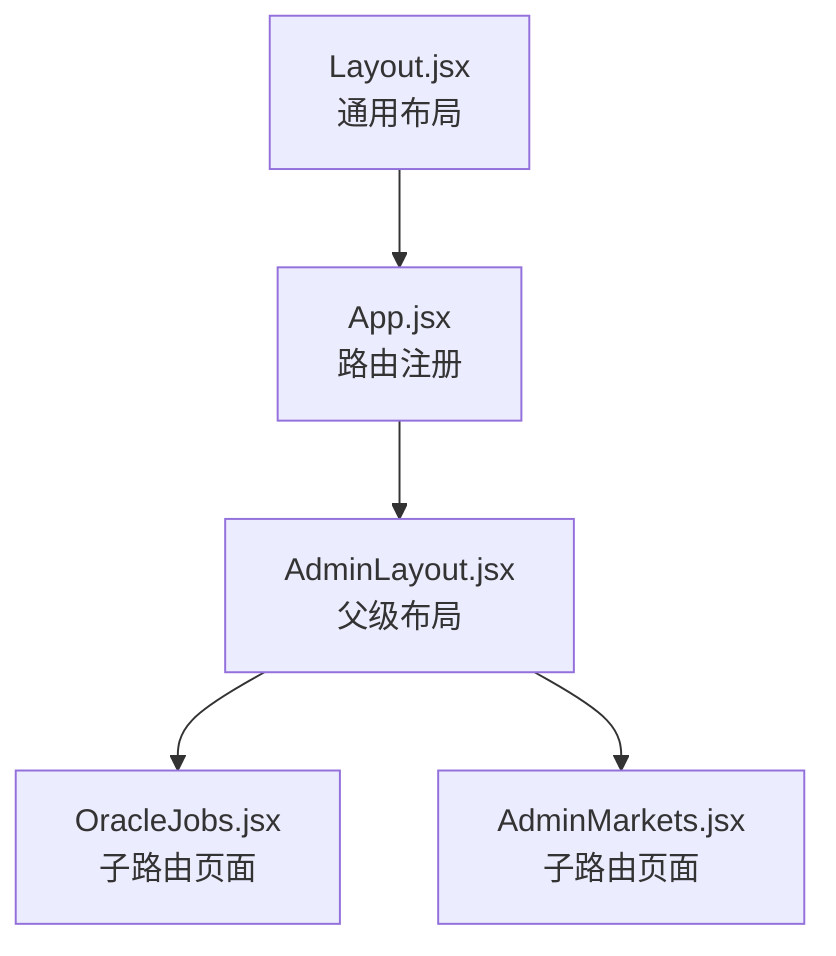
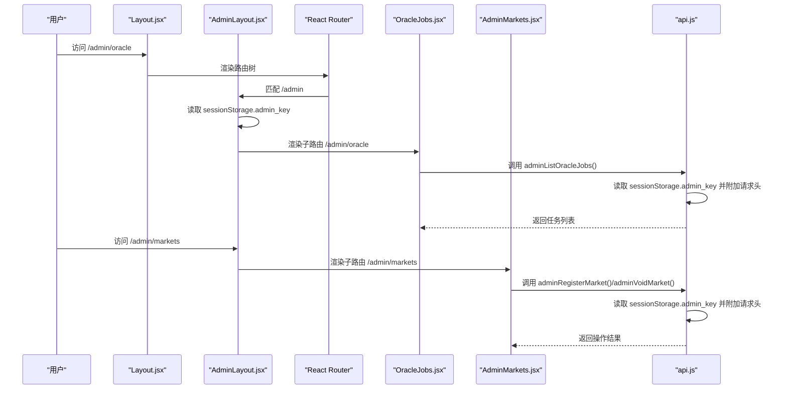
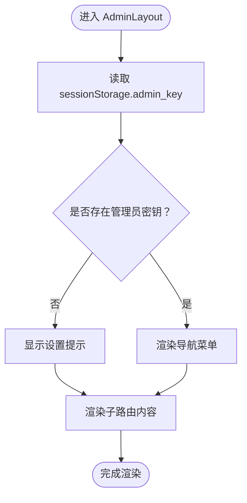
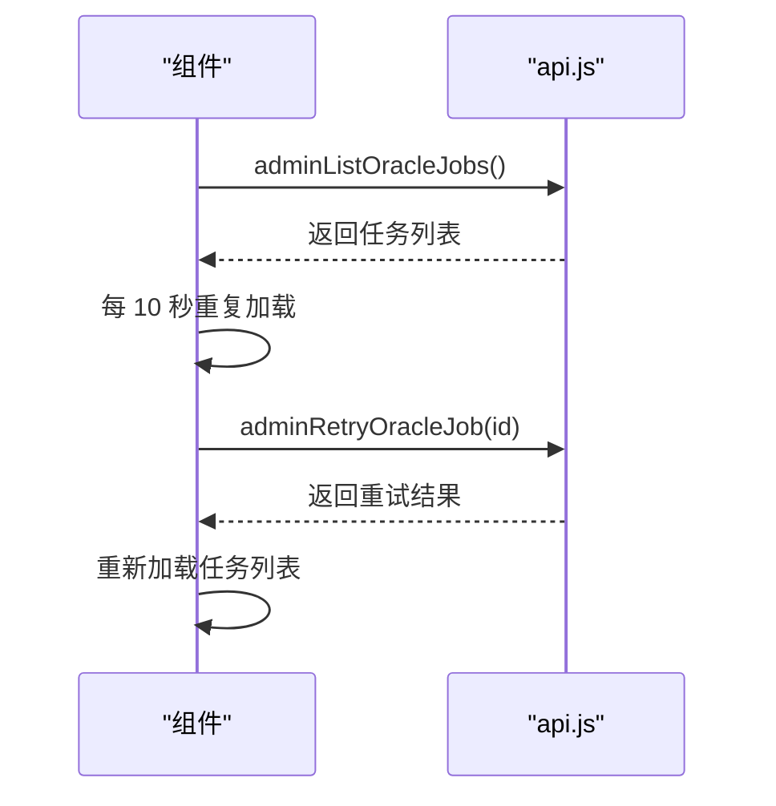
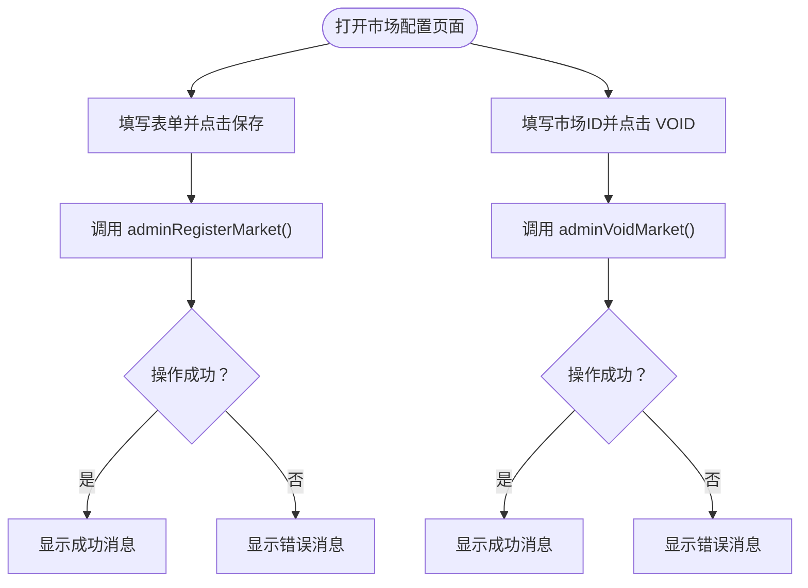
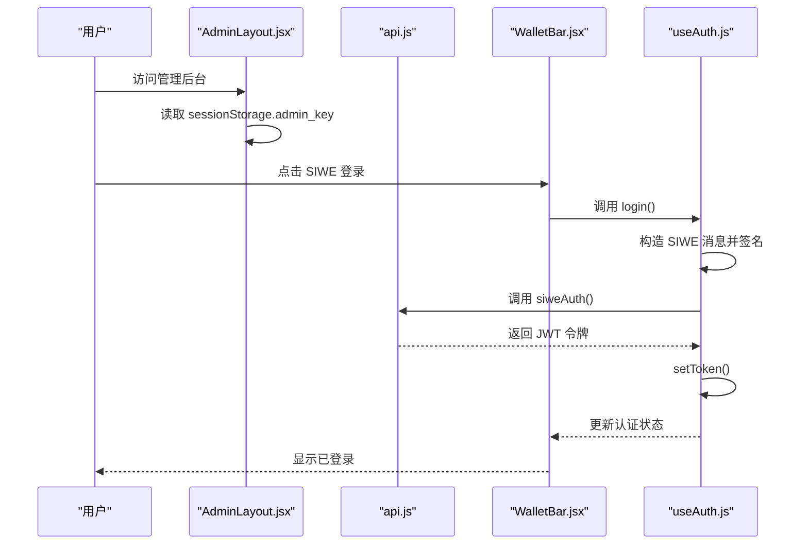
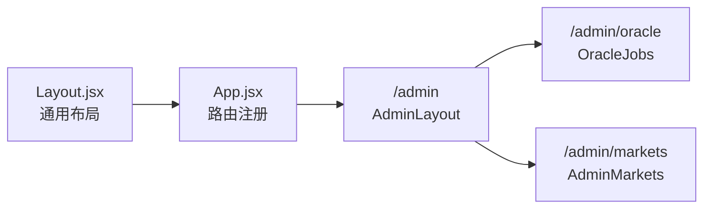
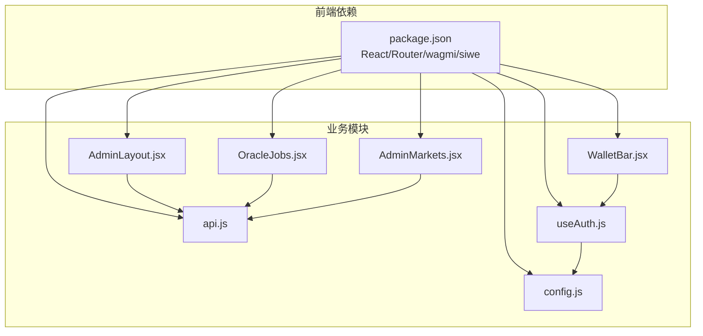

# 管理后台布局

<cite>
**本文引用的文件**
- [src/pages/admin/AdminLayout.jsx](file://src/pages/admin/AdminLayout.jsx)
- [src/App.jsx](file://src/App.jsx)
- [src/components/Layout.jsx](file://src/components/Layout.jsx)
- [src/services/api.js](file://src/services/api.js)
- [src/hooks/useAuth.js](file://src/hooks/useAuth.js)
- [src/components/WalletBar.jsx](file://src/components/WalletBar.jsx)
- [src/pages/admin/OracleJobs.jsx](file://src/pages/admin/OracleJobs.jsx)
- [src/pages/admin/AdminMarkets.jsx](file://src/pages/admin/AdminMarkets.jsx)
- [src/config.js](file://src/config.js)
- [src/i18n/index.jsx](file://src/i18n/index.jsx)
- [package.json](file://package.json)
</cite>

## 目录
1. [简介](#简介)
2. [项目结构](#项目结构)
3. [核心组件](#核心组件)
4. [架构总览](#架构总览)
5. [详细组件分析](#详细组件分析)
6. [依赖关系分析](#依赖关系分析)
7. [性能考虑](#性能考虑)
8. [故障排除指南](#故障排除指南)
9. [结论](#结论)
10. [附录](#附录)

## 简介
本文件聚焦于管理后台布局组件的设计与实现，围绕 AdminLayout 组件展开，深入解析其权限验证机制、路由导航系统、状态管理与条件渲染逻辑，并结合子路由页面展示如何与父级布局协同工作。文档还提供布局定制指南与权限控制最佳实践，帮助开发者快速理解并扩展管理后台功能。

## 项目结构
管理后台布局位于前端 src/pages/admin 目录下，采用嵌套路由设计：
- 父级布局：AdminLayout.jsx
- 子路由页面：OracleJobs.jsx（预言机任务队列）、AdminMarkets.jsx（市场配置）
- 路由注册：App.jsx 中定义 admin 嵌套路由

图表来源
- [src/App.jsx](file://src/App.jsx#L55-L61)
- [src/pages/admin/AdminLayout.jsx](file://src/pages/admin/AdminLayout.jsx#L1-L33)
- [src/pages/admin/OracleJobs.jsx](file://src/pages/admin/OracleJobs.jsx#L1-L67)
- [src/pages/admin/AdminMarkets.jsx](file://src/pages/admin/AdminMarkets.jsx#L1-L89)
- [src/components/Layout.jsx](file://src/components/Layout.jsx#L1-L69)

章节来源
- [src/App.jsx](file://src/App.jsx#L31-L66)
- [src/pages/admin/AdminLayout.jsx](file://src/pages/admin/AdminLayout.jsx#L1-L33)

## 核心组件
- AdminLayout：管理后台父级布局，负责渲染导航菜单与子路由出口，同时提供管理员权限提示与校验。
- OracleJobs：管理后台子页面之一，展示预言机任务队列并支持手动重试。
- AdminMarkets：管理后台子页面之二，提供市场规则登记/更新与市场作废操作。
- Layout：通用页面布局，包含顶部导航、主内容区与页脚，作为 AdminLayout 的外层布局。
- useAuth：封装钱包 SIWE 登录、登出与认证状态管理，为钱包栏组件提供登录入口。
- api：统一的 HTTP 请求封装与管理员接口调用，包括从 sessionStorage 读取管理员密钥的辅助方法。

章节来源
- [src/pages/admin/AdminLayout.jsx](file://src/pages/admin/AdminLayout.jsx#L8-L32)
- [src/pages/admin/OracleJobs.jsx](file://src/pages/admin/OracleJobs.jsx#L10-L66)
- [src/pages/admin/AdminMarkets.jsx](file://src/pages/admin/AdminMarkets.jsx#L10-L88)
- [src/components/Layout.jsx](file://src/components/Layout.jsx#L14-L68)
- [src/hooks/useAuth.js](file://src/hooks/useAuth.js#L16-L109)
- [src/services/api.js](file://src/services/api.js#L131-L166)

## 架构总览
管理后台采用“父级布局 + 子路由页面”的嵌套路由模式。父级 AdminLayout 负责：
- 权限提示：当 sessionStorage 中不存在管理员密钥时，提示用户在控制台设置。
- 导航菜单：提供 Oracle 队列与市场配置两个子路由入口。
- 子路由出口：通过 Outlet 渲染当前匹配的子页面。

子路由页面通过 api.js 中的管理员接口与后端交互，这些接口会自动从 sessionStorage 读取管理员密钥并附加到请求头中。

图表来源
- [src/App.jsx](file://src/App.jsx#L55-L61)
- [src/pages/admin/AdminLayout.jsx](file://src/pages/admin/AdminLayout.jsx#L9-L29)
- [src/pages/admin/OracleJobs.jsx](file://src/pages/admin/OracleJobs.jsx#L17-L21)
- [src/pages/admin/AdminMarkets.jsx](file://src/pages/admin/AdminMarkets.jsx#L21-L49)
- [src/services/api.js](file://src/services/api.js#L131-L166)

## 详细组件分析

### AdminLayout 组件
- 设计目标：为管理后台提供统一的布局容器，包含权限提示、导航菜单与子路由出口。
- 权限验证机制：
  - 从 sessionStorage 读取管理员密钥，若为空则显示设置提示。
  - 子路由页面通过 api.js 的 adminHeaders() 自动附加 X-Admin-Key 请求头。
- 导航菜单：
  - 使用 NavLink 定义到子路由的导航链接，支持激活态样式。
- 子路由集成：
  - 通过 Outlet 渲染当前匹配的子页面，实现父子组件的解耦与复用。
- 条件渲染逻辑：
  - 未设置管理员密钥时，仅显示提示与导航；设置后才可访问子页面。
- 状态管理：
  - 依赖 sessionStorage 作为轻量级状态存储，无需复杂状态提升。

图表来源
- [src/pages/admin/AdminLayout.jsx](file://src/pages/admin/AdminLayout.jsx#L9-L29)

章节来源
- [src/pages/admin/AdminLayout.jsx](file://src/pages/admin/AdminLayout.jsx#L8-L32)

### 子路由页面：OracleJobs
- 功能概述：展示预言机结算任务列表，支持手动重试失败任务。
- 数据加载：
  - 组件挂载时调用 adminListOracleJobs() 获取任务列表。
  - 每 10 秒自动刷新一次，保持数据实时性。
- 交互逻辑：
  - 对于状态为 manual_review 的任务，提供“重试”按钮，点击后调用 adminRetryOracleJob() 并重新加载。
- 错误处理：
  - 使用 error 状态记录并展示错误信息。

图表来源
- [src/pages/admin/OracleJobs.jsx](file://src/pages/admin/OracleJobs.jsx#L16-L31)
- [src/services/api.js](file://src/services/api.js#L137-L149)

章节来源
- [src/pages/admin/OracleJobs.jsx](file://src/pages/admin/OracleJobs.jsx#L10-L66)

### 子路由页面：AdminMarkets
- 功能概述：提供市场规则登记/更新与市场作废操作。
- 表单交互：
  - 通过表单输入 match_id 与 requires_vc，点击“保存”调用 adminRegisterMarket()。
  - 输入 void_id，点击“VOID”调用 adminVoidMarket()。
- 结果反馈：
  - 使用 msg 状态展示操作结果（成功或错误信息）。

图表来源
- [src/pages/admin/AdminMarkets.jsx](file://src/pages/admin/AdminMarkets.jsx#L20-L49)
- [src/services/api.js](file://src/services/api.js#L151-L166)

章节来源
- [src/pages/admin/AdminMarkets.jsx](file://src/pages/admin/AdminMarkets.jsx#L10-L88)

### 权限验证与认证流程
- 管理员认证：
  - AdminLayout 通过 sessionStorage.admin_key 实现轻量级权限提示。
  - 子路由页面通过 api.js 的 adminHeaders() 将密钥附加到请求头，实现后端鉴权。
- 用户认证（通用）：
  - useAuth 钩子基于 wagmi 与 SIWE 实现钱包签名登录，生成并存储 JWT 令牌。
  - WalletBar 组件提供连接钱包、SIWE 登录、登出与断开连接的 UI。
- 配置与环境：
  - config.js 从环境变量读取 API 基础地址、链 ID、SIWE 域名与 URI 等配置。

图表来源
- [src/pages/admin/AdminLayout.jsx](file://src/pages/admin/AdminLayout.jsx#L9-L20)
- [src/services/api.js](file://src/services/api.js#L93-L99)
- [src/hooks/useAuth.js](file://src/hooks/useAuth.js#L28-L80)
- [src/components/WalletBar.jsx](file://src/components/WalletBar.jsx#L18-L46)

章节来源
- [src/hooks/useAuth.js](file://src/hooks/useAuth.js#L16-L109)
- [src/components/WalletBar.jsx](file://src/components/WalletBar.jsx#L10-L53)
- [src/services/api.js](file://src/services/api.js#L131-L135)
- [src/config.js](file://src/config.js#L7-L22)

### 路由导航系统
- 嵌套路由：
  - App.jsx 中定义 /admin 嵌套路由，AdminLayout 作为父级布局，子路由为 /admin/oracle 与 /admin/markets。
- 导航菜单：
  - AdminLayout 内部提供到子路由的 NavLink，实现页面内跳转。
  - Layout.jsx 提供到 /admin/oracle 的导航入口，便于从通用布局直接进入管理后台。
- 子路由出口：
  - AdminLayout 通过 Outlet 渲染当前匹配的子页面，实现父子布局的解耦。

图表来源
- [src/App.jsx](file://src/App.jsx#L55-L61)
- [src/pages/admin/AdminLayout.jsx](file://src/pages/admin/AdminLayout.jsx#L22-L27)
- [src/components/Layout.jsx](file://src/components/Layout.jsx#L47-L50)

章节来源
- [src/App.jsx](file://src/App.jsx#L31-L66)
- [src/pages/admin/AdminLayout.jsx](file://src/pages/admin/AdminLayout.jsx#L21-L29)
- [src/components/Layout.jsx](file://src/components/Layout.jsx#L47-L50)

## 依赖关系分析
- 组件依赖：
  - AdminLayout 依赖 react-router-dom 的 NavLink 与 Outlet。
  - 子路由页面依赖 api.js 的管理员接口。
  - WalletBar 依赖 wagmi 与 useAuth。
- 外部依赖：
  - React、React Router、wagmi、siwe 等通过 package.json 管理。
- 环境配置：
  - config.js 从环境变量读取 API 地址、链 ID、SIWE 域名与 URI。

图表来源
- [package.json](file://package.json#L12-L28)
- [src/pages/admin/AdminLayout.jsx](file://src/pages/admin/AdminLayout.jsx#L1-L2)
- [src/pages/admin/OracleJobs.jsx](file://src/pages/admin/OracleJobs.jsx#L3-L4)
- [src/pages/admin/AdminMarkets.jsx](file://src/pages/admin/AdminMarkets.jsx#L3-L4)
- [src/services/api.js](file://src/services/api.js#L1-L2)
- [src/components/WalletBar.jsx](file://src/components/WalletBar.jsx#L1-L4)
- [src/hooks/useAuth.js](file://src/hooks/useAuth.js#L1-L10)
- [src/config.js](file://src/config.js#L1-L22)

章节来源
- [package.json](file://package.json#L1-L30)
- [src/services/api.js](file://src/services/api.js#L1-L10)

## 性能考虑
- 子路由页面的数据刷新策略：
  - OracleJobs 使用定时器每 10 秒刷新一次，适合实时监控场景；建议在组件卸载时清理定时器，避免内存泄漏。
- 请求头缓存：
  - api.js 的 adminHeaders() 每次调用都会读取 sessionStorage，建议在组件内部缓存该值，减少重复读取。
- 路由渲染：
  - AdminLayout 仅做轻量级权限提示，不引入重型状态管理，有利于首屏渲染性能。
- 本地存储：
  - 管理员密钥使用 sessionStorage，生命周期短，适合临时权限验证；用户令牌使用 localStorage，注意安全与清理。

[本节为通用指导，不直接分析具体文件]

## 故障排除指南
- 管理员密钥缺失：
  - 现象：访问管理后台时显示设置提示。
  - 处理：在浏览器控制台执行设置命令，写入管理员密钥到 sessionStorage。
- 子路由页面无法加载：
  - 现象：OracleJobs 或 AdminMarkets 报错或无数据。
  - 处理：检查 api.js 的管理员接口调用是否正确附加 X-Admin-Key；确认后端接口可用。
- 用户认证失败：
  - 现象：WalletBar 显示错误或无法登录。
  - 处理：确认 wagmi 连接状态、链 ID 与 SIWE 配置；检查后端 siweAuth 接口返回。
- 路由跳转异常：
  - 现象：点击导航后未进入管理后台。
  - 处理：检查 App.jsx 的嵌套路由配置与 AdminLayout 的子路由路径。

章节来源
- [src/pages/admin/AdminLayout.jsx](file://src/pages/admin/AdminLayout.jsx#L16-L20)
- [src/pages/admin/OracleJobs.jsx](file://src/pages/admin/OracleJobs.jsx#L13-L21)
- [src/pages/admin/AdminMarkets.jsx](file://src/pages/admin/AdminMarkets.jsx#L17-L49)
- [src/services/api.js](file://src/services/api.js#L131-L135)
- [src/hooks/useAuth.js](file://src/hooks/useAuth.js#L28-L80)
- [src/App.jsx](file://src/App.jsx#L55-L61)

## 结论
AdminLayout 通过轻量级的 sessionStorage 权限提示与 react-router 的嵌套路由，实现了管理后台的清晰布局与灵活扩展。配合 api.js 的管理员接口与 useAuth 的钱包认证，形成了从前端布局到后端鉴权的完整闭环。建议在生产环境中加强密钥的安全存储与传输，并优化定时刷新策略与请求头缓存，以提升用户体验与系统稳定性。

[本节为总结性内容，不直接分析具体文件]

## 附录

### 布局定制指南
- 添加新子路由：
  - 在 App.jsx 的 /admin 嵌套路由下新增子路由与页面组件。
  - 在 AdminLayout 的导航菜单中添加对应的 NavLink。
- 修改权限提示：
  - 可在 AdminLayout 中调整提示文案与样式，或改为更严格的鉴权逻辑。
- 样式与主题：
  - 可在 AdminLayout 与子路由页面中引入统一的样式类，确保视觉一致性。

章节来源
- [src/App.jsx](file://src/App.jsx#L55-L61)
- [src/pages/admin/AdminLayout.jsx](file://src/pages/admin/AdminLayout.jsx#L22-L27)

### 权限控制最佳实践
- 管理员密钥：
  - 使用 sessionStorage 仅适用于开发与测试场景；生产环境建议后端签发短期令牌并在前端安全存储。
- 用户令牌：
  - JWT 令牌存储在 localStorage，需配合安全的后端接口与 HTTPS 传输。
- 请求头管理：
  - 统一通过 api.js 的 adminHeaders() 附加管理员密钥，避免分散硬编码。
- 错误处理：
  - 在子路由页面中捕获并展示错误信息，提供明确的用户反馈。

章节来源
- [src/services/api.js](file://src/services/api.js#L131-L135)
- [src/hooks/useAuth.js](file://src/hooks/useAuth.js#L91-L108)
- [src/pages/admin/OracleJobs.jsx](file://src/pages/admin/OracleJobs.jsx#L13-L21)
- [src/pages/admin/AdminMarkets.jsx](file://src/pages/admin/AdminMarkets.jsx#L17-L49)