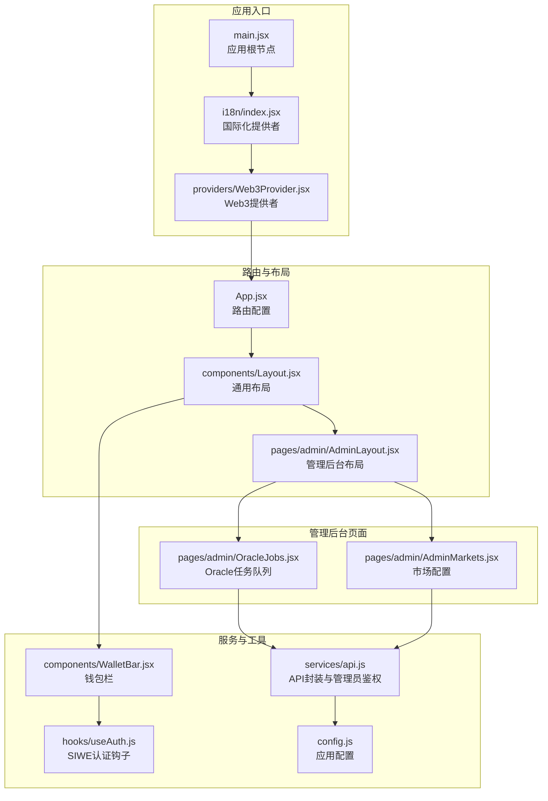
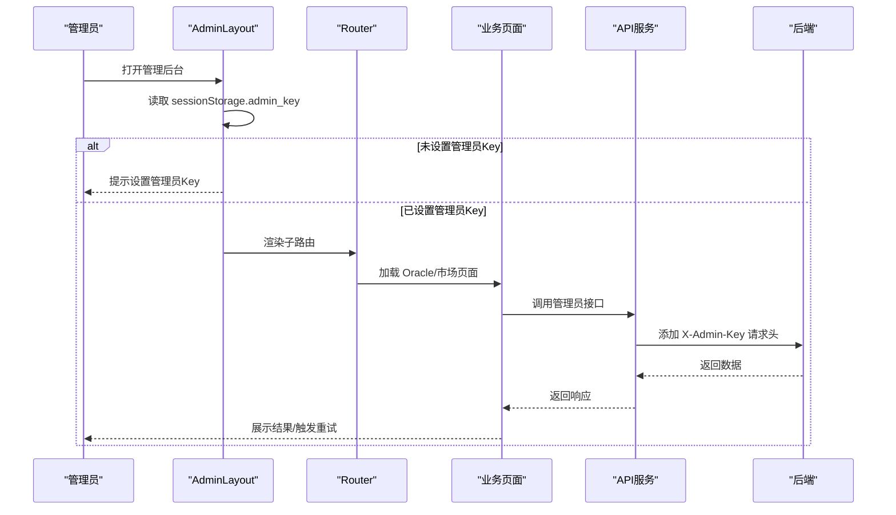
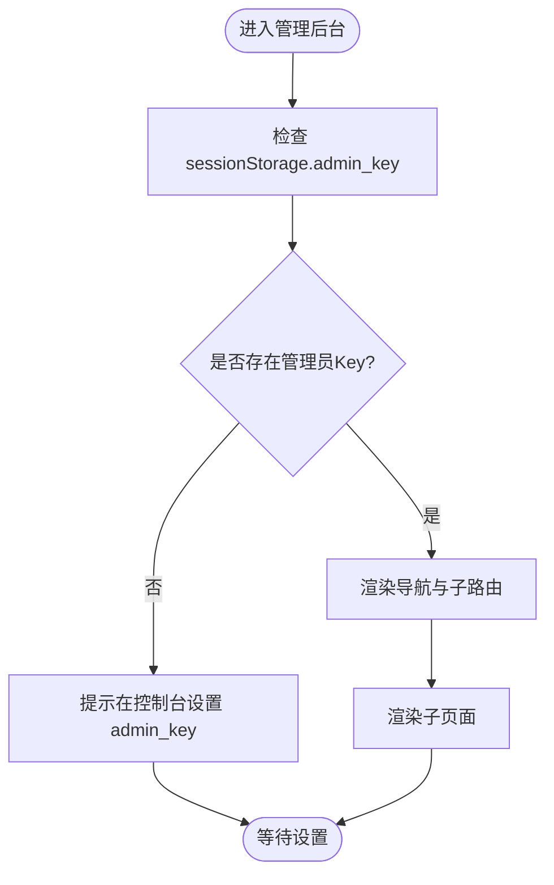
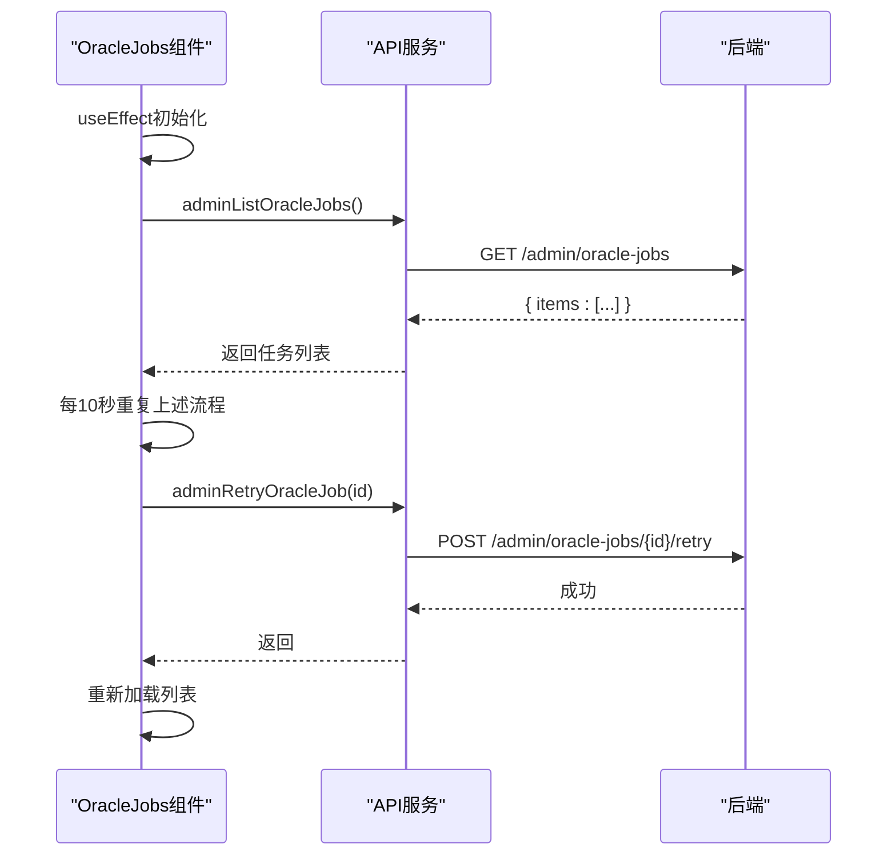
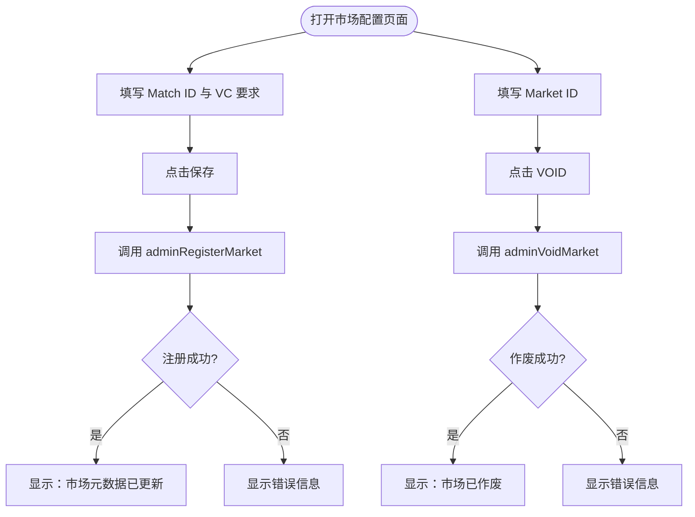
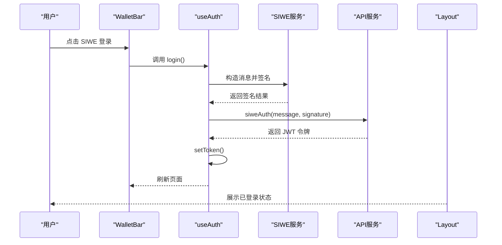
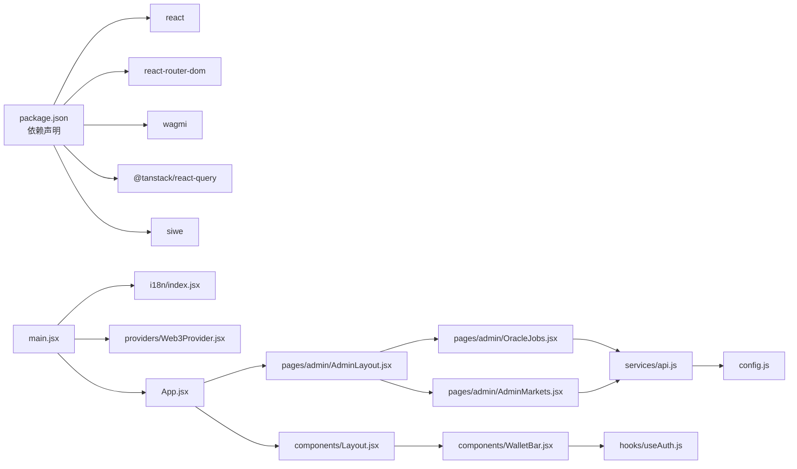

# 管理后台系统

<cite>
**本文档引用的文件**
- [src/pages/admin/AdminLayout.jsx](file://src/pages/admin/AdminLayout.jsx)
- [src/pages/admin/AdminMarkets.jsx](file://src/pages/admin/AdminMarkets.jsx)
- [src/pages/admin/OracleJobs.jsx](file://src/pages/admin/OracleJobs.jsx)
- [src/services/api.js](file://src/services/api.js)
- [src/App.jsx](file://src/App.jsx)
- [src/components/Layout.jsx](file://src/components/Layout.jsx)
- [src/hooks/useAuth.js](file://src/hooks/useAuth.js)
- [src/components/WalletBar.jsx](file://src/components/WalletBar.jsx)
- [src/providers/Web3Provider.jsx](file://src/providers/Web3Provider.jsx)
- [src/i18n/index.jsx](file://src/i18n/index.jsx)
- [src/config.js](file://src/config.js)
- [src/main.jsx](file://src/main.jsx)
- [package.json](file://package.json)
</cite>

## 目录
1. [简介](#简介)
2. [项目结构](#项目结构)
3. [核心组件](#核心组件)
4. [架构总览](#架构总览)
5. [详细组件分析](#详细组件分析)
6. [依赖关系分析](#依赖关系分析)
7. [性能考虑](#性能考虑)
8. [故障排除指南](#故障排除指南)
9. [结论](#结论)
10. [附录](#附录)

## 简介
本文件为管理后台系统的综合技术文档，覆盖管理员权限体系、市场配置管理、预言机任务管理三大核心功能模块。文档深入解释 AdminLayout 布局设计、权限验证机制、管理界面的用户交互模式；详述市场审核流程、预言机配置、用户合规检查的实现细节；并提供管理员操作指南与安全最佳实践。

## 项目结构
前端采用 React + Vite 架构，路由基于 react-router-dom，状态与区块链交互通过 wagmi + @tanstack/react-query 提供。管理后台位于 /admin 路由下，包含 Oracle 任务队列与市场配置两个子页面。

**图表来源**
- [src/main.jsx](file://src/main.jsx#L17-L32)
- [src/App.jsx](file://src/App.jsx#L31-L66)
- [src/components/Layout.jsx](file://src/components/Layout.jsx#L14-L68)
- [src/pages/admin/AdminLayout.jsx](file://src/pages/admin/AdminLayout.jsx#L8-L31)
- [src/pages/admin/OracleJobs.jsx](file://src/pages/admin/OracleJobs.jsx#L10-L66)
- [src/pages/admin/AdminMarkets.jsx](file://src/pages/admin/AdminMarkets.jsx#L10-L88)
- [src/services/api.js](file://src/services/api.js#L131-L166)
- [src/hooks/useAuth.js](file://src/hooks/useAuth.js#L16-L108)
- [src/components/WalletBar.jsx](file://src/components/WalletBar.jsx#L10-L53)
- [src/config.js](file://src/config.js#L7-L22)

**章节来源**
- [src/main.jsx](file://src/main.jsx#L17-L32)
- [src/App.jsx](file://src/App.jsx#L31-L66)
- [src/components/Layout.jsx](file://src/components/Layout.jsx#L14-L68)
- [src/pages/admin/AdminLayout.jsx](file://src/pages/admin/AdminLayout.jsx#L8-L31)

## 核心组件
- 管理后台布局 AdminLayout：提供管理员认证提示与子路由导航，强制管理员通过 sessionStorage 注入 X-Admin-Key。
- Oracle 任务队列 OracleJobs：展示所有预言机结算任务，支持定时刷新与手动重试失败任务。
- 市场配置 AdminMarkets：提供市场元数据登记/更新与市场作废功能，支持 VC 凭证要求开关。
- API 封装与管理员鉴权：统一处理请求头、错误处理与管理员鉴权头注入。
- SIWE 认证与钱包集成：通过 wagmi 钱包钩子与 SIWE 协议完成用户认证与 DID 绑定。
- 国际化与布局：多语言支持与通用导航布局，包含管理入口。

**章节来源**
- [src/pages/admin/AdminLayout.jsx](file://src/pages/admin/AdminLayout.jsx#L8-L31)
- [src/pages/admin/OracleJobs.jsx](file://src/pages/admin/OracleJobs.jsx#L10-L66)
- [src/pages/admin/AdminMarkets.jsx](file://src/pages/admin/AdminMarkets.jsx#L10-L88)
- [src/services/api.js](file://src/services/api.js#L131-L166)
- [src/hooks/useAuth.js](file://src/hooks/useAuth.js#L16-L108)
- [src/i18n/index.jsx](file://src/i18n/index.jsx#L49-L79)

## 架构总览
管理后台采用“布局 + 子路由 + 业务页面”的分层设计。路由通过 react-router-dom 实现嵌套路由，管理后台页面通过 API 服务调用后端接口，管理员权限通过自定义请求头 X-Admin-Key 强制校验。

**图表来源**
- [src/pages/admin/AdminLayout.jsx](file://src/pages/admin/AdminLayout.jsx#L9-L20)
- [src/App.jsx](file://src/App.jsx#L55-L61)
- [src/pages/admin/OracleJobs.jsx](file://src/pages/admin/OracleJobs.jsx#L17-L31)
- [src/pages/admin/AdminMarkets.jsx](file://src/pages/admin/AdminMarkets.jsx#L21-L49)
- [src/services/api.js](file://src/services/api.js#L131-L166)

## 详细组件分析

### 管理后台布局与权限体系
- 布局职责：渲染标题、导航、子路由出口；在未设置管理员 Key 时提示用户在控制台注入。
- 权限机制：通过 sessionStorage.admin_key 读取管理员密钥，注入到请求头 X-Admin-Key，后端据此放行管理接口。
- 导航设计：提供 Oracle 队列与市场配置两个子路由入口，便于管理员快速切换。

**图表来源**
- [src/pages/admin/AdminLayout.jsx](file://src/pages/admin/AdminLayout.jsx#L9-L29)

**章节来源**
- [src/pages/admin/AdminLayout.jsx](file://src/pages/admin/AdminLayout.jsx#L8-L31)

### Oracle 任务管理
- 数据加载：组件挂载时调用列表接口，随后每 10 秒自动刷新一次，确保实时性。
- 任务展示：每个任务卡片包含任务 ID、状态、问题描述、市场合约地址、比分源信息与错误信息。
- 人工审核：当任务状态为 manual_review 时，显示“重试”按钮，点击后调用重试接口并重新加载列表。

**图表来源**
- [src/pages/admin/OracleJobs.jsx](file://src/pages/admin/OracleJobs.jsx#L17-L31)
- [src/services/api.js](file://src/services/api.js#L137-L149)

**章节来源**
- [src/pages/admin/OracleJobs.jsx](file://src/pages/admin/OracleJobs.jsx#L10-L66)
- [src/services/api.js](file://src/services/api.js#L137-L149)

### 市场配置管理
- 元数据登记/更新：输入赛事 ID、VC 凭证要求开关，提交后调用注册接口，成功后提示“市场元数据已更新”。
- 市场作废：输入市场 ID，调用作废接口，成功后提示“市场已作废”。

**图表来源**
- [src/pages/admin/AdminMarkets.jsx](file://src/pages/admin/AdminMarkets.jsx#L21-L49)
- [src/services/api.js](file://src/services/api.js#L151-L166)

**章节来源**
- [src/pages/admin/AdminMarkets.jsx](file://src/pages/admin/AdminMarkets.jsx#L10-L88)
- [src/services/api.js](file://src/services/api.js#L151-L166)

### 权限验证机制与用户交互
- 钱包与认证：WalletBar 展示钱包连接状态与登录按钮；useAuth 钩子封装 SIWE 登录、登出与令牌管理。
- 国际化：I18nProvider 提供中英双语切换与翻译函数，布局中语言切换按钮即时生效。
- 布局导航：Layout 组件提供统一导航，包含管理入口，便于管理员直达后台。

**图表来源**
- [src/components/WalletBar.jsx](file://src/components/WalletBar.jsx#L18-L80)
- [src/hooks/useAuth.js](file://src/hooks/useAuth.js#L29-L80)
- [src/services/api.js](file://src/services/api.js#L93-L99)
- [src/components/Layout.jsx](file://src/components/Layout.jsx#L47-L56)

**章节来源**
- [src/components/WalletBar.jsx](file://src/components/WalletBar.jsx#L10-L53)
- [src/hooks/useAuth.js](file://src/hooks/useAuth.js#L16-L108)
- [src/i18n/index.jsx](file://src/i18n/index.jsx#L49-L79)
- [src/components/Layout.jsx](file://src/components/Layout.jsx#L14-L68)

## 依赖关系分析
- 运行时依赖：React、react-router-dom、wagmi、@tanstack/react-query、siwe 等。
- 提供者栈：main.jsx 中 I18nProvider → Web3Provider → BrowserRouter → App，形成完整的上下文链路。
- 配置：config.js 从环境变量读取 API 地址、链 ID、合约地址等，影响钱包与 API 行为。

**图表来源**
- [package.json](file://package.json#L12-L28)
- [src/main.jsx](file://src/main.jsx#L17-L32)
- [src/App.jsx](file://src/App.jsx#L31-L66)
- [src/components/Layout.jsx](file://src/components/Layout.jsx#L14-L68)
- [src/pages/admin/AdminLayout.jsx](file://src/pages/admin/AdminLayout.jsx#L8-L31)
- [src/pages/admin/OracleJobs.jsx](file://src/pages/admin/OracleJobs.jsx#L10-L66)
- [src/pages/admin/AdminMarkets.jsx](file://src/pages/admin/AdminMarkets.jsx#L10-L88)
- [src/services/api.js](file://src/services/api.js#L131-L166)
- [src/hooks/useAuth.js](file://src/hooks/useAuth.js#L16-L108)
- [src/components/WalletBar.jsx](file://src/components/WalletBar.jsx#L10-L53)
- [src/config.js](file://src/config.js#L7-L22)

**章节来源**
- [package.json](file://package.json#L12-L28)
- [src/main.jsx](file://src/main.jsx#L17-L32)
- [src/App.jsx](file://src/App.jsx#L31-L66)

## 性能考虑
- 自动刷新策略：Oracle 任务列表每 10 秒轮询一次，建议在高并发场景下评估后端压力，必要时引入长轮询或 WebSocket。
- 请求缓存：Web3Provider 内置 React Query 客户端，可用于缓存常用数据（如市场列表、合规信息），减少重复请求。
- 本地存储：令牌与语言偏好使用本地存储，注意在隐私浏览或跨设备场景下的兼容性。
- 组件渲染：WalletBar 与认证状态变化频繁，建议结合 useMemo/useCallback 优化重渲染。

## 故障排除指南
- 管理员 Key 未设置
  - 现象：管理后台显示提示，无法访问管理接口。
  - 处理：在浏览器控制台执行 sessionStorage.setItem('admin_key', '你的ADMIN_API_KEY')。
- 钱包未连接或链 ID 缺失
  - 现象：SIWE 登录按钮不可用或登录失败。
  - 处理：确保钱包已连接且链 ID 可用；检查 config.js 中链 ID 配置。
- 管理接口 401/403
  - 现象：Oracle 列表或市场操作无响应。
  - 处理：确认 X-Admin-Key 正确；核对后端管理员密钥配置。
- 任务重试无效
  - 现象：点击重试无反应。
  - 处理：检查任务状态是否仍为 manual_review；确认网络与后端服务可用。

**章节来源**
- [src/pages/admin/AdminLayout.jsx](file://src/pages/admin/AdminLayout.jsx#L16-L20)
- [src/hooks/useAuth.js](file://src/hooks/useAuth.js#L30-L31)
- [src/services/api.js](file://src/services/api.js#L131-L135)

## 结论
管理后台系统通过清晰的布局与权限控制、完善的 API 封装与定时刷新机制，实现了对 Oracle 任务与市场配置的高效管理。配合 SIWE 认证与国际化支持，提升了管理员的操作体验与系统的可维护性。建议在生产环境中强化密钥管理与审计日志，并根据业务量调整轮询策略与缓存策略。

## 附录

### 管理员操作指南
- Oracle 任务队列
  - 打开“管理后台 → Oracle 队列”，等待列表加载。
  - 查看任务状态，若为“manual_review”，点击“重试”按钮。
  - 列表每 10 秒自动刷新，无需手动刷新。
- 市场配置
  - 打开“管理后台 → 市场配置”。
  - 填写赛事 ID 与 VC 要求开关，点击“保存”。
  - 输入市场 ID，点击“VOID”作废市场。

### 安全最佳实践
- 管理员密钥管理
  - 使用强随机密钥；定期轮换；仅在受信终端设置。
  - 避免将密钥写入代码或提交到版本库。
- 会话与令牌
  - 使用 HTTPS；令牌存储于 sessionStorage/localStorage 时注意 XSS 防护。
  - 登出时清理令牌并断开钱包连接。
- 接口安全
  - 对外暴露的管理接口需严格校验 X-Admin-Key。
  - 记录管理操作日志，便于审计与追踪。