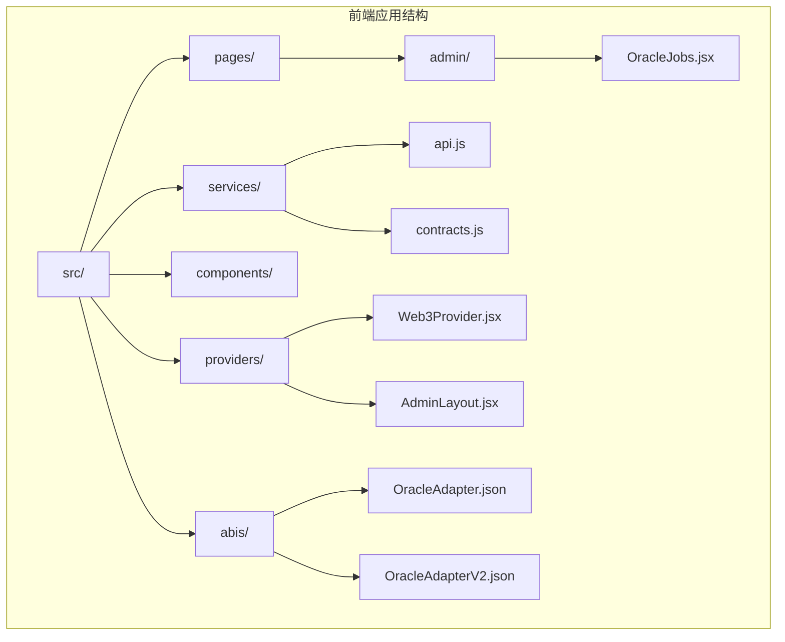
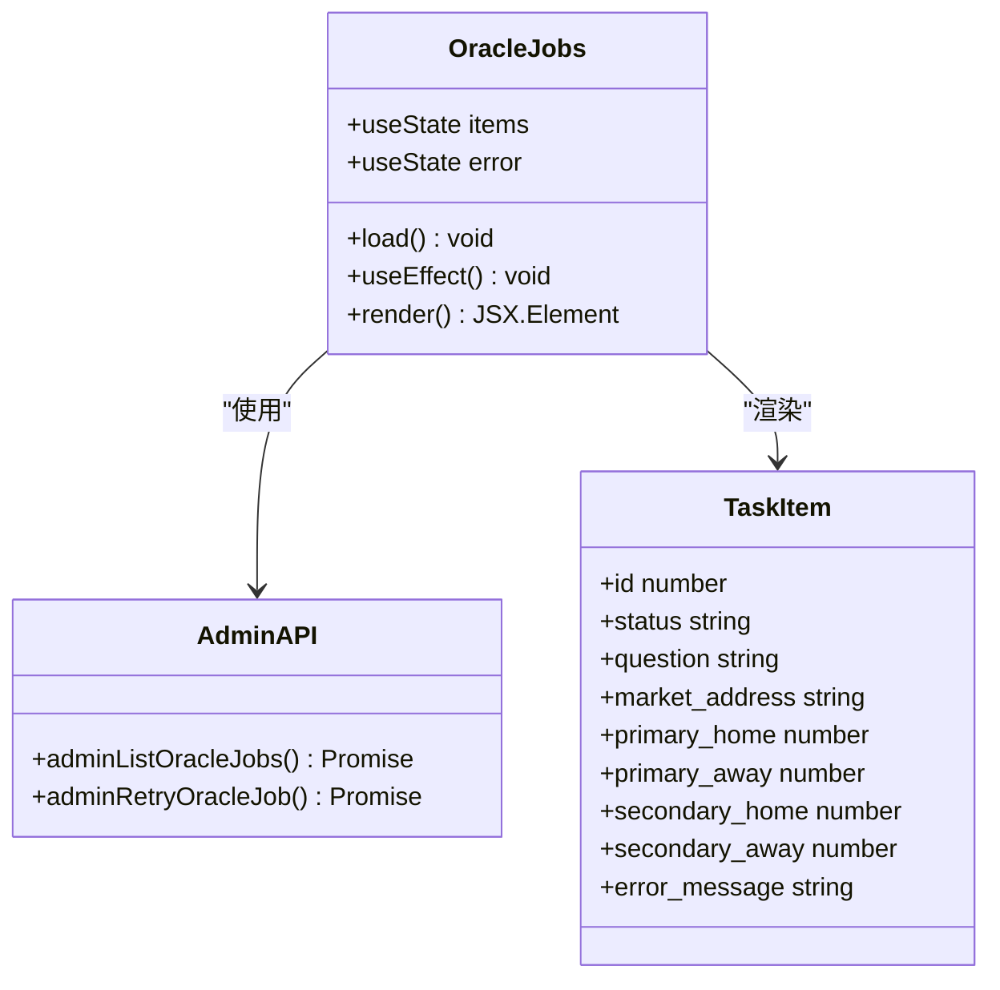
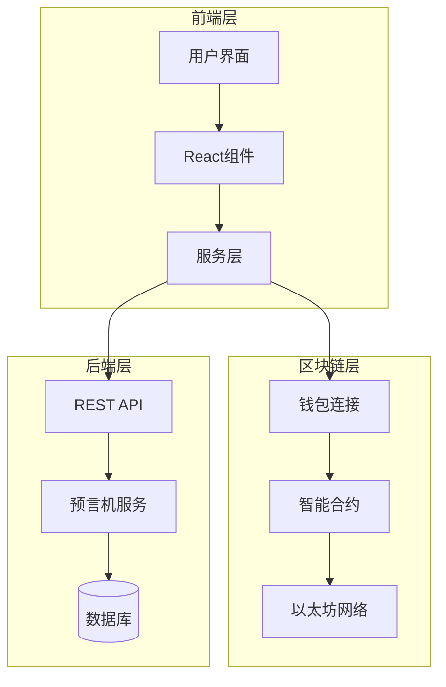
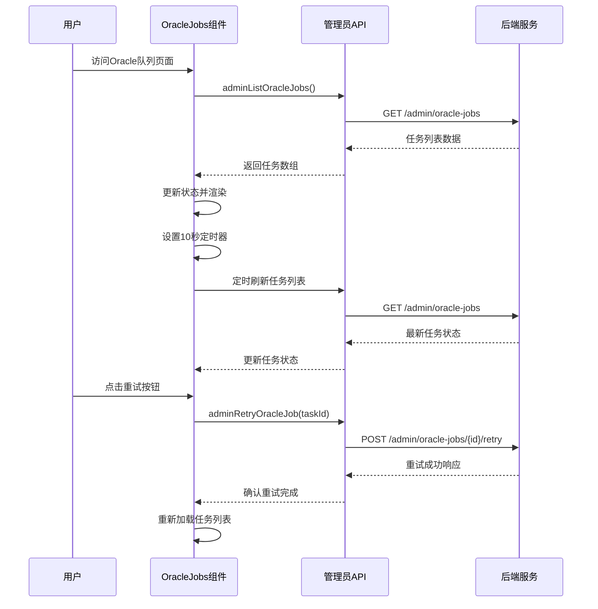
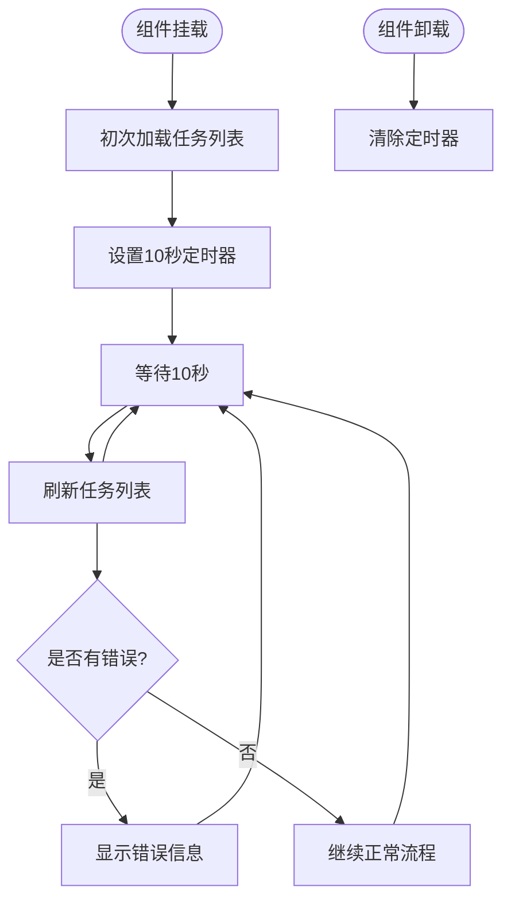
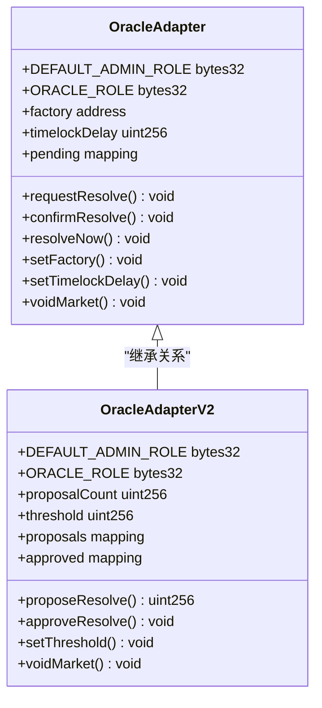
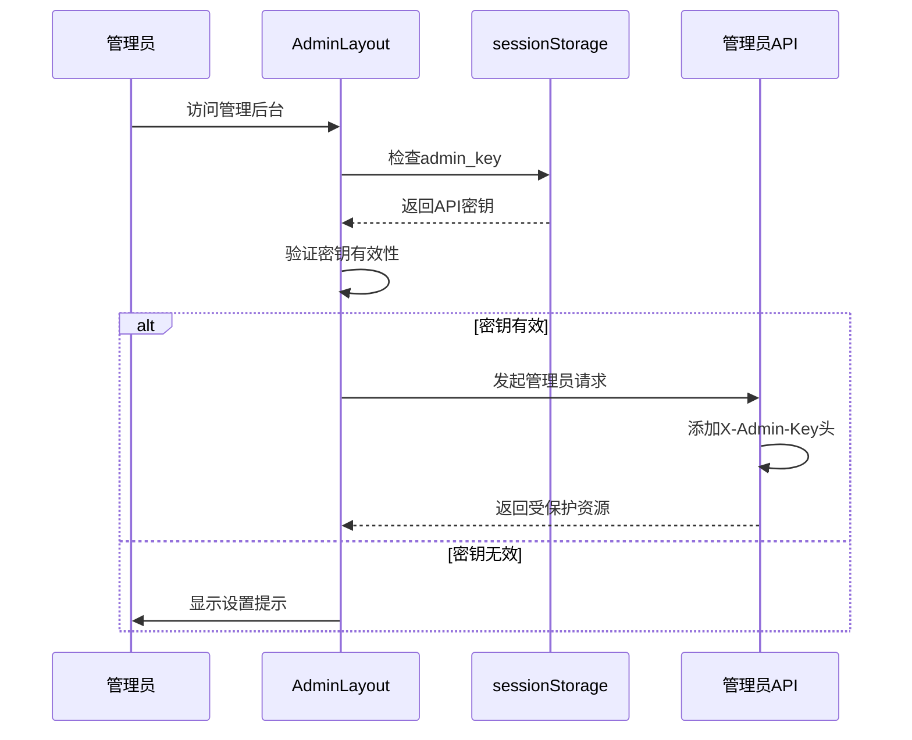
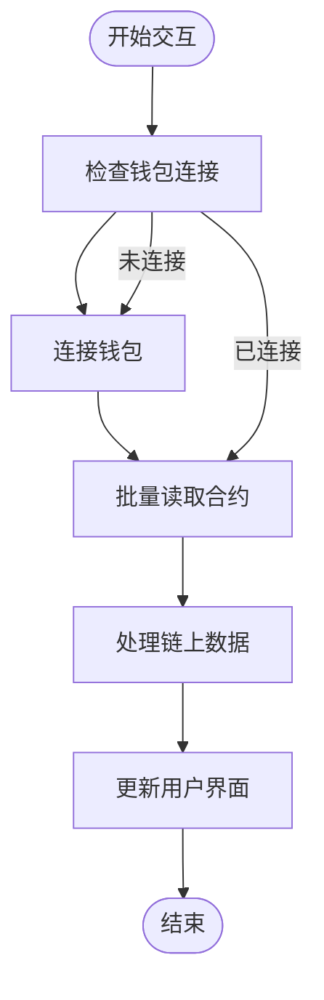

# 预言机任务管理

<cite>
**本文档引用的文件**
- [OracleJobs.jsx](file://src/pages/admin/OracleJobs.jsx)
- [api.js](file://src/services/api.js)
- [contracts.js](file://src/services/contracts.js)
- [OracleAdapter.json](file://src/abis/OracleAdapter.json)
- [OracleAdapterV2.json](file://src/abis/OracleAdapterV2.json)
- [config.js](file://src/config.js)
- [wagmi.js](file://src/wagmi.js)
- [AdminLayout.jsx](file://src/pages/admin/AdminLayout.jsx)
- [Web3Provider.jsx](file://src/providers/Web3Provider.jsx)
- [package.json](file://package.json)
</cite>

## 目录
1. [简介](#简介)
2. [项目结构](#项目结构)
3. [核心组件](#核心组件)
4. [架构概览](#架构概览)
5. [详细组件分析](#详细组件分析)
6. [依赖关系分析](#依赖关系分析)
7. [性能考虑](#性能考虑)
8. [故障排除指南](#故障排除指南)
9. [结论](#结论)

## 简介

预言机任务管理系统是PredictionDID Simple平台的核心组件之一，负责管理和监控预言机结算任务的执行状态。该系统提供了完整的任务队列管理、状态跟踪、错误处理和手动干预功能。

系统采用前后端分离架构，前端使用React + Vite构建，通过API与后端服务通信，同时集成了以太坊区块链交互能力。预言机适配器合约作为核心业务逻辑载体，实现了去中心化的预言机决策流程。

## 项目结构

前端项目采用模块化组织结构，主要分为以下几个核心目录：



**图表来源**
- [OracleJobs.jsx](file://src/pages/admin/OracleJobs.jsx#L1-L67)
- [api.js](file://src/services/api.js#L1-L187)
- [contracts.js](file://src/services/contracts.js#L1-L214)

**章节来源**
- [package.json](file://package.json#L1-L30)
- [config.js](file://src/config.js#L1-L23)

## 核心组件

### 预言机任务队列页面

OracleJobs组件是预言机任务管理的核心界面组件，提供了实时的任务状态监控和手动干预功能。



**图表来源**
- [OracleJobs.jsx](file://src/pages/admin/OracleJobs.jsx#L10-L67)
- [api.js](file://src/services/api.js#L137-L149)

### 管理员API服务

API服务层提供了完整的管理员操作接口，包括任务查询、重试等核心功能。

**章节来源**
- [OracleJobs.jsx](file://src/pages/admin/OracleJobs.jsx#L1-L67)
- [api.js](file://src/services/api.js#L137-L149)

## 架构概览

系统采用分层架构设计，确保了良好的可维护性和扩展性：



**图表来源**
- [Web3Provider.jsx](file://src/providers/Web3Provider.jsx#L16-L24)
- [wagmi.js](file://src/wagmi.js#L26-L36)
- [api.js](file://src/services/api.js#L29-L55)

## 详细组件分析

### OracleJobs组件实现

OracleJobs组件实现了完整的任务队列管理功能，包括自动刷新、错误处理和手动重试。



**图表来源**
- [OracleJobs.jsx](file://src/pages/admin/OracleJobs.jsx#L17-L31)
- [api.js](file://src/services/api.js#L137-L149)

#### 组件状态管理

组件使用React状态钩子管理任务列表和错误信息：

| 状态属性 | 类型 | 描述 | 默认值 |
|---------|------|------|--------|
| items | Array | 任务列表数据 | [] |
| error | string/null | 错误信息 | null |

#### 自动刷新机制

组件实现了智能的自动刷新策略：



**图表来源**
- [OracleJobs.jsx](file://src/pages/admin/OracleJobs.jsx#L24-L31)

**章节来源**
- [OracleJobs.jsx](file://src/pages/admin/OracleJobs.jsx#L10-L67)

### 预言机适配器合约

系统支持两个版本的预言机适配器合约，分别对应不同的决策机制：



**图表来源**
- [OracleAdapter.json](file://src/abis/OracleAdapter.json#L174-L470)
- [OracleAdapterV2.json](file://src/abis/OracleAdapterV2.json#L193-L493)

#### 合约功能对比

| 功能特性 | OracleAdapter | OracleAdapterV2 |
|---------|---------------|-----------------|
| 决策机制 | 单一预言机确认 | 多预言机共识 |
| 时间锁定 | 支持延迟执行 | 不支持时间锁定 |
| 阈值设置 | 固定阈值 | 可配置阈值 |
| 提案系统 | 直接解决 | 基于提案的解决 |
| 批准机制 | 单次确认 | 多次批准 |

**章节来源**
- [OracleAdapter.json](file://src/abis/OracleAdapter.json#L1-L472)
- [OracleAdapterV2.json](file://src/abis/OracleAdapterV2.json#L1-L495)

### 管理员认证与权限

系统实现了基于API密钥的管理员认证机制：



**图表来源**
- [AdminLayout.jsx](file://src/pages/admin/AdminLayout.jsx#L9-L20)
- [api.js](file://src/services/api.js#L132-L135)

**章节来源**
- [AdminLayout.jsx](file://src/pages/admin/AdminLayout.jsx#L8-L32)
- [api.js](file://src/services/api.js#L131-L135)

## 依赖关系分析

### 核心依赖关系

系统的关键依赖关系如下：

```mermaid
graph LR
subgraph "外部依赖"
REACT[React 18.3.1]
WAGMI[Wagmi 2.14.1]
VIEM[Viem 2.21.54]
TANSTACK[@tanstack/react-query]
end
subgraph "内部模块"
ORACLE[OracleJobs.jsx]
API[api.js]
CONTRACTS[contracts.js]
WEB3[Web3Provider.jsx]
CONFIG[config.js]
end
REACT --> ORACLE
WAGMI --> CONTRACTS
VIEM --> CONTRACTS
TANSTACK --> API
ORACLE --> API
API --> CONFIG
CONTRACTS --> CONFIG
WEB3 --> WAGMI
WEB3 --> TANSTACK
```

**图表来源**
- [package.json](file://package.json#L12-L19)
- [Web3Provider.jsx](file://src/providers/Web3Provider.jsx#L1-L24)

### 区块链集成

系统通过wagmi和viem库实现与以太坊网络的交互：

| 依赖库 | 版本 | 用途 |
|-------|------|------|
| react | ^18.3.1 | 用户界面框架 |
| wagmi | ^2.14.1 | 以太坊钱包连接和合约交互 |
| viem | ^2.21.54 | 区块链工具库和类型安全 |
| @tanstack/react-query | ^5.62.2 | 异步数据状态管理 |

**章节来源**
- [package.json](file://package.json#L12-L19)
- [wagmi.js](file://src/wagmi.js#L1-L37)

## 性能考虑

### 前端性能优化

系统采用了多项性能优化策略：

1. **智能定时器管理**
   - 使用10秒间隔避免频繁API调用
   - 组件卸载时自动清理定时器防止内存泄漏

2. **状态更新优化**
   - 条件渲染减少DOM更新
   - 错误状态独立管理避免不必要的重渲染

3. **API调用优化**
   - 批量数据获取减少请求次数
   - 错误处理避免重复请求

### 区块链交互优化



**图表来源**
- [contracts.js](file://src/services/contracts.js#L184-L213)

**章节来源**
- [contracts.js](file://src/services/contracts.js#L184-L213)

## 故障排除指南

### 常见问题诊断

#### 1. 任务列表无法加载

**症状**: Oracle队列页面显示空白或错误信息

**可能原因**:
- 管理员API密钥未设置
- 后端服务不可达
- 网络连接问题

**解决方案**:
1. 检查管理员API密钥设置
   ```javascript
   // 在浏览器控制台执行
   sessionStorage.setItem('admin_key', 'your_admin_api_key')
   ```

2. 验证后端服务状态
   ```javascript
   // 检查健康检查端点
   fetch('/health')
   ```

3. 确认网络连接正常

#### 2. 任务状态不更新

**症状**: 任务状态长时间保持不变

**可能原因**:
- 定时器未正确设置
- API响应异常
- 前端状态管理问题

**解决方案**:
1. 检查组件生命周期钩子
2. 验证API响应格式
3. 查看浏览器开发者工具中的网络请求

#### 3. 重试功能失效

**症状**: 点击重试按钮无响应

**可能原因**:
- 管理员权限不足
- 任务状态不允许重试
- 网络请求超时

**解决方案**:
1. 确认任务状态为"manual_review"
2. 验证管理员API密钥
3. 检查后端日志

### 调试工具和技巧

#### 开发者工具使用

1. **浏览器控制台**
   - 检查JavaScript错误
   - 监控网络请求
   - 查看localStorage和sessionStorage

2. **React DevTools**
   - 分析组件状态变化
   - 跟踪props传递
   - 检查渲染性能

3. **以太坊调试**
   - 使用MetaMask调试模式
   - 监控交易状态
   - 查看合约事件日志

**章节来源**
- [OracleJobs.jsx](file://src/pages/admin/OracleJobs.jsx#L13-L21)
- [AdminLayout.jsx](file://src/pages/admin/AdminLayout.jsx#L15-L20)

## 结论

预言机任务管理系统通过清晰的架构设计和完善的错误处理机制，为PredictionDID Simple平台提供了可靠的预言机任务管理能力。系统的主要优势包括：

1. **实时监控**: 10秒自动刷新机制确保任务状态的及时更新
2. **手动干预**: 支持管理员手动重试失败的任务
3. **错误处理**: 完善的错误捕获和用户友好的错误提示
4. **权限控制**: 基于API密钥的安全访问控制
5. **性能优化**: 智能定时器和状态管理优化

未来可以考虑的功能增强包括：
- 任务优先级排序
- 更详细的日志记录
- 批量操作功能
- 预警通知机制

该系统为去中心化预测市场的稳定运行提供了重要保障，是整个平台不可或缺的核心组件。