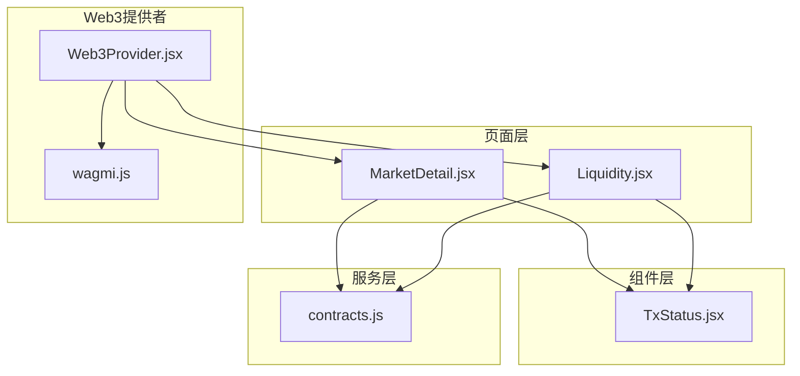
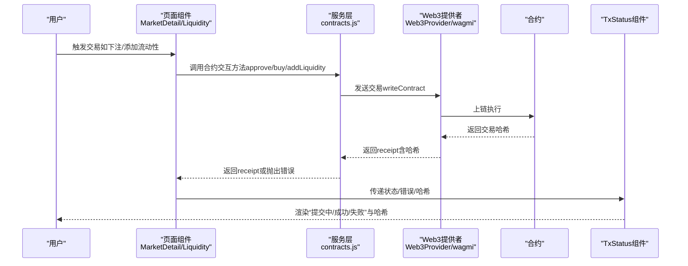
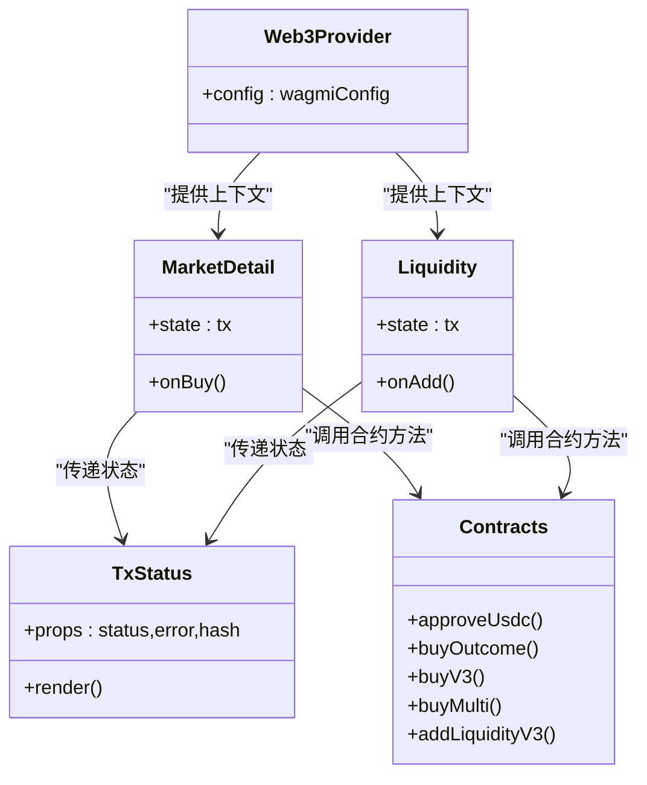

# 交易状态

<cite>
**本文引用的文件**
- [TxStatus.jsx](file://src/components/TxStatus.jsx)
- [MarketDetail.jsx](file://src/pages/MarketDetail.jsx)
- [Liquidity.jsx](file://src/pages/Liquidity.jsx)
- [contracts.js](file://src/services/contracts.js)
- [Web3Provider.jsx](file://src/providers/Web3Provider.jsx)
- [wagmi.js](file://src/wagmi.js)
- [index.css](file://src/index.css)
- [main.jsx](file://src/main.jsx)
- [App.jsx](file://src/App.jsx)
</cite>

## 目录
1. [简介](#简介)
2. [项目结构](#项目结构)
3. [核心组件](#核心组件)
4. [架构总览](#架构总览)
5. [组件详解](#组件详解)
6. [依赖关系分析](#依赖关系分析)
7. [性能考量](#性能考量)
8. [故障排查指南](#故障排查指南)
9. [结论](#结论)

## 简介
本文件围绕交易状态组件 TxStatus 进行系统化文档化，重点阐述其在交易生命周期中的作用：如何在“提交中”“成功”“失败”等阶段向用户反馈状态，如何与钱包与合约交互层协作，以及如何提升用户对交易过程的可见性与信任度。文档同时给出组件的使用示例、状态监听方法与集成模式，帮助开发者在各类交易操作中正确接入该组件。

## 项目结构
交易状态组件位于前端组件目录，配合页面级业务组件与服务层合约交互方法共同完成交易状态的采集、展示与反馈。

图表来源
- [MarketDetail.jsx](file://src/pages/MarketDetail.jsx#L1-L185)
- [Liquidity.jsx](file://src/pages/Liquidity.jsx#L1-L117)
- [TxStatus.jsx](file://src/components/TxStatus.jsx#L1-L26)
- [contracts.js](file://src/services/contracts.js#L1-L214)
- [Web3Provider.jsx](file://src/providers/Web3Provider.jsx#L1-L25)
- [wagmi.js](file://src/wagmi.js#L1-L37)

章节来源
- [main.jsx](file://src/main.jsx#L1-L33)
- [App.jsx](file://src/App.jsx#L1-L67)

## 核心组件
- TxStatus 组件：根据传入的状态、错误与交易哈希，渲染对应阶段的提示信息与交易哈希展示。
- MarketDetail 页面：在用户进行下注等交易时，负责设置与传递状态、错误与哈希给 TxStatus。
- Liquidity 页面：在添加流动性等交易时，负责设置与传递状态、错误与哈希给 TxStatus。
- contracts 服务：封装了与合约交互的方法，返回交易哈希或抛出错误，供页面层消费。

章节来源
- [TxStatus.jsx](file://src/components/TxStatus.jsx#L1-L26)
- [MarketDetail.jsx](file://src/pages/MarketDetail.jsx#L1-L185)
- [Liquidity.jsx](file://src/pages/Liquidity.jsx#L1-L117)
- [contracts.js](file://src/services/contracts.js#L1-L214)

## 架构总览
交易状态组件在整体架构中的位置如下：
- 页面层负责触发交易、收集状态与错误，并将状态对象传递给 TxStatus。
- 服务层负责与钱包与合约交互，返回交易回执或错误。
- Web3 提供者负责提供钱包连接与链上交互能力。

图表来源
- [MarketDetail.jsx](file://src/pages/MarketDetail.jsx#L77-L110)
- [Liquidity.jsx](file://src/pages/Liquidity.jsx#L51-L77)
- [contracts.js](file://src/services/contracts.js#L59-L160)
- [Web3Provider.jsx](file://src/providers/Web3Provider.jsx#L16-L24)
- [wagmi.js](file://src/wagmi.js#L26-L36)
- [TxStatus.jsx](file://src/components/TxStatus.jsx#L6-L25)

## 组件详解

### 组件属性与行为
- 接收的 props
  - status: 字符串，表示交易状态，可选值为 pending、success、error 或 null。
  - error: 字符串，表示错误消息，null 表示无错误。
  - hash: 字符串，表示交易哈希，null 表示无哈希。
- 渲染规则
  - 若 status 与 error 均为 null，则不渲染任何内容。
  - 若 status 为 pending，渲染“交易提交中…”。
  - 若 status 为 success，渲染“交易成功”，并应用成功样式类。
  - 若 status 为 error，渲染“失败：{错误信息}”，并应用错误样式类。
  - 若 hash 存在，额外渲染一行“tx: {hash}”，用于追踪链上交易。

章节来源
- [TxStatus.jsx](file://src/components/TxStatus.jsx#L1-L26)
- [index.css](file://src/index.css#L77-L83)

### 交易状态枚举与含义
- pending：交易已提交至钱包/链上，尚未确认。
- success：交易已成功确认，可显示成功提示与交易哈希。
- error：交易失败，显示错误信息，通常来源于合约交互抛出的异常。

章节来源
- [TxStatus.jsx](file://src/components/TxStatus.jsx#L11-L16)
- [MarketDetail.jsx](file://src/pages/MarketDetail.jsx#L84-L109)
- [Liquidity.jsx](file://src/pages/Liquidity.jsx#L60-L76)

### 用户反馈机制
- 即时反馈：在用户点击“Approve + Buy/Add Liquidity”后立即设置状态为 pending，让用户感知到交易已开始。
- 成功反馈：交易成功后，设置状态为 success，并附带交易哈希，便于用户在链上浏览器中追踪。
- 失败反馈：捕获错误后，设置状态为 error，并显示错误消息，帮助用户定位问题。
- 可见性增强：组件在页面中以卡片形式呈现，配合颜色区分成功与错误，提升可读性。

章节来源
- [MarketDetail.jsx](file://src/pages/MarketDetail.jsx#L84-L109)
- [Liquidity.jsx](file://src/pages/Liquidity.jsx#L60-L76)
- [TxStatus.jsx](file://src/components/TxStatus.jsx#L11-L22)
- [index.css](file://src/index.css#L77-L83)

### 不同阶段的视觉表现
- 提交中：显示“交易提交中…”。
- 成功：显示“交易成功”，并应用绿色样式类。
- 失败：显示“失败：{错误信息}”，并应用红色样式类。
- 交易哈希：当存在哈希时，显示“tx: {hash}”，并采用较小字号与自动换行，便于复制与查看。

章节来源
- [TxStatus.jsx](file://src/components/TxStatus.jsx#L11-L22)
- [index.css](file://src/index.css#L77-L83)

### 使用示例与集成模式
- 在市场详情页中集成
  - 步骤：在用户点击“Approve + Buy”后，先设置状态为 pending；随后调用 approve 与 buy 方法；成功后设置状态为 success 并附带交易哈希；失败则设置为 error。
  - 关键路径参考：[MarketDetail.jsx](file://src/pages/MarketDetail.jsx#L77-L110)
- 在流动性页中集成
  - 步骤：在用户点击“Approve + Add Liquidity”后，先设置状态为 pending；随后调用 approve 与 addLiquidity 方法；成功后设置状态为 success；失败则设置为 error。
  - 关键路径参考：[Liquidity.jsx](file://src/pages/Liquidity.jsx#L51-L77)

章节来源
- [MarketDetail.jsx](file://src/pages/MarketDetail.jsx#L77-L110)
- [Liquidity.jsx](file://src/pages/Liquidity.jsx#L51-L77)

### 状态监听方法
- 页面层通过 useState 维护 tx 状态对象，包含 status、error、hash 三个字段。
- 在交易开始时设置 tx 为 { status: 'pending', error: null, hash: null }。
- 在交易成功时设置 tx 为 { status: 'success', error: null, hash: receipt.transactionHash }。
- 在交易失败时设置 tx 为 { status: 'error', error: e.shortMessage || e.message, hash: null }。
- 将 tx 对象作为 props 传递给 TxStatus 组件。

章节来源
- [MarketDetail.jsx](file://src/pages/MarketDetail.jsx#L44-L45)
- [MarketDetail.jsx](file://src/pages/MarketDetail.jsx#L84-L109)
- [Liquidity.jsx](file://src/pages/Liquidity.jsx#L31-L31)
- [Liquidity.jsx](file://src/pages/Liquidity.jsx#L60-L76)

### 与合约交互的集成
- 服务层提供 approve、buyOutcome、buyV3、buyMulti、addLiquidityV3 等方法，这些方法内部通过 wagmi 的 writeContract 发送交易，并通过 waitForTransactionReceipt 等待回执。
- 页面层在调用这些方法后，根据返回的回执或抛出的错误，更新 tx 状态对象，从而驱动 TxStatus 的渲染。

章节来源
- [contracts.js](file://src/services/contracts.js#L59-L160)
- [MarketDetail.jsx](file://src/pages/MarketDetail.jsx#L88-L101)
- [Liquidity.jsx](file://src/pages/Liquidity.jsx#L66-L68)

## 依赖关系分析
- 组件耦合
  - TxStatus 仅依赖传入的 props，保持低耦合与高内聚。
  - 页面层与服务层通过状态对象进行松耦合通信。
- 外部依赖
  - Web3 提供者与 wagmi 配置为交易执行提供基础设施。
  - CSS 样式类 status-ok 与 status-error 控制成功与失败的颜色表现。

图表来源
- [TxStatus.jsx](file://src/components/TxStatus.jsx#L1-L26)
- [MarketDetail.jsx](file://src/pages/MarketDetail.jsx#L1-L185)
- [Liquidity.jsx](file://src/pages/Liquidity.jsx#L1-L117)
- [contracts.js](file://src/services/contracts.js#L1-L214)
- [Web3Provider.jsx](file://src/providers/Web3Provider.jsx#L1-L25)

章节来源
- [Web3Provider.jsx](file://src/providers/Web3Provider.jsx#L16-L24)
- [wagmi.js](file://src/wagmi.js#L26-L36)

## 性能考量
- 渲染开销极低：TxStatus 仅根据状态分支渲染少量文本，无复杂计算。
- 状态最小化：页面层仅维护必要的 tx 状态对象，避免冗余重渲染。
- 异步交互：合约交互在服务层集中处理，页面层只负责状态更新，降低页面复杂度。

[本节为通用性能建议，无需特定文件引用]

## 故障排查指南
- 无任何状态显示
  - 检查页面层是否正确初始化 tx 状态对象，确保初始值为 { status: null, error: null, hash: null }。
  - 确认 TxStatus 是否被正确渲染在页面中。
  - 参考路径：[MarketDetail.jsx](file://src/pages/MarketDetail.jsx#L44-L45)，[Liquidity.jsx](file://src/pages/Liquidity.jsx#L31-L31)
- “交易提交中”一直显示
  - 检查合约交互流程是否正常返回回执；若未返回，可能因钱包未确认或网络异常。
  - 确认 wagmi 配置与钱包连接状态。
  - 参考路径：[contracts.js](file://src/services/contracts.js#L59-L160)，[wagmi.js](file://src/wagmi.js#L26-L36)
- “失败”信息不明确
  - 捕获错误时应尽量使用 e.shortMessage 或 e.message，确保错误信息可读。
  - 参考路径：[MarketDetail.jsx](file://src/pages/MarketDetail.jsx#L107-L108)，[Liquidity.jsx](file://src/pages/Liquidity.jsx#L74-L75)
- 无法看到交易哈希
  - 确认交易成功后是否正确设置 hash 字段；TxStatus 会在 hash 存在时显示。
  - 参考路径：[MarketDetail.jsx](file://src/pages/MarketDetail.jsx#L103)，[TxStatus.jsx](file://src/components/TxStatus.jsx#L18-L22)

章节来源
- [MarketDetail.jsx](file://src/pages/MarketDetail.jsx#L84-L109)
- [Liquidity.jsx](file://src/pages/Liquidity.jsx#L60-L76)
- [TxStatus.jsx](file://src/components/TxStatus.jsx#L18-L22)
- [contracts.js](file://src/services/contracts.js#L59-L160)
- [wagmi.js](file://src/wagmi.js#L26-L36)

## 结论
TxStatus 组件通过简洁的 props 接口与清晰的状态分支，为用户提供了即时、直观的交易反馈。结合页面层的状态管理与服务层的合约交互，组件在“提交中”“成功”“失败”等关键阶段均能有效提升用户的可见性与信任度。建议在所有涉及链上交易的页面中统一使用该组件，以保证一致的用户体验与可维护性。