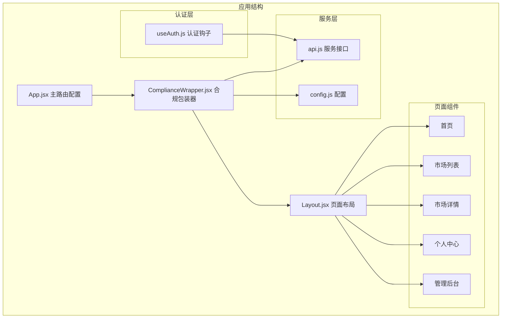
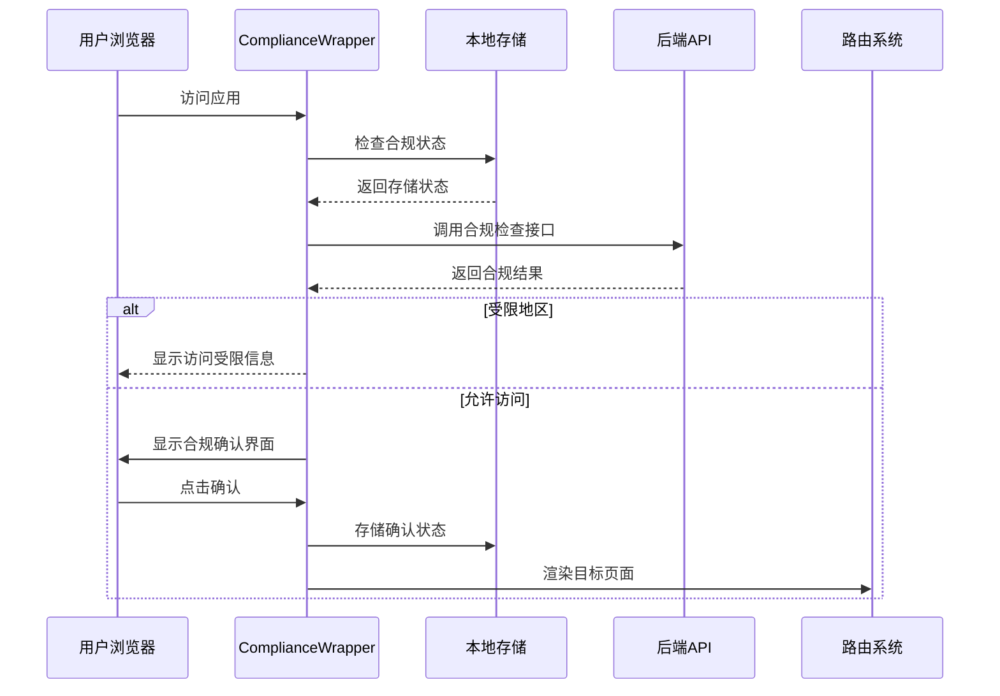
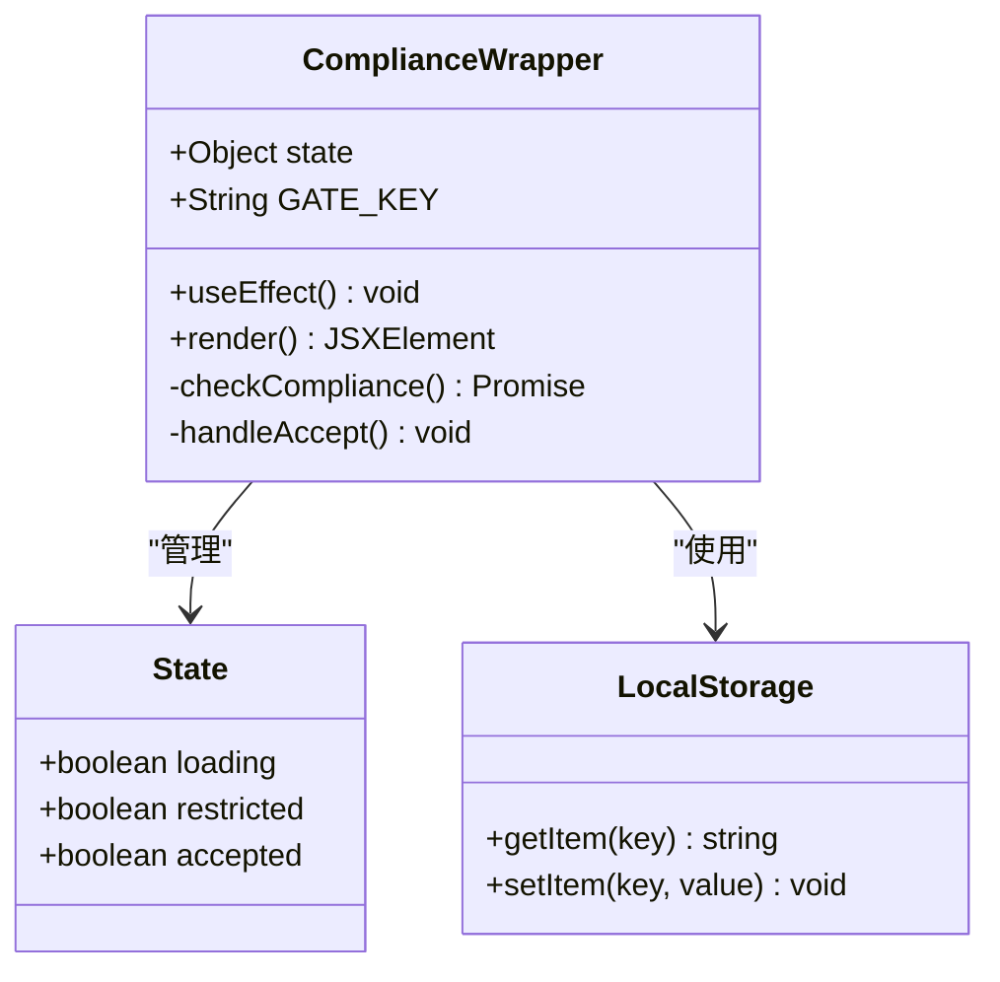
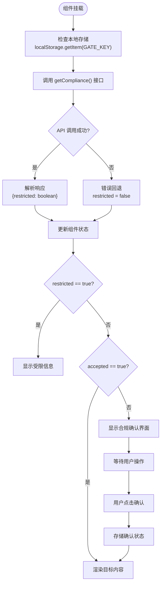
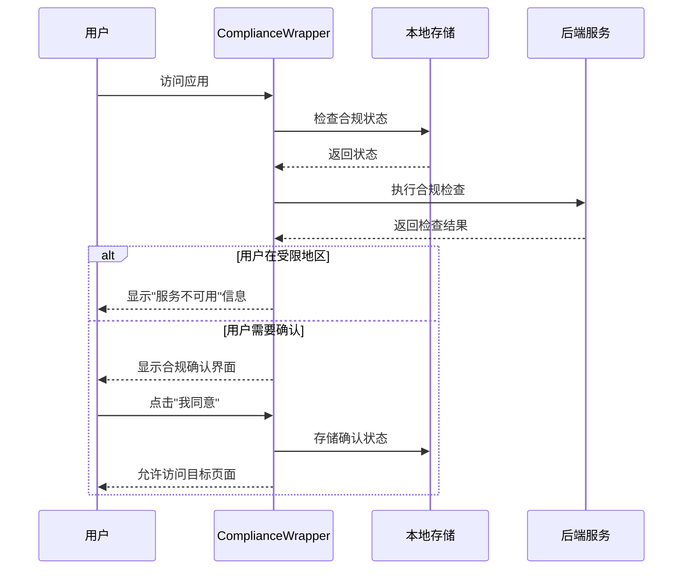
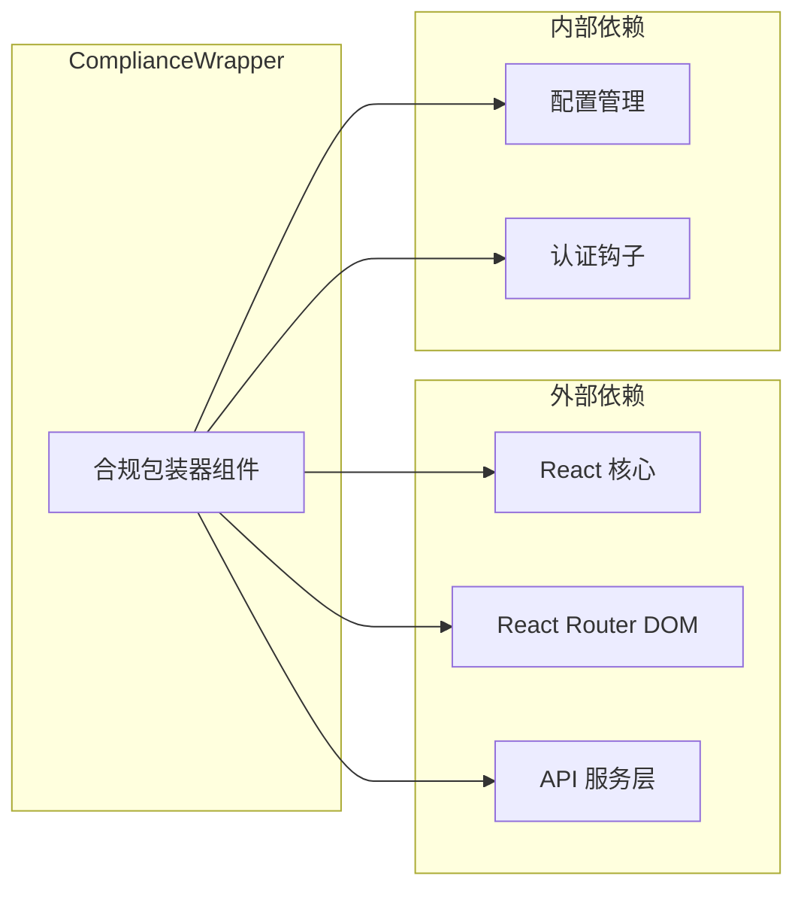

# 合规包装器

<cite>
**本文档引用的文件**
- [src/components/ComplianceWrapper.jsx](file://src/components/ComplianceWrapper.jsx)
- [src/App.jsx](file://src/App.jsx)
- [src/hooks/useAuth.js](file://src/hooks/useAuth.js)
- [src/services/api.js](file://src/services/api.js)
- [src/config.js](file://src/config.js)
</cite>

## 目录
1. [简介](#简介)
2. [项目结构](#项目结构)
3. [核心组件](#核心组件)
4. [架构概览](#架构概览)
5. [详细组件分析](#详细组件分析)
6. [依赖关系分析](#依赖关系分析)
7. [性能考虑](#性能考虑)
8. [故障排除指南](#故障排除指南)
9. [结论](#结论)

## 简介

ComplianceWrapper 是一个关键的安全组件，负责在用户访问应用前执行合规检查和地理围栏验证。该组件确保平台遵守不同地区的法律法规要求，通过多层次的安全检查保护平台免受受限地区的访问。

该组件的核心功能包括：
- 地理围栏检查（地区限制验证）
- 用户合规确认机制
- 安全访问控制
- 用户友好的错误处理

## 项目结构

ComplianceWrapper 组件位于前端项目的组件目录中，与主要的应用路由配置紧密集成：

**图表来源**
- [src/App.jsx](file://src/App.jsx#L31-L66)
- [src/components/ComplianceWrapper.jsx](file://src/components/ComplianceWrapper.jsx#L1-L44)

**章节来源**
- [src/App.jsx](file://src/App.jsx#L1-L67)
- [src/components/ComplianceWrapper.jsx](file://src/components/ComplianceWrapper.jsx#L1-L44)

## 核心组件

ComplianceWrapper 组件是一个高阶组件，它包装了整个应用的路由系统，确保所有页面访问都经过合规检查。组件的核心特性包括：

### 主要功能
- **地理围栏检查**：验证用户所在地区的访问权限
- **合规确认机制**：要求用户明确同意平台条款
- **本地存储管理**：持久化用户的合规状态
- **错误容错处理**：在网络异常时提供安全的默认行为

### 状态管理
组件维护三个关键状态：
- `loading`：表示合规检查正在进行中
- `restricted`：标识用户所在地区是否受限
- `accepted`：记录用户是否已接受合规确认

**章节来源**
- [src/components/ComplianceWrapper.jsx](file://src/components/ComplianceWrapper.jsx#L16-L30)

## 架构概览

ComplianceWrapper 采用分层架构设计，确保安全性和可维护性：

**图表来源**
- [src/components/ComplianceWrapper.jsx](file://src/components/ComplianceWrapper.jsx#L20-L44)
- [src/services/api.js](file://src/services/api.js)

## 详细组件分析

### 组件结构和实现

ComplianceWrapper 采用函数式组件设计，利用 React Hooks 进行状态管理和副作用处理：

**图表来源**
- [src/components/ComplianceWrapper.jsx](file://src/components/ComplianceWrapper.jsx#L16-L44)

### 合规检查流程

组件的合规检查流程遵循严格的安全协议：

**图表来源**
- [src/components/ComplianceWrapper.jsx](file://src/components/ComplianceWrapper.jsx#L20-L44)

### 用户交互流程

**图表来源**
- [src/components/ComplianceWrapper.jsx](file://src/components/ComplianceWrapper.jsx#L32-L44)

### 组件属性接口

ComplianceWrapper 作为路由包装器，不需要外部 props 输入。其行为完全由内部状态和外部环境决定：

| 属性名称 | 类型 | 必需 | 描述 |
|---------|------|------|------|
| 无 | 无 | 无 | 该组件不接收任何 props |

### 状态管理机制

组件使用 React 的 useState Hook 管理内部状态：

| 状态字段 | 类型 | 默认值 | 描述 |
|---------|------|--------|------|
| loading | boolean | true | 表示合规检查正在进行中 |
| restricted | boolean | false | 标识用户所在地区是否受限 |
| accepted | boolean | false | 记录用户是否已接受合规确认 |

### 本地存储策略

组件使用 localStorage 来持久化用户的合规状态：

- **存储键名**：`compliance_accepted_v1`
- **存储值**：`'1'` 表示已接受，其他值表示未接受
- **用途**：避免重复显示合规确认界面

**章节来源**
- [src/components/ComplianceWrapper.jsx](file://src/components/ComplianceWrapper.jsx#L8-L30)

## 依赖关系分析

ComplianceWrapper 组件的依赖关系相对简洁，确保了良好的模块化和可测试性：

**图表来源**
- [src/components/ComplianceWrapper.jsx](file://src/components/ComplianceWrapper.jsx#L1-L6)
- [src/App.jsx](file://src/App.jsx#L27-L28)

### 关键依赖说明

1. **React Hooks**：使用 useEffect 和 useState 进行状态管理
2. **React Router**：使用 Outlet 组件渲染子路由
3. **API 服务**：调用 getCompliance 接口进行合规检查
4. **配置管理**：依赖全局配置对象

**章节来源**
- [src/components/ComplianceWrapper.jsx](file://src/components/ComplianceWrapper.jsx#L1-L6)

## 性能考虑

ComplianceWrapper 组件在设计时充分考虑了性能优化：

### 加载优化
- **快速响应**：使用本地存储立即返回用户状态
- **并发处理**：API 调用与本地检查并行执行
- **缓存策略**：避免重复的合规检查请求

### 内存管理
- **最小状态**：只维护必要的状态字段
- **及时清理**：组件卸载时自动清理状态
- **避免泄漏**：正确处理异步操作的生命周期

### 用户体验优化
- **即时反馈**：加载状态提供视觉反馈
- **错误容错**：网络异常时提供安全的默认行为
- **平滑过渡**：状态变化时提供流畅的用户体验

## 故障排除指南

### 常见问题及解决方案

#### 1. 合规检查接口失败
**症状**：页面长时间显示加载状态
**原因**：后端 API 服务不可用
**解决方案**：
- 检查 API 服务器状态
- 验证网络连接
- 查看浏览器开发者工具的网络面板

#### 2. 地区限制错误
**症状**：显示"服务不可用"信息
**原因**：用户所在地区被标记为受限
**解决方案**：
- 联系客服了解具体限制原因
- 检查是否有其他可用的访问方式

#### 3. 合规确认状态异常
**症状**：反复要求用户确认合规
**原因**：本地存储数据损坏或被清除
**解决方案**：
- 清除浏览器缓存和 Cookie
- 检查浏览器的本地存储权限
- 重新加载页面

### 调试技巧

1. **启用开发者工具**：查看网络请求和响应
2. **检查控制台日志**：寻找 JavaScript 错误
3. **验证 API 响应**：确认合规检查接口返回正确的 JSON 格式
4. **测试本地存储**：确认 localStorage 正常工作

**章节来源**
- [src/components/ComplianceWrapper.jsx](file://src/components/ComplianceWrapper.jsx#L28-L29)

## 结论

ComplianceWrapper 组件是 PredictionDIDSimple 项目中至关重要的安全组件，它通过多层次的合规检查确保平台遵守全球各地的法律法规要求。组件的设计体现了以下核心原则：

### 安全性
- 严格的地理围栏检查
- 用户明确的合规确认机制
- 错误容错的安全默认行为

### 可用性
- 简洁直观的用户界面
- 流畅的用户体验
- 及时的状态反馈

### 可维护性
- 清晰的代码结构
- 最小化的依赖关系
- 良好的错误处理机制

该组件为整个应用提供了坚实的安全基础，确保用户在享受预测市场服务的同时，平台能够合规运营并保护所有用户群体的权益。