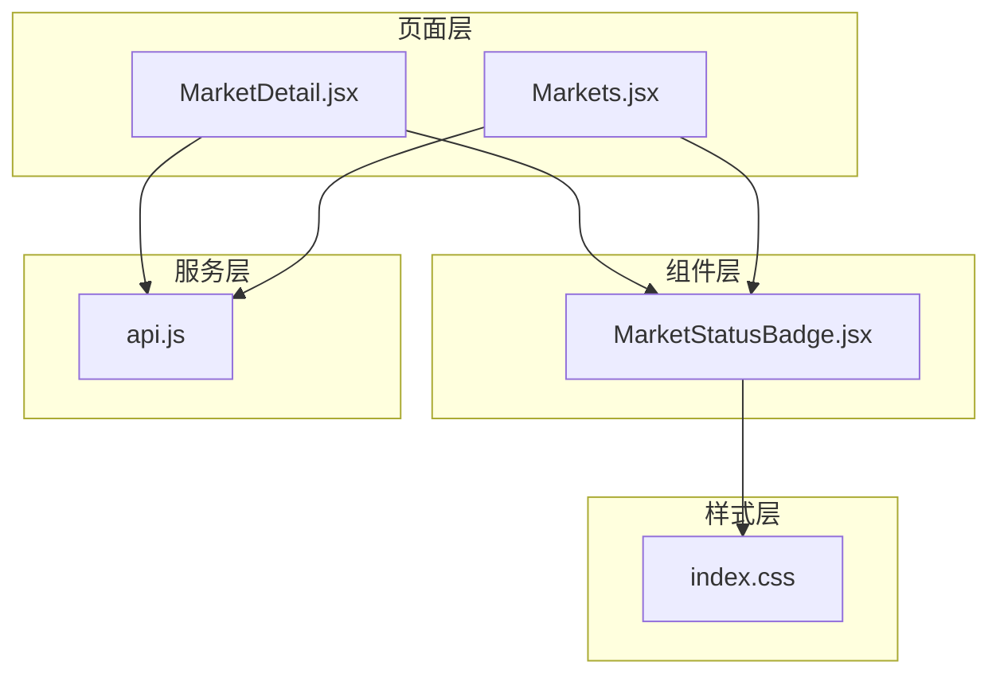
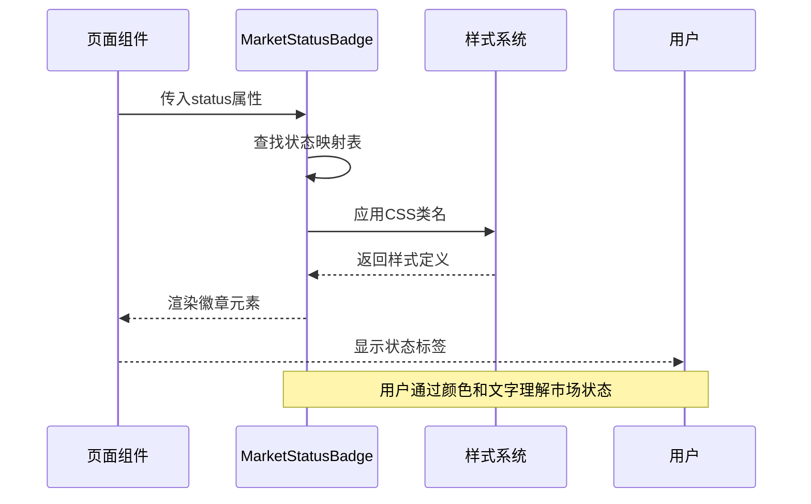
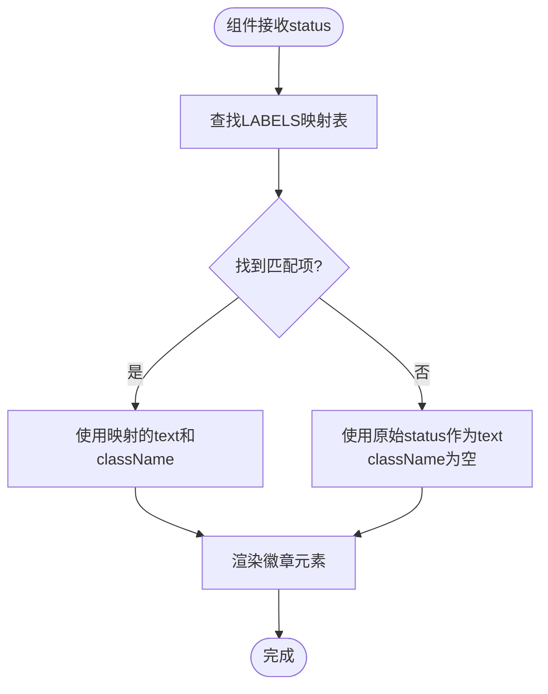
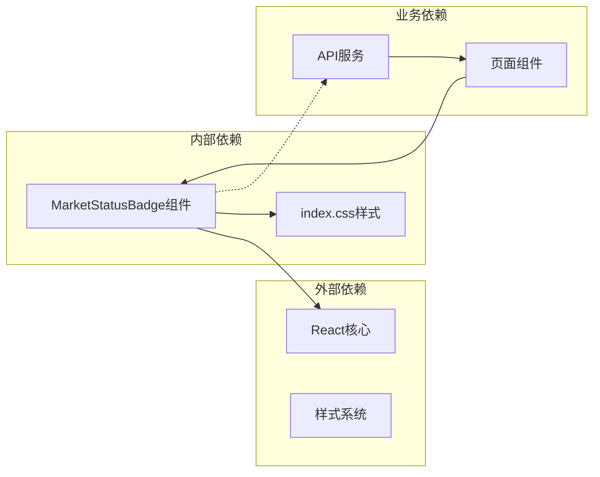

# 市场状态徽章

<cite>
**本文档引用的文件**
- [MarketStatusBadge.jsx](file://src/components/MarketStatusBadge.jsx)
- [index.css](file://src/index.css)
- [MarketDetail.jsx](file://src/pages/MarketDetail.jsx)
- [Markets.jsx](file://src/pages/Markets.jsx)
- [api.js](file://src/services/api.js)
</cite>

## 目录
1. [简介](#简介)
2. [项目结构](#项目结构)
3. [核心组件](#核心组件)
4. [架构概览](#架构概览)
5. [详细组件分析](#详细组件分析)
6. [依赖分析](#依赖分析)
7. [性能考虑](#性能考虑)
8. [故障排除指南](#故障排除指南)
9. [结论](#结论)

## 简介

市场状态徽章组件是一个专门用于展示预测市场状态的UI组件，它将复杂的市场状态代码转换为用户友好的中文标签，并通过颜色编码系统提供直观的状态指示。该组件在预测市场的列表视图和详情视图中发挥着重要作用，帮助用户快速理解市场当前所处的状态阶段。

## 项目结构

MarketStatusBadge组件位于前端项目的组件目录中，与页面组件和样式文件协同工作：



**图表来源**
- [MarketStatusBadge.jsx](file://src/components/MarketStatusBadge.jsx#L1-L24)
- [MarketDetail.jsx](file://src/pages/MarketDetail.jsx#L24-L25)
- [Markets.jsx](file://src/pages/Markets.jsx#L38-L52)
- [index.css](file://src/index.css#L102-L113)

**章节来源**
- [MarketStatusBadge.jsx](file://src/components/MarketStatusBadge.jsx#L1-L24)
- [MarketDetail.jsx](file://src/pages/MarketDetail.jsx#L1-L185)
- [Markets.jsx](file://src/pages/Markets.jsx#L1-L56)

## 核心组件

### 组件概述

MarketStatusBadge是一个纯函数组件，接收单一的status属性，根据预定义的状态映射表返回相应的徽章元素。该组件的设计遵循了单一职责原则，专注于状态显示逻辑，不包含任何业务逻辑。

### 状态映射表

组件内部维护了一个状态映射表，将技术状态码映射到用户友好的中文显示文本和对应的CSS类名：

| 状态枚举 | 中文显示文本 | CSS类名 | 颜色含义 |
|---------|-------------|---------|----------|
| OPEN | 开放下注 | badge-open | 蓝色背景，表示市场正在接受投注 |
| RESOLVED | 已结算 | badge-resolved | 绿色背景，表示市场已完成结算 |
| VOID | 已作废 (可退款) | badge-void | 红色背景，表示市场被作废且可退款 |
| ORACLE_PENDING | 预言机结算中 | badge-pending | 橙色背景，表示等待预言机确认 |

### Props参数

组件接收以下props参数：
- **status** (string): 市场状态代码，必须是预定义的状态枚举之一

### 样式类名映射关系

每个状态都对应特定的CSS类名，这些类名在全局样式文件中定义了具体的视觉效果：

- `.badge`: 基础徽章样式
- `.badge-open`: 开放状态样式
- `.badge-resolved`: 已结算状态样式  
- `.badge-void`: 已作废状态样式
- `.badge-pending`: 预言机结算中状态样式

**章节来源**
- [MarketStatusBadge.jsx](file://src/components/MarketStatusBadge.jsx#L1-L24)
- [index.css](file://src/index.css#L102-L113)

## 架构概览

MarketStatusBadge组件在整个应用架构中扮演着状态可视化的重要角色，它与页面组件和样式系统紧密协作：



**图表来源**
- [MarketStatusBadge.jsx](file://src/components/MarketStatusBadge.jsx#L18-L23)
- [MarketDetail.jsx](file://src/pages/MarketDetail.jsx#L118-L129)
- [Markets.jsx](file://src/pages/Markets.jsx#L48-L50)

## 详细组件分析

### 状态显示逻辑

组件采用查找表模式实现状态映射，具有以下特点：



**图表来源**
- [MarketStatusBadge.jsx](file://src/components/MarketStatusBadge.jsx#L18-L23)

### 颜色编码系统

颜色编码系统基于语义化设计原则，每种状态都有明确的颜色含义：

- **蓝色 (#dbeafe)**: 表示积极的、可操作的状态（开放下注）
- **绿色 (#dcfce7)**: 表示已完成、成功的状态（已结算）
- **红色 (#fee2e2)**: 表示负面的、需要关注的状态（已作废）
- **橙色 (#fef3c7)**: 表示中性、等待中的状态（预言机结算中）

### 文本格式化规则

组件遵循以下文本格式化规则：
1. 所有显示文本均为中文，便于本地化用户理解
2. 特殊状态包含额外说明信息，如"已作废 (可退款)"
3. 未识别的状态回退到原始状态文本，确保不会丢失信息

### 不同市场状态的视觉表现

#### 开放下注 (OPEN)
- **视觉表现**: 蓝色背景，深蓝色文字
- **用户提示**: "开放下注" - 表示市场正在接受投注
- **交互影响**: 用户可以进行下注操作

#### 已结算 (RESOLVED)
- **视觉表现**: 绿色背景，深绿色文字  
- **用户提示**: "已结算" - 表示市场已完成结算流程
- **交互影响**: 用户无法再进行下注操作

#### 已作废 (VOID)
- **视觉表现**: 红色背景，深红色文字
- **用户提示**: "已作废 (可退款)" - 表示市场被作废且可申请退款
- **交互影响**: 用户可以申请退款，但不能下注

#### 预言机结算中 (ORACLE_PENDING)
- **视觉表现**: 橙色背景，深橙色文字
- **用户提示**: "预言机结算中" - 表示等待预言机确认结果
- **交互影响**: 市场暂停下注，等待最终结果确定

### 组件使用示例

#### 在市场列表页面中的使用

在市场列表页面中，MarketStatusBadge通常与市场基本信息一起显示：

```javascript
// 在市场卡片中使用
<Link key={mk.id} to={`/markets/${mk.id}`} className="card link-card">
  <p>{mk.question}</p>
  <p>Yes池 {formatUsdc(mk.yes_pool)} / No池 {formatUsdc(mk.no_pool)} · {mk.status}</p>
</Link>
```

#### 在市场详情页面中的使用

在市场详情页面中，组件的使用更加复杂，因为它需要考虑比赛状态和市场状态的优先级：

```javascript
// 确定显示的市场状态
const displayStatus = market.match?.status === 'ORACLE_PENDING' 
  ? 'ORACLE_PENDING' 
  : market.status;

// 在页面头部显示
{market.match && (
  <p>
    {market.match.home_team} vs {market.match.away_team}{' '}
    <MarketStatusBadge status={displayStatus} />
  </p>
)}
```

### 自定义样式方法

虽然组件提供了标准的样式方案，但可以通过以下方式实现自定义：

1. **覆盖CSS类名**: 通过继承或覆盖现有的CSS类名来修改样式
2. **添加额外类名**: 在组件外部添加自定义类名来实现特殊样式
3. **主题定制**: 通过CSS变量或主题系统实现统一的主题定制

### 集成模式

#### 市场列表集成
- **位置**: 市场卡片的底部或右侧
- **用途**: 快速浏览多个市场的状态
- **交互**: 点击卡片进入市场详情页面

#### 市场详情集成
- **位置**: 市场标题下方或比分信息旁边
- **用途**: 显示当前的市场状态
- **交互**: 结合其他状态信息提供完整的上下文

**章节来源**
- [MarketDetail.jsx](file://src/pages/MarketDetail.jsx#L117-L130)
- [Markets.jsx](file://src/pages/Markets.jsx#L36-L52)

## 依赖分析

MarketStatusBadge组件具有清晰的依赖关系和较低的耦合度：



**图表来源**
- [MarketStatusBadge.jsx](file://src/components/MarketStatusBadge.jsx#L1-L24)
- [index.css](file://src/index.css#L102-L113)
- [MarketDetail.jsx](file://src/pages/MarketDetail.jsx#L24-L25)
- [Markets.jsx](file://src/pages/Markets.jsx#L38-L52)

### 直接依赖
- **React**: 用于组件渲染和生命周期管理
- **全局样式**: 依赖index.css中的徽章样式定义

### 间接依赖
- **API服务**: 通过页面组件间接使用，获取市场状态数据
- **页面组件**: 作为UI组件被页面组件引用

### 潜在循环依赖
组件设计避免了循环依赖，保持了良好的模块化结构。

**章节来源**
- [MarketStatusBadge.jsx](file://src/components/MarketStatusBadge.jsx#L1-L24)
- [api.js](file://src/services/api.js#L81-L91)

## 性能考虑

MarketStatusBadge组件具有以下性能特征：

### 渲染性能
- **纯函数组件**: 无内部状态，渲染开销极低
- **简单逻辑**: 状态查找操作的时间复杂度为O(1)
- **不可变数据**: 使用常量映射表，避免不必要的内存分配

### 内存使用
- **静态映射表**: 状态映射表在模块级别定义，只初始化一次
- **最小DOM节点**: 仅渲染一个span元素，DOM开销很小

### 缓存策略
- **浏览器缓存**: 样式文件会被浏览器缓存，重复使用时无需重新下载
- **组件复用**: 可以在多个页面中重复使用，提高整体性能

## 故障排除指南

### 常见问题及解决方案

#### 状态显示异常
**问题**: 显示的文本不符合预期
**可能原因**: 
- 传递了未定义的状态枚举值
- 状态值格式不正确

**解决方案**:
- 确保传递正确的状态枚举值
- 在调用前验证状态值的有效性

#### 样式不生效
**问题**: 徽章没有显示预期的颜色
**可能原因**:
- CSS类名冲突
- 样式文件未正确加载

**解决方案**:
- 检查CSS类名的正确性
- 确认样式文件的加载顺序

#### 性能问题
**问题**: 大量徽章同时渲染导致性能下降
**解决方案**:
- 使用虚拟滚动技术
- 实施懒加载机制
- 优化样式计算

**章节来源**
- [MarketStatusBadge.jsx](file://src/components/MarketStatusBadge.jsx#L18-L23)

## 结论

MarketStatusBadge组件通过简洁而有效的设计，成功地将复杂的市场状态信息转化为直观的视觉指示。其设计特点包括：

### 设计优势
- **语义化设计**: 颜色编码系统符合用户的认知习惯
- **国际化友好**: 使用中文显示文本，便于本地化用户理解
- **可扩展性**: 支持新的状态类型和自定义样式
- **性能优化**: 采用纯函数组件，渲染效率高

### 用户价值
- **快速理解**: 用户能够一目了然地理解市场状态
- **决策支持**: 通过颜色和文字提供决策依据
- **一致性**: 在整个应用中提供统一的状态显示体验

### 技术价值
- **模块化设计**: 低耦合，易于维护和测试
- **类型安全**: 明确的接口定义，减少运行时错误
- **可测试性**: 纯函数特性使得单元测试简单直接

该组件为预测市场的用户体验提供了重要的视觉支持，通过合理的状态管理和颜色编码，显著提升了用户对市场状态的理解和决策效率。