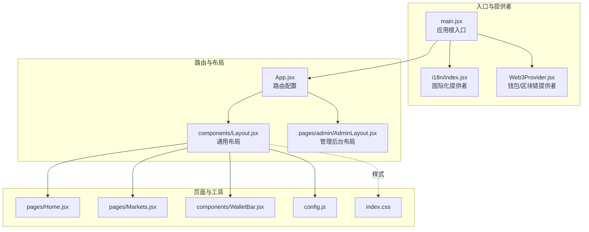
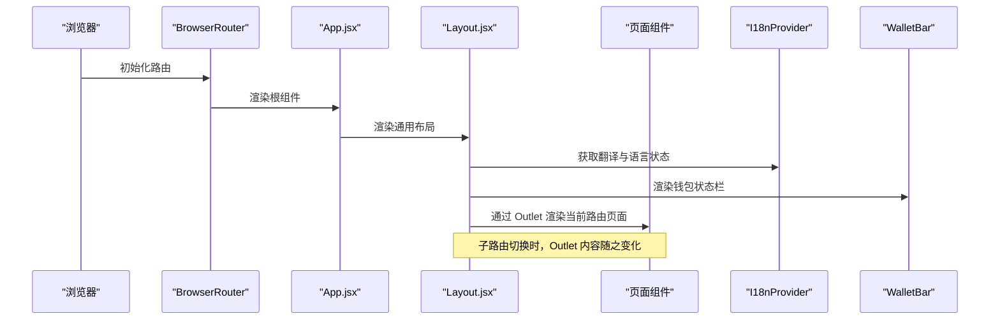
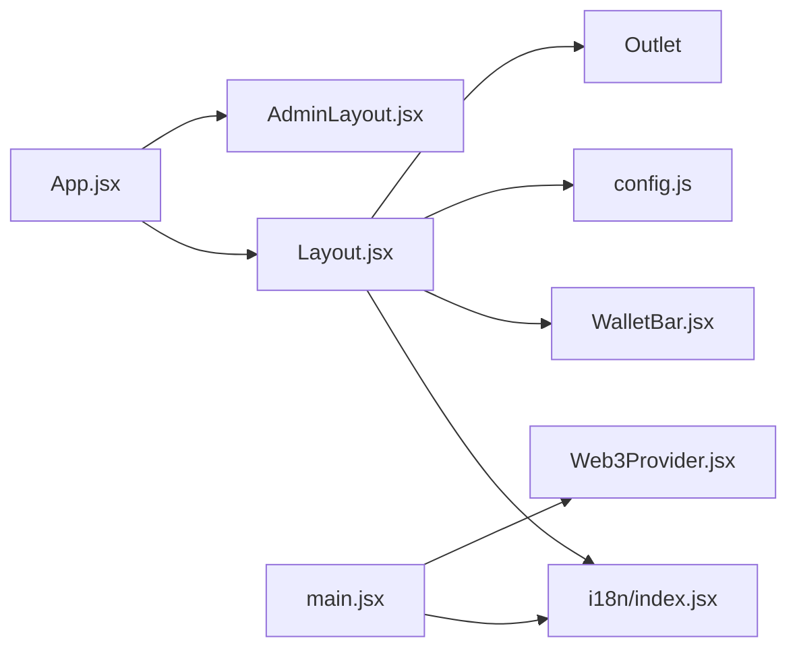

# 布局组件

<cite>
**本文引用的文件**
- [src/components/Layout.jsx](file://src/components/Layout.jsx)
- [src/App.jsx](file://src/App.jsx)
- [src/i18n/index.jsx](file://src/i18n/index.jsx)
- [src/main.jsx](file://src/main.jsx)
- [src/pages/admin/AdminLayout.jsx](file://src/pages/admin/AdminLayout.jsx)
- [src/components/WalletBar.jsx](file://src/components/WalletBar.jsx)
- [src/config.js](file://src/config.js)
- [src/index.css](file://src/index.css)
- [src/pages/Home.jsx](file://src/pages/Home.jsx)
- [src/pages/Markets.jsx](file://src/pages/Markets.jsx)
- [src/hooks/useAuth.js](file://src/hooks/useAuth.js)
</cite>

## 目录
1. [简介](#简介)
2. [项目结构](#项目结构)
3. [核心组件](#核心组件)
4. [架构总览](#架构总览)
5. [组件详细分析](#组件详细分析)
6. [依赖关系分析](#依赖关系分析)
7. [性能考量](#性能考量)
8. [故障排查指南](#故障排查指南)
9. [结论](#结论)
10. [附录](#附录)

## 简介
本文件围绕前端布局组件 Layout 进行系统化说明，涵盖其整体设计理念、导航结构设计、响应式布局实现、国际化支持机制、路由集成方式、活动状态管理、语言切换功能、样式定制方法、与 Router 的集成模式，以及作为应用基础容器如何承载其他页面组件并提供统一用户体验。文档同时给出使用示例与最佳实践建议，帮助开发者快速理解与扩展该布局体系。

## 项目结构
该前端采用基于文件组织的模块化结构，布局组件位于 components 目录，路由配置集中在 App.jsx，国际化与全局提供者在 i18n 与 main.jsx 中初始化，页面组件位于 pages 目录，样式集中于 index.css。

图表来源
- [src/main.jsx](file://src/main.jsx#L17-L32)
- [src/i18n/index.jsx](file://src/i18n/index.jsx#L49-L66)
- [src/App.jsx](file://src/App.jsx#L31-L66)
- [src/components/Layout.jsx](file://src/components/Layout.jsx#L14-L68)
- [src/pages/admin/AdminLayout.jsx](file://src/pages/admin/AdminLayout.jsx#L8-L32)
- [src/components/WalletBar.jsx](file://src/components/WalletBar.jsx#L10-L53)
- [src/config.js](file://src/config.js#L7-L22)
- [src/index.css](file://src/index.css#L25-L67)

章节来源
- [src/main.jsx](file://src/main.jsx#L1-L33)
- [src/App.jsx](file://src/App.jsx#L1-L67)

## 核心组件
- Layout 组件：提供统一的头部导航、主内容区与页脚，内部集成了国际化与钱包状态展示，通过 Outlet 渲染子路由页面。
- App 路由：定义全站路由规则，将 Layout 作为通用布局包裹，同时配置管理后台的嵌套路由。
- 国际化提供者：I18nProvider 管理语言状态与翻译函数，useI18n 钩子向组件暴露 t、lang、setLang。
- 钱包栏 WalletBar：展示钱包连接状态、登录/登出、地址缩略等交互。
- 管理后台布局 AdminLayout：用于后台区域的导航与内容渲染。
- 样式与配置：index.css 定义布局样式；config.js 提供链 ID 等运行时配置。

章节来源
- [src/components/Layout.jsx](file://src/components/Layout.jsx#L14-L68)
- [src/App.jsx](file://src/App.jsx#L31-L66)
- [src/i18n/index.jsx](file://src/i18n/index.jsx#L49-L79)
- [src/components/WalletBar.jsx](file://src/components/WalletBar.jsx#L10-L53)
- [src/pages/admin/AdminLayout.jsx](file://src/pages/admin/AdminLayout.jsx#L8-L32)
- [src/index.css](file://src/index.css#L25-L67)
- [src/config.js](file://src/config.js#L7-L22)

## 架构总览
Layout 作为应用的基础容器，通过 React Router 的嵌套路由机制与 Outlet 实现页面切换。国际化与 Web3 提供者在应用根部注入，使 Layout 及其子页面均可访问翻译与钱包能力。管理后台采用独立的 AdminLayout 进行嵌套路由，保持通用布局的一致性。

图表来源
- [src/main.jsx](file://src/main.jsx#L17-L32)
- [src/App.jsx](file://src/App.jsx#L31-L66)
- [src/components/Layout.jsx](file://src/components/Layout.jsx#L14-L68)
- [src/components/WalletBar.jsx](file://src/components/WalletBar.jsx#L10-L53)
- [src/i18n/index.jsx](file://src/i18n/index.jsx#L49-L79)

## 组件详细分析

### Layout 组件
- 设计理念
  - 作为应用的“骨架”，统一承载导航、内容与页脚，保证跨页面一致的用户体验。
  - 通过 NavLink 的 isActive 回调实现导航活动状态的动态高亮。
  - 通过 Outlet 渲染子路由页面，实现页面级内容的按需替换。
- 导航结构设计
  - 导航项包括首页、市场、统计、流动性、个人中心、DID、管理后台等，覆盖主要业务路径。
  - 活动状态管理：利用 NavLink 的 isActive 回调动态添加 active 类，结合 CSS 实现视觉高亮。
- 国际化支持
  - 通过 useI18n 获取翻译函数 t 与当前语言 lang，导航文案与页脚文案均来自翻译键。
  - 语言切换：点击语言切换按钮，调用 setLang 切换 zh/en，并持久化到本地存储。
- 钱包状态集成
  - 集成 WalletBar，展示钱包连接状态、登录/登出、地址缩略与错误提示。
- 响应式布局实现
  - header 使用 flex 布局，品牌名与导航项水平排列，右侧钱包栏自动靠右。
  - main 设置 flex: 1 与最大宽度，确保内容在不同屏幕尺寸下居中且可滚动。
  - footer 固定页脚，显示版本与链 ID。
- 与 Router 的集成
  - App.jsx 中将 Layout 作为路由元素，子路由通过 Outlet 渲染。
  - 管理后台采用嵌套路由，AdminLayout 作为 admin 路由下的子布局。
- Props 接口
  - 无外部 props 输入，通过上下文与路由参数驱动行为。
- 使用示例
  - 在 App.jsx 中将 Layout 作为通用布局包裹页面路由，即可实现统一导航与页脚。
  - 如需新增导航项，只需在 Layout 的 header 中添加 NavLink，并在国际化键中补充对应翻译。
- 样式定制方法
  - 通过修改 index.css 中 .layout、.header、.main、.footer 等选择器，调整布局与配色。
  - 导航活动状态可通过 .header a.active 控制高亮样式。
- 与其他组件的关系
  - 依赖 i18n 提供的翻译与语言切换能力。
  - 依赖 WalletBar 展示钱包状态。
  - 依赖 config 提供的链 ID 信息。

章节来源
- [src/components/Layout.jsx](file://src/components/Layout.jsx#L14-L68)
- [src/i18n/index.jsx](file://src/i18n/index.jsx#L49-L79)
- [src/components/WalletBar.jsx](file://src/components/WalletBar.jsx#L10-L53)
- [src/config.js](file://src/config.js#L7-L22)
- [src/index.css](file://src/index.css#L25-L67)

### 国际化支持机制
- 提供者与钩子
  - I18nProvider：维护语言状态 lang，提供翻译函数 t 与 setLang 方法，并通过 useMemo 缓存上下文值。
  - useI18n：在组件内获取 t、lang、setLang，若在 Provider 外部使用会抛出错误。
- 语言持久化
  - 语言偏好从本地存储读取，切换语言时写回本地存储，确保刷新后仍保持所选语言。
- 翻译键覆盖
  - 支持中文与英文两套翻译键，如 home、markets、me、did、admin、stats、liquidity、phase_footer 等。
- 与 Layout 的集成
  - Layout 通过 useI18n 获取 t 与 lang，并在导航与页脚中使用翻译键，实现多语言导航与提示文案。

章节来源
- [src/i18n/index.jsx](file://src/i18n/index.jsx#L49-L79)
- [src/components/Layout.jsx](file://src/components/Layout.jsx#L15-L16)

### 钱包状态与登录流程
- 钱包栏 WalletBar
  - 展示钱包连接状态、地址缩略、登录/登出按钮与错误提示。
  - 未连接时提供连接按钮；已连接时提供 SIWE 登录与断开连接操作。
- 认证钩子 useAuth
  - 封装 SIWE 登录流程：构造消息、请求签名、调用后端认证、保存令牌、绑定 DID。
  - 提供登出逻辑与认证状态查询。
- 与 Layout 的集成
  - Layout 直接引入 WalletBar，无需额外 props，即可在导航右侧展示钱包状态。

章节来源
- [src/components/WalletBar.jsx](file://src/components/WalletBar.jsx#L10-L53)
- [src/hooks/useAuth.js](file://src/hooks/useAuth.js#L16-L109)

### 管理后台布局
- AdminLayout
  - 用于管理后台区域的导航与内容渲染，包含 Oracle 队列与市场配置两个子导航。
  - 通过 sessionStorage 检查管理员密钥，未设置时提示在控制台设置。
  - 与 Layout 的关系：AdminLayout 作为 admin 路由下的子布局，复用 Layout 的通用样式与导航风格。

章节来源
- [src/pages/admin/AdminLayout.jsx](file://src/pages/admin/AdminLayout.jsx#L8-L32)
- [src/App.jsx](file://src/App.jsx#L55-L61)

### 路由集成与嵌套路由
- App.jsx
  - 定义所有页面路由，将 Layout 作为通用布局包裹。
  - 管理后台采用嵌套路由，AdminLayout 作为 admin 路由下的子布局。
- Layout.jsx
  - 通过 Outlet 渲染当前匹配的子路由页面，实现页面切换。
- 动态生成导航
  - 导航项通过静态 NavLink 定义，配合 isActive 回调实现活动状态高亮。
  - 若需动态生成，可在 Layout 中根据路由表或权限动态渲染 NavLink 列表。

章节来源
- [src/App.jsx](file://src/App.jsx#L31-L66)
- [src/components/Layout.jsx](file://src/components/Layout.jsx#L58-L61)

### 样式与响应式设计
- 布局容器
  - .layout 使用最小高度与 flex 布局，确保页脚始终在底部。
  - .header 使用背景色与 flex 布局，品牌名自动靠左，右侧钱包栏靠右。
  - .main 设置 flex: 1 与最大宽度，内容在中间区域居中显示。
  - .footer 固定页脚，显示版本与链 ID。
- 导航活动状态
  - .header a.active 控制活动导航项的高亮样式。
- 按钮与输入
  - 全局按钮与输入框样式统一，便于一致性交互。

章节来源
- [src/index.css](file://src/index.css#L25-L67)

## 依赖关系分析
- 组件耦合
  - Layout 依赖 i18n 提供的翻译与语言切换能力，依赖 WalletBar 展示钱包状态。
  - App.jsx 作为路由配置中心，将 Layout 与各页面组件解耦。
  - AdminLayout 与 Layout 解耦，仅共享通用样式与导航风格。
- 外部依赖
  - react-router-dom：提供路由与导航能力。
  - wagmi：提供钱包连接、签名与账户状态。
  - siwe：用于以太坊签名登录协议。
- 潜在循环依赖
  - 未发现循环依赖，组件间通过提供者与路由解耦。

图表来源
- [src/components/Layout.jsx](file://src/components/Layout.jsx#L14-L68)
- [src/App.jsx](file://src/App.jsx#L31-L66)
- [src/main.jsx](file://src/main.jsx#L17-L32)
- [src/i18n/index.jsx](file://src/i18n/index.jsx#L49-L66)

章节来源
- [src/components/Layout.jsx](file://src/components/Layout.jsx#L1-L69)
- [src/App.jsx](file://src/App.jsx#L1-L67)
- [src/main.jsx](file://src/main.jsx#L1-L33)

## 性能考量
- 渲染优化
  - I18nProvider 使用 useMemo 缓存上下文值，避免因语言切换导致不必要的重新渲染。
  - Layout 通过 NavLink 的 isActive 回调实现轻量级活动状态判断，减少复杂计算。
- 资源加载
  - index.css 作为全局样式，建议按需拆分或使用 CSS-in-JS 以减少首屏体积（可选）。
- 路由切换
  - 使用 Outlet 渲染子路由页面，避免重复挂载通用布局，提升切换性能。

章节来源
- [src/i18n/index.jsx](file://src/i18n/index.jsx#L52-L63)
- [src/components/Layout.jsx](file://src/components/Layout.jsx#L24-L49)

## 故障排查指南
- 语言切换无效
  - 检查 useI18n 是否在 I18nProvider 内部使用，确认 setLang 是否正确写入本地存储。
- 导航活动状态不生效
  - 确认 NavLink 的 isActive 回调是否正确返回 active 类名，CSS 中 .header a.active 是否存在。
- 钱包连接与登录异常
  - 检查 wagmi 提供者是否正确注入，WalletBar 中 connect、signMessageAsync 是否可用。
  - 查看 useAuth 的错误信息与加载状态，确认 SIWE 域名、URI 与链 ID 配置正确。
- 管理后台无法进入
  - 确认 sessionStorage 中 admin_key 是否设置，AdminLayout 是否正确渲染。
- 页脚链 ID 显示异常
  - 检查 config.js 中 chainId 的环境变量配置是否正确。

章节来源
- [src/i18n/index.jsx](file://src/i18n/index.jsx#L73-L79)
- [src/components/Layout.jsx](file://src/components/Layout.jsx#L44-L54)
- [src/components/WalletBar.jsx](file://src/components/WalletBar.jsx#L10-L53)
- [src/hooks/useAuth.js](file://src/hooks/useAuth.js#L28-L80)
- [src/pages/admin/AdminLayout.jsx](file://src/pages/admin/AdminLayout.jsx#L9-L20)
- [src/config.js](file://src/config.js#L3-L11)

## 结论
Layout 组件通过简洁的结构与清晰的职责划分，构建了统一的应用骨架。它与国际化、钱包状态、路由系统紧密协作，既保证了良好的用户体验，也为后续扩展提供了稳定基础。通过合理的样式定制与路由嵌套，可以轻松适配更多页面与功能模块。

## 附录
- 使用示例
  - 在 App.jsx 中将 Layout 作为通用布局包裹页面路由，即可实现统一导航与页脚。
  - 新增导航项：在 Layout 的 header 中添加 NavLink，并在国际化键中补充对应翻译。
- 最佳实践
  - 保持导航项与路由表一致，避免出现死链。
  - 将样式集中管理，避免分散的内联样式影响可维护性。
  - 对于需要权限控制的区域，可结合 useAuth 的认证状态进行条件渲染。