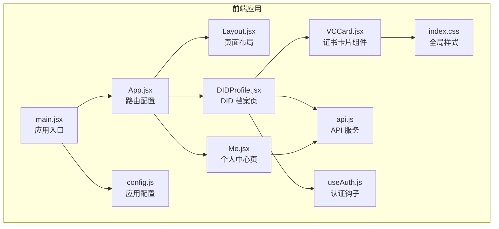
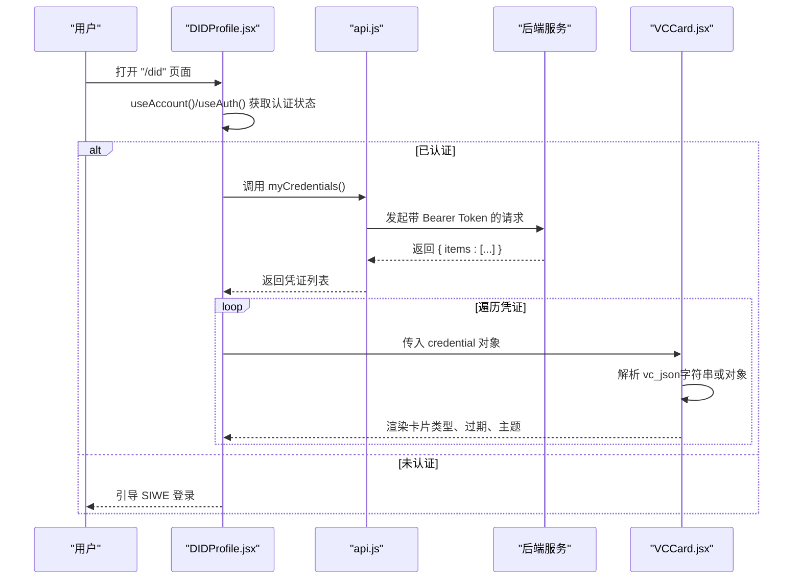
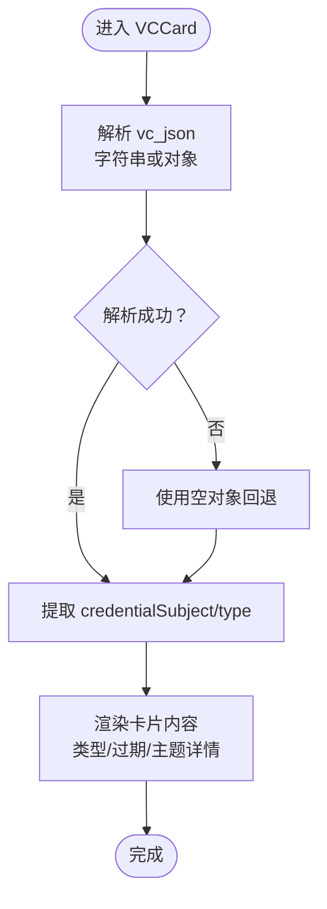
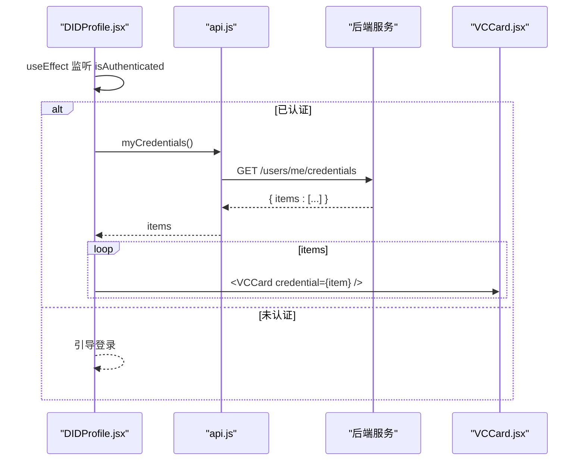
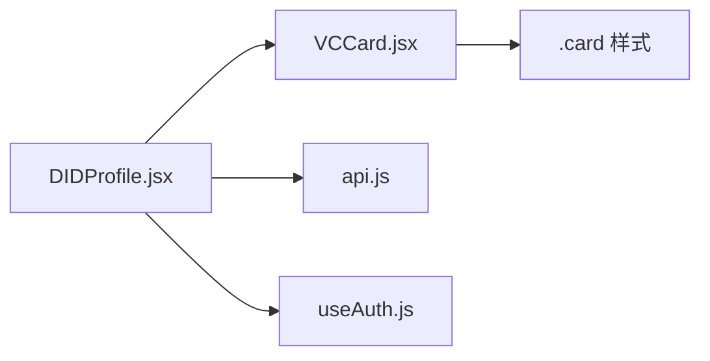

# 证书卡片

<cite>
**本文引用的文件**
- [VCCard.jsx](file://src/components/VCCard.jsx)
- [DIDProfile.jsx](file://src/pages/DIDProfile.jsx)
- [Me.jsx](file://src/pages/Me.jsx)
- [api.js](file://src/services/api.js)
- [useAuth.js](file://src/hooks/useAuth.js)
- [index.css](file://src/index.css)
- [App.jsx](file://src/App.jsx)
- [main.jsx](file://src/main.jsx)
- [config.js](file://src/config.js)
</cite>

## 目录
1. [简介](#简介)
2. [项目结构](#项目结构)
3. [核心组件](#核心组件)
4. [架构总览](#架构总览)
5. [组件详细分析](#组件详细分析)
6. [依赖关系分析](#依赖关系分析)
7. [性能考量](#性能考量)
8. [故障排查指南](#故障排查指南)
9. [结论](#结论)
10. [附录](#附录)

## 简介
本文件围绕“证书卡片”组件 VCCard 的设计与实现进行系统化说明，重点覆盖：
- 数字证书（可验证凭证，VC）在前端的展示逻辑与数据结构
- 组件接收的 props 参数、字段映射与样式定制
- 不同类型证书（如身份证明、资格认证、DID 证书）的显示格式与交互行为
- 在 DID 档案页与个人中心中的集成模式
- 如何帮助用户管理与展示其数字身份与认证信息

## 项目结构
该组件位于前端 src/components 目录下，配合页面组件、API 服务、认证钩子与全局样式共同工作。路由层面通过 App.jsx 注册 DIDProfile 页面，使用户可在“/did”路径访问 DID 档案与 VC 列表。

图表来源
- [main.jsx](file://src/main.jsx#L17-L32)
- [App.jsx](file://src/App.jsx#L31-L66)
- [DIDProfile.jsx](file://src/pages/DIDProfile.jsx#L16-L68)
- [Me.jsx](file://src/pages/Me.jsx#L22-L104)
- [VCCard.jsx](file://src/components/VCCard.jsx#L6-L34)
- [api.js](file://src/services/api.js#L114-L117)
- [useAuth.js](file://src/hooks/useAuth.js#L16-L108)
- [index.css](file://src/index.css#L69-L75)
- [config.js](file://src/config.js#L1-L23)

章节来源
- [main.jsx](file://src/main.jsx#L17-L32)
- [App.jsx](file://src/App.jsx#L31-L66)

## 核心组件
- VCCard：用于展示单个可验证凭证（VC）的关键字段，包括凭证类型、过期时间与主题详情。
- DIDProfile：展示用户 DID 与 VC 列表，负责拉取凭证并逐项渲染 VCCard。
- API 服务：提供 myCredentials 等接口，支撑凭证数据获取。
- 认证钩子：提供 SIWE 登录、令牌管理与 DID 绑定能力，保障凭证访问权限。
- 全局样式：提供 card 容器样式，统一卡片外观。

章节来源
- [VCCard.jsx](file://src/components/VCCard.jsx#L6-L34)
- [DIDProfile.jsx](file://src/pages/DIDProfile.jsx#L16-L68)
- [api.js](file://src/services/api.js#L114-L117)
- [useAuth.js](file://src/hooks/useAuth.js#L16-L108)
- [index.css](file://src/index.css#L69-L75)

## 架构总览
下图展示了从用户进入 DID 档案页到凭证卡片渲染的端到端流程，以及组件间的依赖关系。

图表来源
- [DIDProfile.jsx](file://src/pages/DIDProfile.jsx#L24-L30)
- [api.js](file://src/services/api.js#L114-L117)
- [useAuth.js](file://src/hooks/useAuth.js#L28-L80)
- [VCCard.jsx](file://src/components/VCCard.jsx#L6-L34)

## 组件详细分析

### VCCard 组件
- 功能定位：展示单个 VC 的关键信息，便于用户快速识别凭证类型、有效期与主体内容。
- 输入参数（props）：
  - credential：包含以下字段的对象
    - credential_type：凭证类型名称（例如“VerifiedFan”）
    - expires_at：过期时间（ISO 时间戳）
    - vc_json：VC 的 JSON 字段，可能为字符串或对象
- 数据解析与容错：
  - 若 vc_json 为字符串，尝试 JSON.parse；失败则回退为空对象，避免渲染中断
  - 从解析结果中提取 credentialSubject 作为主题详情
  - 将 type 字段（若为数组）拼接为字符串显示
- 视觉呈现：
  - 使用 className="card" 应用统一卡片样式
  - 主题详情以 pre 标签展示，字体较小，适合查看结构化 JSON
- 交互行为：
  - 作为纯展示组件，不包含交互按钮或跳转逻辑

图表来源
- [VCCard.jsx](file://src/components/VCCard.jsx#L6-L34)

章节来源
- [VCCard.jsx](file://src/components/VCCard.jsx#L6-L34)
- [index.css](file://src/index.css#L69-L75)

### DIDProfile 页面与凭证列表
- 责任边界：展示用户 DID 与 VC 列表；在认证后拉取凭证并逐项渲染 VCCard。
- 关键流程：
  - useAuth 钩子提供 isAuthenticated；当为真时调用 myCredentials 获取 items
  - DID 由钱包地址与链 ID 组合生成（遵循 did:pkh:eip155:chainId:address）
  - 无凭证时显示提示文案
- 与 VCCard 的集成：遍历 items，将每个 credential 作为 props 传给 VCCard

图表来源
- [DIDProfile.jsx](file://src/pages/DIDProfile.jsx#L24-L30)
- [api.js](file://src/services/api.js#L114-L117)
- [VCCard.jsx](file://src/components/VCCard.jsx#L6-L34)

章节来源
- [DIDProfile.jsx](file://src/pages/DIDProfile.jsx#L16-L68)
- [api.js](file://src/services/api.js#L114-L117)

### 个人中心页（Me）与凭证的关系
- 个人中心页展示用户持仓与领取操作，与 VC 展示无直接耦合
- 两者均依赖认证钩子与 API 服务，体现一致的认证与数据访问模式

章节来源
- [Me.jsx](file://src/pages/Me.jsx#L22-L104)

### 认证与 DID 绑定
- SIWE 登录：useAuth 钩子构造 SIWE 消息并请求签名，随后调用后端获取 JWT，并尝试绑定 DID
- DID 构造：did:pkh:eip155:{chainId}:{address}，与 DIDProfile 中的展示一致
- 令牌持久化：通过 api.js 的 setToken/getToken/clearToken 管理 Bearer Token

章节来源
- [useAuth.js](file://src/hooks/useAuth.js#L28-L80)
- [api.js](file://src/services/api.js#L8-L20)
- [config.js](file://src/config.js#L1-L23)

### 样式与视觉呈现
- 卡片容器：.card 提供背景、边框、圆角与内边距，统一卡片风格
- 主题详情：pre 样式设置较小字体，适合查看 JSON 结构
- 页面级样式：index.css 提供全局排版与组件基础样式

章节来源
- [index.css](file://src/index.css#L69-L75)

## 依赖关系分析
- 组件耦合度：VCCard 仅依赖传入的 credential 对象，低耦合、高内聚
- 数据流：DIDProfile -> VCCard，数据自上而下传递
- 外部依赖：API 服务（myCredentials）、认证钩子（useAuth）、全局样式（index.css）

图表来源
- [DIDProfile.jsx](file://src/pages/DIDProfile.jsx#L16-L68)
- [VCCard.jsx](file://src/components/VCCard.jsx#L6-L34)
- [api.js](file://src/services/api.js#L114-L117)
- [useAuth.js](file://src/hooks/useAuth.js#L16-L108)
- [index.css](file://src/index.css#L69-L75)

章节来源
- [DIDProfile.jsx](file://src/pages/DIDProfile.jsx#L16-L68)
- [VCCard.jsx](file://src/components/VCCard.jsx#L6-L34)

## 性能考量
- 渲染优化：VCCard 为纯展示组件，渲染成本低；建议在上层对 items 做必要的去重与缓存
- JSON 解析：对 vc_json 的解析在每次渲染执行，若 items 较大可考虑 memo 化或在上层预处理
- 网络请求：myCredentials 仅在认证后触发，避免不必要的请求
- 样式：.card 与 pre 样式简单，不影响性能

## 故障排查指南
- 无法看到 VC 列表
  - 确认已连接钱包且已通过 SIWE 登录
  - 检查认证状态与 Bearer Token 是否存在
  - 查看 myCredentials 请求是否返回 items
- VC 内容为空或报错
  - 检查 credential.vc_json 是否为合法 JSON 字符串或对象
  - 若解析失败，组件会回退为空对象，确保后端返回正确格式
- DID 显示异常
  - 确认链 ID 与地址是否正确，DID 构造规则为 did:pkh:eip155:{chainId}:{address}

章节来源
- [useAuth.js](file://src/hooks/useAuth.js#L28-L80)
- [api.js](file://src/services/api.js#L114-L117)
- [DIDProfile.jsx](file://src/pages/DIDProfile.jsx#L32-L35)
- [VCCard.jsx](file://src/components/VCCard.jsx#L9-L17)

## 结论
VCCard 以简洁的数据解析与统一的卡片样式，实现了 VC 的直观展示。结合 DIDProfile 的凭证列表与 useAuth 的认证流程，用户可以在 DID 档案中集中管理与查看自己的数字身份与认证信息。未来可扩展的方向包括：字段映射定制、多类型凭证的差异化渲染、以及更丰富的交互（如复制 VC、导出 JSON 等）。

## 附录

### 组件属性与字段映射
- 输入 props
  - credential.credential_type：凭证类型名称（显示为加粗标题）
  - credential.expires_at：过期时间（显示为本地化日期时间）
  - credential.vc_json：VC 的 JSON 字段（字符串或对象）
- 输出展示
  - 凭证类型列表（数组则拼接为字符串）
  - 主题详情（JSON 格式，pre 标签展示）

章节来源
- [VCCard.jsx](file://src/components/VCCard.jsx#L6-L34)

### 不同类型证书的显示格式
- 身份证明：credentialSubject 中包含身份标识字段（如姓名、ID），在主题详情中以 JSON 形式展示
- 资格认证：credentialSubject 中包含认证等级或类别字段，在主题详情中以 JSON 形式展示
- DID 证书：credentialSubject 中包含 DID 标识，通常与 DIDProfile 页面的 DID 显示保持一致

章节来源
- [DIDProfile.jsx](file://src/pages/DIDProfile.jsx#L32-L35)
- [VCCard.jsx](file://src/components/VCCard.jsx#L18-L21)

### 在 DID 档案与个人中心中的集成模式
- DID 档案页：展示 DID 与 VC 列表，点击“SIWE 登录”后拉取凭证并逐项渲染 VCCard
- 个人中心页：展示持仓与领取操作，与 VC 展示无直接耦合，但共享认证与数据访问模式

章节来源
- [DIDProfile.jsx](file://src/pages/DIDProfile.jsx#L16-L68)
- [Me.jsx](file://src/pages/Me.jsx#L22-L104)