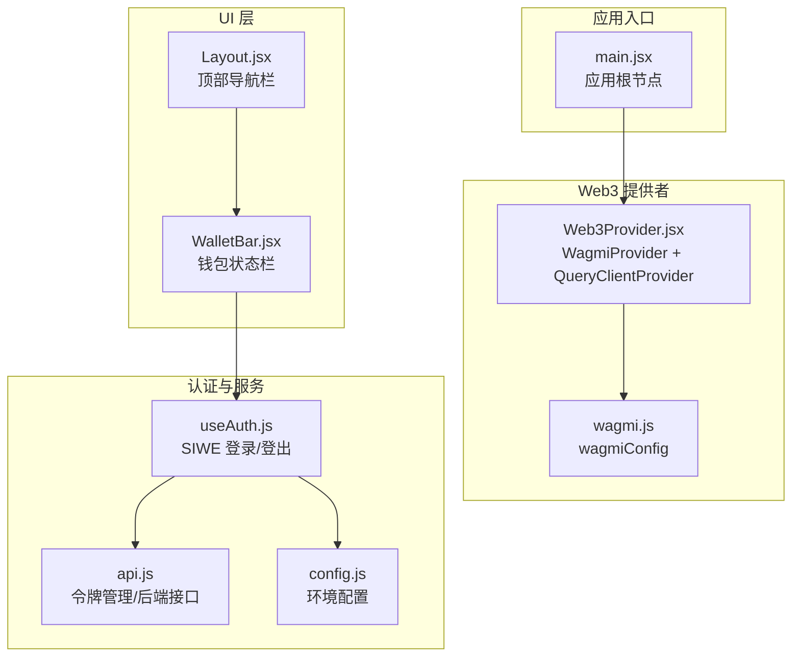
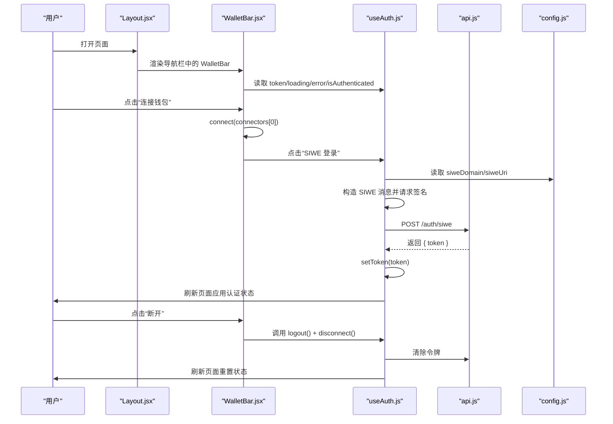
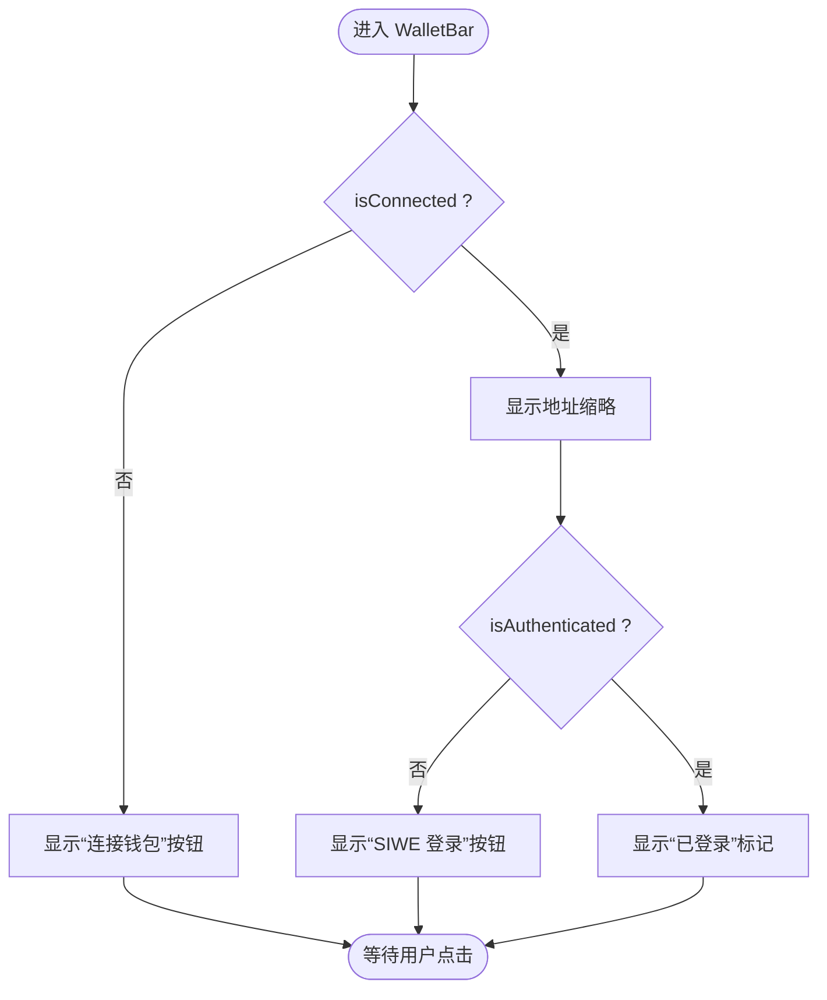
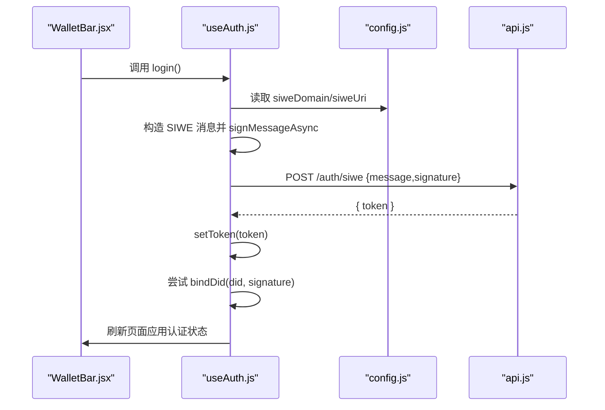
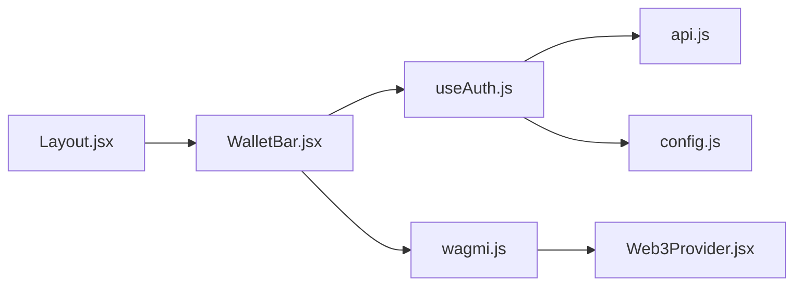

# 钱包状态栏

<cite>
**本文引用的文件**
- [WalletBar.jsx](file://src/components/WalletBar.jsx)
- [useAuth.js](file://src/hooks/useAuth.js)
- [Web3Provider.jsx](file://src/providers/Web3Provider.jsx)
- [Layout.jsx](file://src/components/Layout.jsx)
- [main.jsx](file://src/main.jsx)
- [wagmi.js](file://src/wagmi.js)
- [config.js](file://src/config.js)
- [index.css](file://src/index.css)
- [api.js](file://src/services/api.js)
- [Me.jsx](file://src/pages/Me.jsx)
</cite>

## 目录
1. [简介](#简介)
2. [项目结构](#项目结构)
3. [核心组件](#核心组件)
4. [架构总览](#架构总览)
5. [详细组件分析](#详细组件分析)
6. [依赖关系分析](#依赖关系分析)
7. [性能考量](#性能考量)
8. [故障排查指南](#故障排查指南)
9. [结论](#结论)
10. [附录](#附录)

## 简介
WalletBar 是一个位于应用顶部导航栏的钱包状态栏组件，负责：
- 展示当前钱包连接状态与地址缩略
- 提供“连接钱包”“SIWE 登录”“断开连接”等关键交互
- 在连接成功、连接中、未连接等状态下给出直观的界面反馈
- 与认证钩子 useAuth 协同，实现钱包与去中心化身份（DID）的统一登录体验

该组件通过 wagmi 提供的钱包连接能力与自定义认证逻辑结合，简化用户的 Web3 体验，使用户能够在单一入口完成钱包连接、身份认证与断开操作。

## 项目结构
WalletBar 组件位于组件层，被 Layout 布局组件引入并在全局导航栏中展示；其运行依赖于 Web3Provider 提供的 wagmi 配置与 React Query 客户端；认证逻辑由 useAuth 钩子封装，并通过 API 服务与后端交互。

图表来源
- [main.jsx](file://src/main.jsx#L17-L32)
- [Web3Provider.jsx](file://src/providers/Web3Provider.jsx#L16-L24)
- [wagmi.js](file://src/wagmi.js#L26-L36)
- [Layout.jsx](file://src/components/Layout.jsx#L56-L56)
- [WalletBar.jsx](file://src/components/WalletBar.jsx#L10-L52)
- [useAuth.js](file://src/hooks/useAuth.js#L16-L108)
- [api.js](file://src/services/api.js#L8-L20)
- [config.js](file://src/config.js#L7-L22)

章节来源
- [main.jsx](file://src/main.jsx#L17-L32)
- [Web3Provider.jsx](file://src/providers/Web3Provider.jsx#L16-L24)
- [wagmi.js](file://src/wagmi.js#L26-L36)
- [Layout.jsx](file://src/components/Layout.jsx#L56-L56)
- [WalletBar.jsx](file://src/components/WalletBar.jsx#L10-L52)
- [useAuth.js](file://src/hooks/useAuth.js#L16-L108)
- [api.js](file://src/services/api.js#L8-L20)
- [config.js](file://src/config.js#L7-L22)

## 核心组件
- WalletBar：展示钱包连接状态、地址缩略、登录按钮与断开连接按钮；根据连接状态与认证状态动态呈现不同 UI。
- useAuth：封装 SIWE 登录流程、登出流程与认证状态管理，提供 token、loading、error、isAuthenticated 等状态。
- Web3Provider：为应用提供 wagmi 与 React Query 的上下文，确保 WalletBar 可使用 useAccount/useConnect/useDisconnect/useSignMessage 等钩子。
- Layout：在导航栏右侧集成 WalletBar，作为全站统一入口。
- wagmi.js：定义链与连接器配置，为 WalletBar 的连接器选择提供基础。

章节来源
- [WalletBar.jsx](file://src/components/WalletBar.jsx#L10-L52)
- [useAuth.js](file://src/hooks/useAuth.js#L16-L108)
- [Web3Provider.jsx](file://src/providers/Web3Provider.jsx#L16-L24)
- [Layout.jsx](file://src/components/Layout.jsx#L56-L56)
- [wagmi.js](file://src/wagmi.js#L26-L36)

## 架构总览
WalletBar 通过 wagmi 钩子获取钱包连接状态与地址，结合 useAuth 钩子实现 SIWE 登录与登出；认证成功后生成 JWT 令牌并持久化，随后可触发页面刷新以应用认证状态。整体交互路径如下：

图表来源
- [Layout.jsx](file://src/components/Layout.jsx#L56-L56)
- [WalletBar.jsx](file://src/components/WalletBar.jsx#L24-L46)
- [useAuth.js](file://src/hooks/useAuth.js#L29-L80)
- [api.js](file://src/services/api.js#L94-L99)
- [config.js](file://src/config.js#L18-L21)

## 详细组件分析

### WalletBar 组件
- 功能职责
  - 未连接：显示“连接钱包”按钮，点击后使用第一个可用连接器发起连接。
  - 已连接：显示地址缩略（前6...后4），若未登录则显示“SIWE 登录”按钮；已认证时显示“已登录”标记；提供“断开”按钮，同时执行登出与断开钱包。
  - 错误提示：当认证过程中出现错误时，显示错误信息。
- 关键钩子
  - useAccount：获取 address、isConnected。
  - useConnect：获取 connect、connectors、isPending。
  - useDisconnect：获取 disconnect。
  - useAuth：获取 token、login、logout、loading、error、isAuthenticated。
- 状态与交互
  - 连接中：按钮禁用，避免重复点击。
  - 登录中：按钮禁用，避免重复点击。
  - 断开连接：同时调用 logout 与 disconnect，确保前后端状态一致。

图表来源
- [WalletBar.jsx](file://src/components/WalletBar.jsx#L23-L46)

章节来源
- [WalletBar.jsx](file://src/components/WalletBar.jsx#L10-L52)

### useAuth 钩子
- 功能职责
  - SIWE 登录：构造 SIWE 消息，请求用户签名，调用后端 /auth/siwe 获取 JWT 令牌，保存至本地存储，尝试绑定 DID，最后刷新页面。
  - 登出：清除本地令牌并刷新页面。
  - 状态暴露：isConnected、address、token、isAuthenticated、loading、error。
- 关键流程
  - 登录流程：校验地址与链 ID -> 构造 SIWE -> 请求签名 -> 调用后端认证 -> 保存令牌 -> 绑定 DID（可选）-> 刷新。
  - 错误处理：捕获异常并设置 error，finally 结束 loading。
- 与 WalletBar 的协作
  - WalletBar 通过 useAuth 的 token 与 isAuthenticated 决定是否显示“SIWE 登录”与“已登录”标记。
  - WalletBar 通过 useAuth 的 login/logout 控制登录/登出交互。

图表来源
- [useAuth.js](file://src/hooks/useAuth.js#L29-L80)
- [api.js](file://src/services/api.js#L94-L99)
- [config.js](file://src/config.js#L18-L21)

章节来源
- [useAuth.js](file://src/hooks/useAuth.js#L16-L108)
- [api.js](file://src/services/api.js#L8-L20)
- [config.js](file://src/config.js#L7-L22)

### Web3Provider 与 wagmi 配置
- Web3Provider
  - 为应用提供 WagmiProvider 与 QueryClientProvider 上下文，使 WalletBar 可使用 wagmi 钩子。
- wagmiConfig
  - 定义链（默认 Hardhat 本地链）与连接器（浏览器注入式钱包），并配置传输方式。

章节来源
- [Web3Provider.jsx](file://src/providers/Web3Provider.jsx#L16-L24)
- [wagmi.js](file://src/wagmi.js#L26-L36)

### Layout 与全局展示
- Layout 在 header 中右侧放置 WalletBar，作为全站统一入口，确保用户在任意页面都能看到钱包状态与操作。
- 与 Me 页面的协同：Me 页面在未连接或未认证时提供引导，WalletBar 则提供更便捷的一键操作。

章节来源
- [Layout.jsx](file://src/components/Layout.jsx#L56-L56)
- [Me.jsx](file://src/pages/Me.jsx#L67-L74)

### 样式与状态提示
- 已登录标记与错误提示分别使用绿色与红色样式，便于用户快速识别状态。
- WalletBar 使用内联样式控制布局与字体大小，保证在导航栏中的视觉一致性。

章节来源
- [index.css](file://src/index.css#L77-L83)
- [WalletBar.jsx](file://src/components/WalletBar.jsx#L21-L51)

## 依赖关系分析
WalletBar 的依赖关系清晰，耦合度低，主要依赖于：
- wagmi 钩子：useAccount/useConnect/useDisconnect/useSignMessage
- 自定义认证钩子：useAuth
- API 服务：令牌管理与 SIWE 认证接口
- 配置：环境变量与链 ID

图表来源
- [WalletBar.jsx](file://src/components/WalletBar.jsx#L12-L18)
- [useAuth.js](file://src/hooks/useAuth.js#L18-L20)
- [api.js](file://src/services/api.js#L94-L99)
- [config.js](file://src/config.js#L18-L21)
- [wagmi.js](file://src/wagmi.js#L26-L36)
- [Web3Provider.jsx](file://src/providers/Web3Provider.jsx#L16-L24)
- [Layout.jsx](file://src/components/Layout.jsx#L56-L56)

章节来源
- [WalletBar.jsx](file://src/components/WalletBar.jsx#L12-L18)
- [useAuth.js](file://src/hooks/useAuth.js#L18-L20)
- [api.js](file://src/services/api.js#L94-L99)
- [config.js](file://src/config.js#L18-L21)
- [wagmi.js](file://src/wagmi.js#L26-L36)
- [Web3Provider.jsx](file://src/providers/Web3Provider.jsx#L16-L24)
- [Layout.jsx](file://src/components/Layout.jsx#L56-L56)

## 性能考量
- 连接器选择：WalletBar 使用 connectors[0]，建议在多连接器场景下提供连接器选择 UI，避免默认连接器不兼容导致的失败。
- 登录流程：SIWE 登录涉及网络请求与签名，建议在 UI 上提供加载状态与错误提示，避免重复点击。
- 页面刷新：认证成功与登出后刷新页面，确保状态同步，但会带来轻微的页面抖动，可在后续优化为细粒度状态更新。

## 故障排查指南
- 无法连接钱包
  - 检查浏览器是否安装支持的注入式钱包（如 MetaMask）。
  - 确认 wagmi 配置中的链与连接器是否正确。
- 连接后无法登录
  - 检查 SIWE 域名与 URI 配置是否与后端一致。
  - 确认钱包签名请求是否被用户授权。
- 登录后仍显示未认证
  - 检查本地存储中是否存在 JWT 令牌。
  - 确认后端 /auth/siwe 接口是否返回令牌。
- 断开连接后状态未更新
  - 确认 logout 是否调用了清除令牌与页面刷新。
  - 检查 disconnect 是否被调用。

章节来源
- [useAuth.js](file://src/hooks/useAuth.js#L29-L80)
- [api.js](file://src/services/api.js#L94-L99)
- [config.js](file://src/config.js#L18-L21)

## 结论
WalletBar 通过简洁的 UI 与明确的状态流转，将钱包连接、身份认证与断开连接整合为统一入口，显著降低了用户的 Web3 使用门槛。配合 useAuth 的 SIWE 登录与 Web3Provider 的上下文，WalletBar 实现了从连接到认证再到断开的完整闭环，适用于各类基于以太坊生态的应用场景。

## 附录

### Props 接口说明
- WalletBar 组件不接收任何 props，完全依赖 wagmi 与 useAuth 钩子提供的状态与方法。

章节来源
- [WalletBar.jsx](file://src/components/WalletBar.jsx#L10-L10)

### 状态与界面表现
- 未连接
  - UI：显示“连接钱包”按钮
  - 行为：点击后使用第一个连接器发起连接
- 连接中
  - UI：按钮禁用
  - 行为：阻止重复点击
- 已连接
  - UI：显示地址缩略；若未登录显示“SIWE 登录”按钮；已登录显示“已登录”标记；提供“断开”按钮
  - 行为：点击“断开”同时执行登出与断开钱包
- 错误
  - UI：显示错误信息
  - 行为：提示用户重试或检查配置

章节来源
- [WalletBar.jsx](file://src/components/WalletBar.jsx#L23-L50)
- [index.css](file://src/index.css#L77-L83)

### 使用示例与集成方法
- 在任意需要展示钱包状态的页面，直接引入 Layout 组件即可获得 WalletBar。
- 若需在其他布局中使用，可参考 Layout 的集成方式，在对应位置渲染 WalletBar。
- 与 Me 页面的协同：在未连接或未认证时，Me 页面提供引导；WalletBar 提供一键操作。

章节来源
- [Layout.jsx](file://src/components/Layout.jsx#L56-L56)
- [Me.jsx](file://src/pages/Me.jsx#L67-L74)

### 统一展示模式
- 全站统一：在 Layout 的 header 右侧固定展示 WalletBar，确保用户在任意页面都能看到钱包状态与操作。
- 状态反馈：通过颜色与文案区分连接中、已登录、错误等状态，提升用户体验。

章节来源
- [Layout.jsx](file://src/components/Layout.jsx#L56-L56)
- [index.css](file://src/index.css#L77-L83)