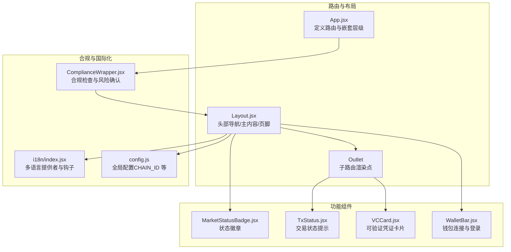
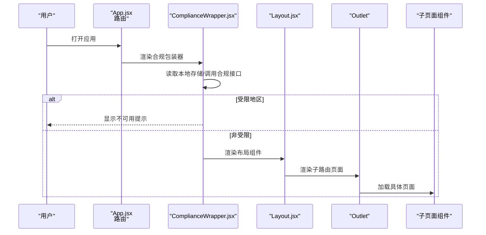
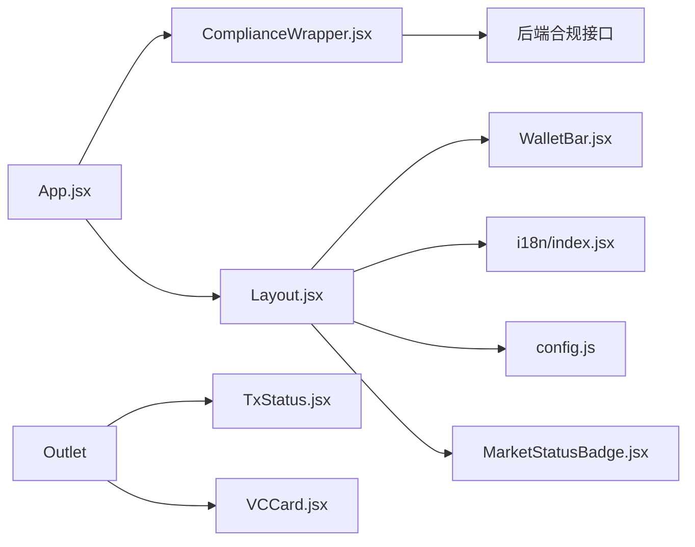

# 页面组件

<cite>
**本文引用的文件**
- [src/components/Layout.jsx](file://src/components/Layout.jsx)
- [src/components/ComplianceWrapper.jsx](file://src/components/ComplianceWrapper.jsx)
- [src/components/MarketStatusBadge.jsx](file://src/components/MarketStatusBadge.jsx)
- [src/components/TxStatus.jsx](file://src/components/TxStatus.jsx)
- [src/components/VCCard.jsx](file://src/components/VCCard.jsx)
- [src/components/WalletBar.jsx](file://src/components/WalletBar.jsx)
- [src/i18n/index.jsx](file://src/i18n/index.jsx)
- [src/App.jsx](file://src/App.jsx)
- [src/config.js](file://src/config.js)
</cite>

## 目录
1. [简介](#简介)
2. [项目结构](#项目结构)
3. [核心组件](#核心组件)
4. [架构总览](#架构总览)
5. [详细组件分析](#详细组件分析)
6. [依赖关系分析](#依赖关系分析)
7. [性能考量](#性能考量)
8. [故障排查指南](#故障排查指南)
9. [结论](#结论)
10. [附录](#附录)

## 简介
本文件面向页面组件系统，聚焦于可复用UI组件的设计理念、属性接口与使用场景。重点覆盖以下组件：
- Layout 布局组件：统一导航、主内容区与页脚，承载国际化与钱包状态展示。
- MarketStatusBadge 状态徽章：按市场状态码渲染中文标签与样式。
- ComplianceWrapper 合规包装器：在用户访问前进行地理围栏检查与风险确认，决定是否放行。
- 其他配套组件：TxStatus 交易状态提示、VCCard 可验证凭证卡片、WalletBar 钱包栏。

文档提供 props 定义、事件处理、样式定制建议、组合使用模式、完整使用示例与最佳实践，帮助开发者快速理解与正确集成这些组件。

## 项目结构
页面组件位于 src/components 下，围绕路由与页面布局组织；国际化与配置分别位于 src/i18n 与 src/config；根路由 App.jsx 将合规包装器与页面布局串联起来，形成“先合规、后布局”的访问控制链路。

图表来源
- [src/App.jsx](file://src/App.jsx#L31-L66)
- [src/components/Layout.jsx](file://src/components/Layout.jsx#L14-L68)
- [src/components/ComplianceWrapper.jsx](file://src/components/ComplianceWrapper.jsx#L16-L44)
- [src/i18n/index.jsx](file://src/i18n/index.jsx#L49-L79)
- [src/config.js](file://src/config.js#L7-L22)
- [src/components/MarketStatusBadge.jsx](file://src/components/MarketStatusBadge.jsx#L18-L23)
- [src/components/TxStatus.jsx](file://src/components/TxStatus.jsx#L6-L25)
- [src/components/VCCard.jsx](file://src/components/VCCard.jsx#L6-L34)
- [src/components/WalletBar.jsx](file://src/components/WalletBar.jsx#L10-L53)

章节来源
- [src/App.jsx](file://src/App.jsx#L31-L66)
- [src/components/Layout.jsx](file://src/components/Layout.jsx#L14-L68)
- [src/components/ComplianceWrapper.jsx](file://src/components/ComplianceWrapper.jsx#L16-L44)
- [src/i18n/index.jsx](file://src/i18n/index.jsx#L49-L79)
- [src/config.js](file://src/config.js#L7-L22)

## 核心组件
本节概述四个关键组件的职责、输入输出与典型用法。

- Layout 布局组件
  - 职责：提供统一头部导航、主内容区与页脚；内嵌国际化与钱包栏；通过 Outlet 渲染子路由页面。
  - 关键点：导航项与路由路径一一对应；语言切换通过 useI18n；页脚展示 CHAIN_ID 来源于 config。
  - 章节来源
    - [src/components/Layout.jsx](file://src/components/Layout.jsx#L14-L68)

- MarketStatusBadge 状态徽章
  - 职责：根据传入的状态码渲染中文标签与样式类名。
  - 关键点：状态码映射表集中维护；未识别状态回退为原始文本与空样式。
  - 章节来源
    - [src/components/MarketStatusBadge.jsx](file://src/components/MarketStatusBadge.jsx#L18-L23)

- ComplianceWrapper 合规包装器
  - 职责：在用户进入应用前进行合规检查；若受限地区直接阻断；否则要求用户确认风险后方可继续。
  - 关键点：本地存储记录“已接受”；调用后端合规接口；失败时默认视为非受限以保证可用性。
  - 章节来源
    - [src/components/ComplianceWrapper.jsx](file://src/components/ComplianceWrapper.jsx#L16-L44)

- TxStatus 交易状态提示
  - 职责：根据交易状态显示“提交中/成功/失败”，并在存在哈希时展示交易哈希。
  - 关键点：无状态与错误时不渲染；支持在卡片容器中展示。
  - 章节来源
    - [src/components/TxStatus.jsx](file://src/components/TxStatus.jsx#L6-L25)

- VCCard 可验证凭证卡片
  - 职责：展示 VC 类型、过期时间与主题详情（JSON 格式）。
  - 关键点：对 vc_json 字符串进行安全解析；主题信息以预格式化文本展示。
  - 章节来源
    - [src/components/VCCard.jsx](file://src/components/VCCard.jsx#L6-L34)

- WalletBar 钱包栏
  - 职责：展示钱包连接状态、地址缩略、SIWE 登录与断开连接。
  - 关键点：结合 wagmi 与自定义认证钩子；断开时同时登出并断开钱包。
  - 章节来源
    - [src/components/WalletBar.jsx](file://src/components/WalletBar.jsx#L10-L53)

## 架构总览
下图展示从路由到页面布局再到各功能组件的调用链，以及合规前置检查如何影响访问流程。

图表来源
- [src/App.jsx](file://src/App.jsx#L31-L66)
- [src/components/ComplianceWrapper.jsx](file://src/components/ComplianceWrapper.jsx#L16-L44)
- [src/components/Layout.jsx](file://src/components/Layout.jsx#L14-L68)

## 详细组件分析

### Layout 布局组件
- 设计理念
  - 采用“头部导航 + 主内容 + 页脚”的经典三段式布局，确保一致的用户体验。
  - 内置国际化与钱包栏，减少页面级重复逻辑。
- 属性接口
  - 无显式 props；通过 Outlet 渲染子路由。
- 事件处理
  - 语言切换：点击按钮触发 useI18n 的 setLang。
  - 导航：使用 NavLink 控制激活态。
- 样式定制
  - 通过 className（如 header、main、footer、brand、active、lang-toggle）与外层 CSS 文件配合，实现主题化与响应式。
- 组合使用
  - 作为路由嵌套的第二层（在合规包装器之后），统一承载所有业务页面。
- 使用示例
  - 在路由中以元素形式包裹子路由，即可获得统一布局。
- 最佳实践
  - 将导航项与路由路径保持一致，便于维护。
  - 页脚信息来源于 config，确保链 ID 与部署环境一致。
  
章节来源
- [src/components/Layout.jsx](file://src/components/Layout.jsx#L14-L68)
- [src/i18n/index.jsx](file://src/i18n/index.jsx#L49-L79)
- [src/config.js](file://src/config.js#L7-L22)

### MarketStatusBadge 状态徽章
- 设计理念
  - 以状态码为中心的映射渲染，保证 UI 与业务状态的一致性。
- 属性接口
  - status: string（市场状态码）
- 事件处理
  - 无交互事件；仅渲染。
- 样式定制
  - 通过 className（如 badge-open、badge-resolved、badge-void、badge-pending）与外部样式绑定。
- 组合使用
  - 常用于市场卡片、详情页的状态标识；可与 Layout 的导航或页脚信息共同出现。
- 使用示例
  - 在市场列表页或详情页传入状态码，自动渲染对应徽章。
- 最佳实践
  - 保持状态码与后端一致；未识别状态回退策略需与后端约定。
  
章节来源
- [src/components/MarketStatusBadge.jsx](file://src/components/MarketStatusBadge.jsx#L18-L23)

### ComplianceWrapper 合规包装器
- 设计理念
  - 在路由入口处进行合规前置校验，保障业务符合监管要求。
- 属性接口
  - 无显式 props；内部通过 useEffect 执行检查。
- 事件处理
  - 本地存储键名：compliance_accepted_v1；点击“继续”写入本地存储并更新 accepted 状态。
- 样式定制
  - 受限地区提示使用 card 容器样式；可通过外部 CSS 调整宽度与间距。
- 组合使用
  - 作为最外层路由元素，包裹所有业务路由；与 Layout 协同工作。
- 使用示例
  - 在 App.jsx 中将所有业务路由置于合规包装器之下。
- 最佳实践
  - 合规接口失败时默认非受限，提升可用性；用户确认后写入本地存储，避免重复弹窗。
  
章节来源
- [src/components/ComplianceWrapper.jsx](file://src/components/ComplianceWrapper.jsx#L16-L44)
- [src/App.jsx](file://src/App.jsx#L31-L66)

### TxStatus 交易状态提示
- 设计理念
  - 在交易生命周期中提供即时反馈，增强用户信心。
- 属性接口
  - status: string | null（pending/success/error）
  - error: string | null（错误信息）
  - hash: string | null（交易哈希）
- 事件处理
  - 无交互事件；仅根据 props 渲染。
- 样式定制
  - 使用内联样式控制间距与字体大小；状态类名（如 status-ok、status-error）用于高亮。
- 组合使用
  - 通常与表单提交、钱包签名等异步操作配合使用。
- 使用示例
  - 在提交交易后传入状态与哈希，自动显示对应提示。
- 最佳实践
  - 当无状态也无错误时返回 null，避免空渲染；错误信息应简洁明确。
  
章节来源
- [src/components/TxStatus.jsx](file://src/components/TxStatus.jsx#L6-L25)

### VCCard 可验证凭证卡片
- 设计理念
  - 结构化展示 VC 的类型、过期时间与主题详情，便于审计与核验。
- 属性接口
  - credential: object（包含 credential_type、expires_at、vc_json 等字段）
- 事件处理
  - 无交互事件；仅渲染。
- 样式定制
  - 使用 card 容器与预格式化文本展示主题详情；字体大小可微调。
- 组合使用
  - 适合在个人中心、DID 身份档案等页面展示 VC 列表或详情。
- 使用示例
  - 传入 VC 对象，自动解析并渲染类型、过期时间与主题 JSON。
- 最佳实践
  - 对 vc_json 进行安全解析；解析失败时回退为空对象，避免崩溃。
  
章节来源
- [src/components/VCCard.jsx](file://src/components/VCCard.jsx#L6-L34)

### WalletBar 钱包栏
- 设计理念
  - 将钱包连接、地址展示与 SIWE 登录整合在一个组件中，降低页面复杂度。
- 属性接口
  - 无显式 props；内部通过 wagmi 与自定义认证钩子获取状态。
- 事件处理
  - 连接钱包：选择首个可用连接器并发起连接。
  - SIWE 登录：调用登录方法；加载中禁用按钮。
  - 断开连接：同时调用登出与断开钱包。
- 样式定制
  - 使用内联样式控制间距与字号；状态类名（如 status-ok）用于高亮登录状态。
- 组合使用
  - 作为 Layout 的右上角工具条，贯穿所有页面。
- 使用示例
  - 在 Layout 的 header 中直接引入 WalletBar。
- 最佳实践
  - 断开连接时同时登出，避免状态不一致；错误信息及时展示。
  
章节来源
- [src/components/WalletBar.jsx](file://src/components/WalletBar.jsx#L10-L53)

## 依赖关系分析
- 组件耦合
  - Layout 依赖国际化与配置；WalletBar 依赖 wagmi 与自定义认证钩子；ComplianceWrapper 依赖后端合规接口与本地存储。
- 直接依赖
  - App.jsx 依赖 ComplianceWrapper 与 Layout；Layout 依赖 WalletBar、i18n 与 config。
- 外部依赖
  - react-router-dom（路由与 Outlet）、wagmi（钱包钩子）、自定义认证钩子与 API 服务。
- 潜在循环依赖
  - 未发现直接循环；组件间通过 props 与上下文传递数据。
- 接口契约
  - i18n 提供 t、lang、setLang；config 提供 chainId 等；ComplianceWrapper 通过 getCompliance 返回 restricted 字段。

图表来源
- [src/App.jsx](file://src/App.jsx#L31-L66)
- [src/components/ComplianceWrapper.jsx](file://src/components/ComplianceWrapper.jsx#L16-L44)
- [src/components/Layout.jsx](file://src/components/Layout.jsx#L14-L68)
- [src/components/WalletBar.jsx](file://src/components/WalletBar.jsx#L10-L53)
- [src/i18n/index.jsx](file://src/i18n/index.jsx#L49-L79)
- [src/config.js](file://src/config.js#L7-L22)
- [src/components/MarketStatusBadge.jsx](file://src/components/MarketStatusBadge.jsx#L18-L23)
- [src/components/TxStatus.jsx](file://src/components/TxStatus.jsx#L6-L25)
- [src/components/VCCard.jsx](file://src/components/VCCard.jsx#L6-L34)

章节来源
- [src/App.jsx](file://src/App.jsx#L31-L66)
- [src/components/ComplianceWrapper.jsx](file://src/components/ComplianceWrapper.jsx#L16-L44)
- [src/components/Layout.jsx](file://src/components/Layout.jsx#L14-L68)
- [src/components/WalletBar.jsx](file://src/components/WalletBar.jsx#L10-L53)
- [src/i18n/index.jsx](file://src/i18n/index.jsx#L49-L79)
- [src/config.js](file://src/config.js#L7-L22)
- [src/components/MarketStatusBadge.jsx](file://src/components/MarketStatusBadge.jsx#L18-L23)
- [src/components/TxStatus.jsx](file://src/components/TxStatus.jsx#L6-L25)
- [src/components/VCCard.jsx](file://src/components/VCCard.jsx#L6-L34)

## 性能考量
- 渲染优化
  - i18n 使用 useMemo 缓存上下文值，避免不必要的重渲染。
  - ComplianceWrapper 在加载完成后不再重新请求，除非刷新页面。
- 交互体验
  - WalletBar 在连接/登录过程中禁用按钮，防止重复提交。
  - TxStatus 仅在有状态或错误时渲染，减少 DOM 节点。
- 样式与资源
  - 通过 className 与外部 CSS 控制样式，避免内联样式过多导致重排。
  - 页脚链 ID 来源于 config，避免运行时计算。

## 故障排查指南
- 合规检查失败
  - 现象：页面长时间显示加载或受限提示。
  - 排查：确认后端合规接口可达；若失败默认非受限；检查本地存储键名是否被篡改。
  - 章节来源
    - [src/components/ComplianceWrapper.jsx](file://src/components/ComplianceWrapper.jsx#L16-L44)

- 语言切换无效
  - 现象：点击语言切换按钮后未生效。
  - 排查：确认 useI18n 正常提供；检查本地存储键值；确认 i18n 提供者包裹范围。
  - 章节来源
    - [src/i18n/index.jsx](file://src/i18n/index.jsx#L49-L79)

- 钱包连接异常
  - 现象：连接按钮不可用或点击无反应。
  - 排查：确认 wagmi 配置；检查 connectors 列表；查看错误信息是否显示。
  - 章节来源
    - [src/components/WalletBar.jsx](file://src/components/WalletBar.jsx#L10-L53)

- 交易状态不显示
  - 现象：提交交易后无任何提示。
  - 排查：确认传入的 status、error、hash 是否正确；当均为空时组件不会渲染。
  - 章节来源
    - [src/components/TxStatus.jsx](file://src/components/TxStatus.jsx#L6-L25)

- VC 展示异常
  - 现象：主题详情未显示或报错。
  - 排查：确认 credential.vc_json 格式；解析失败会回退为空对象。
  - 章节来源
    - [src/components/VCCard.jsx](file://src/components/VCCard.jsx#L6-L34)

## 结论
页面组件系统通过清晰的职责划分与稳定的接口契约，实现了高内聚、低耦合的可复用UI层。Layout 提供统一布局与国际化支持，ComplianceWrapper 实现访问前置控制，MarketStatusBadge、TxStatus、VCCard、WalletBar 则分别覆盖状态展示、交易反馈、凭证展示与钱包交互。遵循本文的最佳实践与组合模式，可在不牺牲一致性的情况下快速扩展新页面与功能。

## 附录
- 组件属性与事件速查
  - Layout：无 props；通过 Outlet 渲染子路由。
  - MarketStatusBadge：status(string)。
  - ComplianceWrapper：无 props；内部状态包括 loading、restricted、accepted。
  - TxStatus：status(null|string)、error(null|string)、hash(null|string)。
  - VCCard：credential(object)。
  - WalletBar：无 props；内部通过 wagmi 与认证钩子管理状态。
- 样式定制建议
  - 优先使用 className 与外部 CSS；内联样式仅用于局部微调。
  - 为状态类名（如 status-ok、status-error、badge-*）提供统一的主题色与尺寸规范。
- 组合使用示例路径
  - 在 App.jsx 中将合规包装器与布局组合使用，见 [src/App.jsx](file://src/App.jsx#L31-L66)。
  - 在 Layout 中引入 WalletBar 与国际化，见 [src/components/Layout.jsx](file://src/components/Layout.jsx#L14-L68)。
  - 在任意页面中使用 MarketStatusBadge、TxStatus、VCCard，参考对应文件的 props 说明。