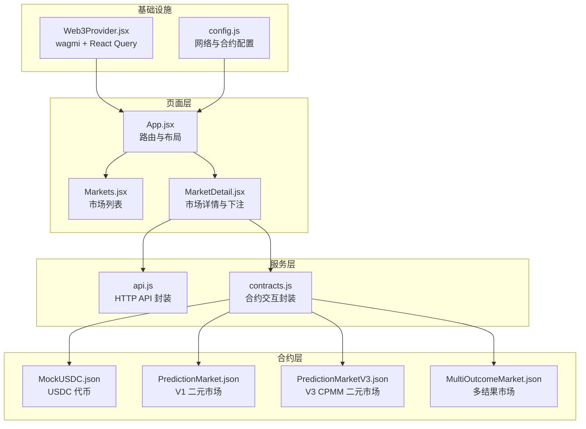
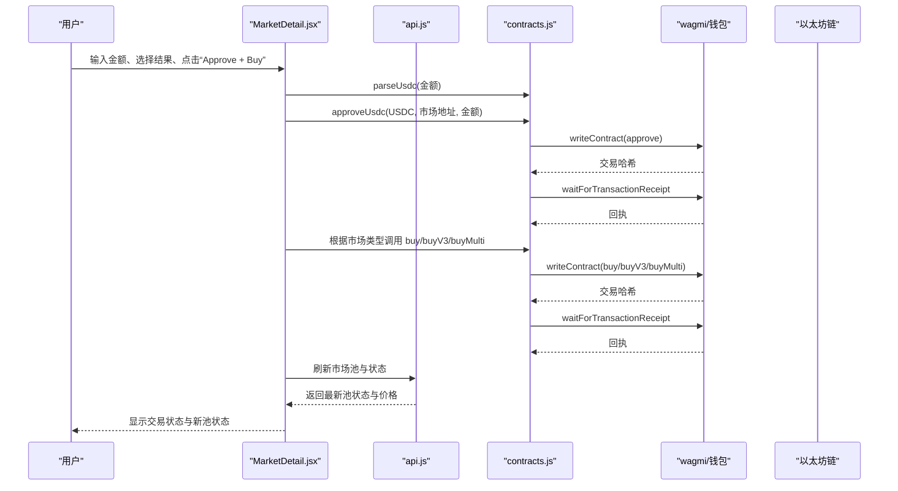
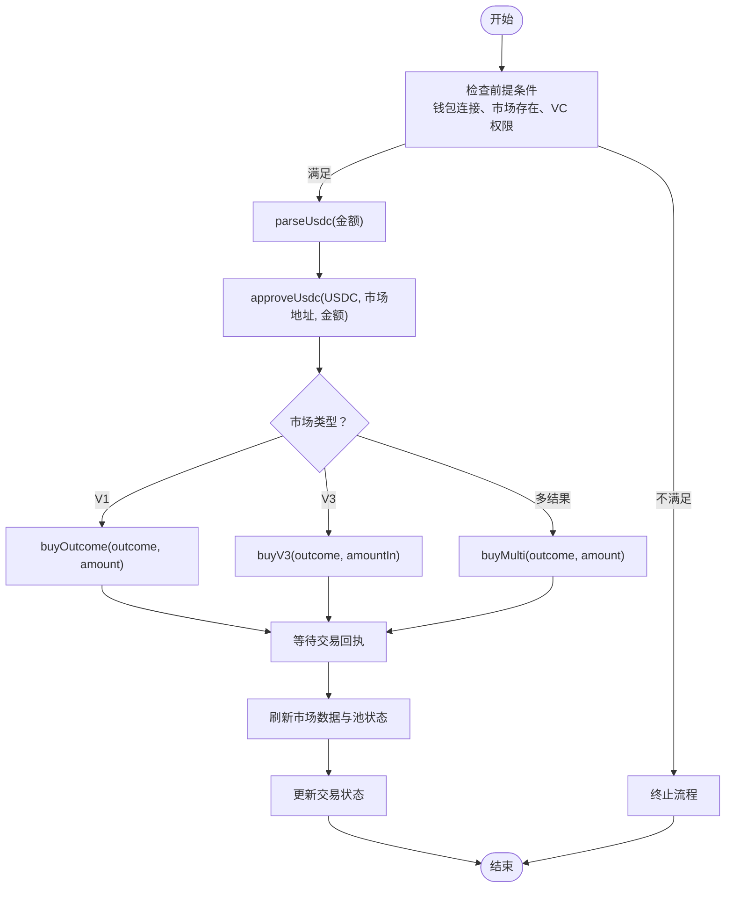
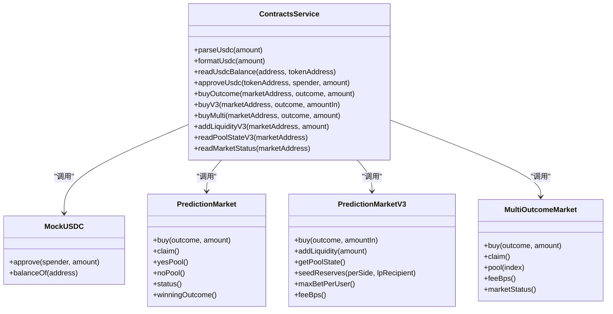
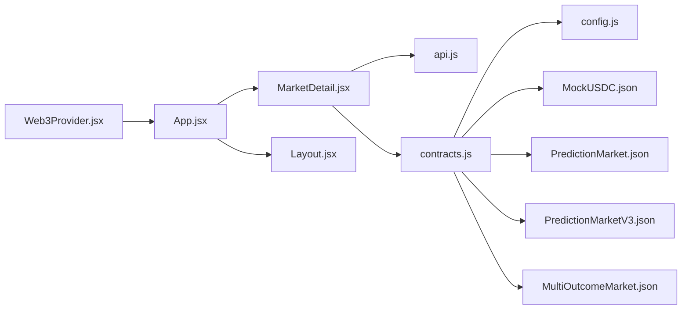

# 市场交易与下注

<cite>
**本文档引用的文件**
- [App.jsx](file://src/App.jsx)
- [Web3Provider.jsx](file://src/providers/Web3Provider.jsx)
- [config.js](file://src/config.js)
- [Markets.jsx](file://src/pages/Markets.jsx)
- [MarketDetail.jsx](file://src/pages/MarketDetail.jsx)
- [TxStatus.jsx](file://src/components/TxStatus.jsx)
- [useAuth.js](file://src/hooks/useAuth.js)
- [api.js](file://src/services/api.js)
- [contracts.js](file://src/services/contracts.js)
- [MockUSDC.json](file://src/abis/MockUSDC.json)
- [PredictionMarket.json](file://src/abis/PredictionMarket.json)
- [PredictionMarketV3.json](file://src/abis/PredictionMarketV3.json)
- [MultiOutcomeMarket.json](file://src/abis/MultiOutcomeMarket.json)
</cite>

## 目录
1. [简介](#简介)
2. [项目结构](#项目结构)
3. [核心组件](#核心组件)
4. [架构总览](#架构总览)
5. [详细组件分析](#详细组件分析)
6. [依赖关系分析](#依赖关系分析)
7. [性能考虑](#性能考虑)
8. [故障排除指南](#故障排除指南)
9. [结论](#结论)

## 简介
本文件面向预测市场前端用户与开发者，系统性阐述“市场交易与下注”功能的实现机制与使用流程。内容涵盖：
- 用户如何在预测市场中进行下注（Yes/No 选择、金额输入、交易确认）
- 交易执行机制、价格计算、流动性池影响与交易费用结构
- 下注限额、资金锁定与交易历史记录
- 完整的交易流程示例与风险控制措施

## 项目结构
该前端采用模块化组织，围绕“页面组件 + 服务层 + 合约交互 + 配置”的分层设计：
- 页面层：市场列表、市场详情、个人中心等
- 服务层：API 封装、合约交互封装
- 合约层：ABI 定义（MockUSDC、V1/V3 二元市场、多结果市场）
- 配置层：网络、合约地址、SIWE 等配置

图表来源
- [App.jsx](file://src/App.jsx#L31-L66)
- [Web3Provider.jsx](file://src/providers/Web3Provider.jsx#L16-L24)
- [config.js](file://src/config.js#L7-L22)
- [Markets.jsx](file://src/pages/Markets.jsx#L14-L55)
- [MarketDetail.jsx](file://src/pages/MarketDetail.jsx#L31-L184)
- [api.js](file://src/services/api.js#L29-L55)
- [contracts.js](file://src/services/contracts.js#L1-L214)
- [MockUSDC.json](file://src/abis/MockUSDC.json)
- [PredictionMarket.json](file://src/abis/PredictionMarket.json#L1-L347)
- [PredictionMarketV3.json](file://src/abis/PredictionMarketV3.json#L1-L581)
- [MultiOutcomeMarket.json](file://src/abis/MultiOutcomeMarket.json#L1-L362)

章节来源
- [App.jsx](file://src/App.jsx#L31-L66)
- [Web3Provider.jsx](file://src/providers/Web3Provider.jsx#L16-L24)
- [config.js](file://src/config.js#L7-L22)

## 核心组件
- 市场列表页：展示市场问题、对阵信息、池金额与状态，支持跳转至详情页
- 市场详情页：展示市场详情、池状态、价格、下注表单与交易状态反馈
- 合约交互服务：封装 approve、buy、buyV3、buyMulti、readPoolStateV3、readMarketStatus 等
- API 服务：封装市场列表、详情、池状态、订单簿等 HTTP 接口
- 交易状态组件：统一展示 pending/success/error 与交易哈希

章节来源
- [Markets.jsx](file://src/pages/Markets.jsx#L14-L55)
- [MarketDetail.jsx](file://src/pages/MarketDetail.jsx#L31-L184)
- [contracts.js](file://src/services/contracts.js#L59-L213)
- [api.js](file://src/services/api.js#L82-L186)
- [TxStatus.jsx](file://src/components/TxStatus.jsx#L6-L25)

## 架构总览
前端通过 wagmi 与区块链交互，通过 React Query 缓存 API 数据；合约交互通过 viem 的 readContract/writeContract 实现，交易回执通过 waitForTransactionReceipt 等待确认。

图表来源
- [MarketDetail.jsx](file://src/pages/MarketDetail.jsx#L78-L110)
- [contracts.js](file://src/services/contracts.js#L59-L142)
- [api.js](file://src/services/api.js#L82-L186)

## 详细组件分析

### 市场详情页（MarketDetail）——下注流程与状态管理
- 输入与校验：金额输入、结果选择、钱包连接状态、访问控制（VC）检查
- 执行顺序：parseUsdc → approveUsdc → buy/buyV3/buyMulti → 刷新数据 → 更新交易状态
- 价格与池状态：链上 V3 池状态（reserveYes/reserveNo/priceYesBps），API 池快照价格
- 交易状态反馈：TxStatus 组件统一展示 pending/success/error 与交易哈希

图表来源
- [MarketDetail.jsx](file://src/pages/MarketDetail.jsx#L78-L110)
- [contracts.js](file://src/services/contracts.js#L59-L142)

章节来源
- [MarketDetail.jsx](file://src/pages/MarketDetail.jsx#L31-L184)
- [TxStatus.jsx](file://src/components/TxStatus.jsx#L6-L25)

### 合约交互服务（contracts.js）——交易执行与价格读取
- USDC 金额解析与格式化：parseUsdc/formatUsdc（小数位 6）
- 授权与购买：approveUsdc、buyOutcome、buyV3、buyMulti
- 链上状态读取：readMarketStatus（V1）、readPoolStateV3（V3）
- 余额查询：readUsdcBalance
- 添加流动性：addLiquidityV3（用于流动性提供者）

图表来源
- [contracts.js](file://src/services/contracts.js#L24-L213)
- [MockUSDC.json](file://src/abis/MockUSDC.json)
- [PredictionMarket.json](file://src/abis/PredictionMarket.json#L127-L344)
- [PredictionMarketV3.json](file://src/abis/PredictionMarketV3.json#L179-L579)
- [MultiOutcomeMarket.json](file://src/abis/MultiOutcomeMarket.json#L125-L360)

章节来源
- [contracts.js](file://src/services/contracts.js#L24-L213)

### API 服务（api.js）——数据获取与认证
- 通用请求封装：自动注入 Authorization、处理非 2xx 响应
- 市场相关：listMarkets/getMarket/getMarketPool/getMarketOrderbook
- 认证与合规：siweAuth/bindDid/myCredentials/verifyVC/getCompliance
- 平台统计：getPlatformStats
- 健康与就绪检查：getHealth/getReady

章节来源
- [api.js](file://src/services/api.js#L29-L186)

### 交易状态组件（TxStatus）——统一反馈
- 展示 pending/success/error 三种状态
- 成功时显示交易哈希，便于追踪

章节来源
- [TxStatus.jsx](file://src/components/TxStatus.jsx#L6-L25)

### 配置与提供者（config.js、Web3Provider.jsx）
- config.js：API 地址、链 ID、MockUSDC 地址、SIWE 域名与 URI
- Web3Provider.jsx：wagmi + React Query 提供者，为全应用注入区块链与缓存能力

章节来源
- [config.js](file://src/config.js#L7-L22)
- [Web3Provider.jsx](file://src/providers/Web3Provider.jsx#L16-L24)

## 依赖关系分析
- 页面组件依赖服务层：MarketDetail 依赖 api.js 与 contracts.js
- 服务层依赖配置与 ABI：contracts.js 依赖 wagmi 配置与各合约 ABI
- 前端路由与布局：App.jsx 定义路由，Web3Provider.jsx 提供上下文

图表来源
- [MarketDetail.jsx](file://src/pages/MarketDetail.jsx#L10-L19)
- [api.js](file://src/services/api.js#L29-L55)
- [contracts.js](file://src/services/contracts.js#L1-L14)
- [config.js](file://src/config.js#L7-L22)
- [App.jsx](file://src/App.jsx#L31-L66)
- [Web3Provider.jsx](file://src/providers/Web3Provider.jsx#L16-L24)

章节来源
- [App.jsx](file://src/App.jsx#L31-L66)
- [Web3Provider.jsx](file://src/providers/Web3Provider.jsx#L16-L24)
- [config.js](file://src/config.js#L7-L22)

## 性能考虑
- 并行读取：readMarketStatus 使用 Promise.all 并行获取状态、获胜结果、池金额，减少等待时间
- 数据缓存：React Query 提供请求缓存与失效策略，降低重复请求开销
- 事件监听：合约事件（如 Bought、LiquidityAdded）可用于触发 UI 更新，避免轮询

章节来源
- [contracts.js](file://src/services/contracts.js#L185-L212)

## 故障排除指南
- 交易失败：检查错误信息（shortMessage/message），确认钱包签名、授权额度、链上状态
- 无法连接钱包：确认 wagmi 配置与网络 ID，检查 MetaMask/钱包插件
- 市场不可下注：检查市场状态（OPEN/RESOLVED/VOIDED）、VC 权限、截止时间
- 价格异常：对比链上 getPoolState 与 API 池快照，确认数据同步状态

章节来源
- [MarketDetail.jsx](file://src/pages/MarketDetail.jsx#L106-L109)
- [TxStatus.jsx](file://src/components/TxStatus.jsx#L12-L16)

## 结论
该前端实现了从市场浏览到下注下单的完整闭环：用户在市场详情页选择结果与金额，前端完成 USDC 授权与购买调用，随后通过 API 与链上数据刷新展示最新池状态与价格。V3 市场引入 CPMM 机制，价格由流动性池的储备量决定；多结果市场支持更多 outcome；交易费用与下注限额在合约层面体现。配合统一的交易状态反馈与合规检查，为用户提供安全、透明、可追溯的预测市场体验。