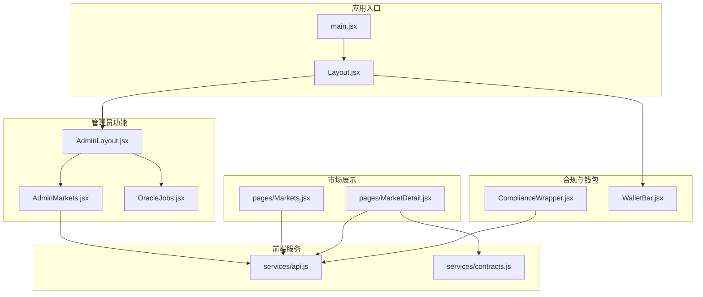
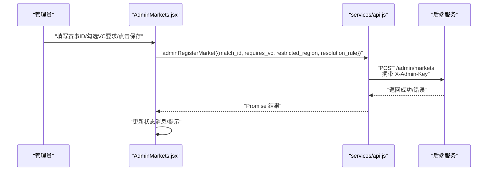
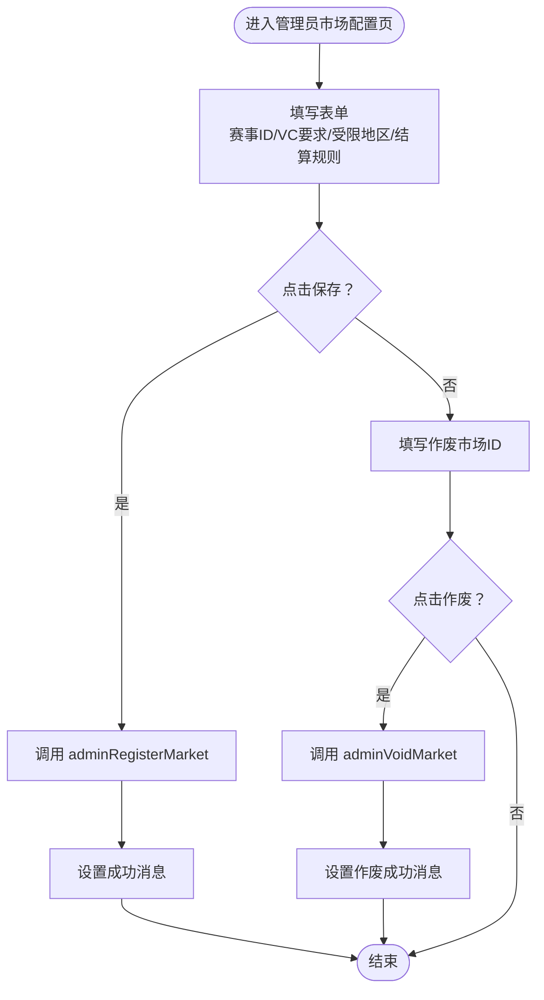
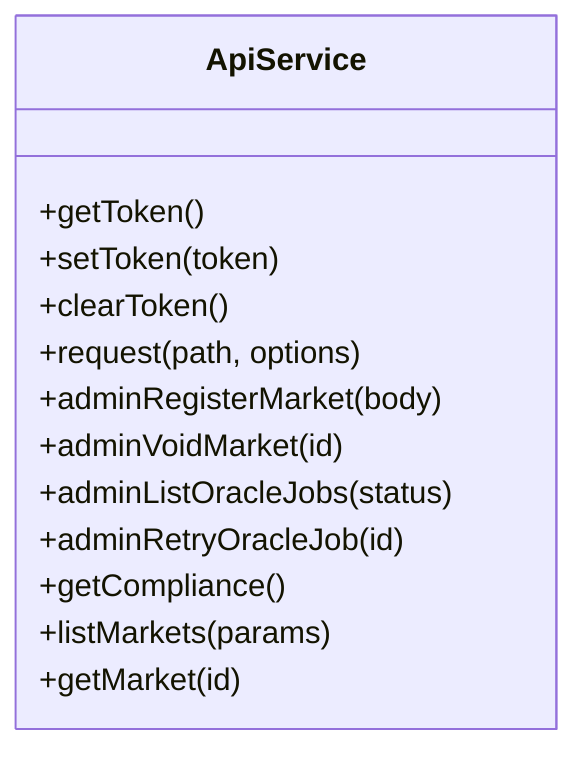
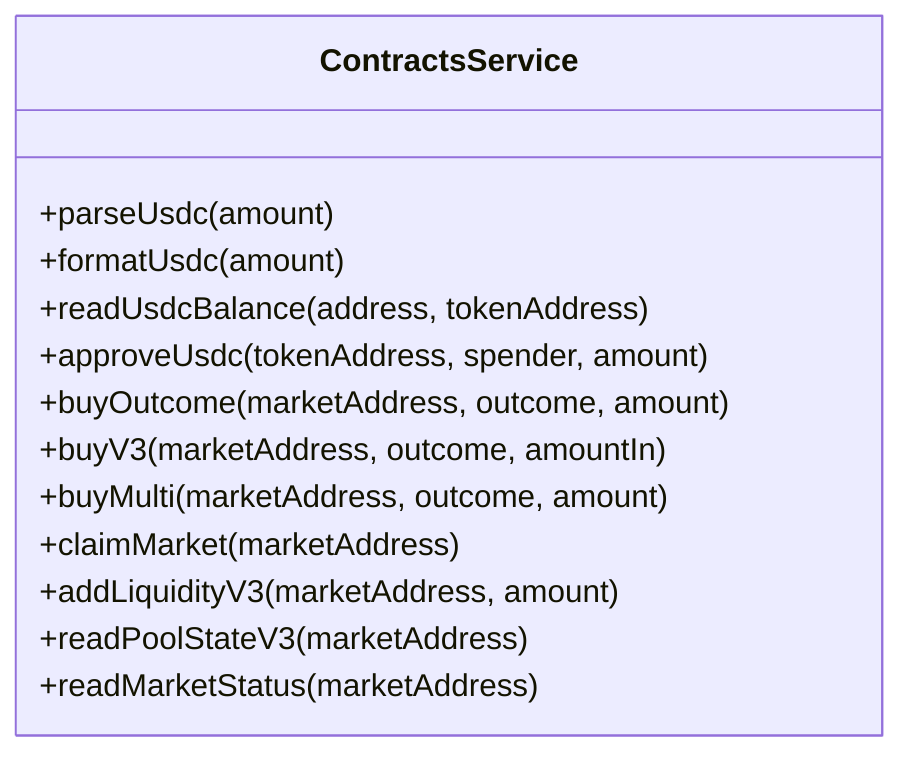
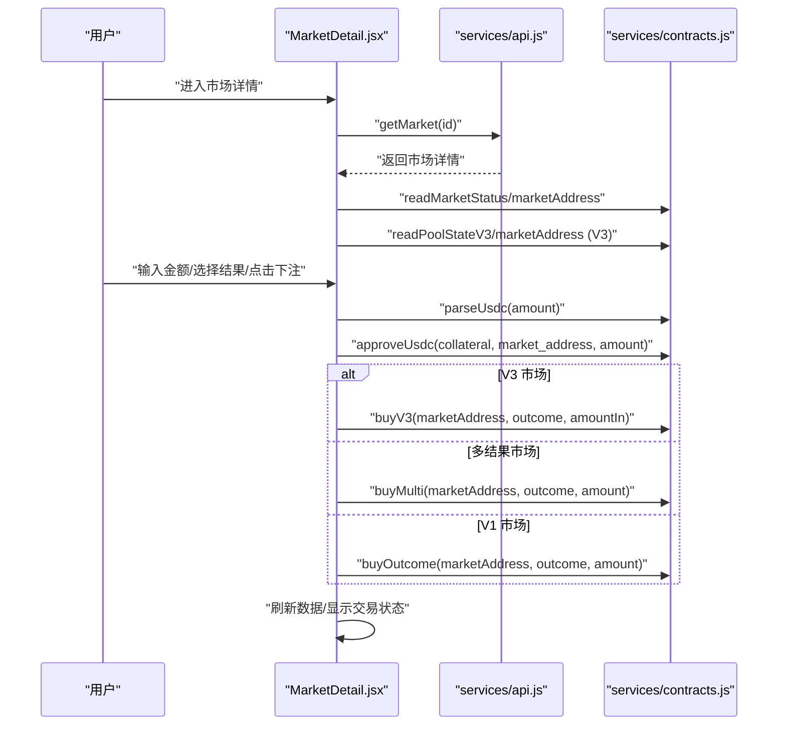
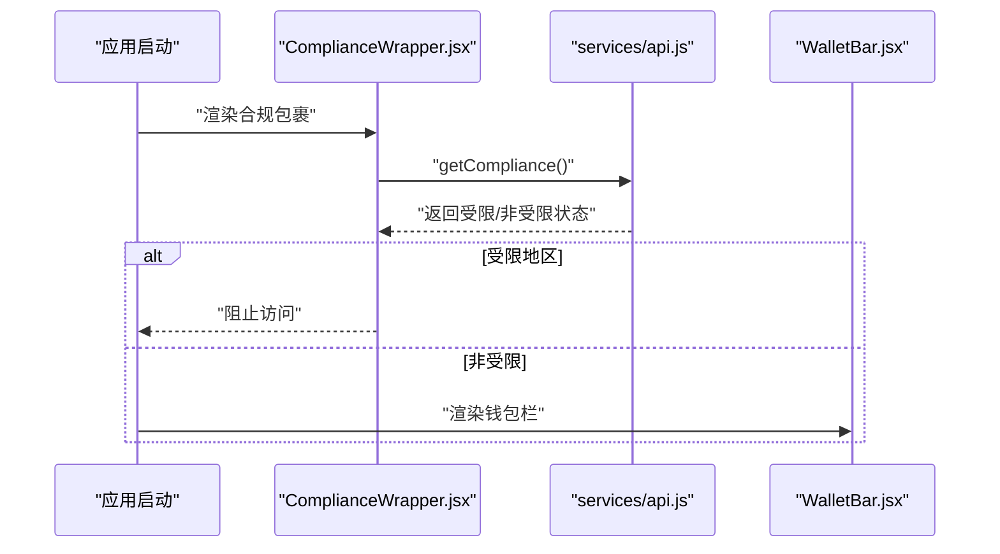
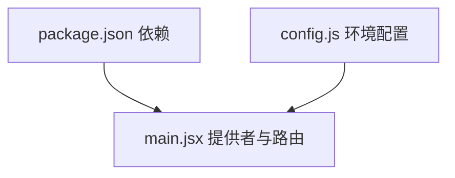

# 市场创建与配置

<cite>
**本文档引用的文件**
- [src/pages/admin/AdminMarkets.jsx](file://src/pages/admin/AdminMarkets.jsx)
- [src/services/api.js](file://src/services/api.js)
- [src/services/contracts.js](file://src/services/contracts.js)
- [src/components/ComplianceWrapper.jsx](file://src/components/ComplianceWrapper.jsx)
- [src/pages/admin/AdminLayout.jsx](file://src/pages/admin/AdminLayout.jsx)
- [src/pages/admin/OracleJobs.jsx](file://src/pages/admin/OracleJobs.jsx)
- [src/components/Layout.jsx](file://src/components/Layout.jsx)
- [src/pages/Markets.jsx](file://src/pages/Markets.jsx)
- [src/pages/MarketDetail.jsx](file://src/pages/MarketDetail.jsx)
- [src/components/WalletBar.jsx](file://src/components/WalletBar.jsx)
- [src/main.jsx](file://src/main.jsx)
- [src/config.js](file://src/config.js)
- [package.json](file://package.json)
</cite>

## 目录
1. [简介](#简介)
2. [项目结构](#项目结构)
3. [核心组件](#核心组件)
4. [架构总览](#架构总览)
5. [详细组件分析](#详细组件分析)
6. [依赖关系分析](#依赖关系分析)
7. [性能考虑](#性能考虑)
8. [故障排除指南](#故障排除指南)
9. [结论](#结论)
10. [附录](#附录)

## 简介
本文件面向管理员，系统性阐述“市场创建与配置”的完整流程与实现细节。内容涵盖：
- 管理员如何创建/登记预测市场规则、设置合规与结算参数
- 前端界面实现、表单与交互逻辑
- 与后端 API 的交互方式与错误处理
- 市场配置项（如受限地区、结算规则）、时间限制、VC 凭证要求
- 市场审核与作废机制
- 完整创建流程示例与常见配置场景

## 项目结构
该前端采用 React + Vite 架构，路由基于 react-router-dom，Web3 钱包交互通过 wagmi/viem 实现。管理员功能位于 `/admin` 子路由，核心业务组件分布如下：
- 管理后台布局与页面：AdminLayout、AdminMarkets、OracleJobs
- 前端 API 封装：services/api.js
- 合约交互封装：services/contracts.js
- 全局布局与导航：components/Layout.jsx、pages/Markets.jsx、pages/MarketDetail.jsx
- 合规检查：components/ComplianceWrapper.jsx
- 钱包栏：components/WalletBar.jsx
- 应用入口与提供者：main.jsx、config.js

图表来源
- [src/main.jsx](file://src/main.jsx#L17-L32)
- [src/components/Layout.jsx](file://src/components/Layout.jsx#L14-L68)
- [src/pages/admin/AdminLayout.jsx](file://src/pages/admin/AdminLayout.jsx#L8-L32)
- [src/pages/admin/AdminMarkets.jsx](file://src/pages/admin/AdminMarkets.jsx#L10-L89)
- [src/pages/admin/OracleJobs.jsx](file://src/pages/admin/OracleJobs.jsx#L10-L67)
- [src/services/api.js](file://src/services/api.js#L29-L187)
- [src/services/contracts.js](file://src/services/contracts.js#L1-L214)
- [src/pages/Markets.jsx](file://src/pages/Markets.jsx#L14-L56)
- [src/pages/MarketDetail.jsx](file://src/pages/MarketDetail.jsx#L31-L185)
- [src/components/ComplianceWrapper.jsx](file://src/components/ComplianceWrapper.jsx#L16-L44)
- [src/components/WalletBar.jsx](file://src/components/WalletBar.jsx#L10-L54)

章节来源
- [src/main.jsx](file://src/main.jsx#L17-L32)
- [src/components/Layout.jsx](file://src/components/Layout.jsx#L14-L68)
- [src/pages/admin/AdminLayout.jsx](file://src/pages/admin/AdminLayout.jsx#L8-L32)

## 核心组件
- 管理员市场配置页：提供“登记/更新市场规则”和“作废市场”两大功能，支持输入赛事 ID、勾选 VC 凭证要求、输入市场 ID 作废等。
- 管理员 API 封装：统一处理请求头（含管理员密钥）、错误响应与数据解析；提供市场规则登记、作废、预言机任务管理等方法。
- 合约交互封装：封装 USDC 授权、购买、流动性添加、池状态读取等链上操作。
- 市场列表与详情：展示市场状态、池金额、截止时间、VC 访问控制等，并支持下注。
- 合规检查：在用户访问前进行地理围栏与风险确认检查。
- 钱包栏：集成钱包连接、SIWE 登录、登出与断开。

章节来源
- [src/pages/admin/AdminMarkets.jsx](file://src/pages/admin/AdminMarkets.jsx#L10-L89)
- [src/services/api.js](file://src/services/api.js#L29-L187)
- [src/services/contracts.js](file://src/services/contracts.js#L24-L214)
- [src/pages/Markets.jsx](file://src/pages/Markets.jsx#L14-L56)
- [src/pages/MarketDetail.jsx](file://src/pages/MarketDetail.jsx#L31-L185)
- [src/components/ComplianceWrapper.jsx](file://src/components/ComplianceWrapper.jsx#L16-L44)
- [src/components/WalletBar.jsx](file://src/components/WalletBar.jsx#L10-L54)

## 架构总览
管理员市场创建与配置涉及三层协作：
- 前端界面层：AdminMarkets.jsx 提供表单与交互
- API 服务层：services/api.js 封装管理员接口与通用请求
- 合约交互层：services/contracts.js 封装链上操作

图表来源
- [src/pages/admin/AdminMarkets.jsx](file://src/pages/admin/AdminMarkets.jsx#L21-L36)
- [src/services/api.js](file://src/services/api.js#L151-L158)

章节来源
- [src/pages/admin/AdminMarkets.jsx](file://src/pages/admin/AdminMarkets.jsx#L21-L36)
- [src/services/api.js](file://src/services/api.js#L151-L158)

## 详细组件分析

### 管理员市场配置页（AdminMarkets）
- 功能要点
  - 登记/更新市场规则：输入赛事 ID、勾选是否需要 VC 凭证、设置受限地区、结算规则
  - 作废市场：输入市场 ID 触发作废操作
  - 管理员鉴权：通过 sessionStorage 中的管理员 API Key 注入请求头
- 表单与状态
  - 使用 useState 维护 matchId、requiresVC、voidId、msg
  - 保存按钮触发 adminRegisterMarket，作废按钮触发 adminVoidMarket
- 错误处理
  - try/catch 包裹异步操作，捕获异常并显示错误消息

图表来源
- [src/pages/admin/AdminMarkets.jsx](file://src/pages/admin/AdminMarkets.jsx#L10-L89)

章节来源
- [src/pages/admin/AdminMarkets.jsx](file://src/pages/admin/AdminMarkets.jsx#L10-L89)

### 管理员 API 封装（services/api.js）
- 通用请求封装
  - request 函数统一处理请求头（Content-Type、Authorization）、错误响应与 JSON 解析
  - 支持 GET/POST 等方法，自动拼接 config.apiUrl
- 管理员接口
  - adminRegisterMarket：POST /admin/markets，携带 X-Admin-Key
  - adminVoidMarket：POST /admin/markets/{id}/void，携带 X-Admin-Key
  - adminListOracleJobs、adminRetryOracleJob：用于查看与重试预言机任务
- 其他接口
  - 市场列表/详情、用户持仓、VC 验证、合规限制等

图表来源
- [src/services/api.js](file://src/services/api.js#L29-L187)

章节来源
- [src/services/api.js](file://src/services/api.js#L29-L187)

### 合约交互封装（services/contracts.js）
- USDC 金额处理
  - parseUsdc：将人类可读金额解析为链上整数（6 位小数）
  - formatUsdc：将链上金额格式化为字符串
- 钱包授权与购买
  - approveUsdc：授权 USDC 给市场合约
  - buyOutcome/buyV3/buyMulti：根据市场类型调用不同合约方法
- 池状态读取
  - readPoolStateV3：读取 V3 市场池状态（储备量、价格）
  - readMarketStatus：读取 V1 市场状态（状态码、获胜结果、池金额）

图表来源
- [src/services/contracts.js](file://src/services/contracts.js#L24-L214)

章节来源
- [src/services/contracts.js](file://src/services/contracts.js#L24-L214)

### 市场列表与详情（Markets、MarketDetail）
- 市场列表
  - 通过 listMarkets 获取市场列表，展示问题、对阵、池金额与状态
- 市场详情
  - 通过 getMarket 获取详情，结合 readMarketStatus/readPoolStateV3 读取链上状态
  - 支持 VC 访问控制：若 requires_vc 且未允许，则隐藏下注入口
  - 下注流程：parseUsdc → approveUsdc → buyX → 刷新数据

图表来源
- [src/pages/MarketDetail.jsx](file://src/pages/MarketDetail.jsx#L55-L110)
- [src/services/api.js](file://src/services/api.js#L89-L91)
- [src/services/contracts.js](file://src/services/contracts.js#L78-L142)

章节来源
- [src/pages/Markets.jsx](file://src/pages/Markets.jsx#L14-L56)
- [src/pages/MarketDetail.jsx](file://src/pages/MarketDetail.jsx#L31-L185)
- [src/services/api.js](file://src/services/api.js#L89-L91)
- [src/services/contracts.js](file://src/services/contracts.js#L78-L142)

### 合规检查与钱包集成
- 合规检查
  - ComplianceWrapper 在应用启动时调用 getCompliance，若受限地区直接阻断访问
- 钱包与认证
  - WalletBar 集成 wagmi 钱包钩子，支持连接、断开、SIWE 登录与登出

图表来源
- [src/components/ComplianceWrapper.jsx](file://src/components/ComplianceWrapper.jsx#L21-L30)
- [src/services/api.js](file://src/services/api.js#L168-L171)
- [src/components/WalletBar.jsx](file://src/components/WalletBar.jsx#L10-L54)

章节来源
- [src/components/ComplianceWrapper.jsx](file://src/components/ComplianceWrapper.jsx#L16-L44)
- [src/components/WalletBar.jsx](file://src/components/WalletBar.jsx#L10-L54)

### 管理后台布局与预言机任务
- AdminLayout
  - 提供管理员入口导航（Oracle 队列、市场配置），并在未设置管理员 Key 时提示
- OracleJobs
  - 定时轮询预言机任务列表，支持手动重试“需要人工审核”的任务

章节来源
- [src/pages/admin/AdminLayout.jsx](file://src/pages/admin/AdminLayout.jsx#L8-L32)
- [src/pages/admin/OracleJobs.jsx](file://src/pages/admin/OracleJobs.jsx#L10-L67)

## 依赖关系分析
- 前端依赖
  - React、react-router-dom、wagmi、viem、@tanstack/react-query
- 配置
  - config.js 从环境变量读取 API 地址、链 ID、合约地址等
- 路由与提供者
  - main.jsx 中注入 I18nProvider、Web3Provider、BrowserRouter

图表来源
- [package.json](file://package.json#L12-L29)
- [src/config.js](file://src/config.js#L1-L23)
- [src/main.jsx](file://src/main.jsx#L17-L32)

章节来源
- [package.json](file://package.json#L12-L29)
- [src/config.js](file://src/config.js#L1-L23)
- [src/main.jsx](file://src/main.jsx#L17-L32)

## 性能考虑
- 并行读取链上状态：readMarketStatus 内部使用 Promise.all 并行获取状态、获胜结果与池金额，减少等待时间
- 定时刷新：OracleJobs 使用定时器每 10 秒刷新任务列表，避免频繁轮询带来的压力
- 金额解析与格式化：parseUsdc/formatUsdc 使用 viem 的高精度工具，避免浮点误差

章节来源
- [src/services/contracts.js](file://src/services/contracts.js#L185-L212)
- [src/pages/admin/OracleJobs.jsx](file://src/pages/admin/OracleJobs.jsx#L24-L31)

## 故障排除指南
- 管理员 Key 未设置
  - 现象：AdminLayout 提示在控制台设置 sessionStorage.admin_key
  - 处理：在浏览器控制台执行设置命令后再刷新页面
- 请求失败
  - 现象：API 返回非 2xx 状态，request 抛出错误
  - 处理：检查后端服务健康状态、网络连通性与管理员 Key 正确性
- 合规限制
  - 现象：ComplianceWrapper 显示服务不可用
  - 处理：确认所在地区不在受限范围，或联系管理员调整策略
- 钱包未连接或未登录
  - 现象：MarketDetail 下注按钮禁用或受限市场提示
  - 处理：连接钱包并完成 SIWE 登录，必要时申请 VC 凭证

章节来源
- [src/pages/admin/AdminLayout.jsx](file://src/pages/admin/AdminLayout.jsx#L15-L20)
- [src/services/api.js](file://src/services/api.js#L49-L54)
- [src/components/ComplianceWrapper.jsx](file://src/components/ComplianceWrapper.jsx#L34-L44)
- [src/pages/MarketDetail.jsx](file://src/pages/MarketDetail.jsx#L78-L82)

## 结论
本项目通过清晰的分层设计实现了管理员对预测市场的创建与配置能力：前端提供直观的表单与交互，API 层负责与后端通信与鉴权，合约层完成链上操作。配合合规检查与钱包认证，保障了市场创建与交易的安全与可控。建议在生产环境中进一步完善表单校验、错误提示与日志记录，以提升用户体验与运维效率。

## 附录

### 市场创建与配置流程示例
- 步骤 1：在 AdminLayout 中进入“市场配置”
- 步骤 2：在 AdminMarkets 表单中填写赛事 ID，勾选是否需要 VC 凭证，设置受限地区与结算规则
- 步骤 3：点击“保存”，调用 adminRegisterMarket 完成规则登记
- 步骤 4：在 Markets 页面查看新市场状态
- 步骤 5：如需作废，回到 AdminMarkets 输入市场 ID 并点击“VOID”

章节来源
- [src/pages/admin/AdminLayout.jsx](file://src/pages/admin/AdminLayout.jsx#L22-L27)
- [src/pages/admin/AdminMarkets.jsx](file://src/pages/admin/AdminMarkets.jsx#L56-L71)
- [src/services/api.js](file://src/services/api.js#L151-L158)
- [src/pages/Markets.jsx](file://src/pages/Markets.jsx#L20-L25)

### 常见配置场景
- 二元市场（V1/V3）：设置结算规则为“主队获胜”等，支持 VC 凭证访问控制
- 多结果市场：outcome_count > 2，支持多选项下注
- 时间限制：通过 end_time 控制市场截止时间
- 保证金与流动性：V3 市场可通过 addLiquidityV3 注入流动性，池状态通过 readPoolStateV3 获取
- 审核机制：OracleJobs 展示“需要人工审核”的任务并支持重试

章节来源
- [src/pages/MarketDetail.jsx](file://src/pages/MarketDetail.jsx#L117-L151)
- [src/services/contracts.js](file://src/services/contracts.js#L150-L176)
- [src/pages/admin/OracleJobs.jsx](file://src/pages/admin/OracleJobs.jsx#L56-L61)