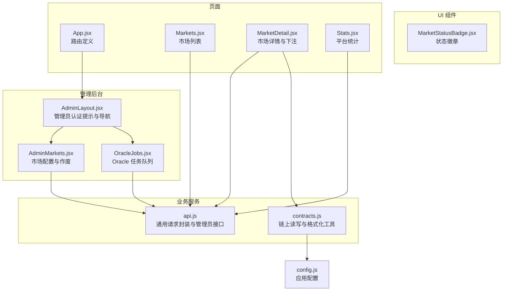
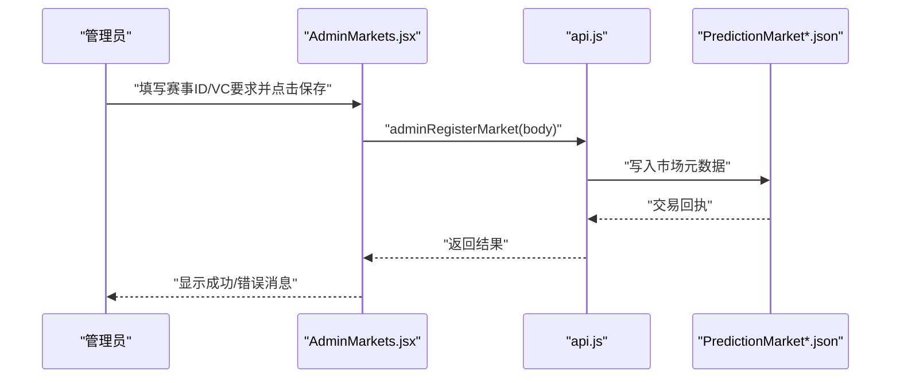
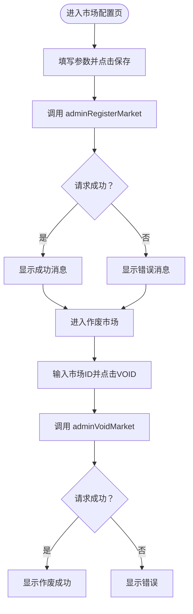
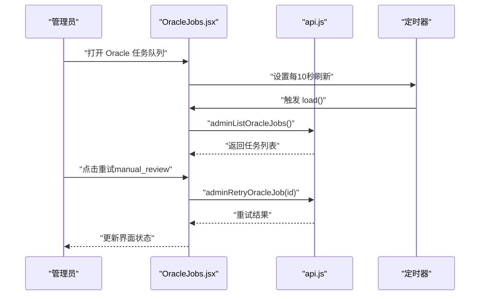
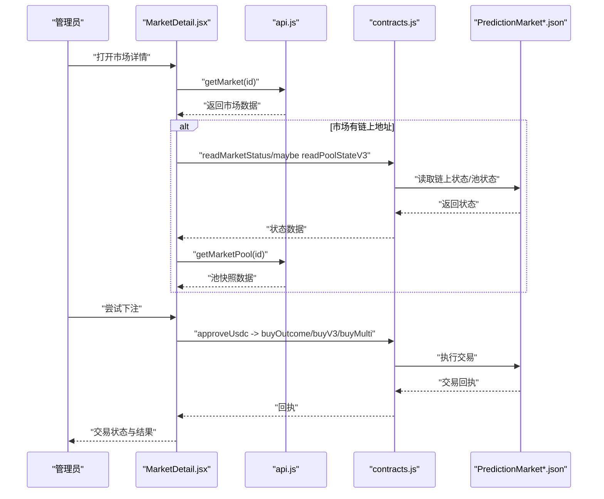
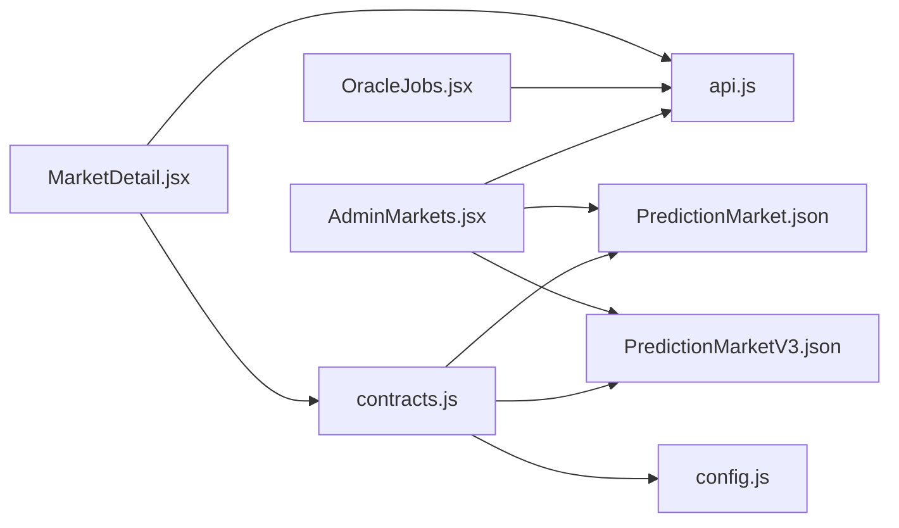

# 市场管理与监控

<cite>
**本文档引用的文件**
- [src/pages/admin/AdminMarkets.jsx](file://src/pages/admin/AdminMarkets.jsx)
- [src/pages/admin/AdminLayout.jsx](file://src/pages/admin/AdminLayout.jsx)
- [src/pages/admin/OracleJobs.jsx](file://src/pages/admin/OracleJobs.jsx)
- [src/services/api.js](file://src/services/api.js)
- [src/services/contracts.js](file://src/services/contracts.js)
- [src/components/MarketStatusBadge.jsx](file://src/components/MarketStatusBadge.jsx)
- [src/pages/Stats.jsx](file://src/pages/Stats.jsx)
- [src/pages/Markets.jsx](file://src/pages/Markets.jsx)
- [src/pages/MarketDetail.jsx](file://src/pages/MarketDetail.jsx)
- [src/App.jsx](file://src/App.jsx)
- [src/config.js](file://src/config.js)
- [src/abis/PredictionMarket.json](file://src/abis/PredictionMarket.json)
- [src/abis/PredictionMarketV3.json](file://src/abis/PredictionMarketV3.json)
- [src/abis/MarketFactory.json](file://src/abis/MarketFactory.json)
</cite>

## 目录
1. [简介](#简介)
2. [项目结构](#项目结构)
3. [核心组件](#核心组件)
4. [架构总览](#架构总览)
5. [详细组件分析](#详细组件分析)
6. [依赖关系分析](#依赖关系分析)
7. [性能考量](#性能考量)
8. [故障排查指南](#故障排查指南)
9. [结论](#结论)
10. [附录](#附录)

## 简介
本文件面向管理员，系统性说明市场管理与监控功能，涵盖以下主题：
- 监控市场状态与健康状况
- 管理市场配置（注册/更新规则、作废市场）
- 处理异常与重试（Oracle 任务队列）
- 参数调整与合规检查
- 市场统计分析与风险控制
- 管理员操作指南与监控仪表板使用说明

## 项目结构
前端采用 React + Vite 架构，路由通过 React Router v6 管理；管理员功能位于 `/admin` 嵌套路由下，通过 AdminLayout 统一布局与认证提示。核心模块包括：
- 管理后台页面：市场配置、Oracle 任务队列
- 业务服务：API 封装、合约交互
- UI 组件：状态徽章、交易状态展示
- 配置：API 地址、链 ID、合约地址等

图表来源
- [src/App.jsx](file://src/App.jsx#L31-L66)
- [src/pages/admin/AdminLayout.jsx](file://src/pages/admin/AdminLayout.jsx#L8-L31)
- [src/pages/admin/AdminMarkets.jsx](file://src/pages/admin/AdminMarkets.jsx#L10-L88)
- [src/pages/admin/OracleJobs.jsx](file://src/pages/admin/OracleJobs.jsx#L10-L66)
- [src/services/api.js](file://src/services/api.js#L29-L186)
- [src/services/contracts.js](file://src/services/contracts.js#L167-L213)
- [src/components/MarketStatusBadge.jsx](file://src/components/MarketStatusBadge.jsx#L18-L23)
- [src/pages/Markets.jsx](file://src/pages/Markets.jsx#L14-L55)
- [src/pages/MarketDetail.jsx](file://src/pages/MarketDetail.jsx#L31-L184)
- [src/pages/Stats.jsx](file://src/pages/Stats.jsx#L12-L45)
- [src/config.js](file://src/config.js#L7-L22)

章节来源
- [src/App.jsx](file://src/App.jsx#L31-L66)
- [src/pages/admin/AdminLayout.jsx](file://src/pages/admin/AdminLayout.jsx#L8-L31)
- [src/services/api.js](file://src/services/api.js#L29-L186)
- [src/services/contracts.js](file://src/services/contracts.js#L167-L213)
- [src/config.js](file://src/config.js#L7-L22)

## 核心组件
- 管理员布局与导航：AdminLayout 提供管理员认证提示与子路由导航，确保管理员凭据正确配置后方可进入管理功能。
- 市场配置页：AdminMarkets 提供“登记/更新市场规则”和“作废市场”两大功能，支持输入赛事 ID、VC 要求、目标市场 ID 等。
- Oracle 任务队列：OracleJobs 展示所有预言机结算任务，支持按状态过滤与手动重试，具备定时刷新机制。
- 平台统计页：Stats 展示平台整体运营指标（成交笔数、成交量、手续费、活跃用户、开放市场、TVL 等）。
- 市场状态徽章：MarketStatusBadge 将状态码映射为中文标签与样式，便于直观识别市场状态。

章节来源
- [src/pages/admin/AdminLayout.jsx](file://src/pages/admin/AdminLayout.jsx#L8-L31)
- [src/pages/admin/AdminMarkets.jsx](file://src/pages/admin/AdminMarkets.jsx#L10-L88)
- [src/pages/admin/OracleJobs.jsx](file://src/pages/admin/OracleJobs.jsx#L10-L66)
- [src/pages/Stats.jsx](file://src/pages/Stats.jsx#L12-L45)
- [src/components/MarketStatusBadge.jsx](file://src/components/MarketStatusBadge.jsx#L18-L23)

## 架构总览
管理员工作流围绕“配置—监控—处置—统计”闭环展开：
- 配置阶段：通过 AdminMarkets 注册/更新市场元数据（如赛事关联、VC 要求、结算规则），或作废市场。
- 监控阶段：OracleJobs 实时查看结算任务状态，Markets/MarketDetail 展示市场池与状态，Stats 提供宏观指标。
- 处置阶段：对异常任务进行重试，对违规或异常市场执行作废。
- 统计阶段：基于 Stats 的指标评估风险与收益，辅助决策。

图表来源
- [src/pages/admin/AdminMarkets.jsx](file://src/pages/admin/AdminMarkets.jsx#L21-L36)
- [src/services/api.js](file://src/services/api.js#L151-L158)
- [src/abis/PredictionMarket.json](file://src/abis/PredictionMarket.json#L286-L293)
- [src/abis/PredictionMarketV3.json](file://src/abis/PredictionMarketV3.json#L498-L507)

## 详细组件分析

### 管理员布局与导航（AdminLayout）
- 功能要点
  - 从 sessionStorage 读取管理员密钥，未配置时提示在控制台设置。
  - 提供“Oracle 队列”“市场配置”两个子路由导航。
- 安全与可用性
  - 通过 sessionStorage 存储密钥，避免硬编码。
  - 未配置密钥时阻断后续管理操作。

章节来源
- [src/pages/admin/AdminLayout.jsx](file://src/pages/admin/AdminLayout.jsx#L8-L31)

### 市场配置页（AdminMarkets）
- 功能要点
  - 登记/更新市场规则：输入赛事 ID、是否需要 VC、受限地区、结算规则等。
  - 作废市场：输入目标市场 ID，触发作废流程。
- 错误处理
  - 捕获异常并显示错误消息，保证操作反馈及时。
- 与合约交互
  - 通过 api.js 的管理员接口调用后端，后端再与链上合约交互。

图表来源
- [src/pages/admin/AdminMarkets.jsx](file://src/pages/admin/AdminMarkets.jsx#L21-L49)
- [src/services/api.js](file://src/services/api.js#L151-L166)

章节来源
- [src/pages/admin/AdminMarkets.jsx](file://src/pages/admin/AdminMarkets.jsx#L10-L88)
- [src/services/api.js](file://src/services/api.js#L151-L166)

### Oracle 任务队列（OracleJobs）
- 功能要点
  - 定时刷新（每 10 秒）获取任务列表，支持按状态过滤。
  - 对处于“manual_review”的任务提供“重试”按钮。
- 异常处理
  - 捕获加载错误并显示错误信息。
- 与后端交互
  - 使用 adminHeaders 注入管理员密钥，调用 /admin/oracle-jobs 与 /admin/oracle-jobs/{id}/retry。

图表来源
- [src/pages/admin/OracleJobs.jsx](file://src/pages/admin/OracleJobs.jsx#L16-L31)
- [src/services/api.js](file://src/services/api.js#L137-L149)

章节来源
- [src/pages/admin/OracleJobs.jsx](file://src/pages/admin/OracleJobs.jsx#L10-L66)
- [src/services/api.js](file://src/services/api.js#L137-L149)

### 平台统计页（Stats）
- 功能要点
  - 展示平台整体指标：成交笔数、成交量、手续费、活跃用户、开放市场、TVL 等。
  - 使用 formatUsdc 将链上金额格式化为人类可读形式。
- 数据来源
  - 通过 api.js 的 getPlatformStats 获取统计信息。

章节来源
- [src/pages/Stats.jsx](file://src/pages/Stats.jsx#L12-L45)
- [src/services/api.js](file://src/services/api.js#L173-L176)
- [src/services/contracts.js](file://src/services/contracts.js#L28-L35)

### 市场状态与详情（Markets/MarketDetail）
- 市场列表（Markets）
  - 展示问题、关联赛事、Yes/No 池金额与状态。
- 市场详情（MarketDetail）
  - 展示截止时间、池金额、CPMM 价格（链上与 API 快照）、受限市场提示。
  - 支持下注（V1/V3/Multi），授权 USDC 后调用相应 buy 方法。
  - 读取链上状态与池状态，结合 API 池快照进行交叉验证。
  - 使用 MarketStatusBadge 展示状态标签。

图表来源
- [src/pages/MarketDetail.jsx](file://src/pages/MarketDetail.jsx#L54-L110)
- [src/services/api.js](file://src/services/api.js#L88-L91)
- [src/services/contracts.js](file://src/services/contracts.js#L183-L213)
- [src/abis/PredictionMarket.json](file://src/abis/PredictionMarket.json#L286-L293)
- [src/abis/PredictionMarketV3.json](file://src/abis/PredictionMarketV3.json#L302-L321)

章节来源
- [src/pages/Markets.jsx](file://src/pages/Markets.jsx#L14-L55)
- [src/pages/MarketDetail.jsx](file://src/pages/MarketDetail.jsx#L31-L184)
- [src/services/api.js](file://src/services/api.js#L88-L91)
- [src/services/contracts.js](file://src/services/contracts.js#L183-L213)
- [src/components/MarketStatusBadge.jsx](file://src/components/MarketStatusBadge.jsx#L18-L23)

### 合约交互与状态读取（contracts.js）
- 金额工具：parseUsdc/formatUsdc，统一 USDC 小数位处理。
- 授权与购买：approveUsdc、buyOutcome、buyV3、buyMulti。
- 读取状态：readMarketStatus（V1）、readPoolStateV3（V3）。
- 并发优化：readMarketStatus 内部并行读取多项链上状态，提升性能。

章节来源
- [src/services/contracts.js](file://src/services/contracts.js#L24-L35)
- [src/services/contracts.js](file://src/services/contracts.js#L59-L69)
- [src/services/contracts.js](file://src/services/contracts.js#L78-L104)
- [src/services/contracts.js](file://src/services/contracts.js#L113-L123)
- [src/services/contracts.js](file://src/services/contracts.js#L132-L141)
- [src/services/contracts.js](file://src/services/contracts.js#L183-L213)

### 管理员接口与安全头（api.js）
- 管理员接口
  - adminListOracleJobs/adminRetryOracleJob：任务队列管理。
  - adminRegisterMarket/adminVoidMarket：市场配置与作废。
- 安全头
  - adminHeaders 从 sessionStorage 读取管理员密钥，注入 X-Admin-Key。

章节来源
- [src/services/api.js](file://src/services/api.js#L137-L166)
- [src/services/api.js](file://src/services/api.js#L131-L135)

### 配置与路由（config.js/App.jsx）
- 配置项
  - API 基础地址、链 ID、MockUSDC 地址、市场工厂地址、SIWE 域名与 URI。
- 路由
  - 管理后台嵌套路由：/admin/oracle、/admin/markets。
  - 市场相关页面：markets、markets/:id、stats、liquidity 等。

章节来源
- [src/config.js](file://src/config.js#L7-L22)
- [src/App.jsx](file://src/App.jsx#L56-L61)

## 依赖关系分析
- 组件耦合
  - AdminMarkets 与 api.js 紧密耦合，负责市场配置与作废。
  - OracleJobs 与 api.js 紧密耦合，负责任务队列与重试。
  - MarketDetail 与 api.js、contracts.js 双向耦合，负责市场详情与下注。
- 外部依赖
  - wagmi 配置用于链上读写与交易确认。
  - 合约 ABI（PredictionMarket、PredictionMarketV3、MarketFactory）定义链上接口。
- 循环依赖
  - 未发现循环依赖，模块职责清晰。

图表来源
- [src/pages/admin/AdminMarkets.jsx](file://src/pages/admin/AdminMarkets.jsx#L4-L4)
- [src/pages/admin/OracleJobs.jsx](file://src/pages/admin/OracleJobs.jsx#L4-L4)
- [src/pages/MarketDetail.jsx](file://src/pages/MarketDetail.jsx#L9-L19)
- [src/services/api.js](file://src/services/api.js#L1-L2)
- [src/services/contracts.js](file://src/services/contracts.js#L1-L6)
- [src/config.js](file://src/config.js#L1-L6)
- [src/abis/PredictionMarket.json](file://src/abis/PredictionMarket.json#L1-L3)
- [src/abis/PredictionMarketV3.json](file://src/abis/PredictionMarketV3.json#L1-L3)

章节来源
- [src/pages/admin/AdminMarkets.jsx](file://src/pages/admin/AdminMarkets.jsx#L4-L4)
- [src/pages/admin/OracleJobs.jsx](file://src/pages/admin/OracleJobs.jsx#L4-L4)
- [src/pages/MarketDetail.jsx](file://src/pages/MarketDetail.jsx#L9-L19)
- [src/services/contracts.js](file://src/services/contracts.js#L1-L6)
- [src/abis/PredictionMarket.json](file://src/abis/PredictionMarket.json#L1-L3)
- [src/abis/PredictionMarketV3.json](file://src/abis/PredictionMarketV3.json#L1-L3)

## 性能考量
- 并发读取：readMarketStatus 内部并行调用多个链上方法，减少等待时间。
- 定时刷新：OracleJobs 每 10 秒刷新一次，平衡实时性与网络负载。
- 金额格式化：统一使用 parseUsdc/formatUsdc，避免重复计算与格式化误差。

章节来源
- [src/services/contracts.js](file://src/services/contracts.js#L183-L213)
- [src/pages/admin/OracleJobs.jsx](file://src/pages/admin/OracleJobs.jsx#L23-L31)

## 故障排查指南
- 管理员认证失败
  - 现象：AdminLayout 提示未设置管理员 Key。
  - 处理：在浏览器控制台执行 sessionStorage.setItem('admin_key', '你的ADMIN_API_KEY')。
- Oracle 任务失败
  - 现象：任务状态为 manual_review，显示错误信息。
  - 处理：在 OracleJobs 页面点击“重试”，或检查后端日志与网络连通性。
- 市场作废无效
  - 现象：adminVoidMarket 返回错误。
  - 处理：确认市场 ID 正确、管理员密钥有效、后端服务正常。
- 下注失败
  - 现象：approve 或 buy 抛出异常。
  - 处理：检查钱包连接、USDC 授权额度、市场状态（需为 OPEN）、VC 访问控制。

章节来源
- [src/pages/admin/AdminLayout.jsx](file://src/pages/admin/AdminLayout.jsx#L15-L20)
- [src/pages/admin/OracleJobs.jsx](file://src/pages/admin/OracleJobs.jsx#L56-L61)
- [src/pages/admin/AdminMarkets.jsx](file://src/pages/admin/AdminMarkets.jsx#L38-L49)
- [src/pages/MarketDetail.jsx](file://src/pages/MarketDetail.jsx#L77-L110)

## 结论
该前端实现了完整的管理员市场管理与监控能力：通过 AdminMarkets 完成市场配置与作废，借助 OracleJobs 实时监控与处置异常任务，结合 Stats 与 MarketDetail 的多维度数据，形成“配置—监控—处置—统计”的闭环。配合合约层的读写接口与状态映射，为管理员提供了高效、可视化的运维体验。

## 附录

### 管理员操作指南
- 登录与认证
  - 在浏览器控制台设置管理员密钥：sessionStorage.setItem('admin_key', '你的ADMIN_API_KEY')。
- 市场配置
  - 打开“市场配置”页面，填写赛事 ID、是否需要 VC、受限地区、结算规则，点击保存。
  - 如需作废市场，填写目标市场 ID，点击 VOID。
- Oracle 任务处理
  - 打开“Oracle 队列”，查看任务状态；对 manual_review 任务点击“重试”。
- 监控仪表板
  - 打开“平台统计”查看宏观指标；打开“预测市场”或“市场详情”查看具体市场状态与池数据。

章节来源
- [src/pages/admin/AdminLayout.jsx](file://src/pages/admin/AdminLayout.jsx#L15-L20)
- [src/pages/admin/AdminMarkets.jsx](file://src/pages/admin/AdminMarkets.jsx#L21-L49)
- [src/pages/admin/OracleJobs.jsx](file://src/pages/admin/OracleJobs.jsx#L16-L31)
- [src/pages/Stats.jsx](file://src/pages/Stats.jsx#L12-L45)
- [src/pages/Markets.jsx](file://src/pages/Markets.jsx#L14-L55)
- [src/pages/MarketDetail.jsx](file://src/pages/MarketDetail.jsx#L54-L70)

### 风险控制与合规检查
- 受限地区与 VC 控制
  - 市场详情页根据 access.restricted_region 与 access.requires_vc 判断访问权限。
  - 用户需持有对应 VC 凭证并在 DID 页完成绑定后方可参与受限市场。
- 作废与退款
  - 作废市场后，用户可申请退款，状态标记为 VOID。
- 统计与阈值
  - 通过 Stats 的 TVL、开放市场数等指标评估系统风险，必要时暂停新市场或收紧参数。

章节来源
- [src/pages/MarketDetail.jsx](file://src/pages/MarketDetail.jsx#L146-L151)
- [src/services/api.js](file://src/services/api.js#L168-L171)
- [src/pages/Stats.jsx](file://src/pages/Stats.jsx#L12-L45)
- [src/abis/PredictionMarket.json](file://src/abis/PredictionMarket.json#L98-L100)
- [src/abis/PredictionMarketV3.json](file://src/abis/PredictionMarketV3.json#L162-L164)