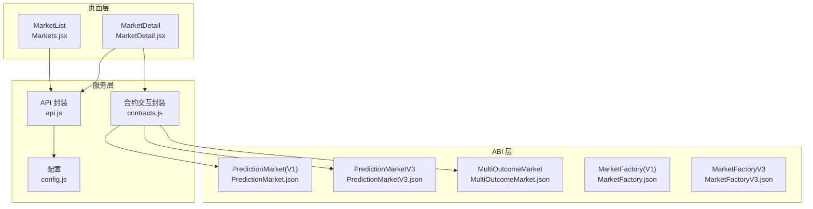
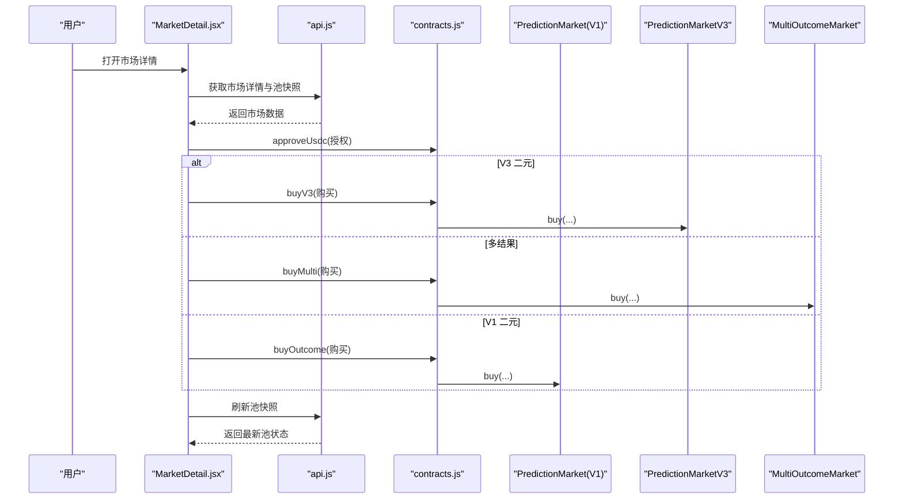
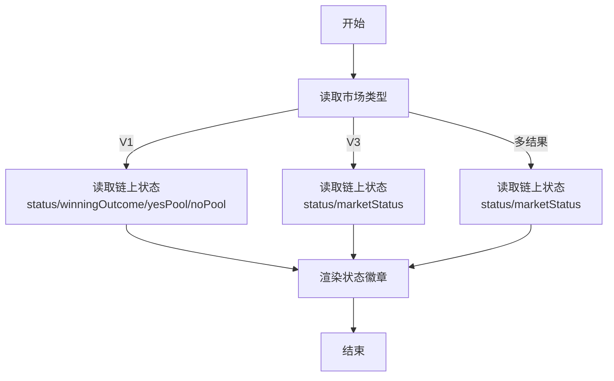
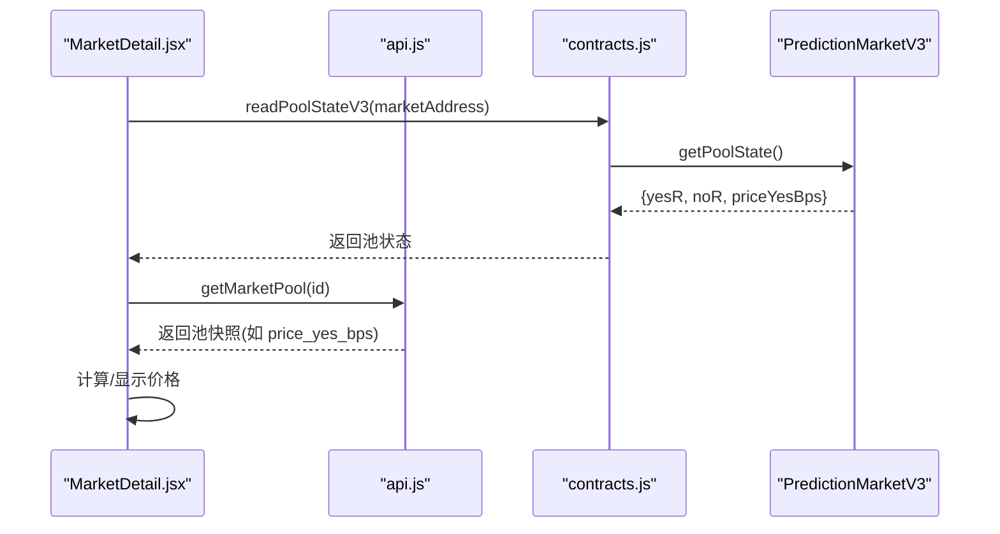
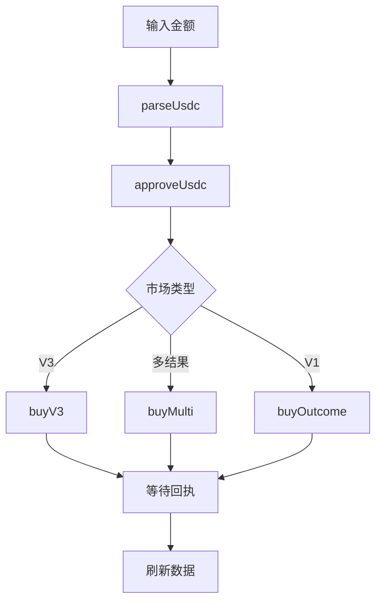
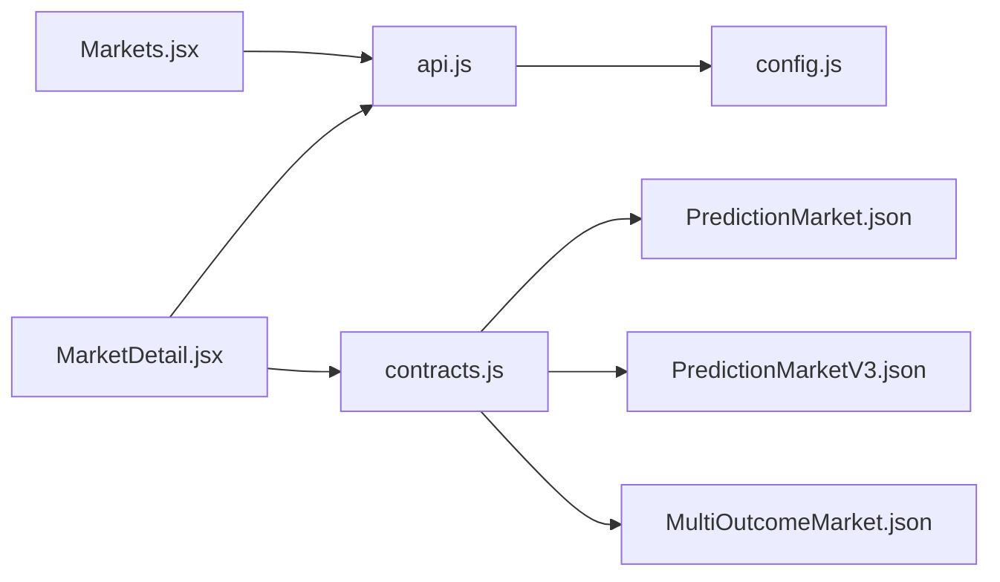

# 市场类型与结构

<cite>
**本文引用的文件**
- [contracts.js](file://src/services/contracts.js)
- [api.js](file://src/services/api.js)
- [Markets.jsx](file://src/pages/Markets.jsx)
- [MarketDetail.jsx](file://src/pages/MarketDetail.jsx)
- [MarketStatusBadge.jsx](file://src/components/MarketStatusBadge.jsx)
- [config.js](file://src/config.js)
- [PredictionMarket.json](file://src/abis/PredictionMarket.json)
- [PredictionMarketV3.json](file://src/abis/PredictionMarketV3.json)
- [MultiOutcomeMarket.json](file://src/abis/MultiOutcomeMarket.json)
- [MarketFactory.json](file://src/abis/MarketFactory.json)
- [MarketFactoryV3.json](file://src/abis/MarketFactoryV3.json)
</cite>

## 目录
1. [简介](#简介)
2. [项目结构](#项目结构)
3. [核心组件](#核心组件)
4. [架构总览](#架构总览)
5. [详细组件分析](#详细组件分析)
6. [依赖关系分析](#依赖关系分析)
7. [性能考量](#性能考量)
8. [故障排查指南](#故障排查指南)
9. [结论](#结论)
10. [附录](#附录)

## 简介
本文件系统性梳理前端侧对预测市场的抽象与实现，重点覆盖以下主题：
- 市场类型与结构：二元市场（V1/V3）、多结果市场（V1），以及 CPMM 流动性池机制
- 市场数据结构与状态管理：链上状态、池状态、API 快照、市场参数
- 价格发现与交易流程：下单、授权、流动性注入、价格计算
- 适用场景与差异对比：如何根据类型与参数选择合适的市场形态

## 项目结构
前端围绕“页面 + 服务层 + ABI 定义”的分层组织：
- 页面层：市场列表页与详情页负责展示与交互
- 服务层：API 封装与合约交互封装
- ABI 层：各类市场合约接口定义
- 配置层：全局配置（API 地址、链 ID、合约地址等）

图表来源
- [Markets.jsx](file://src/pages/Markets.jsx#L1-L56)
- [MarketDetail.jsx](file://src/pages/MarketDetail.jsx#L1-L185)
- [api.js](file://src/services/api.js#L1-L187)
- [contracts.js](file://src/services/contracts.js#L1-L214)
- [config.js](file://src/config.js#L1-L23)
- [PredictionMarket.json](file://src/abis/PredictionMarket.json#L1-L347)
- [PredictionMarketV3.json](file://src/abis/PredictionMarketV3.json#L1-L581)
- [MultiOutcomeMarket.json](file://src/abis/MultiOutcomeMarket.json#L1-L362)
- [MarketFactory.json](file://src/abis/MarketFactory.json#L1-L250)
- [MarketFactoryV3.json](file://src/abis/MarketFactoryV3.json#L1-L445)

章节来源
- [Markets.jsx](file://src/pages/Markets.jsx#L1-L56)
- [MarketDetail.jsx](file://src/pages/MarketDetail.jsx#L1-L185)
- [api.js](file://src/services/api.js#L1-L187)
- [contracts.js](file://src/services/contracts.js#L1-L214)
- [config.js](file://src/config.js#L1-L23)

## 核心组件
- 市场类型识别与交易路由
  - 依据市场对象中的类型字段区分 V1 二元、V3 二元、多结果市场，并调用相应的合约交互方法
- 合约交互封装
  - 授权、购买、读取链上状态、读取池状态、添加流动性等
- API 封装
  - 市场列表、详情、池快照、订单簿、健康检查等
- 状态展示
  - 市场状态徽章组件映射状态码到中文标签

章节来源
- [MarketDetail.jsx](file://src/pages/MarketDetail.jsx#L77-L110)
- [contracts.js](file://src/services/contracts.js#L78-L176)
- [api.js](file://src/services/api.js#L82-L186)
- [MarketStatusBadge.jsx](file://src/components/MarketStatusBadge.jsx#L1-L24)

## 架构总览
前端通过页面组件驱动服务层，服务层分别对接后端 API 与链上合约，形成“UI → 服务 → 合约/后端”的清晰链路。

图表来源
- [MarketDetail.jsx](file://src/pages/MarketDetail.jsx#L55-L110)
- [api.js](file://src/services/api.js#L82-L186)
- [contracts.js](file://src/services/contracts.js#L59-L176)
- [PredictionMarket.json](file://src/abis/PredictionMarket.json#L127-L130)
- [PredictionMarketV3.json](file://src/abis/PredictionMarketV3.json#L204-L207)
- [MultiOutcomeMarket.json](file://src/abis/MultiOutcomeMarket.json#L137-L140)

## 详细组件分析

### 市场类型与数据结构
- 二元市场（V1）
  - 关键字段：问题、截止时间、Yes/No 池、状态、获胜结果、链上地址
  - 交易：buyOutcome，链上状态通过 status、yesPool、noPool、winningOutcome 等读取
- 二元市场（V3，CPMM）
  - 关键字段：问题、截止时间、链上地址、类型标记、feeBps、maxBetPerUser、LP 总量等
  - 交易：buyV3；池状态通过 getPoolState 返回 yes/no 储备与价格（priceYesBps）
- 多结果市场（V1）
  - 关键字段：问题、截止时间、结果数量、feeBps、链上地址、状态
  - 交易：buyMulti；池状态通过 pool(index) 视图读取各结果池

章节来源
- [MarketDetail.jsx](file://src/pages/MarketDetail.jsx#L55-L70)
- [Markets.jsx](file://src/pages/Markets.jsx#L36-L52)
- [PredictionMarket.json](file://src/abis/PredictionMarket.json#L283-L345)
- [PredictionMarketV3.json](file://src/abis/PredictionMarketV3.json#L302-L321)
- [MultiOutcomeMarket.json](file://src/abis/MultiOutcomeMarket.json#L267-L276)

### 市场状态管理
- 状态枚举与映射
  - V1：status（枚举）→ OPEN/RESOLVED/VOID 等
  - V3：marketStatus（枚举）→ OPEN/RESOLVED/VOID 等
  - 多结果：marketStatus（枚举）→ OPEN/RESOLVED/VOID 等
- 状态展示
  - 市场详情页优先显示“ORACLE_PENDING”（当比赛状态为 ORACLE_PENDING 时）
  - 使用徽章组件映射状态码到中文标签

图表来源
- [MarketDetail.jsx](file://src/pages/MarketDetail.jsx#L117-L118)
- [MarketStatusBadge.jsx](file://src/components/MarketStatusBadge.jsx#L1-L24)
- [PredictionMarket.json](file://src/abis/PredictionMarket.json#L283-L312)
- [PredictionMarketV3.json](file://src/abis/PredictionMarketV3.json#L344-L353)
- [MultiOutcomeMarket.json](file://src/abis/MultiOutcomeMarket.json#L209-L218)

章节来源
- [MarketDetail.jsx](file://src/pages/MarketDetail.jsx#L117-L118)
- [MarketStatusBadge.jsx](file://src/components/MarketStatusBadge.jsx#L1-L24)
- [PredictionMarket.json](file://src/abis/PredictionMarket.json#L283-L312)
- [PredictionMarketV3.json](file://src/abis/PredictionMarketV3.json#L344-L353)
- [MultiOutcomeMarket.json](file://src/abis/MultiOutcomeMarket.json#L209-L218)

### CPMM 流动性池与价格发现
- V3 二元市场池状态
  - 读取 getPoolState 返回 yesR、noR、priceYesBps
  - 价格以“百分点”形式返回，前端换算为百分比显示
- 添加流动性
  - 调用 addLiquidity 注入流动性，事件记录 LP mint 数量
- 价格发现
  - 通过池内储备比例推导市场价格，链上提供 priceYesBps 便于前端直接展示

图表来源
- [MarketDetail.jsx](file://src/pages/MarketDetail.jsx#L64-L68)
- [contracts.js](file://src/services/contracts.js#L167-L176)
- [PredictionMarketV3.json](file://src/abis/PredictionMarketV3.json#L302-L321)
- [api.js](file://src/services/api.js#L179-L181)

章节来源
- [MarketDetail.jsx](file://src/pages/MarketDetail.jsx#L138-L145)
- [contracts.js](file://src/services/contracts.js#L167-L176)
- [PredictionMarketV3.json](file://src/abis/PredictionMarketV3.json#L302-L321)
- [api.js](file://src/services/api.js#L179-L181)

### 交易流程与参数配置
- 通用流程
  - 解析输入金额（parseUsdc）→ 授权 approveUsdc → 根据类型调用 buyOutcome/buyV3/buyMulti → 等待交易回执 → 刷新数据
- 参数配置
  - V3：feeBps、maxBetPerUser、初始流动性（由工厂创建时传入）
  - 多结果：outcomeCount、feeBps
  - V1：无显式 feeBps 字段，但可通过其他方式配置（如工厂默认）

图表来源
- [MarketDetail.jsx](file://src/pages/MarketDetail.jsx#L78-L110)
- [contracts.js](file://src/services/contracts.js#L24-L26)
- [contracts.js](file://src/services/contracts.js#L59-L69)
- [contracts.js](file://src/services/contracts.js#L113-L123)
- [contracts.js](file://src/services/contracts.js#L132-L142)
- [contracts.js](file://src/services/contracts.js#L78-L88)

章节来源
- [MarketDetail.jsx](file://src/pages/MarketDetail.jsx#L78-L110)
- [contracts.js](file://src/services/contracts.js#L24-L26)
- [contracts.js](file://src/services/contracts.js#L59-L69)
- [contracts.js](file://src/services/contracts.js#L113-L142)
- [PredictionMarketV3.json](file://src/abis/PredictionMarketV3.json#L38-L50)
- [MultiOutcomeMarket.json](file://src/abis/MultiOutcomeMarket.json#L32-L40)

### 市场参数与适用场景
- 二元 V1
  - 适合简单 Yes/No 场景，无需 CPMM；适合低复杂度、低流动性需求
- 二元 V3（CPMM）
  - 适合高流动性和自动做市需求；支持 feeBps、maxBetPerUser、初始流动性等精细控制
- 多结果 V1
  - 适合三档及以上结果的场景；支持 outcomeCount 与 feeBps 控制成本与规模

章节来源
- [PredictionMarketV3.json](file://src/abis/PredictionMarketV3.json#L38-L50)
- [MultiOutcomeMarket.json](file://src/abis/MultiOutcomeMarket.json#L32-L40)
- [MarketFactoryV3.json](file://src/abis/MarketFactoryV3.json#L199-L253)

## 依赖关系分析
- 页面依赖服务层
  - MarketDetail 依赖 api.js 与 contracts.js
  - Markets 依赖 api.js
- 服务层依赖 ABI
  - contracts.js 依赖各市场 ABI 以调用链上方法
- 配置依赖
  - config.js 提供 API 地址、链 ID、合约地址等

图表来源
- [MarketDetail.jsx](file://src/pages/MarketDetail.jsx#L1-L25)
- [Markets.jsx](file://src/pages/Markets.jsx#L1-L9)
- [api.js](file://src/services/api.js#L1-L22)
- [contracts.js](file://src/services/contracts.js#L1-L14)
- [config.js](file://src/config.js#L1-L23)
- [PredictionMarket.json](file://src/abis/PredictionMarket.json#L1-L14)
- [PredictionMarketV3.json](file://src/abis/PredictionMarketV3.json#L1-L14)
- [MultiOutcomeMarket.json](file://src/abis/MultiOutcomeMarket.json#L1-L14)

章节来源
- [MarketDetail.jsx](file://src/pages/MarketDetail.jsx#L1-L25)
- [Markets.jsx](file://src/pages/Markets.jsx#L1-L9)
- [api.js](file://src/services/api.js#L1-L22)
- [contracts.js](file://src/services/contracts.js#L1-L14)
- [config.js](file://src/config.js#L1-L23)

## 性能考量
- 并行读取
  - 读取 V1 市场状态时并行调用多个视图方法，减少等待时间
- 池状态双通道
  - 同时读取链上池状态与 API 池快照，提升展示实时性与鲁棒性
- 交易批处理
  - 授权与购买合并为一次交互序列，减少往返次数

章节来源
- [contracts.js](file://src/services/contracts.js#L183-L213)
- [MarketDetail.jsx](file://src/pages/MarketDetail.jsx#L67-L68)

## 故障排查指南
- 交易失败
  - 检查钱包连接状态、市场开放状态、VC 访问控制、授权额度与链上余额
- 无法读取状态
  - 确认市场地址有效、链 ID 正确、合约 ABI 与链上一致
- 价格异常
  - 核对 priceYesBps 单位换算、链上与 API 池状态差异

章节来源
- [MarketDetail.jsx](file://src/pages/MarketDetail.jsx#L78-L110)
- [MarketStatusBadge.jsx](file://src/components/MarketStatusBadge.jsx#L1-L24)
- [config.js](file://src/config.js#L1-L23)

## 结论
本前端实现以清晰的类型识别与服务层封装，统一了 V1/V3 二元市场与多结果市场的交互路径；通过链上状态与 API 池快照的协同，实现了高效的价格发现与用户体验。建议在实际部署中结合业务场景选择合适类型，并合理配置 feeBps、最大投注额与初始流动性等参数。

## 附录
- 关键实现路径参考
  - 二元 V1 下注：[buyOutcome 调用](file://src/services/contracts.js#L78-L88)
  - 二元 V3 下注：[buyV3 调用](file://src/services/contracts.js#L113-L123)
  - 多结果下注：[buyMulti 调用](file://src/services/contracts.js#L132-L142)
  - 授权：[approveUsdc 调用](file://src/services/contracts.js#L59-L69)
  - 读取 V1 状态：[readMarketStatus 调用](file://src/services/contracts.js#L183-L213)
  - 读取 V3 池状态：[readPoolStateV3 调用](file://src/services/contracts.js#L167-L176)
  - 市场详情页交易逻辑：[onBuy 实现](file://src/pages/MarketDetail.jsx#L78-L110)
  - 市场列表页展示：[Markets.jsx](file://src/pages/Markets.jsx#L36-L52)
  - 状态徽章映射：[MarketStatusBadge.jsx](file://src/components/MarketStatusBadge.jsx#L1-L24)
  - API 封装：[api.js](file://src/services/api.js#L82-L186)
  - 配置：[config.js](file://src/config.js#L1-L23)