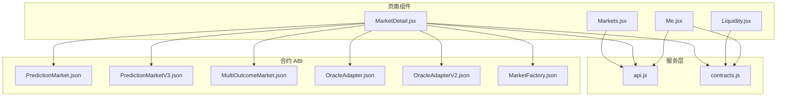
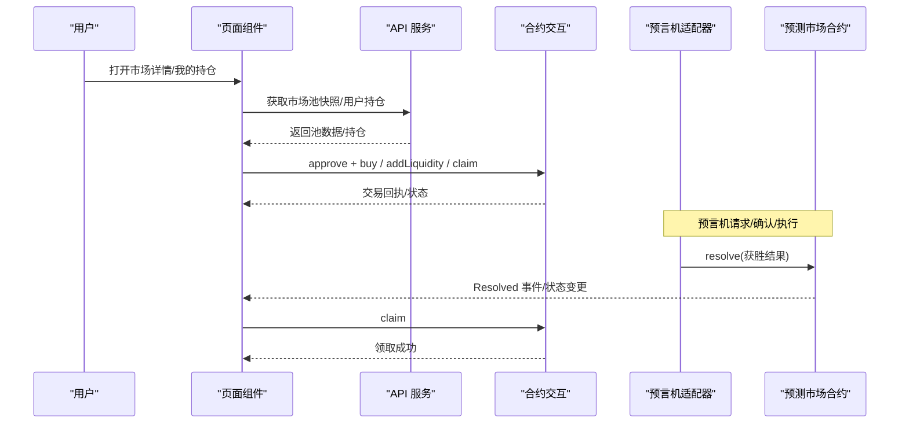
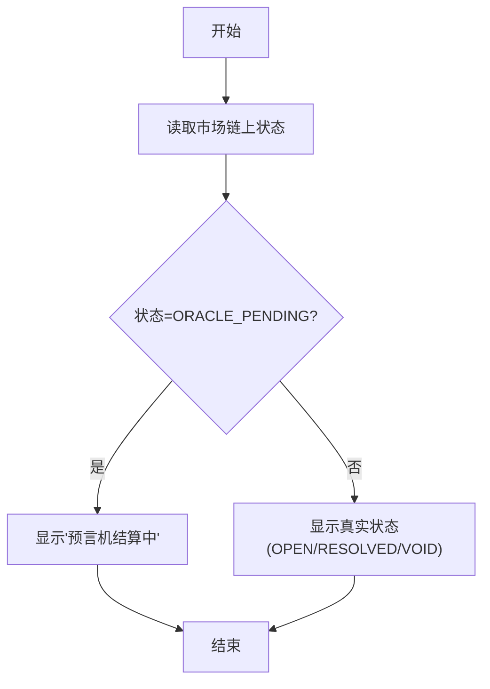
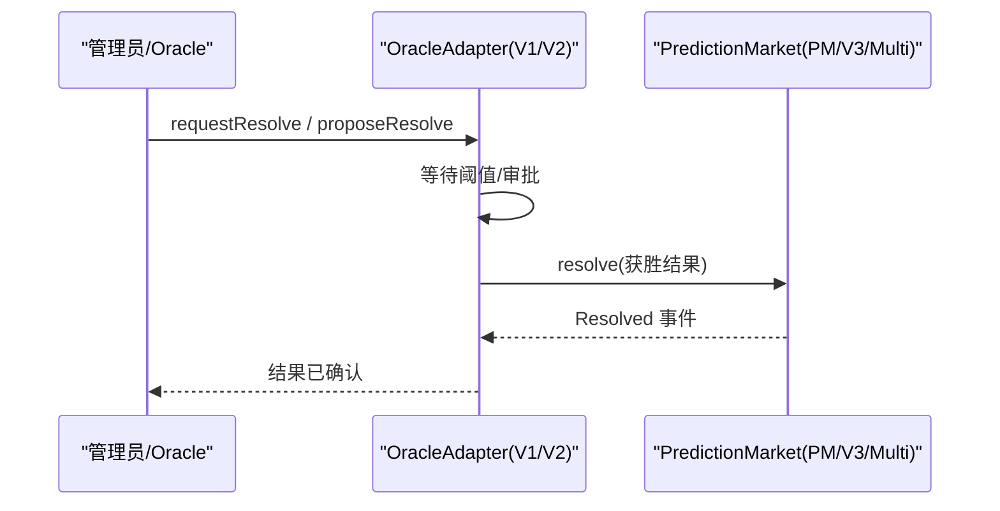
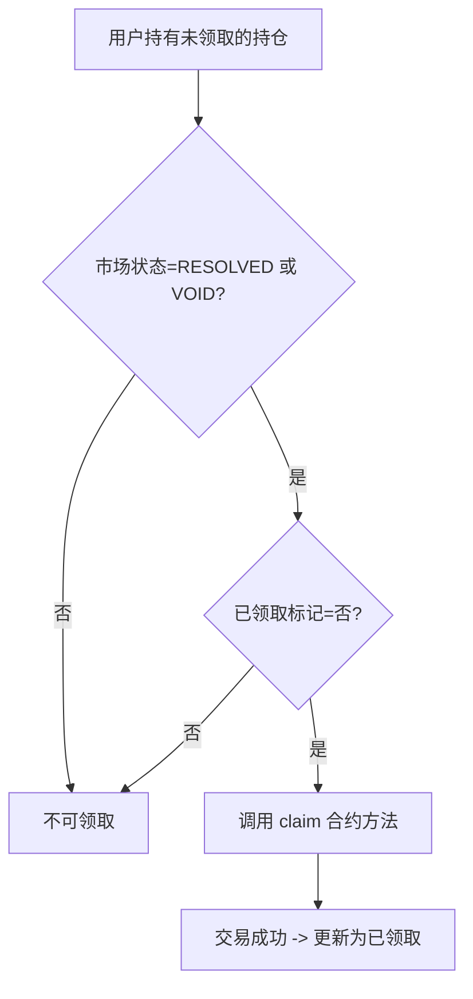
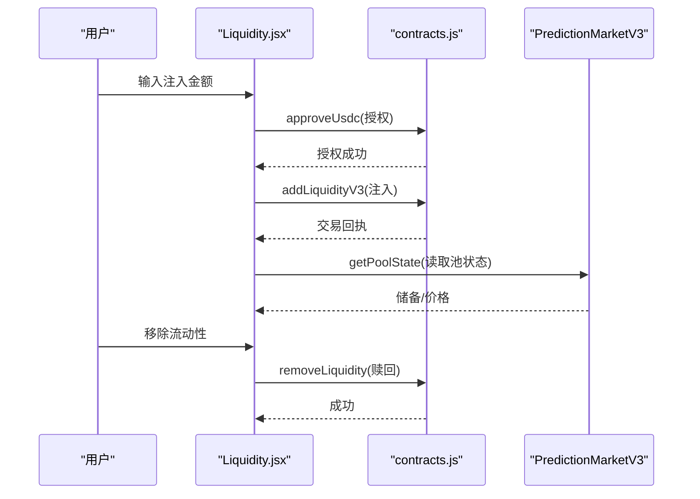
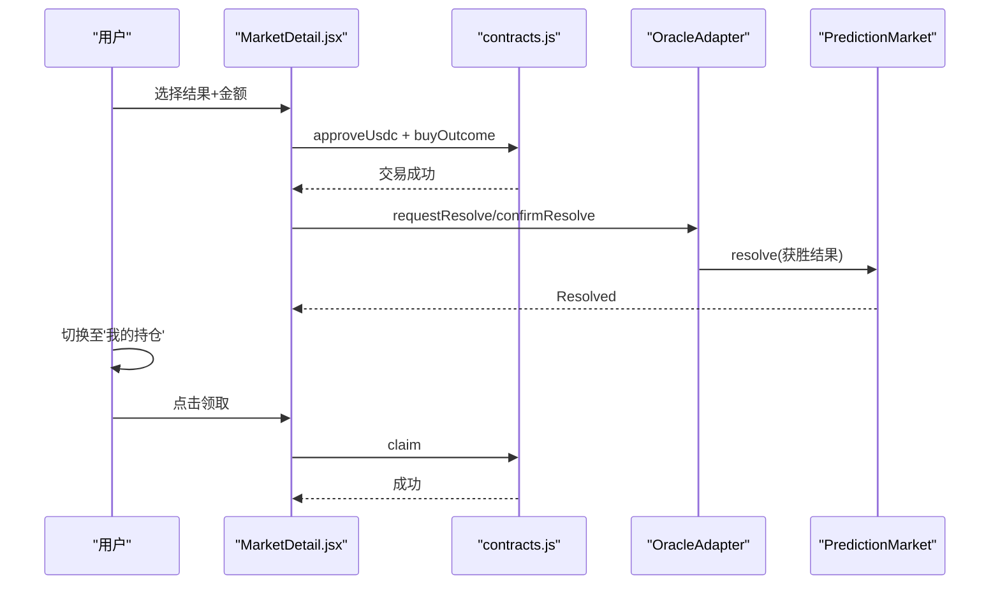
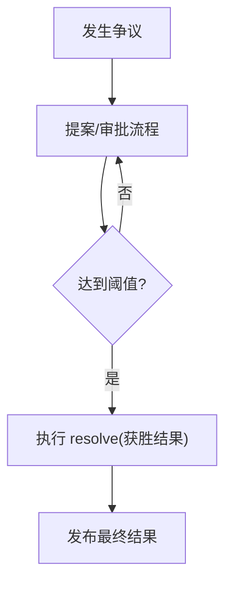
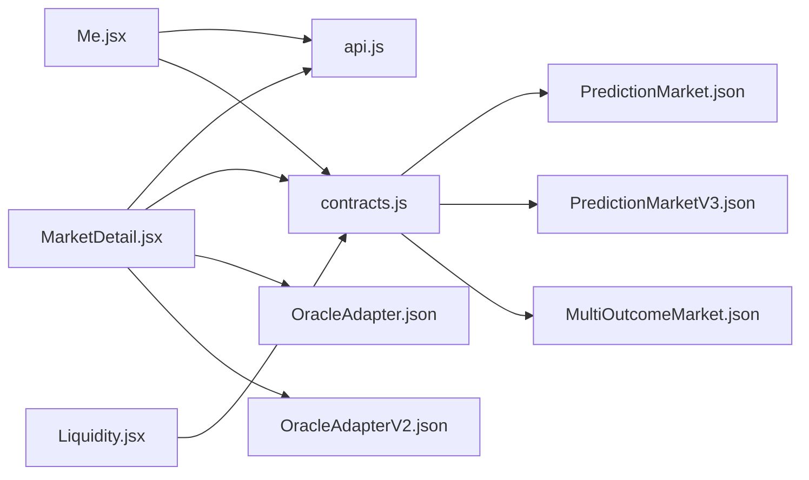

# 市场结算与奖励

<cite>
**本文引用的文件**
- [contracts.js](file://src/services/contracts.js)
- [api.js](file://src/services/api.js)
- [Markets.jsx](file://src/pages/Markets.jsx)
- [MarketDetail.jsx](file://src/pages/MarketDetail.jsx)
- [Liquidity.jsx](file://src/pages/Liquidity.jsx)
- [Me.jsx](file://src/pages/Me.jsx)
- [MarketStatusBadge.jsx](file://src/components/MarketStatusBadge.jsx)
- [TxStatus.jsx](file://src/components/TxStatus.jsx)
- [PredictionMarket.json](file://src/abis/PredictionMarket.json)
- [PredictionMarketV3.json](file://src/abis/PredictionMarketV3.json)
- [MultiOutcomeMarket.json](file://src/abis/MultiOutcomeMarket.json)
- [OracleAdapter.json](file://src/abis/OracleAdapter.json)
- [OracleAdapterV2.json](file://src/abis/OracleAdapterV2.json)
- [MarketFactory.json](file://src/abis/MarketFactory.json)
</cite>

## 目录
1. [简介](#简介)
2. [项目结构](#项目结构)
3. [核心组件](#核心组件)
4. [架构总览](#架构总览)
5. [详细组件分析](#详细组件分析)
6. [依赖关系分析](#依赖关系分析)
7. [性能考量](#性能考量)
8. [故障排查指南](#故障排查指南)
9. [结论](#结论)
10. [附录](#附录)

## 简介
本文件聚焦于前端侧“市场结算与奖励”能力的实现与使用说明，涵盖以下主题：
- 结算触发条件与状态流转
- 预言机集成与结果确认流程
- 奖励计算与收益分配（基于链上状态）
- 流动性提供者的收益与提取机制
- 结算状态管理、争议处理与最终结果发布
- 完整结算流程示例与异常处理方案

说明：本仓库前端主要负责展示市场状态、触发链上操作（如授权、购买、添加流动性、领取奖励）、读取链上状态与池数据，并通过后端 API 获取市场池快照与用户持仓。实际的结算逻辑（如 resolve、费用抽取、奖励分配）由链上合约实现。

## 项目结构
前端围绕页面组件、服务层与合约 ABI 组织，关键模块如下：
- 页面组件：市场列表、市场详情、流动性管理、个人中心（持仓与领取）
- 服务层：API 请求封装、合约交互封装（读写、格式化）
- 合约 ABI：预测市场、多结果市场、V3 CPMM、预言机适配器、工厂等

图表来源
- [Markets.jsx](file://src/pages/Markets.jsx#L1-L56)
- [MarketDetail.jsx](file://src/pages/MarketDetail.jsx#L1-L185)
- [Liquidity.jsx](file://src/pages/Liquidity.jsx#L1-L117)
- [Me.jsx](file://src/pages/Me.jsx#L1-L105)
- [api.js](file://src/services/api.js#L1-L187)
- [contracts.js](file://src/services/contracts.js#L1-L214)
- [PredictionMarket.json](file://src/abis/PredictionMarket.json#L1-L347)
- [PredictionMarketV3.json](file://src/abis/PredictionMarketV3.json#L1-L581)
- [MultiOutcomeMarket.json](file://src/abis/MultiOutcomeMarket.json#L1-L362)
- [OracleAdapter.json](file://src/abis/OracleAdapter.json#L1-L472)
- [OracleAdapterV2.json](file://src/abis/OracleAdapterV2.json#L1-L495)
- [MarketFactory.json](file://src/abis/MarketFactory.json#L1-L250)

章节来源
- [Markets.jsx](file://src/pages/Markets.jsx#L1-L56)
- [MarketDetail.jsx](file://src/pages/MarketDetail.jsx#L1-L185)
- [Liquidity.jsx](file://src/pages/Liquidity.jsx#L1-L117)
- [Me.jsx](file://src/pages/Me.jsx#L1-L105)
- [api.js](file://src/services/api.js#L1-L187)
- [contracts.js](file://src/services/contracts.js#L1-L214)

## 核心组件
- 市场状态展示与导航：页面组件负责渲染市场状态徽章、池数据与下注入口。
- 合约交互封装：统一处理 approve、buy、claim、addLiquidity、读取 pool 状态等。
- 预言机适配器：提供请求结算、确认结算、提案与阈值等功能（V1/V2）。
- 用户收益领取：在市场已结算或已作废状态下允许领取。

章节来源
- [MarketStatusBadge.jsx](file://src/components/MarketStatusBadge.jsx#L1-L24)
- [TxStatus.jsx](file://src/components/TxStatus.jsx#L1-L26)
- [contracts.js](file://src/services/contracts.js#L1-L214)
- [OracleAdapter.json](file://src/abis/OracleAdapter.json#L1-L472)
- [OracleAdapterV2.json](file://src/abis/OracleAdapterV2.json#L1-L495)
- [Me.jsx](file://src/pages/Me.jsx#L1-L105)

## 架构总览
前端通过 API 获取市场池快照与用户持仓，同时通过 wagmi 与合约交互完成链上操作。预言机适配器负责结果确认与执行，最终由市场合约记录获胜结果并允许用户领取。

图表来源
- [MarketDetail.jsx](file://src/pages/MarketDetail.jsx#L1-L185)
- [Me.jsx](file://src/pages/Me.jsx#L1-L105)
- [api.js](file://src/services/api.js#L1-L187)
- [contracts.js](file://src/services/contracts.js#L1-L214)
- [OracleAdapter.json](file://src/abis/OracleAdapter.json#L1-L472)
- [OracleAdapterV2.json](file://src/abis/OracleAdapterV2.json#L1-L495)
- [PredictionMarket.json](file://src/abis/PredictionMarket.json#L1-L347)
- [PredictionMarketV3.json](file://src/abis/PredictionMarketV3.json#L1-L581)
- [MultiOutcomeMarket.json](file://src/abis/MultiOutcomeMarket.json#L1-L362)

## 详细组件分析

### 市场状态与结算状态管理
- 前端展示状态包括：开放下注、已结算、已作废（可退款）、预言机结算中。
- 市场详情页会优先显示“预言机结算中”，以提示用户当前处于结果确认阶段。
- 已结算或已作废且未领取的持仓，可在“我的持仓”页触发领取。

图表来源
- [MarketDetail.jsx](file://src/pages/MarketDetail.jsx#L117-L118)
- [MarketStatusBadge.jsx](file://src/components/MarketStatusBadge.jsx#L1-L24)

章节来源
- [MarketDetail.jsx](file://src/pages/MarketDetail.jsx#L117-L118)
- [MarketStatusBadge.jsx](file://src/components/MarketStatusBadge.jsx#L1-L24)

### 预言机集成与结果确认流程
- V1 适配器：支持请求结算、立即结算、确认结算、作废市场。
- V2 适配器：引入提案与审批流程，支持阈值控制，提升抗审查能力。
- 前端通过调用相应合约方法发起请求，最终由市场合约记录获胜结果。

图表来源
- [OracleAdapter.json](file://src/abis/OracleAdapter.json#L359-L380)
- [OracleAdapterV2.json](file://src/abis/OracleAdapterV2.json#L389-L448)
- [PredictionMarket.json](file://src/abis/PredictionMarket.json#L276-L279)
- [PredictionMarketV3.json](file://src/abis/PredictionMarketV3.json#L473-L476)
- [MultiOutcomeMarket.json](file://src/abis/MultiOutcomeMarket.json#L299-L302)

章节来源
- [OracleAdapter.json](file://src/abis/OracleAdapter.json#L1-L472)
- [OracleAdapterV2.json](file://src/abis/OracleAdapterV2.json#L1-L495)
- [PredictionMarket.json](file://src/abis/PredictionMarket.json#L1-L347)
- [PredictionMarketV3.json](file://src/abis/PredictionMarketV3.json#L1-L581)
- [MultiOutcomeMarket.json](file://src/abis/MultiOutcomeMarket.json#L1-L362)

### 奖励计算与收益分配（前端视角）
- 奖励发放由市场合约根据“获胜结果”与“用户持仓”决定。前端通过“我的持仓”页判断是否可领取。
- 对于 V1 市场，合约提供“已领取”标记；对于 V3 与多结果市场，合约提供相应状态字段。
- 前端在市场状态为“已结算”或“已作废”且未领取时，允许用户调用 claim。

图表来源
- [Me.jsx](file://src/pages/Me.jsx#L90-L97)
- [contracts.js](file://src/services/contracts.js#L95-L104)
- [PredictionMarket.json](file://src/abis/PredictionMarket.json#L147-L156)
- [PredictionMarketV3.json](file://src/abis/PredictionMarketV3.json#L224-L233)
- [MultiOutcomeMarket.json](file://src/abis/MultiOutcomeMarket.json#L156-L166)

章节来源
- [Me.jsx](file://src/pages/Me.jsx#L46-L61)
- [contracts.js](file://src/services/contracts.js#L95-L104)
- [PredictionMarket.json](file://src/abis/PredictionMarket.json#L147-L156)
- [PredictionMarketV3.json](file://src/abis/PredictionMarketV3.json#L224-L233)
- [MultiOutcomeMarket.json](file://src/abis/MultiOutcomeMarket.json#L156-L166)

### 流动性提供者收益与提取机制（V3 CPMM）
- V3 市场采用常数乘法做市商模型，前端通过读取池状态（Yes/No 储备、价格）评估流动性价值。
- 用户可通过添加流动性获得 LP 份额，后续可移除流动性取回对应资产。
- 前端提供流动性管理页，完成授权与添加/移除流动性操作。

图表来源
- [Liquidity.jsx](file://src/pages/Liquidity.jsx#L51-L77)
- [contracts.js](file://src/services/contracts.js#L150-L176)
- [PredictionMarketV3.json](file://src/abis/PredictionMarketV3.json#L302-L321)
- [PredictionMarketV3.json](file://src/abis/PredictionMarketV3.json#L434-L437)

章节来源
- [Liquidity.jsx](file://src/pages/Liquidity.jsx#L1-L117)
- [contracts.js](file://src/services/contracts.js#L150-L176)
- [PredictionMarketV3.json](file://src/abis/PredictionMarketV3.json#L1-L581)

### 结算流程完整示例
- 场景：V1 二元市场
  1) 用户在市场详情页进行下注（授权 + 购买），随后市场进入“预言机结算中”。
  2) 管理员通过 OracleAdapter 请求结算并确认，最终由市场合约 resolve 获胜结果。
  3) 用户在“我的持仓”页点击领取，完成奖励提取。

图表来源
- [MarketDetail.jsx](file://src/pages/MarketDetail.jsx#L77-L110)
- [contracts.js](file://src/services/contracts.js#L78-L104)
- [OracleAdapter.json](file://src/abis/OracleAdapter.json#L359-L380)
- [PredictionMarket.json](file://src/abis/PredictionMarket.json#L276-L279)

章节来源
- [MarketDetail.jsx](file://src/pages/MarketDetail.jsx#L77-L110)
- [contracts.js](file://src/services/contracts.js#L78-L104)
- [OracleAdapter.json](file://src/abis/OracleAdapter.json#L1-L472)
- [PredictionMarket.json](file://src/abis/PredictionMarket.json#L1-L347)

### 争议处理与最终结果发布
- V2 适配器引入提案与审批流程，通过阈值控制提升结果发布的稳健性。
- 若出现争议，可通过提案流程重新确认结果，最终由市场合约记录获胜结果。

图表来源
- [OracleAdapterV2.json](file://src/abis/OracleAdapterV2.json#L389-L448)
- [PredictionMarket.json](file://src/abis/PredictionMarket.json#L276-L279)

章节来源
- [OracleAdapterV2.json](file://src/abis/OracleAdapterV2.json#L1-L495)
- [PredictionMarket.json](file://src/abis/PredictionMarket.json#L1-L347)

## 依赖关系分析
- 页面组件依赖服务层：API 用于获取池快照与用户持仓；合约交互用于链上操作。
- 合约交互封装统一了 approve、buy、claim、addLiquidity、读取池状态等方法。
- 预言机适配器与市场合约共同决定结算路径与最终结果。

图表来源
- [MarketDetail.jsx](file://src/pages/MarketDetail.jsx#L1-L185)
- [Me.jsx](file://src/pages/Me.jsx#L1-L105)
- [Liquidity.jsx](file://src/pages/Liquidity.jsx#L1-L117)
- [api.js](file://src/services/api.js#L1-L187)
- [contracts.js](file://src/services/contracts.js#L1-L214)
- [PredictionMarket.json](file://src/abis/PredictionMarket.json#L1-L347)
- [PredictionMarketV3.json](file://src/abis/PredictionMarketV3.json#L1-L581)
- [MultiOutcomeMarket.json](file://src/abis/MultiOutcomeMarket.json#L1-L362)
- [OracleAdapter.json](file://src/abis/OracleAdapter.json#L1-L472)
- [OracleAdapterV2.json](file://src/abis/OracleAdapterV2.json#L1-L495)

章节来源
- [MarketDetail.jsx](file://src/pages/MarketDetail.jsx#L1-L185)
- [Me.jsx](file://src/pages/Me.jsx#L1-L105)
- [Liquidity.jsx](file://src/pages/Liquidity.jsx#L1-L117)
- [api.js](file://src/services/api.js#L1-L187)
- [contracts.js](file://src/services/contracts.js#L1-L214)

## 性能考量
- 并行读取：合约状态读取采用并行方式，减少等待时间。
- 池状态刷新：在流动性页面与市场详情页按需刷新池状态，避免频繁轮询。
- 交易确认：统一使用交易回执等待，保证链上状态稳定后再更新 UI。

章节来源
- [contracts.js](file://src/services/contracts.js#L183-L213)
- [Liquidity.jsx](file://src/pages/Liquidity.jsx#L44-L49)
- [MarketDetail.jsx](file://src/pages/MarketDetail.jsx#L54-L70)

## 故障排查指南
- 授权失败：检查 USDC 授权额度与合约地址是否正确。
- 下注失败：确认市场状态为开放、用户具备访问权限、金额合法。
- 领取失败：确认市场已结算或已作废且未领取。
- 流动性操作失败：检查授权、注入金额与钱包余额。
- 交易状态：使用交易状态组件查看 pending/success/error 与交易哈希。

章节来源
- [MarketDetail.jsx](file://src/pages/MarketDetail.jsx#L77-L110)
- [Me.jsx](file://src/pages/Me.jsx#L46-L61)
- [Liquidity.jsx](file://src/pages/Liquidity.jsx#L51-L77)
- [TxStatus.jsx](file://src/components/TxStatus.jsx#L1-L26)

## 结论
本前端实现围绕“状态展示 + 合约交互 + 预言机流程”的闭环，完成市场结算与奖励发放的关键路径。用户可在市场结算后领取奖励，流动性提供者通过 V3 CPMM 获取收益并可随时提取。争议场景通过 V2 预言机适配器的提案/审批机制增强稳健性。

## 附录
- 常用方法与用途
  - 授权与下注：approveUsdc、buyOutcome、buyV3、buyMulti
  - 领取奖励：claimMarket
  - 流动性：addLiquidityV3、removeLiquidity
  - 读取状态：readMarketStatus、readPoolStateV3
  - API：listMarkets、getMarket、getMarketPool、myPositions

章节来源
- [contracts.js](file://src/services/contracts.js#L59-L176)
- [api.js](file://src/services/api.js#L81-L186)