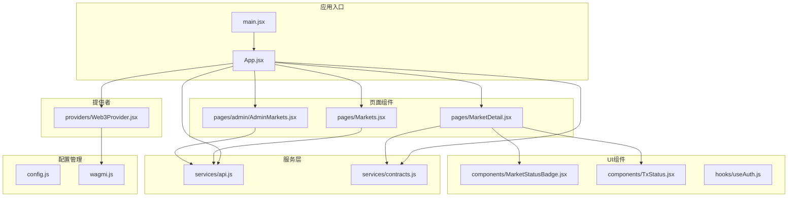
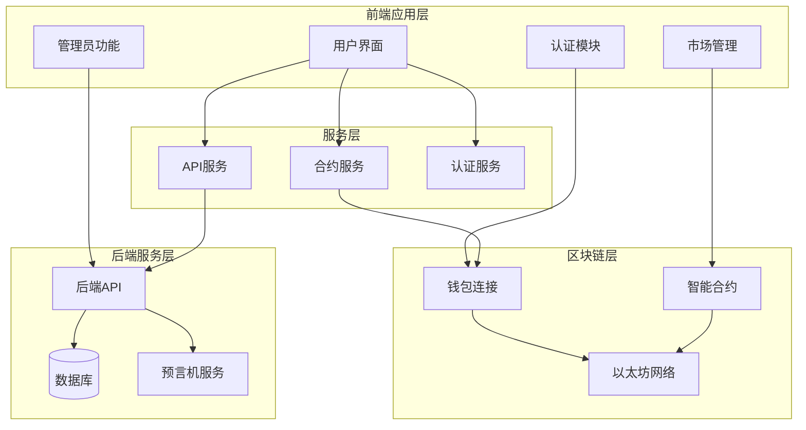
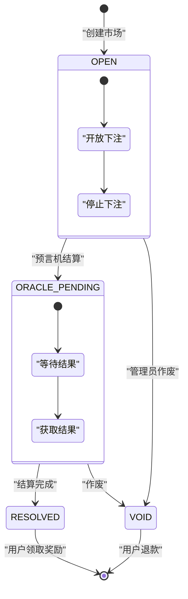
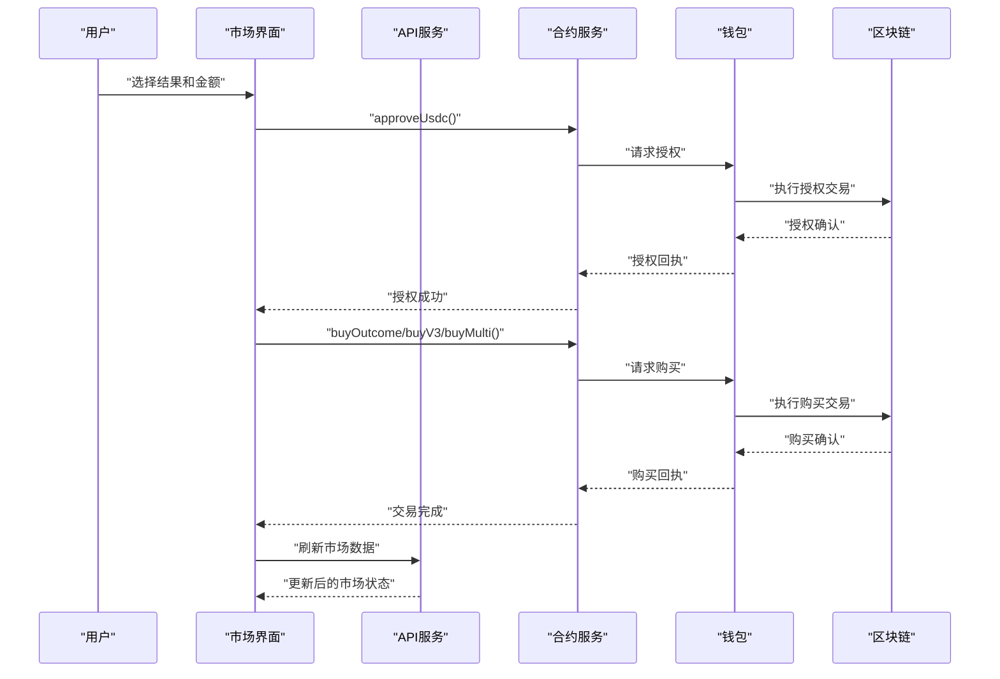
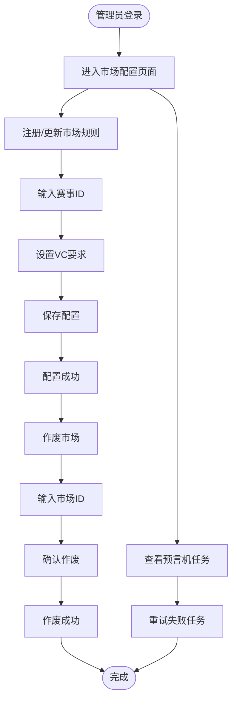
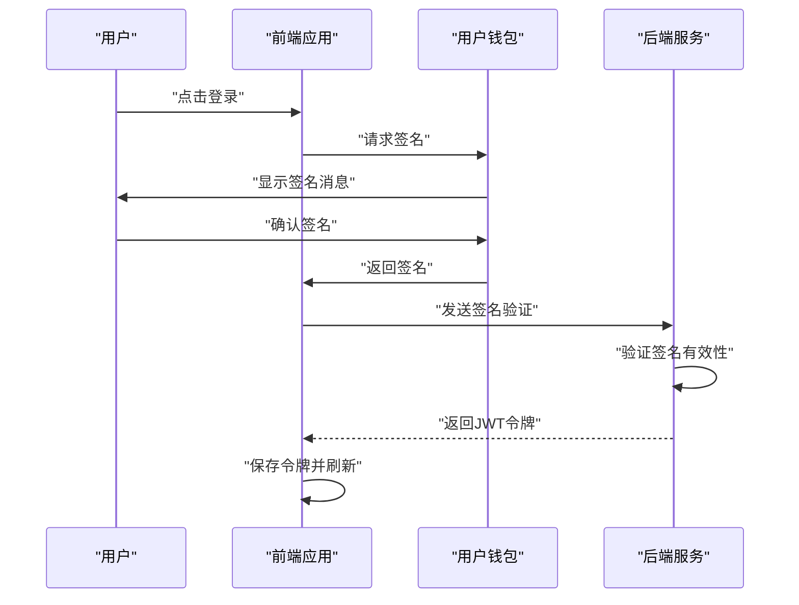
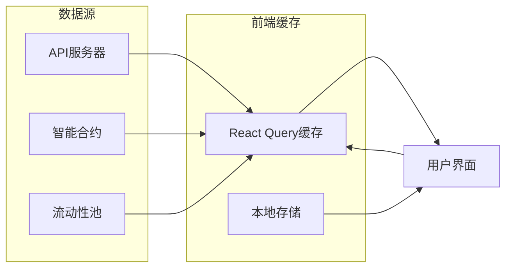

# 预测市场管理系统

<cite>
**本文档引用的文件**
- [App.jsx](file://src/App.jsx)
- [main.jsx](file://src/main.jsx)
- [config.js](file://src/config.js)
- [package.json](file://src/package.json)
- [contracts.js](file://src/services/contracts.js)
- [api.js](file://src/services/api.js)
- [Markets.jsx](file://src/pages/Markets.jsx)
- [MarketDetail.jsx](file://src/pages/MarketDetail.jsx)
- [AdminMarkets.jsx](file://src/pages/admin/AdminMarkets.jsx)
- [Web3Provider.jsx](file://src/providers/Web3Provider.jsx)
- [wagmi.js](file://src/wagmi.js)
- [MarketStatusBadge.jsx](file://src/components/MarketStatusBadge.jsx)
- [TxStatus.jsx](file://src/components/TxStatus.jsx)
- [useAuth.js](file://src/hooks/useAuth.js)
</cite>

## 目录
1. [简介](#简介)
2. [项目结构](#项目结构)
3. [核心组件](#核心组件)
4. [架构概览](#架构概览)
5. [详细组件分析](#详细组件分析)
6. [依赖关系分析](#依赖关系分析)
7. [性能考虑](#性能考虑)
8. [故障排除指南](#故障排除指南)
9. [结论](#结论)

## 简介

预测市场管理系统是一个基于区块链技术的去中心化预测市场平台，支持二元市场、多结果市场和CPMM流动性池等不同市场类型的创建、配置、交易和结算。该系统集成了钱包连接、合规检查、市场管理和用户交互等功能模块。

系统采用React前端框架，结合wagmi和viem库实现区块链交互，通过API服务层与后端进行通信，支持多种市场类型和复杂的交易流程。

## 项目结构

项目采用模块化的组织方式，主要分为以下几个核心部分：



**图表来源**
- [main.jsx](file://src/main.jsx#L1-L33)
- [App.jsx](file://src/App.jsx#L1-L67)
- [config.js](file://src/config.js#L1-L23)

**章节来源**
- [main.jsx](file://src/main.jsx#L1-L33)
- [App.jsx](file://src/App.jsx#L1-L67)
- [config.js](file://src/config.js#L1-L23)

## 核心组件

### 应用路由系统

应用采用React Router进行路由管理，支持多级嵌套路由结构：

- **基础路由**：首页、市场列表、个人中心、统计页面
- **市场路由**：市场详情、赛事详情
- **管理路由**：管理员后台，包含预言机管理和市场配置
- **合规路由**：所有页面都需要通过合规检查包裹层

### 钱包集成

系统通过wagmi提供完整的钱包连接功能：
- 支持MetaMask等主流浏览器钱包
- 自动检测网络连接状态
- 提供签名验证和身份认证功能

### 合约交互层

contracts.js模块封装了所有区块链交互操作：
- USDC代币授权和余额查询
- 不同类型市场的购买操作
- 流动性池状态查询
- 市场状态读取

**章节来源**
- [App.jsx](file://src/App.jsx#L31-L67)
- [Web3Provider.jsx](file://src/providers/Web3Provider.jsx#L1-L25)
- [contracts.js](file://src/services/contracts.js#L1-L214)

## 架构概览

系统采用前后端分离的架构设计，前端负责用户界面和业务逻辑，后端提供数据服务和API接口。



**图表来源**
- [api.js](file://src/services/api.js#L1-L187)
- [contracts.js](file://src/services/contracts.js#L1-L214)
- [useAuth.js](file://src/hooks/useAuth.js#L1-L110)

## 详细组件分析

### 市场管理系统

#### 市场类型支持

系统支持三种主要的市场类型：

1. **二元市场 (Binary Market)**：支持Yes/No两种结果
2. **多结果市场 (Multi-outcome Market)**：支持三个或更多结果
3. **CPMM流动性池市场 (V3)**：基于常数乘数做市商模型

#### 市场状态管理



**图表来源**
- [MarketStatusBadge.jsx](file://src/components/MarketStatusBadge.jsx#L1-L24)

#### 交易流程



**图表来源**
- [MarketDetail.jsx](file://src/pages/MarketDetail.jsx#L77-L110)
- [contracts.js](file://src/services/contracts.js#L59-L142)

**章节来源**
- [MarketDetail.jsx](file://src/pages/MarketDetail.jsx#L1-L185)
- [contracts.js](file://src/services/contracts.js#L71-L142)

### 管理员功能模块

#### 市场配置管理

管理员可以通过专门的界面进行市场配置：



**图表来源**
- [AdminMarkets.jsx](file://src/pages/admin/AdminMarkets.jsx#L20-L49)

#### 合规检查机制

系统实现了多层次的合规检查：

1. **地理位置限制**：检查用户所在地区是否在受限名单中
2. **VC凭证验证**：对于需要VC的市场，验证用户的可验证凭证
3. **年龄和资格检查**：根据市场规则进行额外验证

**章节来源**
- [AdminMarkets.jsx](file://src/pages/admin/AdminMarkets.jsx#L1-L89)

### 用户认证系统

#### SIWE协议集成

系统使用SIWE（Sign-In with Ethereum）协议实现去中心化身份认证：



**图表来源**
- [useAuth.js](file://src/hooks/useAuth.js#L28-L80)

**章节来源**
- [useAuth.js](file://src/hooks/useAuth.js#L1-L110)

### 数据流管理

#### 市场数据获取

系统采用多源数据同步策略：



**图表来源**
- [api.js](file://src/services/api.js#L178-L186)
- [contracts.js](file://src/services/contracts.js#L167-L176)

**章节来源**
- [api.js](file://src/services/api.js#L1-L187)
- [contracts.js](file://src/services/contracts.js#L162-L176)

## 依赖关系分析

### 核心依赖关系

```mermaid
graph TB
subgraph "前端依赖"
React[react@^18.3.1]
Router[react-router-dom@^6.28.0]
Wagmi[wagmi@^2.14.1]
Viem[viem@^2.21.54]
Query[@tanstack/react-query@^5.62.2]
end
subgraph "应用模块"
App[App.jsx]
Main[main.jsx]
Config[config.js]
Services[services/*]
Pages[pages/*]
Components[components/*]
end
React --> App
Router --> App
Wagmi --> Services
Viem --> Services
Query --> Services
App --> Services
App --> Pages
App --> Components
Main --> App
Main --> Config
```

**图表来源**
- [package.json](file://src/package.json#L12-L28)
- [main.jsx](file://src/main.jsx#L1-L33)

### 区块链配置

系统针对不同的市场类型提供了相应的合约配置：

| 市场类型 | 合约文件 | 主要功能 |
|---------|----------|----------|
| 二元市场V1 | PredictionMarket.json | 基础二元市场交易 |
| 二元市场V3 | PredictionMarketV3.json | CPMM流动性池 |
| 多结果市场 | MultiOutcomeMarket.json | 多结果市场交易 |
| USDC代币 | MockUSDC.json | 代币授权和转账 |

**章节来源**
- [package.json](file://src/package.json#L1-L30)
- [config.js](file://src/config.js#L1-L23)

## 性能考虑

### 数据缓存策略

系统采用React Query进行智能缓存管理：
- 自动缓存API响应数据
- 支持缓存失效和重新验证
- 实现乐观更新和错误恢复

### 批量操作优化

合约交互采用了批量读取优化：
- 并行获取多个合约状态
- 减少网络往返次数
- 提高用户体验

### 内存管理

- 合理的组件卸载和清理
- 避免内存泄漏
- 优化大列表渲染

## 故障排除指南

### 常见问题诊断

#### 钱包连接问题
- 检查钱包是否正确安装和配置
- 确认网络ID与应用配置匹配
- 验证账户是否有足够的ETH支付Gas费

#### 交易失败排查
- 检查USDC授权是否成功
- 确认市场状态是否为OPEN
- 验证用户是否满足VC要求
- 查看交易回执中的错误信息

#### 数据加载问题
- 检查API服务是否正常运行
- 验证Indexer是否在同步数据
- 确认市场ID是否正确

**章节来源**
- [TxStatus.jsx](file://src/components/TxStatus.jsx#L1-L26)
- [MarketDetail.jsx](file://src/pages/MarketDetail.jsx#L106-L109)

### 错误处理机制

系统实现了完善的错误处理：
- 用户友好的错误提示
- 详细的错误日志记录
- 自动重试机制
- 降级处理策略

## 结论

预测市场管理系统是一个功能完整、架构清晰的去中心化金融应用。系统通过模块化的设计实现了高度的可维护性和扩展性，支持多种市场类型和复杂的业务场景。

主要特点包括：
- 完善的市场生命周期管理
- 多层次的合规检查机制  
- 灵活的市场配置功能
- 优化的用户体验设计
- 健壮的错误处理和监控

未来可以考虑的功能增强：
- 添加更多市场类型支持
- 实现更精细的风控机制
- 优化移动端用户体验
- 增强数据分析和报告功能