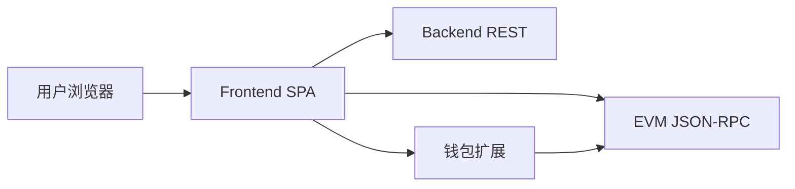

# Frontend 需求规格说明书

| 文档属性 | 内容 |
|---------|------|
| 项目名称 | Prediction DID — 世界杯 Web3 预测市场（Frontend） |
| 文档版本 | 1.0 |
| 适用代码 | `frontend/` 目录（React 18 + Vite 5 + wagmi 2） |
| 编写依据 | 源码、`frontend_func.md`、`backend/01.需求规格说明书.md`、`docs/ARCHITECTURE.md` |

---

## 1. 引言

### 1.1 编写目的

本文档从**已实现代码**反推并整理 Frontend 子系统的软件需求规格，供产品、前端开发、测试与联调统一理解 Web 应用边界、功能范围、页面路由、API/链上交互约定。读者无需阅读源码即可把握前端应「做什么」以及「做到什么程度」。

### 1.2 项目背景

Prediction DID 前端是面向世界杯赛事的 **Web3 DApp**，用户通过浏览器：

- 浏览赛程与预测市场（数据来自 Backend API）；
- 连接以太坊兼容钱包，使用 mUSDC 在链上下注；
- 通过 SIWE 登录 Backend，查看持仓、DID 与可验证凭证（VC）；
- 在结算/作废后链上 claim 奖金或退款；
- （可选）向 CPMM 市场注入流动性；
- 运营人员通过简易管理页查看 Oracle 任务、配置市场合规规则。

链上交易由**用户钱包**签名；Backend **不托管私钥**。前端负责组装交易、展示状态，不替代合约逻辑。

### 1.3 术语与缩略语

| 术语 | 说明 |
|------|------|
| DApp | 去中心化应用，本项目中指 React + wagmi 单页应用 |
| SIWE | Sign-In with Ethereum，登录 Backend 的签名标准 |
| DID | Decentralized Identifier；前端展示 `did:pkh:eip155:{chainId}:{address}` |
| VC | Verifiable Credential，Backend 签发的可验证凭证 |
| wagmi | React Hooks 库，封装 viem 钱包与合约读写 |
| mUSDC | MockUSDC 测试代币，6 位小数 |
| CPMM | Phase 3 恒定乘积做市市场（PredictionMarketV3） |
| JWT | Backend 返回的会话令牌，存 localStorage |

### 1.4 参考文献

- `docs/ARCHITECTURE.md` — 系统架构
- `frontend/frontend_func.md` — 函数与组件说明
- `backend/01.需求规格说明书.md` — Backend API 需求
- `contracts/01.需求规格说明书.md` — 链上能力边界
- `frontend/.env.example` — 环境变量模板

---

## 2. 项目概述

### 2.1 产品定位

Frontend 是 Prediction DID 的**用户界面层**，采用 SPA + Provider 架构：

- **表现层**：React 页面与可复用组件；
- **服务层**：`services/api.js`（REST）、`services/contracts.js`（链上读写）；
- **状态层**：wagmi（钱包）、localStorage/sessionStorage（JWT/合规/语言）、React 本地 state；
- **路由层**：react-router-dom v6。

核心用户价值路径：

```
打开应用 → 合规确认 → 连接钱包 → SIWE 登录
→ 浏览首页/市场 → 市场详情 Approve+Buy
→ 我的持仓 → 结算后 Claim
→（可选）DID 页查看 VC / 流动性页 Add Liquidity
```

### 2.2 目标用户与角色

| 角色 | 描述 | 主要使用能力 |
|------|------|--------------|
| 终端用户 | 持有 MetaMask 等注入式钱包的参与者 | 浏览、下注、claim、DID/VC 查看 |
| LP | 流动性提供者 | 流动性页向 V3 市场注入资金 |
| 运营管理员 | 内部人员 | Admin 页：Oracle 队列、市场合规配置、作废市场 |
| 访客 | 未连接钱包 | 只读浏览首页、市场列表、统计（部分页需钱包） |

### 2.3 运行环境

| 类别 | 要求 |
|------|------|
| 运行时 | 现代浏览器（支持 ES Module、fetch、localStorage） |
| 构建 | Node.js；Vite 5 开发/生产构建 |
| 开发服务 | 默认 `http://localhost:5173` |
| 依赖服务 | Backend API（默认 8080）、EVM RPC（默认 8545 Hardhat） |
| 钱包 | 注入式连接器（MetaMask 等，`injected()` connector） |

---

## 3. 系统边界与总体架构

### 3.1 系统上下文



### 3.2 模块职责

| 模块 | 路径 | 职责 |
|------|------|------|
| 入口 | `src/main.jsx` | 挂载 React、Provider 链 |
| 路由 | `src/App.jsx` | 页面路由定义 |
| 配置 | `src/config.js` | Vite 环境变量 |
| Web3 | `src/wagmi.js`, `providers/Web3Provider.jsx` | 链与钱包配置 |
| API 客户端 | `src/services/api.js` | Backend HTTP 封装 |
| 合约客户端 | `src/services/contracts.js` | 链上 read/write |
| 认证 | `src/hooks/useAuth.js` | SIWE 登录/登出 |
| 国际化 | `src/i18n/index.jsx` | 导航中英切换 |
| 合规门控 | `components/ComplianceWrapper.jsx` | 地理限制 + 风险确认 |
| 布局 | `components/Layout.jsx`, `WalletBar.jsx` | 导航与钱包栏 |
| 页面 | `src/pages/**` | 业务页面 |
| ABI | `src/abis/*.json` | 合约 ABI（由 contracts export-abi 同步） |

### 3.3 系统外依赖

| 依赖 | 用途 | 不可用时的行为 |
|------|------|----------------|
| Backend API | 赛程、市场、持仓、统计、合规、Admin | 首页显示 API 离线；各页 error 提示 |
| EVM RPC | approve/buy/claim/addLiquidity | 链上按钮失败，TxStatus 显示错误 |
| 钱包扩展 | 连接、签名、发交易 | 提示「请先连接钱包」 |
| MockUSDC 地址 | approve 与下注 | 无 collateral 时禁用下注按钮 |

### 3.4 与 Backend / Contracts 边界

| 能力 | Frontend | Backend | Contracts |
|------|----------|---------|-----------|
| 市场列表/详情 | 展示 | API 聚合 | 事件索引来源 |
| 下注 | 发 buy 交易 | Indexer 同步 | 资金托管 |
| 持仓/claimed | 展示 + claim 按钮 | JWT API + Indexer | claim 执行 |
| VC 门禁 | 读 access.allowed | 校验 credentials | 无 |
| Oracle 队列 | Admin 只读+重试 | oracle_jobs | 链上 resolve |
| 地理合规 | 读 /compliance/restricted | GeoBlock + API | 无 |

---

## 4. 功能需求

以下需求编号格式：**FR-{模块}-{序号}**。

### 4.1 应用启动与全局框架

| 编号 | 需求描述 | 验收标准 |
|------|----------|----------|
| FR-APP-01 | 应用应挂载于 `#root`，启用 StrictMode | `main.jsx` 正常渲染 |
| FR-APP-02 | Provider 嵌套顺序 | I18nProvider → Web3Provider → BrowserRouter → App |
| FR-APP-03 | 全局布局含导航与钱包栏 | Layout：首页/市场/统计/流动性/我的/DID/管理 + WalletBar |
| FR-APP-04 | 页脚展示链 ID | `CHAIN_ID={config.chainId}` |
| FR-APP-05 | 导航国际化 | Layout 使用 `useI18n().t()`；支持 zh/en 切换并持久化 `localStorage.lang` |

### 4.2 合规与地理门控（ComplianceWrapper）

| 编号 | 需求描述 | 验收标准 |
|------|----------|----------|
| FR-COMP-01 | 启动时查询合规状态 | 调用 `GET /compliance/restricted` |
| FR-COMP-02 | 受限地区阻断全站 | `restricted=true` 时显示「服务不可用」，不渲染子路由 |
| FR-COMP-03 | 风险披露确认门 | 未接受时显示合规确认页；点击后 `localStorage.compliance_accepted_v1=1` |
| FR-COMP-04 | 合规 API 失败降级 | catch 时 `restricted=false`，允许继续（与 Backend 豁免路径互补） |

### 4.3 钱包连接（WalletBar + wagmi）

| 编号 | 需求描述 | 验收标准 |
|------|----------|----------|
| FR-WALLET-01 | 支持注入式钱包连接 | `useConnect` + `injected()` connector |
| FR-WALLET-02 | 展示缩短地址 | `0x1234…abcd` 格式 |
| FR-WALLET-03 | 断开钱包同时清除 JWT | disconnect + logout |
| FR-WALLET-04 | 链配置 | 单链 Hardhat Local，`chainId` 来自 `VITE_CHAIN_ID`（默认 31337） |
| FR-WALLET-05 | RPC | `http://127.0.0.1:8545` |

### 4.4 认证（useAuth + api.js）

| 编号 | 需求描述 | 验收标准 |
|------|----------|----------|
| FR-AUTH-01 | SIWE 登录 | 构造 SiweMessage（domain/uri/chainId/nonce）；签名后 `POST /auth/siwe` |
| FR-AUTH-02 | JWT 持久化 | 成功后将 token 存 `localStorage.prediction_jwt` |
| FR-AUTH-03 | 自动附加 Bearer | `request()` 有 token 时加 `Authorization: Bearer` |
| FR-AUTH-04 | 登录后可选 bind DID | 自动 `POST /users/bind-did`，DID 格式 `did:pkh:eip155:{chainId}:{address}`；失败忽略（已绑定） |
| FR-AUTH-05 | 登出 | `clearToken()` + 刷新页面 |
| FR-AUTH-06 | 登录态判定 | `isAuthenticated = Boolean(getToken())`；**不**校验 JWT 过期 |
| FR-AUTH-07 | SIWE 配置外置 | `VITE_SIWE_DOMAIN`、`VITE_SIWE_URI` |

### 4.5 首页（Home）

| 编号 | 需求描述 | 验收标准 |
|------|----------|----------|
| FR-HOME-01 | 检测 API 在线 | `GET /health`；显示 online/offline |
| FR-HOME-02 | 展示即将开始/进行中比赛 | `listMatches({ limit: 10 })`，过滤 SCHEDULED/LIVE |
| FR-HOME-03 | 跳转比赛详情 | 卡片 Link 至 `/matches/:id` |
| FR-HOME-04 | 无数据提示 | 提示运行 backend seed/sync |

### 4.6 比赛（MatchDetail）

| 编号 | 需求描述 | 验收标准 |
|------|----------|----------|
| FR-MATCH-01 | 展示比赛详情 | `GET /matches/:id`：主客队、开球时间、状态、比分 |
| FR-MATCH-02 | 展示关联市场列表 | 链接至 `/markets/:id` |
| FR-MATCH-03 | 错误处理 | API 失败显示 status-error |

### 4.7 市场列表（Markets）

| 编号 | 需求描述 | 验收标准 |
|------|----------|----------|
| FR-MKT-01 | 列表市场 | `listMarkets({ limit: 50 })` |
| FR-MKT-02 | 展示问题、关联比赛、Yes/No 池、状态 | formatUsdc 格式化金额 |
| FR-MKT-03 | 跳转市场详情 | `/markets/:id` |
| FR-MKT-04 | 空列表提示 | 提示部署合约、seed、Indexer |

### 4.8 市场详情（MarketDetail）

| 编号 | 需求描述 | 验收标准 |
|------|----------|----------|
| FR-MKT-D01 | 加载市场 | `GET /markets/:id`；含 collateral_address、access |
| FR-MKT-D02 | 展示问题、截止、池子、状态徽章 | MarketStatusBadge；比赛 ORACLE_PENDING 时优先展示 |
| FR-MKT-D03 | CPMM 价格展示 | BINARY_V3 时链上 readPoolStateV3 + API getMarketPool |
| FR-MKT-D04 | VC 门禁提示 | requires_vc 且 !allowed 时禁止下注并提示 |
| FR-MKT-D05 | 下注 UI | OPEN 且通过门禁时：选择 outcome、输入 mUSDC 金额 |
| FR-MKT-D06 | 链上下注流程 | approveUsdc → 按 market_type 调用 buyOutcome/buyV3/buyMulti |
| FR-MKT-D07 | 市场类型路由 | 默认/Phase2：`PredictionMarket`；`BINARY_V3`：V3；`MULTI`：MultiOutcome |
| FR-MKT-D08 | 交易状态反馈 | TxStatus：pending/success/error + tx hash |
| FR-MKT-D09 | 下注后刷新 | 成功后 refresh 市场数据 |

### 4.9 我的持仓（Me）

| 编号 | 需求描述 | 验收标准 |
|------|----------|----------|
| FR-ME-01 | 需 SIWE 登录查看 | 未登录显示登录按钮 |
| FR-ME-02 | 持仓列表 | `GET /me/positions`（JWT） |
| FR-ME-03 | 展示 Yes/No 金额、市场状态 | formatUsdc + MarketStatusBadge |
| FR-ME-04 | Claim | RESOLVED/VOID 且未 claimed 时显示按钮；调用 claimMarket（PredictionMarket ABI） |
| FR-ME-05 | 已领取标识 | claimed=true 显示「已领取」 |
| FR-ME-06 | 跳转市场 | Link 至 market_id |

### 4.10 DID 与 VC（DIDProfile）

| 编号 | 需求描述 | 验收标准 |
|------|----------|----------|
| FR-DID-01 | 展示派生 DID | `did:pkh:eip155:{VITE_CHAIN_ID}:{address}` |
| FR-DID-02 | 登录后加载凭证 | `GET /users/me/credentials` |
| FR-DID-03 | VC 卡片展示 | VCCard：credential_type、type、expires_at、credentialSubject JSON |
| FR-DID-04 | 无 VC 提示 | 提示管理员签发 VerifiedFan |

### 4.11 平台统计（Stats）

| 编号 | 需求描述 | 验收标准 |
|------|----------|----------|
| FR-STAT-01 | 展示平台指标 | `GET /stats/platform` |
| FR-STAT-02 | 字段 | trade_count、trade_volume、fees_collected、active_users、open_markets、tvl_approx |
| FR-STAT-03 | 金额格式化 | formatUsdc + mUSDC 单位 |

### 4.12 流动性（Liquidity）

| 编号 | 需求描述 | 验收标准 |
|------|----------|----------|
| FR-LIQ-01 | 列出 OPEN 市场 | listMarkets({ status: 'OPEN' }) |
| FR-LIQ-02 | 池快照 | getMarketPool(selectedId) |
| FR-LIQ-03 | 注入流动性 | approveUsdc + addLiquidityV3（PredictionMarketV3） |
| FR-LIQ-04 | 需连接钱包 | 未连接禁用按钮 |
| FR-LIQ-05 | 抵押地址 | 使用 `VITE_MOCK_USDC_ADDRESS` |

### 4.13 管理后台（Admin）

| 编号 | 需求描述 | 验收标准 |
|------|----------|----------|
| FR-ADM-01 | Admin 鉴权 | `sessionStorage.admin_key`；无 key 时页面提示控制台设置 |
| FR-ADM-02 | Admin API Header | `X-Admin-Key` 随 admin* 请求 |
| FR-ADM-03 | Oracle 任务列表 | `GET /admin/oracle-jobs`；10s 轮询刷新 |
| FR-ADM-04 | 展示任务字段 | id、status、question、market_address、双源比分、error_message |
| FR-ADM-05 | 重试 manual_review | `POST /admin/oracle-jobs/:id/retry` |
| FR-ADM-06 | 市场规则登记 | POST body：match_id、requires_vc、restricted_region、resolution_rule |
| FR-ADM-07 | 作废市场 | `POST /admin/markets/:id/void` |
| FR-ADM-08 | 子路由 | `/admin/oracle`、`/admin/markets`；AdminLayout 嵌套 Outlet |

### 4.14 API 服务层（api.js）

| 编号 | 需求描述 | 验收标准 |
|------|----------|----------|
| FR-API-01 | 统一 request 错误 | 非 2xx 抛 Error(data.error \|\| HTTP status) |
| FR-API-02 | 公开 API 封装 | health、ready、matches、markets、stats、compliance、siwe、verify-vc |
| FR-API-03 | JWT API 封装 | bindDid、myPositions、myCredentials |
| FR-API-04 | Admin API 封装 | oracle-jobs、retry、register market、void |
| FR-API-05 | 扩展 API（已实现未全页使用） | getReady、getMarketOrderbook、verifyVC 可供后续页面调用 |

### 4.15 合约服务层（contracts.js）

| 编号 | 需求描述 | 验收标准 |
|------|----------|----------|
| FR-CHAIN-01 | USDC 精度工具 | parseUsdc / formatUsdc（6 decimals） |
| FR-CHAIN-02 | readUsdcBalance | MockUSDC balanceOf |
| FR-CHAIN-03 | approveUsdc | approve + waitForTransactionReceipt |
| FR-CHAIN-04 | Phase2 buy/claim | PredictionMarket buy、claim |
| FR-CHAIN-05 | Phase3 buy | PredictionMarketV3 buy |
| FR-CHAIN-06 | Multi buy | MultiOutcomeMarket buy |
| FR-CHAIN-07 | V3 流动性 | addLiquidityV3 |
| FR-CHAIN-08 | V3 池状态 | readPoolStateV3 → getPoolState |
| FR-CHAIN-09 | Phase2 链上状态 | readMarketStatus：status、winningOutcome、yesPool、noPool |
| FR-CHAIN-10 | 交易等待 | 所有 write 后 waitForTransactionReceipt |

### 4.16 UI 组件

| 编号 | 需求描述 | 验收标准 |
|------|----------|----------|
| FR-UI-01 | TxStatus | 展示 pending/success/error 与 tx hash |
| FR-UI-02 | MarketStatusBadge | OPEN/RESOLVED/VOID/ORACLE_PENDING 中文标签与样式类 |
| FR-UI-03 | VCCard | 解析 vc_json 展示 credentialSubject |
| FR-UI-04 | WalletBar | 连接/登录/断开/错误 |

---

## 5. 非功能需求

### 5.1 性能与体验

| 编号 | 需求描述 | 指标/说明 |
|------|----------|-----------|
| NFR-PERF-01 | 首屏为 SPA | Vite 构建，无 SSR |
| NFR-PERF-02 | Oracle Admin 轮询 | 10s interval |
| NFR-PERF-03 | 链上交易反馈 | TxStatus 即时更新 pending → success/error |
| NFR-PERF-04 | 登录/登出 | 全页 reload 刷新状态 |

### 5.2 可用性与容错

| 编号 | 需求描述 | 指标/说明 |
|------|----------|-----------|
| NFR-AVAIL-01 | API 离线可见 | 首页 health 检测 |
| NFR-AVAIL-02 | 各页独立 error state | 不阻断整应用 |
| NFR-AVAIL-03 | bindDid 失败不阻断登录 | try/catch 忽略 |
| NFR-AVAIL-04 | 合规 API 失败 | 默认非 restricted |

### 5.3 安全

| 编号 | 需求描述 | 指标/说明 |
|------|----------|-----------|
| NFR-SEC-01 | JWT 存 localStorage | 键 `prediction_jwt`；XSS 风险需 CSP/部署加固 |
| NFR-SEC-02 | Admin Key 存 sessionStorage | 关闭标签页失效；无 UI 输入框（MVP） |
| NFR-SEC-03 | 私钥不出浏览器 | 仅钱包签名 |
| NFR-SEC-04 | SIWE domain/uri 与 Backend 一致 | 环境变量配置 |
| NFR-SEC-05 | VC 门禁由 Backend 判定 | 前端仅读 access.allowed |

### 5.4 兼容性

| 编号 | 需求描述 | 指标/说明 |
|------|----------|-----------|
| NFR-COMPAT-01 | 链 | 当前仅配置 Hardhat Local 单链 |
| NFR-COMPAT-02 | 钱包 | injected connector（MetaMask 等） |
| NFR-COMPAT-03 | Backend CORS | 允许 localhost:5173 |
| NFR-COMPAT-04 | 开发代理 | vite proxy `/health`、`/ready` → 8080 |

### 5.5 可维护性

| 编号 | 需求描述 | 指标/说明 |
|------|----------|-----------|
| NFR-MAINT-01 | ESLint | `npm run lint` |
| NFR-MAINT-02 | ABI 与 contracts 同步 | export-abi → frontend/src/abis |
| NFR-MAINT-03 | 环境变量 | Vite `import.meta.env.VITE_*` |

### 5.6 国际化

| 编号 | 需求描述 | 指标/说明 |
|------|----------|-----------|
| NFR-I18N-01 | 导航与页脚 | zh/en 消息表 |
| NFR-I18N-02 | 页面正文 | 当前主要为硬编码中文（MVP） |

---

## 6. 路由与页面需求

### 6.1 路由表

| 路径 | 组件 | 鉴权/前置 |
|------|------|-----------|
| `/` | Home | 合规门控 |
| `/markets` | Markets | 合规门控 |
| `/markets/:id` | MarketDetail | 合规门控 |
| `/matches/:id` | MatchDetail | 合规门控 |
| `/me` | Me | 合规；持仓需 JWT |
| `/did` | DIDProfile | 合规；VC 需 JWT |
| `/stats` | Stats | 合规门控 |
| `/liquidity` | Liquidity | 合规；链上需钱包 |
| `/admin` | AdminLayout | 合规门控 |
| `/admin/oracle` | OracleJobs | Admin Key |
| `/admin/markets` | AdminMarkets | Admin Key |

### 6.2 Provider 树

```
I18nProvider
  └── Web3Provider (WagmiProvider + QueryClientProvider)
        └── BrowserRouter
              └── App / Routes
                    └── ComplianceWrapper
                          └── Layout (+ Outlet 页面)
```

---

## 7. 数据与状态需求

### 7.1 客户端持久化

| 键 | 存储 | 内容 |
|----|------|------|
| prediction_jwt | localStorage | Backend JWT |
| compliance_accepted_v1 | localStorage | `1` 表示已接受风险披露 |
| lang | localStorage | `zh` \| `en` |
| admin_key | sessionStorage | Admin API Key |

### 7.2 环境变量（VITE_*）

| 变量 | 必填 | 默认 | 说明 |
|------|------|------|------|
| VITE_API_URL | 推荐 | http://localhost:8080 | Backend 基址 |
| VITE_CHAIN_ID | 否 | 31337 | 链 ID |
| VITE_MOCK_USDC_ADDRESS | 链上操作 | 空 | 抵押代币 |
| VITE_MARKET_FACTORY_ADDRESS | 否 | 空 | 配置项（当前页面未直接调用工厂） |
| VITE_SIWE_DOMAIN | 否 | localhost | SIWE |
| VITE_SIWE_URI | 否 | http://localhost:5173 | SIWE |

### 7.3 API 响应模型（前端消费字段）

**Market（节选）**

| 字段 | 用途 |
|------|------|
| id, question, status, end_time | 展示 |
| yes_pool, no_pool | 池子展示 |
| market_address | 链上交互 |
| market_type | BINARY_V3 / MULTI / 默认 Phase2 |
| outcome_count | outcome 选择器长度 |
| match | 嵌套比赛信息 |
| requires_vc | 门禁（经 access 对象） |

**getMarket 响应**

| 字段 | 说明 |
|------|------|
| market | Market 对象 |
| collateral_address | approve 目标 token |
| access | { allowed, requires_vc, credential_type? } |

**Position（Me 页）**

| 字段 | 说明 |
|------|------|
| market_id, yes_amount, no_amount, claimed | 持仓 |
| market | 嵌套 Market |

---

## 8. 接口需求

### 8.1 Backend REST（前端已封装）

#### 8.1.1 公开

| 方法 | 路径 | 调用方 |
|------|------|--------|
| GET | /health | Home |
| GET | /ready | api.js（未在页面使用） |
| GET | /matches | Home, MatchDetail |
| GET | /matches/:id | MatchDetail |
| GET | /markets | Markets, Liquidity |
| GET | /markets/:id | MarketDetail |
| GET | /markets/:id/pool | MarketDetail, Liquidity |
| GET | /markets/:id/orderbook | api.js（未在页面使用） |
| GET | /stats/platform | Stats |
| GET | /compliance/restricted | ComplianceWrapper |
| POST | /auth/siwe | useAuth |
| POST | /auth/verify-vc | api.js（未在页面使用） |

#### 8.1.2 JWT

| 方法 | 路径 | 调用方 |
|------|------|--------|
| POST | /users/bind-did | useAuth |
| GET | /me/positions | Me |
| GET | /users/me/credentials | DIDProfile |

#### 8.1.3 Admin

| 方法 | 路径 | 调用方 |
|------|------|--------|
| GET | /admin/oracle-jobs | OracleJobs |
| POST | /admin/oracle-jobs/:id/retry | OracleJobs |
| POST | /admin/markets | AdminMarkets |
| POST | /admin/markets/:id/void | AdminMarkets |

### 8.2 链上合约（contracts.js）

| 函数 | 合约 ABI | 调用页面 |
|------|----------|----------|
| approve | MockUSDC | MarketDetail, Liquidity |
| buy | PredictionMarket | MarketDetail（默认） |
| buy | PredictionMarketV3 | MarketDetail（BINARY_V3） |
| buy | MultiOutcomeMarket | MarketDetail（MULTI） |
| claim | PredictionMarket | Me |
| addLiquidity | PredictionMarketV3 | Liquidity |
| getPoolState | PredictionMarketV3 | MarketDetail |
| balanceOf | MockUSDC | contracts.js（工具） |

---

## 9. 配置与构建需求

### 9.1 npm 脚本

| 脚本 | 命令 | 说明 |
|------|------|------|
| dev | vite | 开发服务器 :5173 |
| build | vite build | 生产构建至 dist/ |
| preview | vite preview | 预览构建产物 |
| lint | eslint . --ext js,jsx | 代码检查 |

### 9.2 依赖栈

| 包 | 版本级 | 用途 |
|----|--------|------|
| react / react-dom | ^18.3 | UI |
| react-router-dom | ^6.28 | 路由 |
| wagmi / viem | ^2.x | Web3 |
| @tanstack/react-query | ^5 | wagmi 依赖 |
| siwe | ^2.3 | SIWE 消息 |
| vite | ^5.4 | 构建 |

### 9.3 开发联调顺序

```
1. 启动 Hardhat node + deploy + seed
2. 启动 Backend API（指向合约地址）
3. export-abi 同步 frontend/src/abis
4. 配置 frontend/.env（API、USDC 地址）
5. npm run dev
```

---

## 10. 约束与假设

### 10.1 业务约束

| 编号 | 约束 |
|------|------|
| C-01 | 下注前须连接钱包且市场 OPEN |
| C-02 | VC 受限市场须 Backend access.allowed=true 才显示下注 |
| C-03 | Claim 当前仅使用 PredictionMarket ABI（V3/Multi claim 未单独封装） |
| C-04 | Admin 无登录 UI，依赖 sessionStorage 手动注入 Key |
| C-05 | bindDid 复用 SIWE 同一 signature（非独立 BindDID 链上消息） |

### 10.2 技术假设

| 编号 | 假设 |
|------|------|
| A-01 | 用户钱包已添加 Hardhat/本地链且持有 mUSDC |
| A-02 | Backend Indexer 已同步 market_address 与池子 |
| A-03 | market_type 由 Backend DB 正确标注（BINARY_V3、MULTI） |
| A-04 | 页面内中文与 i18n 导航并存（MVP） |

### 10.3 已知限制（实现现状）

| 编号 | 限制 | 影响 |
|------|------|------|
| L-01 | 无 JWT 过期刷新 | token 失效后 API 401，需重新 SIWE |
| L-02 | 无 SSE 比分订阅 | 首页/比赛不实时推送 |
| L-03 | DIDRegistry 链上 bind 未集成 | 仅 Backend DID 字段 |
| L-04 | verifyVC / orderbook / getReady 未挂 UI | API 已封装 |
| L-05 | Liquidity 未过滤 BINARY_V3 | 可能对非 V3 市场调用失败 |
| L-06 | 单链 Hardhat | 测试网/主网需扩展 wagmi chains |
| L-07 | 无移动端专用适配 | 响应式依赖基础 CSS |

---

## 11. 验收标准

### 11.1 功能验收清单

| 场景 | 步骤 | 预期 |
|------|------|------|
| 合规_gate | 首次打开 | 显示风险确认；接受后进入首页 |
| API 在线 | Backend 运行 | 首页 API 在线，列出比赛 |
| 钱包+登录 | 连接 → SIWE | JWT 写入；WalletBar 显示已登录 |
| 下注 | 市场详情 Approve+Buy | Tx 成功；池子更新（Indexer 后 API 可见） |
| VC 门禁 | requires_vc 且无 VC | 不显示下注区；有提示 |
| 持仓+Claim | 结算后 Me 页 | Claim 成功；claimed 显示 |
| 统计 | /stats | 展示 6 项指标 |
| 流动性 | /liquidity V3 市场 | addLiquidity 成功 |
| Admin Oracle | sessionStorage 设 key | 列表加载；manual_review 可重试 |
| Admin 市场 | 登记/void | 返回成功消息 |

### 11.2 构建验收

- `npm run build` 无错误；
- `npm run lint` 无 blocking 错误（若配置）。

---

## 12. 需求追溯矩阵

| 需求类别 | 主要实现文件 |
|----------|--------------|
| FR-APP-* | main.jsx, App.jsx, Layout.jsx |
| FR-COMP-* | ComplianceWrapper.jsx |
| FR-WALLET-* | WalletBar.jsx, wagmi.js |
| FR-AUTH-* | useAuth.js, api.js |
| FR-HOME-* | Home.jsx |
| FR-MATCH-* | MatchDetail.jsx |
| FR-MKT-* | Markets.jsx, MarketDetail.jsx |
| FR-ME-* | Me.jsx |
| FR-DID-* | DIDProfile.jsx, VCCard.jsx |
| FR-STAT-* | Stats.jsx |
| FR-LIQ-* | Liquidity.jsx |
| FR-ADM-* | admin/*.jsx, api.js |
| FR-API-* | services/api.js |
| FR-CHAIN-* | services/contracts.js |
| FR-UI-* | components/*.jsx |

---

## 13. 附录

### 13.1 源码目录索引

```
frontend/
├── index.html
├── vite.config.js
├── package.json
├── .env.example
├── src/
│   ├── main.jsx
│   ├── App.jsx
│   ├── config.js
│   ├── wagmi.js
│   ├── index.css
│   ├── abis/              # 9 个合约 ABI JSON
│   ├── components/        # Layout, WalletBar, ComplianceWrapper, TxStatus, ...
│   ├── hooks/             # useAuth.js
│   ├── i18n/              # index.jsx
│   ├── pages/             # Home, Markets, MarketDetail, Me, ...
│   │   └── admin/         # AdminLayout, OracleJobs, AdminMarkets
│   ├── providers/         # Web3Provider.jsx
│   └── services/          # api.js, contracts.js
└── frontend_func.md
```

### 13.2 与 Backend / Contracts 文档对齐

| 前端能力 | Backend 文档章节 | Contracts 文档章节 |
|----------|------------------|-------------------|
| SIWE / JWT | FR-AUTH-* | — |
| 市场/比赛 API | FR-MKT-* / FR-MATCH-* | — |
| Approve+Buy | FR-IDX-*（索引） | FR-PM-* / FR-V3-* |
| Claim | FR-IDX-* | FR-PM-10 |
| Admin | FR-ADM-* | — |
| VC 门禁 | FR-MKT-05 / FR-VC-* | — |

### 13.3 文档修订记录

| 版本 | 日期 | 说明 |
|------|------|------|
| 1.0 | 2026-07-17 | 初版，基于当前 frontend 源码 |

### 13.4 相关文档

| 文档 | 路径 |
|------|------|
| 函数说明 | frontend/frontend_func.md |
| Backend 需求规格 | backend/01.需求规格说明书.md |
| Contracts 需求规格 | contracts/01.需求规格说明书.md |
| 系统架构 | docs/ARCHITECTURE.md |

---

**文档结束**
