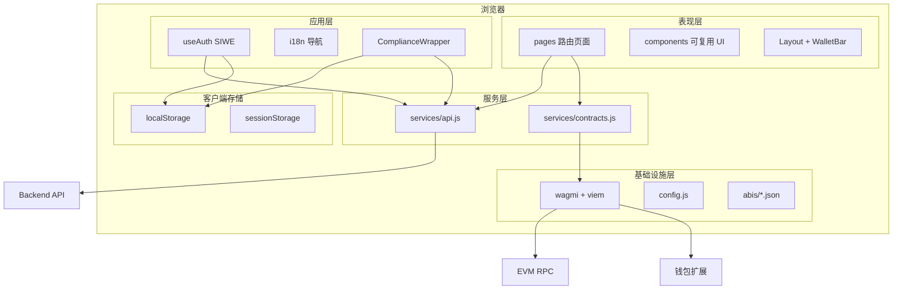
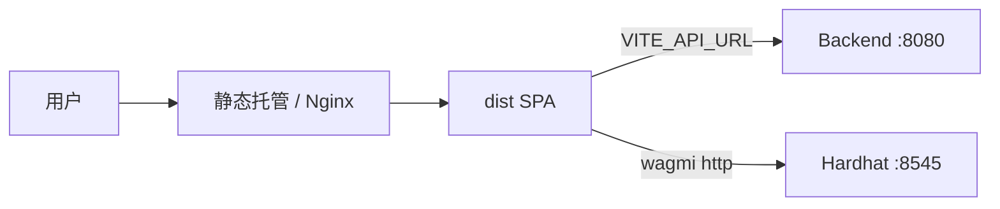
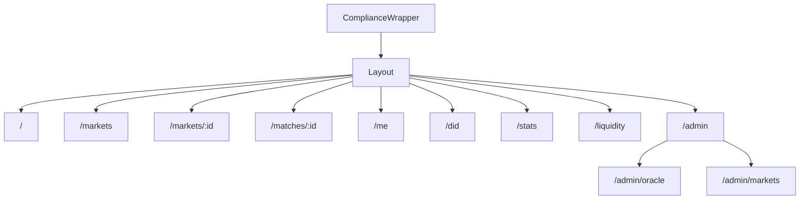
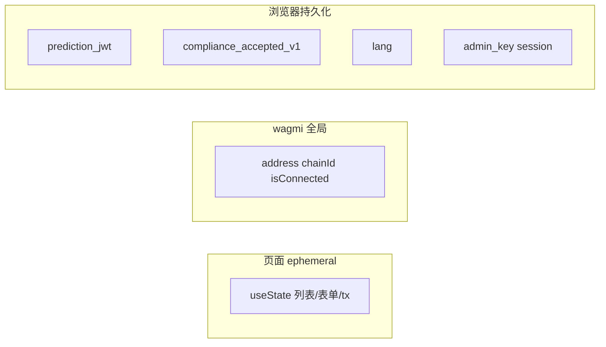
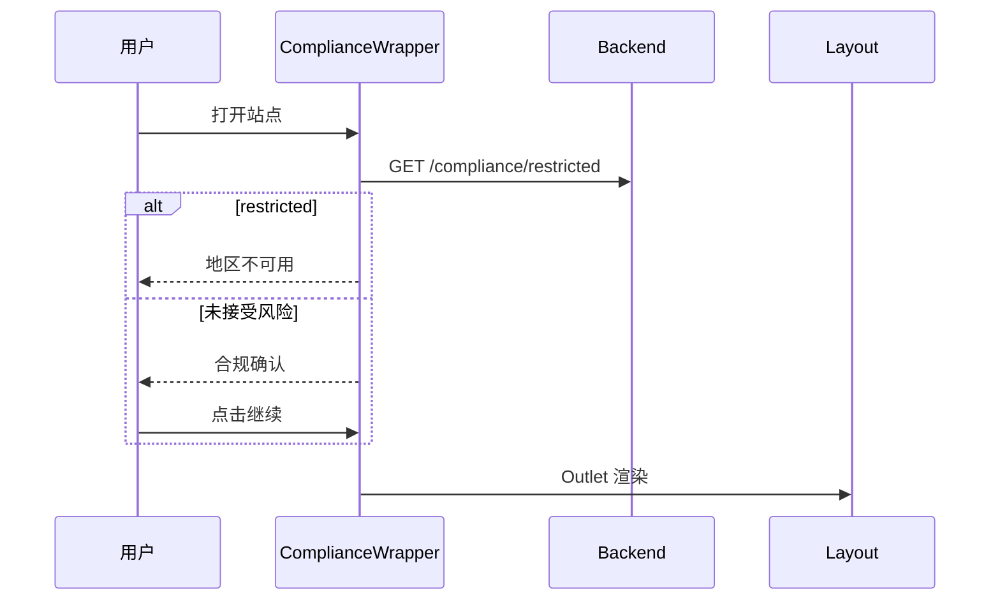
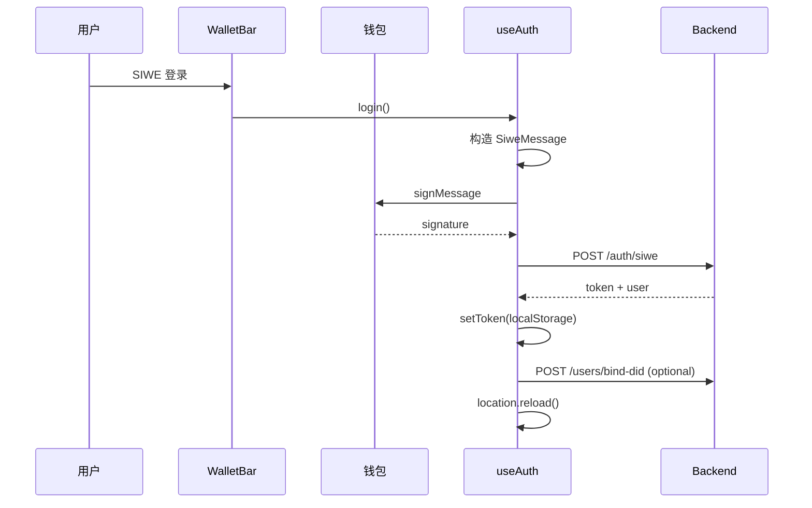
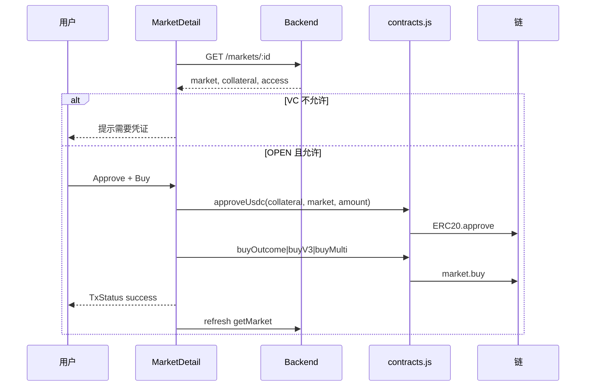
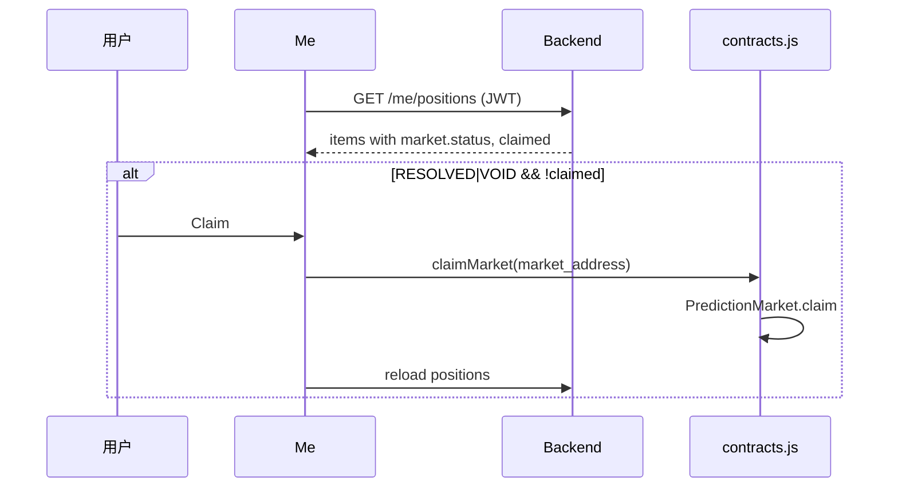
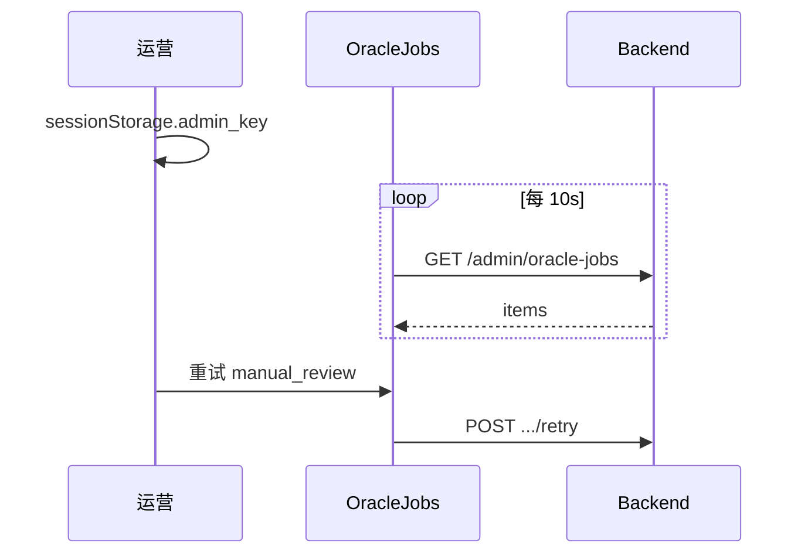
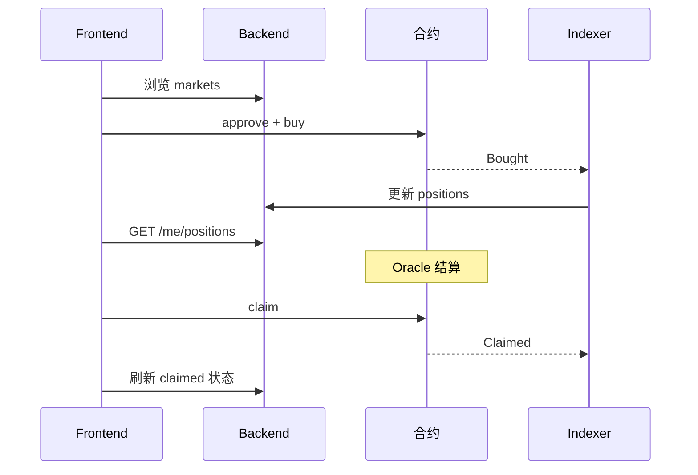

# Frontend 概要设计说明书

| 文档属性 | 内容 |
|---------|------|
| 项目名称 | Prediction DID — 世界杯 Web3 预测市场（Frontend） |
| 文档版本 | 1.0 |
| 前置文档 | `frontend/01.需求规格说明书.md` |
| 适用代码 | `frontend/` 目录（React 18 + Vite 5 + wagmi 2） |
| 详细实现参考 | `frontend/frontend_func.md`、`docs/ARCHITECTURE.md` |

---

## 1. 引言

### 1.1 编写目的

本文档描述 Frontend 子系统的**概要设计**：在需求规格说明书（01 文档）所定义的功能与非功能需求基础上，给出应用架构、模块划分、状态与数据流、接口分层、关键交互流程、安全与构建部署方案，作为详细设计与联调实现的统一蓝图。

### 1.2 设计目标

| 目标 | 设计对策 |
|------|----------|
| 链下读、链上写 | 赛程/市场/持仓走 Backend API；资金操作走 wagmi + 合约 |
| 钱包即身份入口 | injected 连接器 + SIWE 换取 Backend JWT |
| 多市场类型共存 | market_type 路由到 Phase2/V3/Multi 不同 ABI |
| 合规优先 | ComplianceWrapper 全站门控 + Backend 地理 API |
| 可本地联调 | Vite dev + env 指向 Hardhat/Backend |
| MVP 可运维 | Admin 页 + sessionStorage Key；Oracle 10s 轮询 |

### 1.3 设计原则

1. **薄页面、厚服务层**：页面负责 UI 与局部 state；HTTP/链上逻辑集中在 `services/`。
2. **无全局 Redux**：React useState/useEffect + wagmi + 浏览器存储；降低样板代码。
3. **配置外置**：`VITE_*` 环境变量；构建时注入，运行时只读。
4. **交易可感知**：统一 `TxStatus` 展示 pending/success/error。
5. **失败可降级**：合规 API 失败不阻断；bindDid 失败不阻断登录。
6. **ABI 同源**：与 contracts `export-abi.js` 同步，避免手工维护。

---

## 2. 系统总体设计

### 2.1 逻辑架构

Frontend 在 Prediction DID 整体架构中处于**表现与交互层**，向上面向用户浏览器与钱包扩展，向下调用 Backend REST 与 EVM JSON-RPC。



### 2.2 部署架构



| 环境 | 部署方式 | 说明 |
|------|----------|------|
| 开发 | `npm run dev`（Vite :5173） | proxy `/health`、`/ready` → 8080 |
| 生产 | `npm run build` → `dist/` | 静态文件；API URL 构建时注入 |
| 联调 | 同机 Hardhat + Backend + Frontend | 钱包连 localhost:8545 |

**设计决策**：Frontend **无服务端渲染**；SEO 与首屏性能非 MVP 目标。

### 2.3 技术选型

| 类别 | 选型 | 用途 |
|------|------|------|
| UI 框架 | React 18 | 组件化 SPA |
| 构建 | Vite 5 | 开发 HMR、生产打包 |
| 路由 | react-router-dom v6 | 嵌套路由、NavLink |
| Web3 | wagmi 2 + viem 2 | 连接、签名、read/writeContract |
| 异步 | @tanstack/react-query 5 | wagmi 内部依赖 |
| 登录 | siwe 2 | SIWE 消息构造 |
| 样式 | index.css（全局类） | 无 UI 组件库 |
| Lint | ESLint + react plugins | `npm run lint` |

---

## 3. 模块设计

### 3.1 目录结构

```
frontend/
├── index.html                 # Vite 入口 HTML
├── vite.config.js             # 开发服务器与 proxy
├── package.json
├── .env.example
├── src/
│   ├── main.jsx               # React 根挂载
│   ├── App.jsx                # 路由表
│   ├── config.js              # 环境变量聚合
│   ├── wagmi.js               # 链与连接器配置
│   ├── index.css              # 全局样式
│   ├── abis/                  # 9 合约 ABI（export-abi 同步）
│   ├── providers/
│   │   └── Web3Provider.jsx   # WagmiProvider + QueryClient
│   ├── hooks/
│   │   └── useAuth.js         # SIWE 登录逻辑
│   ├── i18n/
│   │   └── index.jsx          # 轻量 i18n Context
│   ├── services/
│   │   ├── api.js             # Backend REST
│   │   └── contracts.js       # 链上读写封装
│   ├── components/
│   │   ├── Layout.jsx
│   │   ├── WalletBar.jsx
│   │   ├── ComplianceWrapper.jsx
│   │   ├── TxStatus.jsx
│   │   ├── MarketStatusBadge.jsx
│   │   └── VCCard.jsx
│   └── pages/
│       ├── Home.jsx
│       ├── Markets.jsx
│       ├── MarketDetail.jsx
│       ├── MatchDetail.jsx
│       ├── Me.jsx
│       ├── DIDProfile.jsx
│       ├── Stats.jsx
│       ├── Liquidity.jsx
│       └── admin/
│           ├── AdminLayout.jsx
│           ├── OracleJobs.jsx
│           └── AdminMarkets.jsx
└── frontend_func.md
```

### 3.2 启动与 Provider 链（main.jsx）

**挂载顺序**：

```
ReactDOM.createRoot(#root).render(
  StrictMode
    → I18nProvider
      → Web3Provider (WagmiProvider + QueryClientProvider)
        → BrowserRouter
          → App (Routes)
)
```

| Provider | 职责 |
|----------|------|
| I18nProvider | lang、t()、setLang；持久化 localStorage.lang |
| Web3Provider | wagmiConfig 注入；React Query 客户端 |
| BrowserRouter | HTML5 history 路由 |
| ComplianceWrapper | 全站合规门控（App 内最外层 Route element） |

### 3.3 路由设计（App.jsx）



**设计要点**：

- Layout 使用 `<Outlet />` 渲染子路由；
- Admin 为 Layout 下嵌套 AdminLayout + Outlet；
- 无 React Router loader/action；数据在页面 `useEffect` 拉取。

### 3.4 配置模块（config.js）

| 字段 | 来源 | 默认 |
|------|------|------|
| apiUrl | VITE_API_URL | http://localhost:8080 |
| chainId | VITE_CHAIN_ID | 31337 |
| mockUsdc | VITE_MOCK_USDC_ADDRESS | '' |
| marketFactory | VITE_MARKET_FACTORY_ADDRESS | '' |
| siweDomain / siweUri | VITE_SIWE_* | localhost / http://localhost:5173 |
| apiUrlConfigured | 派生 | Boolean(apiUrl env) |

### 3.5 Web3 模块（wagmi.js + Web3Provider）

**hardhatLocal 链**：

| 属性 | 值 |
|------|-----|
| id | config.chainId |
| rpc | http://127.0.0.1:8545 |
| connector | injected() 唯一 |

**wagmiConfig**：单链、单 transport；无 WalletConnect/Coinbase 扩展。

**设计决策**：MVP 仅支持本地 Hardhat；扩展多链需增加 `chains` 数组与对应 transports。

### 3.6 API 服务层（services/api.js）

#### 3.6.1 核心模式

```
request(path, options):
  headers = Accept + Content-Type(if body) + Authorization(if JWT)
  fetch(config.apiUrl + path)
  parse JSON; if !ok throw Error(data.error)
```

|  concern | 实现 |
|----------|------|
| JWT 读写 | localStorage key `prediction_jwt` |
| 用户 API | 自动 Bearer |
| Admin API | adminHeaders() → X-Admin-Key from sessionStorage |

#### 3.6.2 API 分组

| 分组 | 代表函数 |
|------|----------|
| 健康 | getHealth, getReady |
| 比赛 | listMatches, getMatch |
| 市场 | listMarkets, getMarket, getMarketPool, getMarketOrderbook |
| 认证 | siweAuth, bindDid, verifyVC |
| 用户 | myPositions, myCredentials |
| 统计/合规 | getPlatformStats, getCompliance |
| 管理 | adminListOracleJobs, adminRetryOracleJob, adminRegisterMarket, adminVoidMarket |

### 3.7 合约服务层（services/contracts.js）

**依赖**：wagmiConfig + 静态 import ABI JSON。

| 函数 | 合约 | 说明 |
|------|------|------|
| parseUsdc / formatUsdc | — | 6 decimals 工具 |
| readUsdcBalance | MockUSDC | balanceOf |
| approveUsdc | MockUSDC | approve + wait receipt |
| buyOutcome | PredictionMarket | Phase 2 buy |
| buyV3 | PredictionMarketV3 | CPMM buy |
| buyMulti | MultiOutcomeMarket | 多结果 buy |
| claimMarket | PredictionMarket | claim（Me 页） |
| addLiquidityV3 | PredictionMarketV3 | 流动性页 |
| readPoolStateV3 | PredictionMarketV3 | getPoolState |
| readMarketStatus | PredictionMarket | 链上状态辅助读 |

**统一模式**：`writeContract` → `waitForTransactionReceipt` 返回 receipt。

### 3.8 认证模块（hooks/useAuth.js）

| 状态/方法 | 说明 |
|-----------|------|
| login | SiweMessage → signMessage → siweAuth → setToken → 可选 bindDid → reload |
| logout | clearToken → reload |
| isAuthenticated | Boolean(getToken()) |
| loading / error | 登录过程 UI 反馈 |

**与 wagmi 关系**：useAccount 提供 address/chainId；useSignMessage 签名。

**设计决策**：登录成功 **整页 reload** 简化各页 token 同步；无 Context 广播。

### 3.9 合规模块（ComplianceWrapper）

**状态机**：

```
loading → GET /compliance/restricted
  → restricted? 阻断页
  → !accepted? 风险确认页 → localStorage GATE_KEY
  → Outlet 正常渲染
```

| 键 | 值 |
|----|-----|
| compliance_accepted_v1 | '1' |

### 3.10 页面模块概览

| 页面 | 数据来源 | 链上操作 |
|------|----------|----------|
| Home | health, listMatches | 无 |
| Markets | listMarkets | 无 |
| MarketDetail | getMarket, getMarketPool, readPoolStateV3 | approve + buy* |
| MatchDetail | getMatch | 无 |
| Me | myPositions (JWT) | claimMarket |
| DIDProfile | myCredentials (JWT) | 无 |
| Stats | getPlatformStats | 无 |
| Liquidity | listMarkets, getMarketPool | approve + addLiquidityV3 |
| OracleJobs | adminListOracleJobs | 无 |
| AdminMarkets | admin API | 无 |

### 3.11 UI 组件

| 组件 | 职责 | 复用点 |
|------|------|--------|
| Layout | 导航、i18n 切换、WalletBar、Outlet | 全站 |
| WalletBar | connect/login/logout/disconnect | Layout |
| ComplianceWrapper | 合规门控 | App 根 |
| TxStatus | 交易反馈 | MarketDetail, Me |
| MarketStatusBadge | 市场状态标签 | MarketDetail, Me |
| VCCard | VC JSON 展示 | DIDProfile |

### 3.12 国际化（i18n/index.jsx）

- **范围**：导航 label、页脚 phase_footer；Compliance 部分文案在组件内硬编码中文；
- **机制**：Context + messages[lang] 对象；
- **持久化**：localStorage.lang，默认 zh。

---

## 4. 数据设计

### 4.1 客户端状态分类



| 类型 | 示例 | 生命周期 |
|------|------|----------|
| 页面 state | markets[], amount, tx.status | 组件卸载丢失 |
| wagmi | address, connection | 钱包会话 |
| localStorage | JWT, 合规, lang | 跨会话 |
| sessionStorage | admin_key | 标签页 |

### 4.2 市场类型与 UI 行为

| market_type（Backend） | 下注函数 | 池展示 |
|------------------------|----------|--------|
| （默认 / Phase2） | buyOutcome | yes_pool / no_pool API |
| BINARY_V3 | buyV3 | readPoolStateV3 + getMarketPool |
| MULTI | buyMulti | outcome_count 下拉 |

### 4.3 VC 门禁数据流

```
GET /markets/:id
  → access { requires_vc, allowed, credential_type? }
MarketDetail:
  IF requires_vc && !allowed → 隐藏下注区 + 提示
  ELSE IF status==OPEN → 显示下注卡片
```

Backend 根据 JWT 地址查 credentials；前端 **不** 本地校验 VC 签名。

### 4.4 金额表示

| 层 | 格式 |
|----|------|
| API | string 十进制整数（最小单位） |
| UI 输入 | 人类可读 mUSDC 数字字符串 |
| 链上 | parseUsdc → bigint；formatUsdc 展示 |

---

## 5. 接口设计

### 5.1 前后端交互架构

```
Page Component
    ├─ services/api.js ──fetch──► Backend REST
    └─ services/contracts.js ──wagmi──► EVM RPC ◄── Wallet
```

### 5.2 鉴权分层

| 层级 | 机制 | 存储/Header |
|------|------|-------------|
| 链上 | 钱包地址 msg.sender | wagmi |
| 用户会话 | JWT | Authorization: Bearer |
| 管理 | Admin API Key | X-Admin-Key (sessionStorage) |

### 5.3 链上交互矩阵

| 用户动作 | ERC20 | 市场合约 | 页面 |
|----------|-------|----------|------|
| 下注 | approve(spender=market) | buy / buy(V3) / buy(Multi) | MarketDetail |
| 领取 | — | claim | Me |
| 加流动性 | approve | addLiquidity | Liquidity |

### 5.4 未接入 UI 的 API（预留）

| 函数 | 潜在用途 |
|------|----------|
| getReady | 系统就绪指示 |
| getMarketOrderbook | 盘口深度展示 |
| verifyVC | 客户端 VC 校验演示 |

---

## 6. 关键流程设计

### 6.1 应用进入流程



### 6.2 SIWE 登录流程



### 6.3 下注流程（MarketDetail）



### 6.4 Claim 流程（Me）



### 6.5 Admin Oracle 监控



### 6.6 端到端业务闭环（含 Backend/链）



---

## 7. 安全设计

### 7.1 威胁与对策

| 威胁 | 对策 |
|------|------|
| XSS 窃取 JWT | localStorage 存储；生产需 CSP、依赖审计 |
| 未授权 Admin | 依赖 sessionStorage Key；无 Key 时仅提示 |
| 错误链 ID | wagmi 单链配置；SIWE chainId 与 config 一致 |
| 受限地区访问 | ComplianceWrapper + Backend restricted |
| 伪造 VC 门禁 | 前端只读 access.allowed；判定在 Backend |
| 私钥泄露 | 不接触私钥；仅钱包签名 |

### 7.2 敏感数据清单

| 数据 | 存储 | 级别 |
|------|------|------|
| prediction_jwt | localStorage | 高 |
| admin_key | sessionStorage | 高 |
| 钱包地址 | wagmi 内存 | 中 |

### 7.3 CORS 与开发 proxy

Vite 仅 proxy `/health`、`/ready`；其余 API 直连 `VITE_API_URL`。Backend CORS 允许 `localhost:5173`。

---

## 8. 错误处理与 UX 设计

| 层级 | 策略 |
|------|------|
| api.request | throw Error(message)；页面 catch 显示 status-error |
| 链上 write | catch e.shortMessage \|\| e.message → TxStatus error |
| Home health | apiStatus online/offline 全局指示 |
| 空数据 | 各页友好文案（seed/sync、连接钱包等） |
| Admin API 403 | OracleJobs error state |

**HTTP 错误**：统一 `{"error":"..."}` 由 Backend 返回；前端不区分 401/403 细粒度 UI（MVP）。

---

## 9. 配置与构建设计

### 9.1 Vite 配置要点

| 项 | 值 |
|----|-----|
| plugins | @vitejs/plugin-react |
| dev port | 5173 |
| proxy | /health, /ready → localhost:8080 |

### 9.2 环境变量分组

| 分组 | 变量 |
|------|------|
| API | VITE_API_URL |
| 链 | VITE_CHAIN_ID, VITE_MOCK_USDC_ADDRESS, VITE_MARKET_FACTORY_ADDRESS |
| SIWE | VITE_SIWE_DOMAIN, VITE_SIWE_URI |

### 9.3 构建产物

- `dist/index.html` + `dist/assets/*`（hash 文件名）；
- 生产部署：任意静态服务器；需配置 SPA fallback 至 index.html。

### 9.4 ABI 同步流程

```
contracts: npm run export-abi
  → frontend/src/abis/{Contract}.json
  → backend/pkg/contracts/{Contract}.json
```

Frontend contracts.js 静态 import 所需 ABI 子集（4 个市场相关 + MockUSDC）。

---

## 10. 样式与主题设计

- **方案**：全局 `index.css`；类名如 `layout`、`header`、`card`、`badge`、`status-ok`、`status-error`；
- **无** CSS Modules / Tailwind / 组件库；
- **MarketStatusBadge**：状态 → className 映射（badge-open 等）；
- **响应式**：基础 flex/grid；未针对移动端深度优化。

---

## 11. 可扩展性与演进

| 扩展点 | 当前实现 | 演进方向 |
|--------|----------|----------|
| 多链 | 单 hardhatLocal | wagmi chains + 环境切换 |
| 钱包 | injected only | WalletConnect、Coinbase |
| 状态管理 | 分散 useState | Zustand/Context 统一用户态 |
| JWT | 无刷新 | 401 拦截 + 重新 SIWE |
| Claim | 仅 PM ABI | 按 market_type 分支 V3/Multi |
| i18n | 导航级 | react-i18next 全站 |
| Admin | console 设 Key | 登录表单 + 短期 token |
| 实时比分 | 无 | EventSource /events/scores |
| DID 链上 | ABI 存在未用 | bindDid → DIDRegistry |
| 测试 | 无 | Vitest + RTL |

---

## 12. 与需求文档的追溯

| 需求章节（01 文档） | 概要设计章节 |
|-------------------|--------------|
| 4 功能需求 FR-* | 3 模块设计、6 关键流程 |
| 5 非功能需求 NFR-* | 2 总体设计、7 安全、8 错误处理 |
| 6 路由与页面 | 3.3 路由设计 |
| 7 数据与状态 | 4 数据设计 |
| 8 接口需求 | 5 接口设计 |
| 9 配置与构建 | 9 配置与构建设计 |

---

## 13. 附录

### 13.1 页面-路由-文件对照

| 路由 | 文件 |
|------|------|
| / | pages/Home.jsx |
| /markets | pages/Markets.jsx |
| /markets/:id | pages/MarketDetail.jsx |
| /matches/:id | pages/MatchDetail.jsx |
| /me | pages/Me.jsx |
| /did | pages/DIDProfile.jsx |
| /stats | pages/Stats.jsx |
| /liquidity | pages/Liquidity.jsx |
| /admin/* | pages/admin/* |

### 13.2 与 Backend / Contracts 对齐

| Frontend 配置/调用 | Backend | Contracts |
|--------------------|---------|-----------|
| VITE_API_URL | HTTP_PORT | — |
| siweDomain/Uri | SIWE_* | — |
| buyOutcome | Indexer Bought | PredictionMarket.buy |
| buyV3 | pool API 字段 | PredictionMarketV3 |
| claimMarket | Indexer Claimed | PredictionMarket.claim |

### 13.3 文档修订记录

| 版本 | 日期 | 说明 |
|------|------|------|
| 1.0 | 2026-07-17 | 初版，基于当前 frontend 源码与 01 需求规格说明书 |

### 13.4 相关文档

| 文档 | 路径 |
|------|------|
| 需求规格说明书 | `frontend/01.需求规格说明书.md` |
| 函数说明 | `frontend/frontend_func.md` |
| Backend 概要设计 | `backend/02.概要设计.md` |
| Contracts 概要设计 | `contracts/02.概要设计.md` |
| 系统架构 | `docs/ARCHITECTURE.md` |

---

**文档结束**
